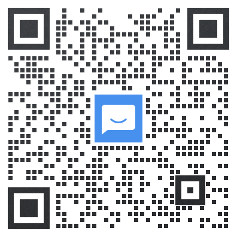

# 光明教材电子化公益项目 

## 项目介绍

光明中医教材是原光明中医函授大学在1985年成立后，由当时诸多顶尖中医专家齐心合力编写而成，在中医界一直享有崇高的地位，是难得的中医学习资料，得到李可老中医的强烈推荐。光明中医学院2005年闭校后，范竹雯老师是教材主要保管人。

现原版纸质教材只剩下几十套，因保存的时间长，已有部分破损。为避免教材失传，光明中医网校在范竹雯老师的指导下，进行了光明中医教材电子化工作。

编写光明中医教材时，各位编者老师为了传承中医，都是义务奉献，未收取报酬。因此电子化后的教材也是公益性的，向社会免费开放，大家可以广为传播。我们希望中医学习者能人手一套教材用于学习。

本项目于2019年8月开始，到2021年1月，完成20门主要课程，近800万字。明细如下：

《05实用中医文献学》《06中医药学概论》《07方剂口诀》 《07口诀浅释》《08中医临证程序与辨证思维方法》 《10黄帝内经讲解》  《11伤寒论讲解》  《12金匮要略讲解》  《13温病条辨讲解》  《14本草备要讲解》 《15中医内科学》《16中医外科学》《17中医骨伤科学》《18中医眼科学》《19中医妇科学》《20中医儿科学》《21针灸学》《22中医喉科学》《23名医医案选读》《25历代医籍选介》《方剂讲解》   

## 组织人员

**范竹雯：指导**

**于云：顾问**

**张建德、 金卓如：监督**

**戴金鳌：协助**

**李文强、高明哲：组织协调**

**何克敏：联络**

## 分工

范竹雯老师及光明中医杂志社提供了光明中医原版教材，以及很多珍贵的历史资料。

于云老师是85届学员，优秀的光明中医毕业生，执业中医师，有30多年的行医经验，在山东烟台造福一方。在《针灸学》教材的电子化过程中，于老师指出了88年版本和94年版本的区别。根据于老师的建议，最终依据88年版本进行了电子化。

张建德、金卓如两位老师也是85届学员，优秀的光明中医毕业生，执业中医师。张建德老师执业于北京；金卓如老师执业于江苏。两位老师也对教材的电子化过程提出了很多优秀建议！

戴金鳌、李文强、高明哲为范竹雯老师弟子。整个教材电子化项目由李文强提出并主导实施，高明哲、戴金鳌协助组织人员、收集资料等工作。

这里向大家一并表示感谢！

## 工作人员及志愿者

具体实施电子化的人员如下：

**小易、江东东、小何、朱明轩、小童、李文强、罗金群、李海燕、精修风敬、粟晓雪、肖肖、贾俨、王岐伯、林杰承、王莹莹、YXW、魏胜周、刘荣、张德、施前锋、浔浔、黄河、林沛桦、子木、夏至、刘书青、王凤池、陈以明**

大家非常辛苦的做了大量工作，做了利国利民的大好事！

这里，我们代表光明中医前辈以及广大中医从业者、爱好者向以上人员致以诚挚的谢意，感谢大家的无私奉献！

## 纠正错误

大家在教材电子版中发现文字错误，可以直接提交PR，我们会进行审核通过。

## 学习教材

如果想系统学习教材，请使用光明中医学习平台https://zuoye.gmzy.org.cn ，平台使用费900元/年。

有疑问请联系助教江老师：

