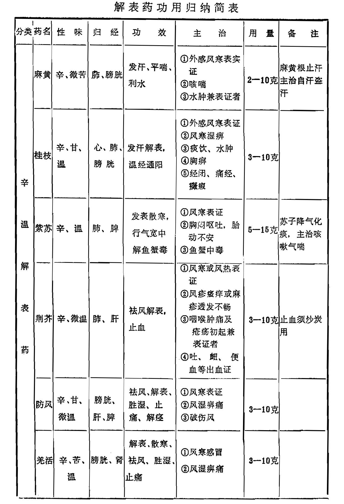
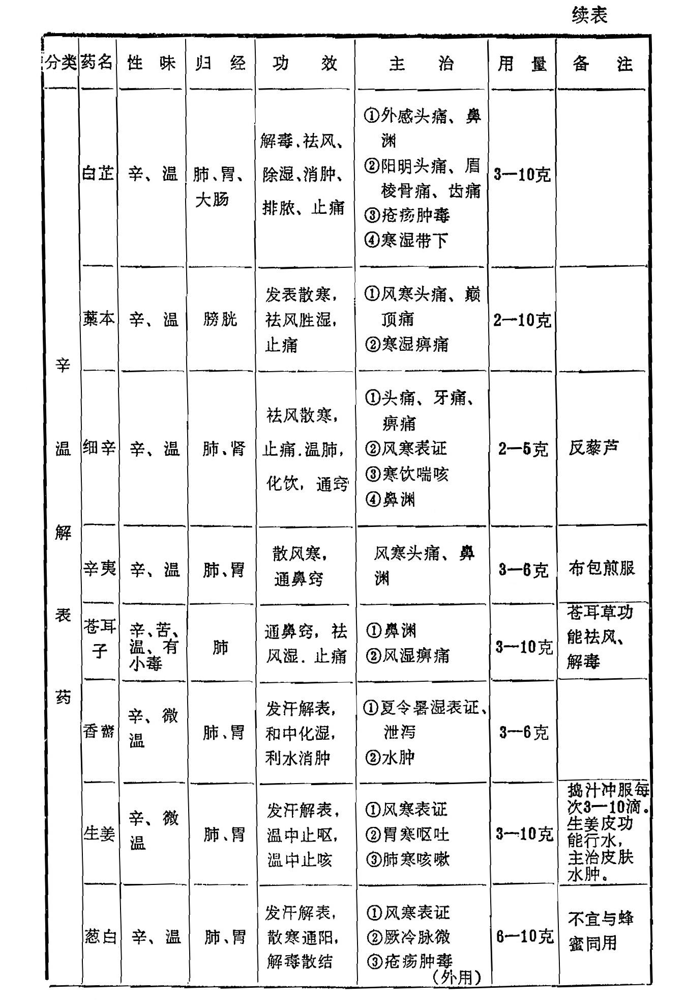
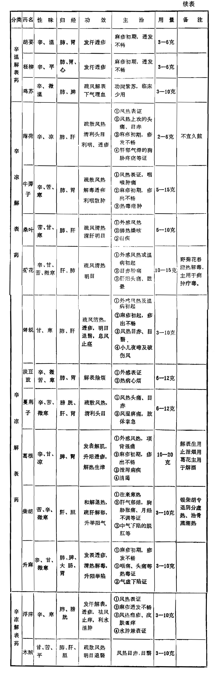

## 小结

本章根据解表药的不同性质，分为辛温解表药和辛凉解表药。

一、辛温解表药：均系辛温之品，都有发汗解表的作用，适用于风寒表证。但又各有特性，主治证候亦有区别。

麻黄、桂枝、细辛发散风寒之力较强。麻黄、桂枝均主散太阳经肌表之风寒，然麻黄发汗作用大于桂枝，故用于无汗之表实证；桂枝不论有汗无汗皆可应用。麻黄又能开宣肺气，利水退肿，
常用于肺气不宣的咳喘及水肿兼表证者；桂枝还可温通血脉，通阳化气，善治妇人血寒经闭，风湿痹证及阳虚不能化气的痰饮蓄水等证。细辛善散少阴经寒邪，多用于外感风寒，发热脉沉者，
且有祛风湿，止痛及温肺化饮之功，可用于头痛齿痛，风湿痹痛及肺寒痰饮喘咳。惟药性较为峻烈，用时宜慎，用量不可过大。

紫苏、荆芥、防风三药发汗作用不及麻、桂之峻，较为缓和，为一般风寒感冒常用之品。其中紫苏散寒力较强，并有行气安胎之功，风寒感冒兼有胸腹胀满，恶心呕逆者更为适宜；荆芥辛散疏风，无论风寒、风热皆可应用，兼能透疹止血，疹出不透及各种出血皆可选用；防风祛风为主，本品甘缓不峻，为风药中之润
剂，功同荆芥。外感风邪，二药常相须为用。但防风还能胜湿止痛，也是治风湿痹证的要药。

羌活、藁本、白芷均有发表、祛风湿止痛的作用，用治感冒头痛。然羌活、藁本温燥升散，入太阳经，以治巅顶头痛连及后脑者；白芷归阳明经，治前额头痛，眉棱骨痛，牙痛及鼻渊等证。
羌活还有通痹止痛的作用，且善于上行，用治风湿痹痛以上半身为佳。白芷又能消痈排脓，用于疮疡肿毒及寒湿带下，风湿瘙痒。

辛夷、苍耳善能宣通肺窍，是治鼻渊的专药。苍耳子还能祛风湿，治皮肤湿疹瘙痒。

生姜发表散寒，又为温中止呕要药。葱白发表通阳，既可外散风寒表邪，又治寒邪人里，下痢脉微之证。胡荽发表透疹，主治麻疹不透；但多煎汤熏洗，很少内服。香薷长于解暑化湿，为治夏日外感风寒，内伤于湿，阳气被阴邪所遏的恶寒无汗，吐泻等证的主药。柽柳为透发麻疹之专药，内服外洗均效。然辛散力强，麻疹已透则不宜用。鸡苏功用与紫苏相类似，惟临床少用。

二、辛凉解表药：均为辛凉之品，具有发散风热的作用，适用于风热表证及温热病初起或麻疹透发不畅等证。其中各药之作用也互有异同。 

薄荷、牛蒡子、蝉蜕有发散风热，宣肺透疹的功效，为风热感冒，温病初期及疹发不透的常用药。三药中薄荷发散力较强，牛蒡子、蝉蜕次之。薄荷善散头面风热，兼理气解郁，可治头痛目赤及肝郁不舒之证；牛蒡子又能清热解毒，疮疡肿毒、咽喉疼痛常用；蝉蜕甘寒质轻，长于定惊止痉，明目退翳，多用于小儿惊风，破伤风及眼科疾患。

桑叶、菊花发散之力不及薄荷，但能清肝火。二者都可散头面风热，治外感风热，头痛目赤，并常相须为用。但桑叶兼能润肺止咳，肺燥咳嗽用之较好；菊花清肝明目作用较桑叶为胜，并能养肝，肝火或阴虚阳亢的头痛眩晕，目赤等证，用之为宜；野
菊花尤善清热解毒，是治疔疮肿毒的良药。

柴胡、葛根、升麻都有升阳发散作用，其退热之功惟柴胡为首，主散少阳半表半里之邪，以治寒热往来之证。又能疏解肝郁，
治肝郁胁痛或月经不调等证。葛根是阳明经之主药，既可解肌退热，治表证发热，项背强痛，又能鼓舞脾胃之气而生津止渴，升阳止泻；升麻退热之力较差，而升举阳气之功最强，可用于透疹和阳气下陷的久泻久痢，脱肛等证。故柴胡、升麻常同用于中气下陷证，而葛根、升麻常并用于透疹。

蔓荆子、淡豆豉发散之力均较弱。前者散头面风热，主治风热头痛，目赤多泪；后者以解表除烦为能，治外感轻证及热病心胸烦乱之证。浮萍长于发汗利水，可治外感风热，风疹瘙痒，以及水肿多用。木贼能疏散风热，治风热目赤，翳膜遮晴的主药。

解表药功用归纳简表

复习思考题

1. 试述解表药的定义，适用范围及使用时的注意点。
2. 如何区别辛温解表药和辛凉解表药的临床应用？
3. 麻黄、桂枝、细辛的功效和应用各怎样？主要差别是什么？
4. 羌活、白芷、防风在功效和应用上有何异同？分别说明其要点?
5. 试述紫苏、荆芥、香薷、生姜、辛夷的功效和临床应用。
6. 薄荷、牛蒡子、蝉衣在功效和应用上有何异同？
7. 桑叶与菊花功效和适应证各如何?试比较之。
8. 分析比较柴胡、葛根、升麻三药的相同点和不同点。
9. 应用麻黄、桂枝、细辛、薄荷、葛根时必须注意哪些问题？
