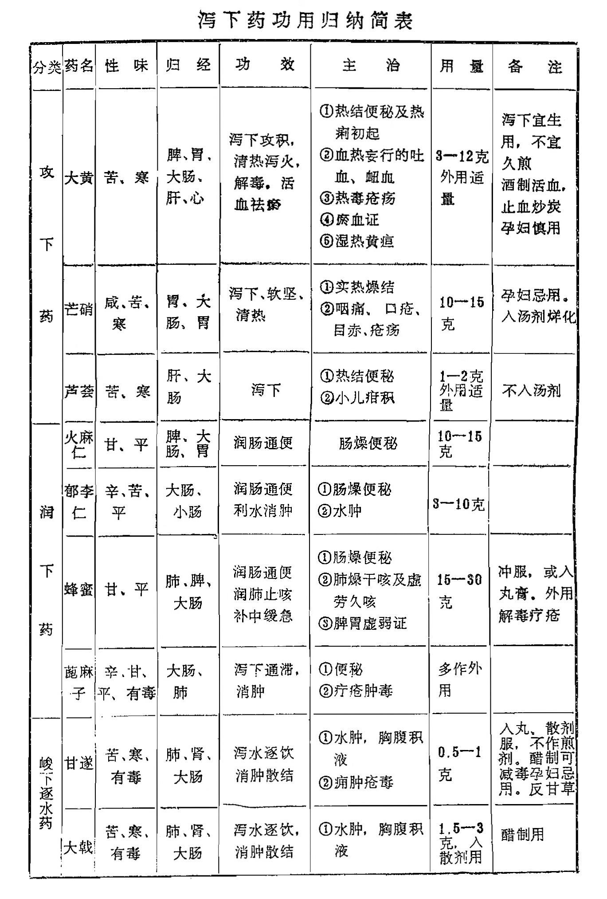

## 小结

本章药物分攻下药、润下药、峻下逐水药三类。

攻下药，作用较猛，能起荡涤肠胃的作用，适用于正气不虚的里实证，若邪实正虚者，当与补益药配伍而攻补兼施为宜。

其中大黄，苦寒攻下，具有泻热通便，泻火解毒，凉血祛瘀之功，凡肠胃实热，血分热毒所致之证皆可应用。芒硝咸寒，有润燥软坚作用，能使肠中燥屎软化，而易于排出。若与大黄同用，则泻下之力更强。芦荟除有通便泻下作用外，还能清肝杀虫。凡肝经实火伴大便秘结，或小儿虫疳，目赤头痛皆可应用。

润下药作用和缓，以润肠缓下为主，适用于体虚肠燥便秘者。火麻仁、郁李仁都是植物种仁，含丰富油脂，可润燥滑肠。两者比较，火麻仁润下缓，兼能滋养补虚，多用于虚证；郁李仁润下力较强，兼能利水消肿，用于实证为宜。蜂蜜可以润肠通便，润肺止咳，滋养补虚，既可应用于肠燥便秘，还能用于虚证的补益和虚劳咳嗽等证。

峻下逐水药作用较猛，并有毒性，服后能引起剧烈腹泻，排出大量水分，应用于水肿胀满，痰饮积聚等重证、实证。甘遂、大戟、芫花三药毒性猛烈，通利二便的作用基本相同，治水肿胀满、痰饮等实证可暂用，不能久服。牵牛子不仅逐水，还能驱虫，消除宿食停滞。商陆功用与甘遂、大戟、芫花相同，唯力稍逊。巴豆性味辛热，专攻下寒积，逐水消肿，非冷积、大腹水肿之实证，不得轻用，只入丸散，不入煎剂。荛花功同芫花，临床少用。续随子功效与巴豆相似，而力稍逊，以制霜用多。泽漆逐水消肿，药力最缓，兼能散结，可治瘰疬。

复习思考题

1、试述泻下药的定义、功效、适应证和注意事项。

2、攻下药、润下药，峻下逐水药的性能各有何特点？

3、阐明大黄、芒硝、甘遂、巴豆的功效和适应证。

4、分析比较大黄与芒硝、火麻仁与郁李仁、大戟与牵牛子的相同点和不同点。

5、应用大黄、芒硝、甘遂、大戟、巴豆时必须注意哪些问题？

泻下药功用归纳简表

。
