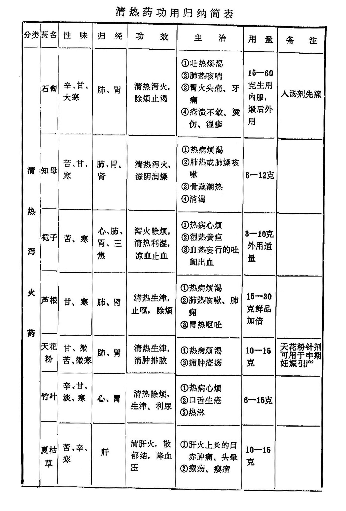
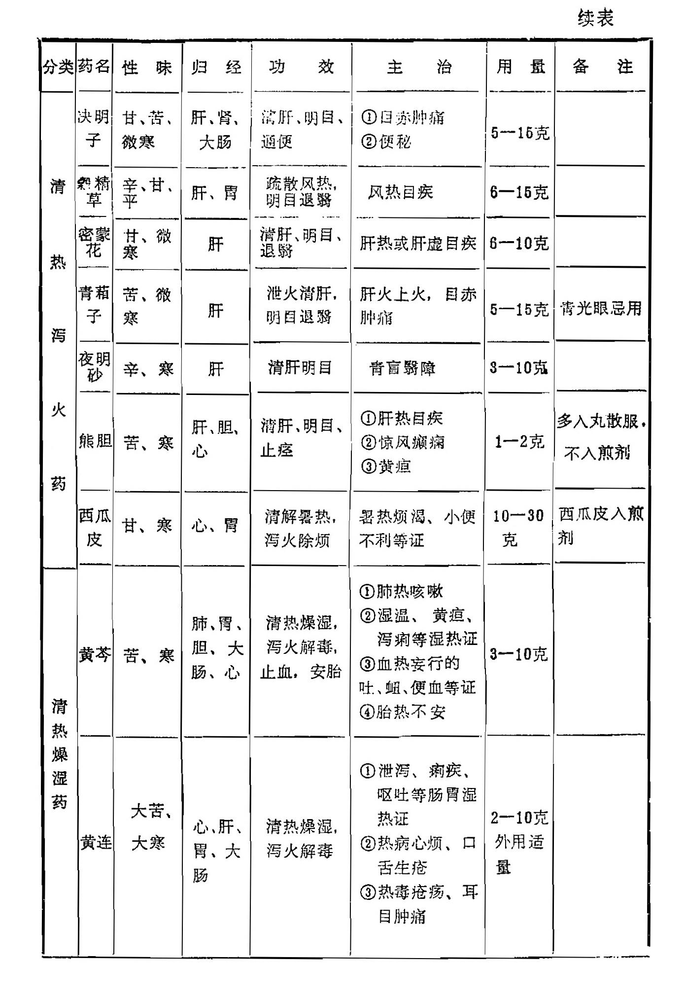
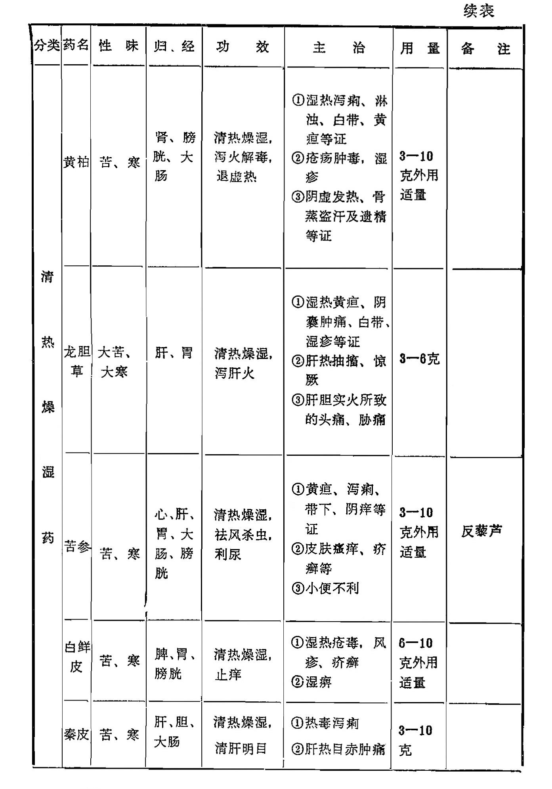
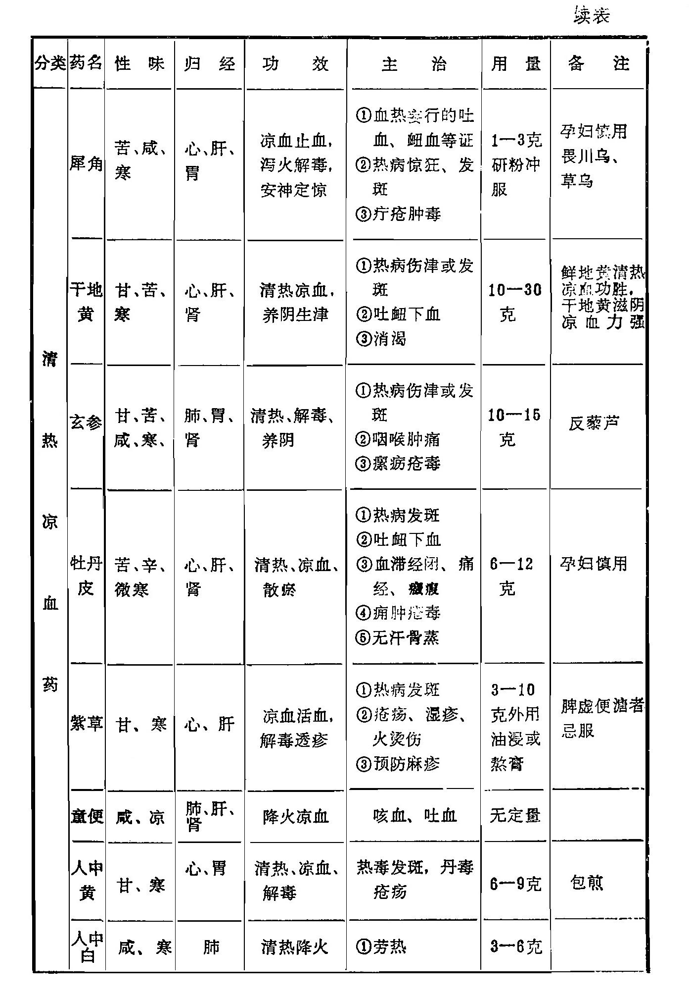
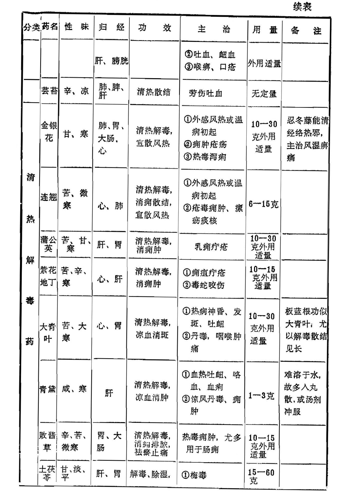
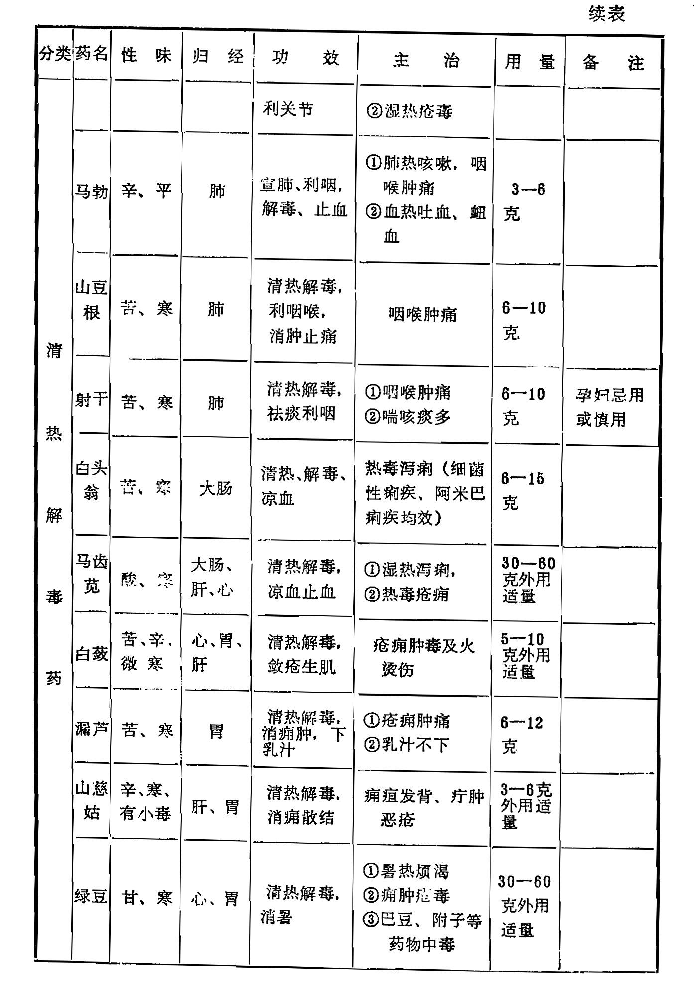
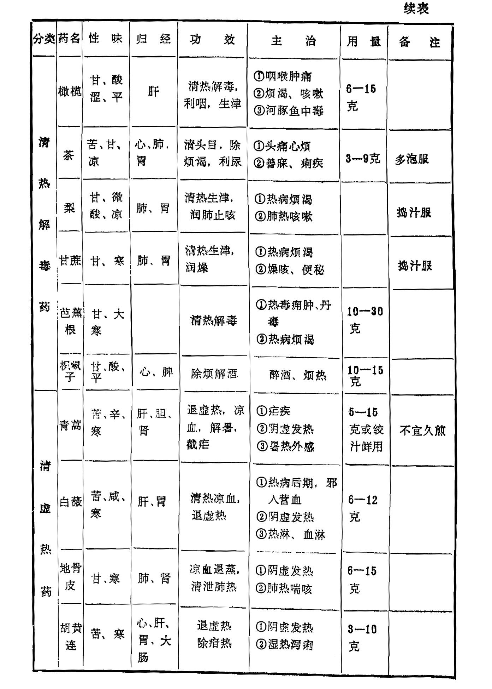

## 小结

本类药物均为寒凉之。主要用于热性病证。根据各药清热作用的不同特点，可分为清热泻火、清热凉血、清热燥湿及清热解毒、清虚热五类。

一、清热泻火药：本类药物多入气分，均有不同程度的清热泻火作用，适用于热病口渴，壮热烦躁等证，临证时可根据热性病的病变部位和病势轻重选择使用。其中石膏、知母、芦根均为清肺胃气分热之主药，石膏、知母常同用于肺胃大热，津伤烦渴之证，然石膏大寒，清热之力最强，主在清解，多用于肺胃热盛之证；知母质润，清热泻火之力不如石膏，但能滋阴润燥，重在清润。因此，除治热病烦渴，肺热燥咳外，又治阴虚劳热、消渴及相火亢盛之证，实热、虚热均可甩。芦根甘寒，清热生津而无恋邪之弊，宜用于热病津伤，烦热口渴，胃热呕哕与肺痈。

栀子清热泻火，药力较缓，常用于热病初起和发热心烦之证，兼可清利湿热，也是治黄疸、淋证的常用药。还可凉血止血解毒，治吐衄等各种出血征。

竹叶善清心胃之火，为治热病心烦，口舌生疮常用之辅助药。淡竹叶长于利尿渗湿，多用于小便不利之证。

夏枯草功能清肝明目，舒肝散结，为治肝火郁结，目赤肿痛及痰火凝结，瘰疬瘿瘤之主要药物。据现代医学硏究，降压作用较好，治髙血压头痛眩晕。西瓜清暑生津。

决明子、谷精草、密蒙花、青葙子、夜明砂、熊胆，均为清肝明目之品，以治肝热目赤肿痛之证，为眼科常用药。其中决明子善解肝经郁热，并有平肝降压，润肠通便之功。穀精草长于疏风明目,善治风热目赤，且能退翳。密蒙花兼能养肝，治视物摸糊之虚证较好。青葙子长于泻火明目，治肝火上炎，目赤肿痛等实证为优。熊胆兼能清肝止痉。

二、清热燥湿药：本类药亦多为苦寒之品，均以清热燥湿为主，并有泻火解毒作用。适用于湿热蕴结及痈肿疮毒等证。其中黄芩、黄连、黄柏三药功效相近，然黄芩偏治上焦，善清肺热，并有安胎降压之功；黄连偏走中焦，长于泻心火而除烦，清胃热而止呕，又是治痢要药；黄柏偏治下焦，主泻肾火，除下焦湿热，多用于阴虚阳亢及下焦湿热疮毒等证。	

龙胆草为泻肝经实火，清下焦湿热之品，凡肝胆实火，目赤头痛，口苦胁痛，惊风抽搐及湿热下注，阴痒带下，尿频尿痛，湿疹瘙痒等证均常用之。

苦参能燥湿祛风，主治疥癣湿疹、皮肤瘙痒等证，内服、外用均有良效。还善治泻痢、小便不利。白鲜皮功同苦参，兼能除痹退黄。秦皮善治湿热泻痢，兼能明目。 

 三、清热凉血药：本类药入心、肝血分，有清热凉血作用，适用于热人营血或热邪伤阴之证。

犀角善清心火，凉血解毒之力最强，凡热入营血，高热神昏，惊狂抽搐，发斑发黄，吐血衄血等血热毒盛之证，均以其为主药。但物稀价昂，现多以水牛角代之。

生地、元参清热凉血之中又有养阴生津之功，常同用于热病阴伤之证，但生地凉血养阴之功较强，玄参降火解毒之力为胜，故血热妄行之吐衄多用生地；热毒咽痛，瘰疬脱疽多用元参。

丹皮寒凉辛散，既能凉血，又能活血散瘀，有凉血而不留瘀，活血而不妄行的特点。故血热、血瘀之证皆可治之，还可用于阴虚发热，无汗骨蒸等证。赤芍功似丹皮，而活血祛瘀之力更强，并善于止痛，但无退虚热作用。此药在补血药白芍下。

紫草清热凉血，又善解毒透疹，最宜于斑疹紫暗，血热毒盛之证，并可作预防麻疹之用。

人中黄、人中白均有清热凉血之功，可用于热毒斑疹，疮疡等证。童便除能凉血止血，又能滋阴降火，治阴虚发热，咳血吐血，衄血血瘀作痛均可。芸苔一药虽有散血，消肿之功，临床却很少用。	

四、清热解毒药：本类药物清热之中尤以解毒见长。主用于痈肿疮毒，咽喉肿疼，急性热病及热毒血痢等证。其中银花、连翘、公英、地丁等均为治痈肿疮毒之要药。银花、连翘皆可清上焦风热，治风热感冒，温病初起之证。银花炒炭，可止血治热毒血痢。连翘又长于散结，治瘰疬结核。连翘之心，人心清心，可治烦热神昏。蒲公英兼有疏郁通乳之功，善治乳痈。紫花地丁凉血解毒之力较强，是治疔毒要药。

大青叶、板蓝根、青黛同出一物，均有清热解毒，凉血消斑作用。大青叶多用于热毒斑疹，咽喉肿痛； 板蓝根多用于大头瘟、痄腮等证，二药可用于病毒感的疾病；青黛内服能清肝凉血治咳嗽咯血之证，外相治口腔咽喉肿烂及皮肤疮疡之证。

白头翁、鸦胆子、马齿苋，均为治痢之药。然白头翁长于凉血解毒，多用于热毒血痢；鸦胆子长于燥湿杀虫，多用于阿米巴痢疾，并能截疟； 马齿苋解毒滑肠，治细菌性痢疾多用，并可消痛肿。

马勃、山豆根、射干均用于咽喉肿痛。马勃轻清辛散，偏重治风热所致的咽痛为佳；山豆根大苦大寒，治热毒所致的咽痛为宜；射干兼能消痰，治痰热之咽痛较好。马勃外用能敛疮止血，山豆根又能抗肿瘤，射干还可降气祛痰。

 土茯苓利湿解毒，可用于杨梅疮毒，汞中毒及多种皮肤病。败酱草善散肠中瘀滞，主治肠痈。白蔹、漏芦皆能治疗疮毒，但白蔹治疮疡能消肿，治溃疡可生肌； 漏芦能消痈下乳，善治乳痈。山慈菇并能散结消肿，可用于热毒痈肿，瘰疬痰核，内服外敷均可。绿豆清热解毒，既可用于暑热烦渴，又善解一切草木金石诸药中毒。

此外，橄榄、梨、甘蔗等也有清热解毒之功，橄榄尤善利咽喉化痰止咳，梨和甘蔗皆为润燥生津之佳品。枳椇子功专解酒，治酒醉烦热，口渴呕吐等症。茶叶清头目、除烦渴、化痰消食，并善利尿解毒。芭蕉根主能解毒疗疮，兼能生津止渴。

五、清虚热药：本类药性多寒凉，具有养阴退热的功效，适用于骨蒸潮热，低热不退等证。其中青蒿长于清透阴分伏热，且能解暑治疟；银柴胡专退虚热而无升散之弊；白薇善治久热不退及产后血虚发热；地骨皮治有汗之骨蒸，且能降肺火，并为肺热咳喘，烦热消渴的常用药；胡黄连能消疳退蒸，为治小儿疳疾、劳热骨蒸之品。银柴胡退虚热，除骨蒸，为治骨蒸劳热之专用药，已附于柴胡下。
​      

复习思考题

1、何谓清热药？根据其作用可分为几类？各类清热药的适应证是什么？

2 、试述石膏、知母、栀子、芦根与夏枯草的功效和适应证。

3、分析比较石膏与知母、栀子与夏枯草功效不同之处。

4 、黄芩、黄连、黄柏、龙胆草在功效和适应证上有何异同点。

5、应用石膏、黄连时须注意哪些问题？

6、阐明你对犀角、玄参、生地、丹皮的功效和适应证的认识。

7、分析比较生地与玄参、丹皮与紫草的相同点和不同点。

8、试述金银花、连翘、蒲公英、大青叶、射干、山豆根、白头翁、败酱草的功效和适应证。

9、犀角和鸦胆子的用量用法及使用时的注意点是什么？

10、常用的清虚热药有哪些？它们之间有何差别？

11、在清热药中，还有哪些药物尚兼有退虚热作用？各有什么特点？

