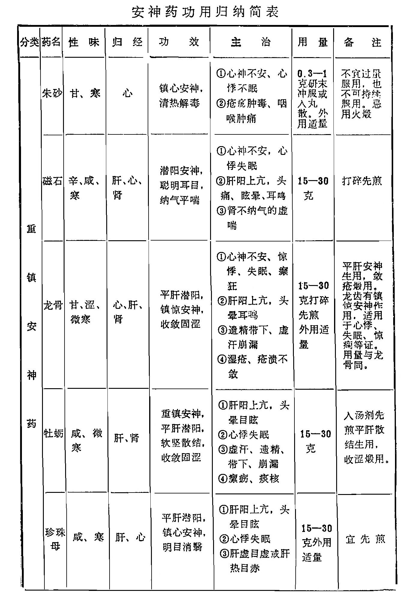

### 小 结	

安神药可分为重镇安神药和养心安神药两种。

重镇安神药多为金石和介类质重性降之品，能镇惊潜阳，多用于心神不宁、阳气躁动之证。其中朱砂、琥珀主要作用于心经，镇心安神之力较强，常用于惊悸、癲狂、烦躁失眠等证。朱砂兼能解毒疗疮，琥珀兼能活血通淋，血淋癃闭用之有效。

磁石、龙骨、牡蛎三药主要作用于肝，不仅可镇惊安神，又能潜敛浮阳。烦躁易怒、失眠多梦、头痛眩晕、耳鸣耳聋等肝阳上亢、心神不安之证，皆可配伍应用。其中，磁石兼入肾经，具有聪耳明目、纳气归肾之效，为眼、耳疾病常用之品；龙骨、牡蛎生用偏于重镇安神，而治阴虚阳浮之证，煅用偏于收敛固涩，以治遗精带下，自汗盗汗等证，二者相比，龙骨镇惊安神之功较强，牡蛎养阴潜阳之力较胜，并能软坚散结。龙齿功近龙骨，而长于镇心安神。紫石英主镇心定惊。

珍珠母亦入心、肝二经，具有平肝潜阳、镇心安神之功，造用于肝阳上亢的头痛头晕及心神不宁，烦躁失眠等证，兼能明目消翳，治目昏翳障。珍珠亦能明目除翳，还有较强的解毒敛疮作用，为眼科、外科常用药。金、铁以镇心为用，治心悸癫痫。

养心安神药，有滋养宁神作用，以治阴虚血亏所致的心悸、眩晕、失眠多梦、虚烦健忘之证。其中酸枣仁养肝胆以安神，益阴以止汗，为治虚烦不眠、惊悸健忘之良药。柏子仁养心以安神，润肠以通便，治血不养心的心悸失眠和阴虚血少的肠燥便秘。远志袪痰利窍，能交通心肾，以治痰阻心窍、心神不安、惊悸健忘以及痰多咳嗽等证为宜；合欢花善于解郁安神，用于忿怒忧郁之失眠、虚烦不安者。合欢皮则以活血止痛，治骨折痈肿为主。

复习思考题

1.安神药主要作用是什么？适用于哪些证候？

2.试述朱砂、磁石、龙骨、牡蛎、琥珀、酸枣仁、柏子仁、远志的功效及临床应用。
