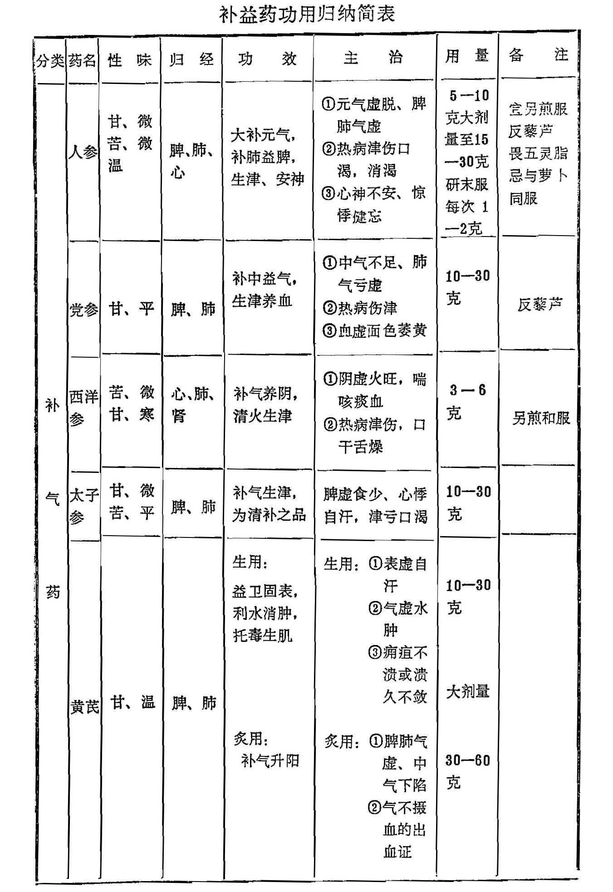
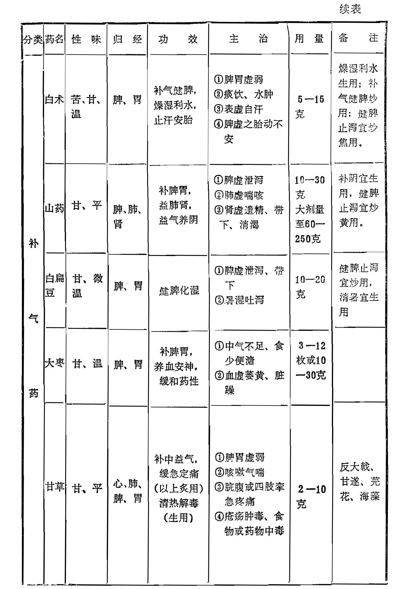
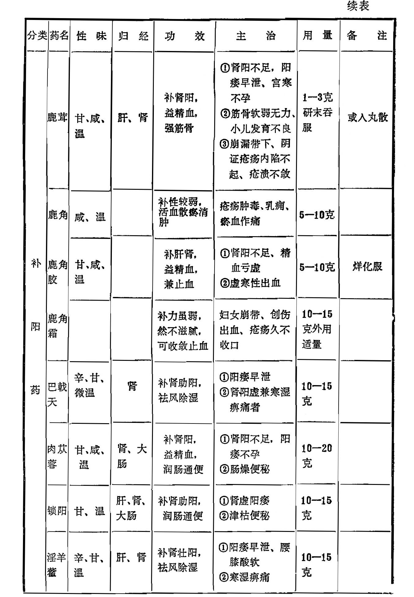
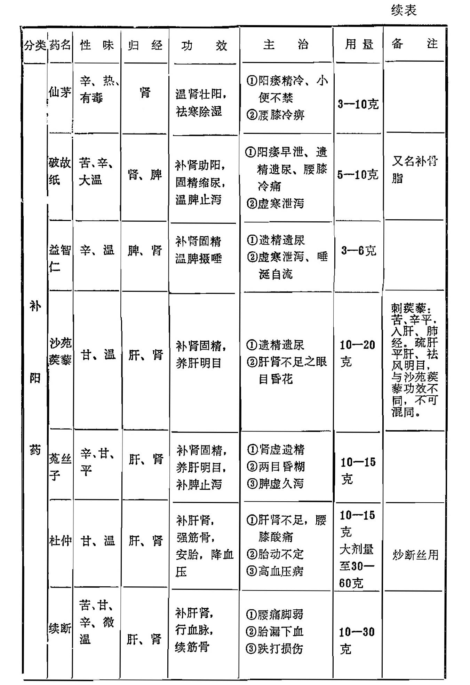
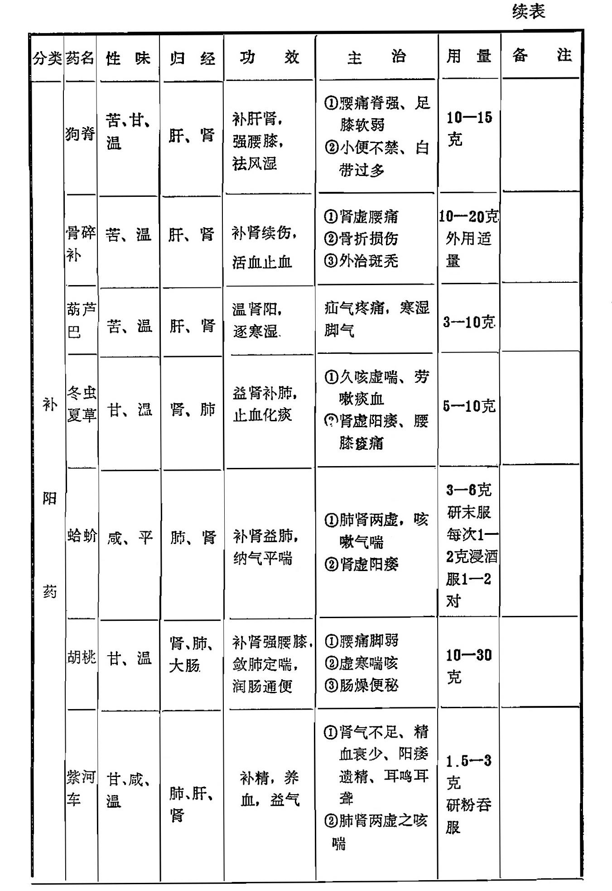
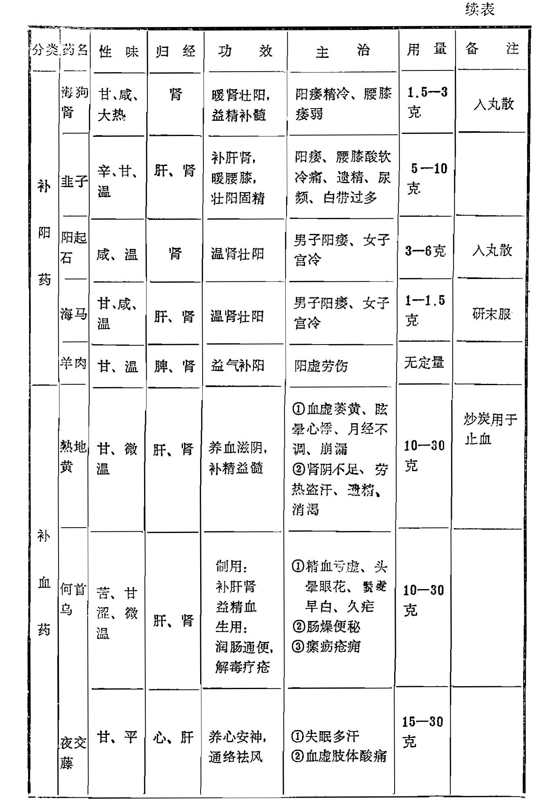
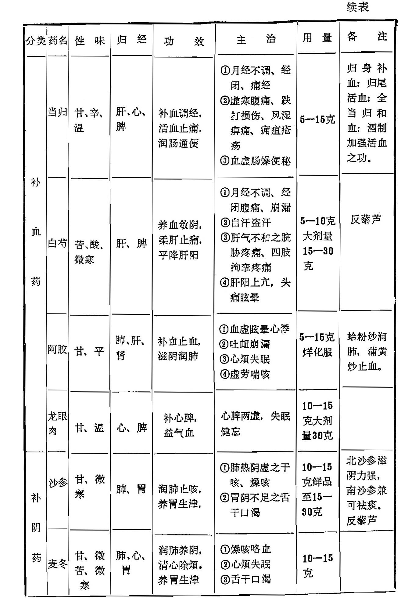
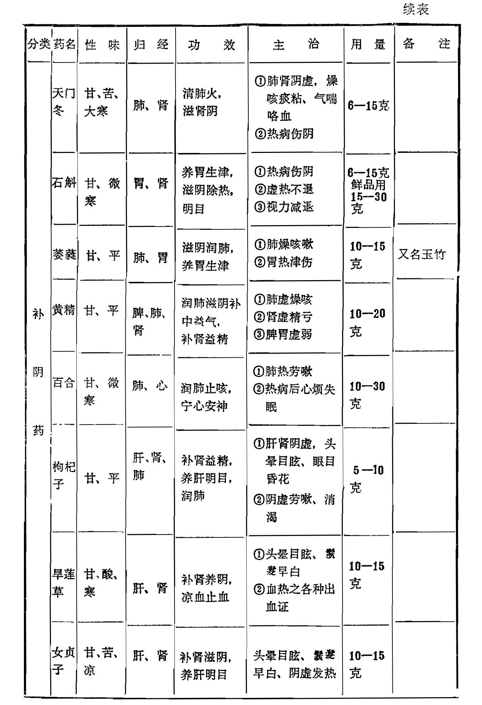
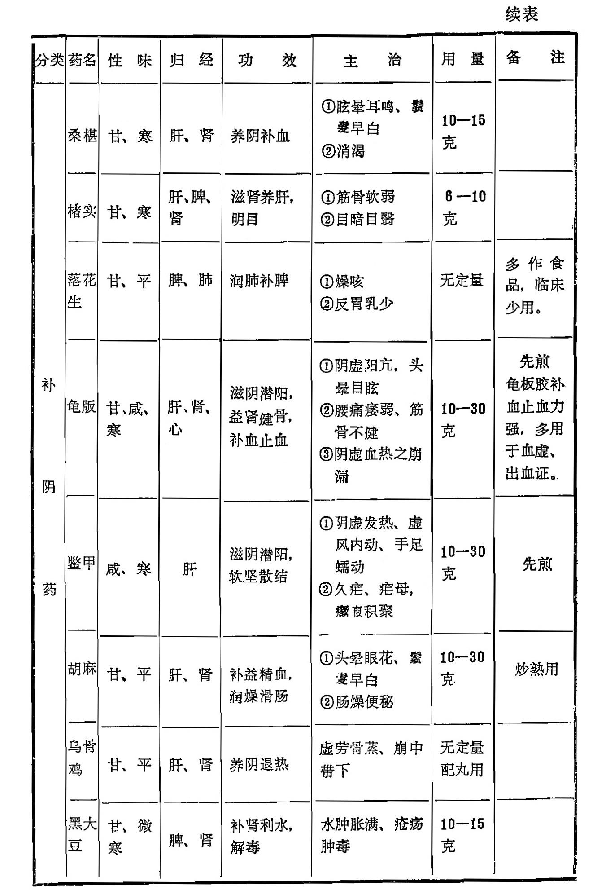

### 补益药功用归纳简表

复习思考题

1、你对补益药有何认识。

2、根据补益各药的效用特点共分为几类？各适用于哪些证候？

3、人参、黄芪、党参的效用各怎样？如何应用，有何差别？

4、分析比较下列药组功效和应用的异同：白术与山药  淫羊藿与肉苁蓉  杜仲与续断  补骨脂与益智仁  菟丝子与沙苑蒺藜  当归与白芍  熟地与何首乌  阿胶与枸杞子  天冬与麦冬  龟版与鳖甲

5、白术与苍术、白芍与赤芍的功用有何不同？

6、试述甘草、鹿茸、冬虫夏草、蛤蚧、紫河车、沙参、石斛、玉竹、旱莲草、女贞子的功效和主治要点。

7、鹿茸、冬虫夏草、蛤蚧、紫河车四药怎样使用？
