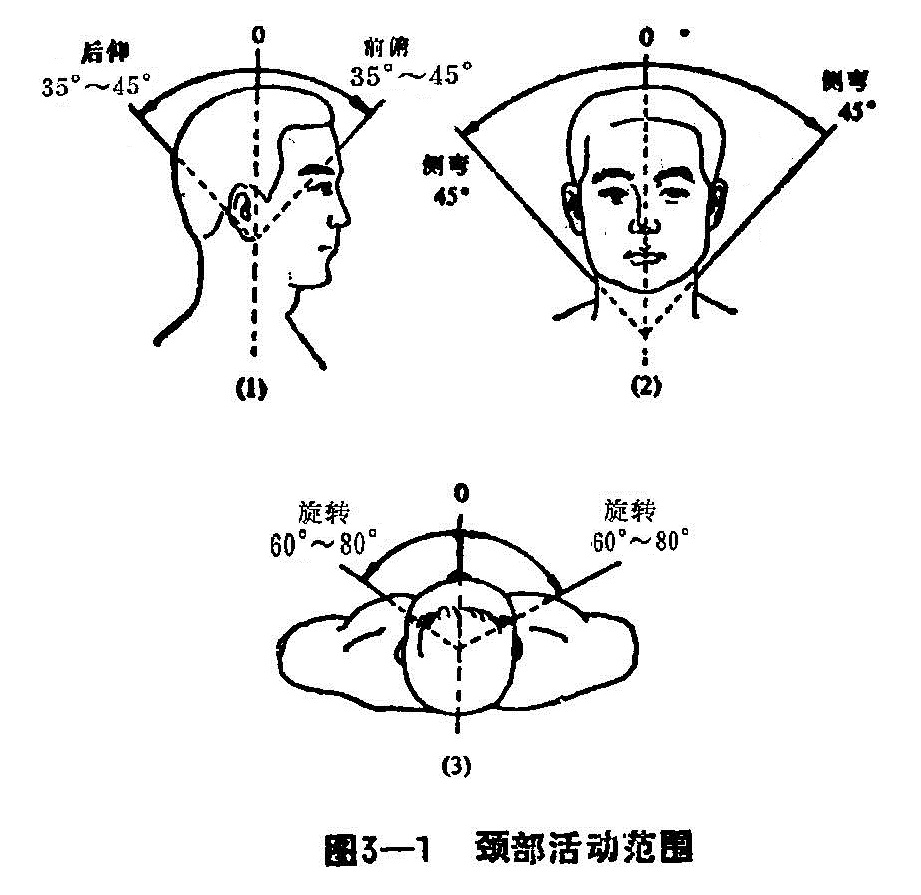
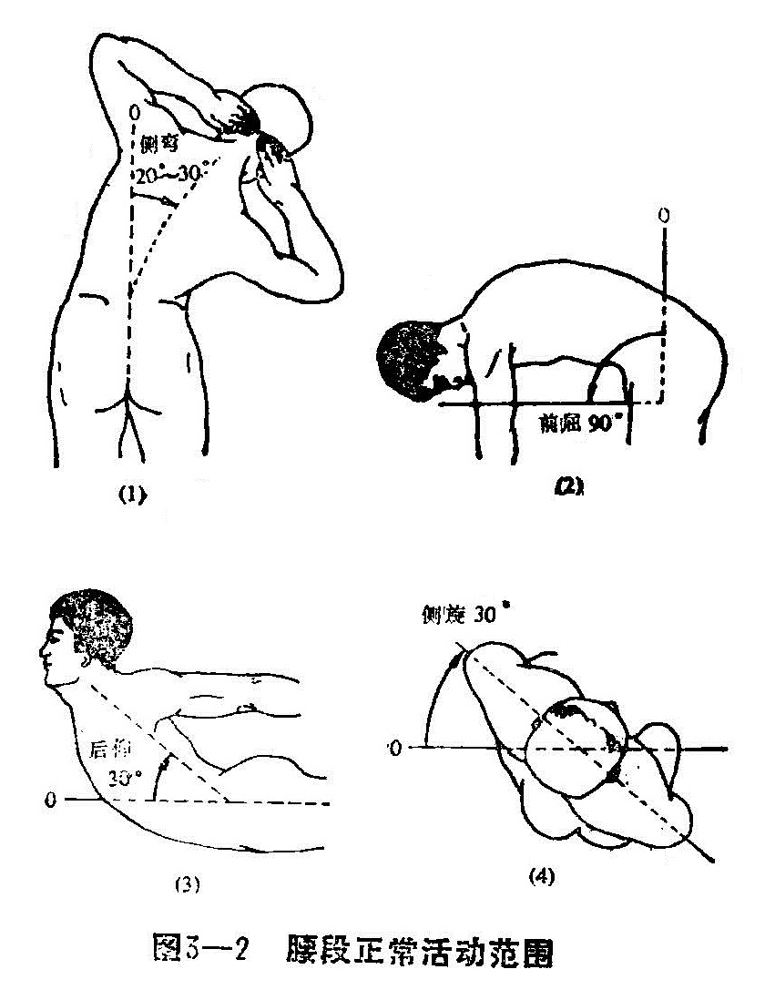
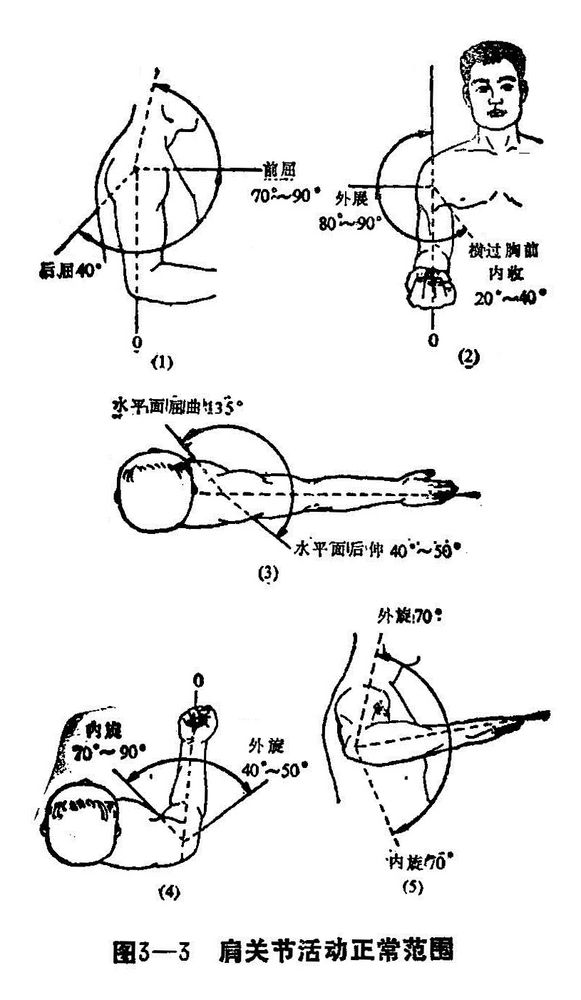
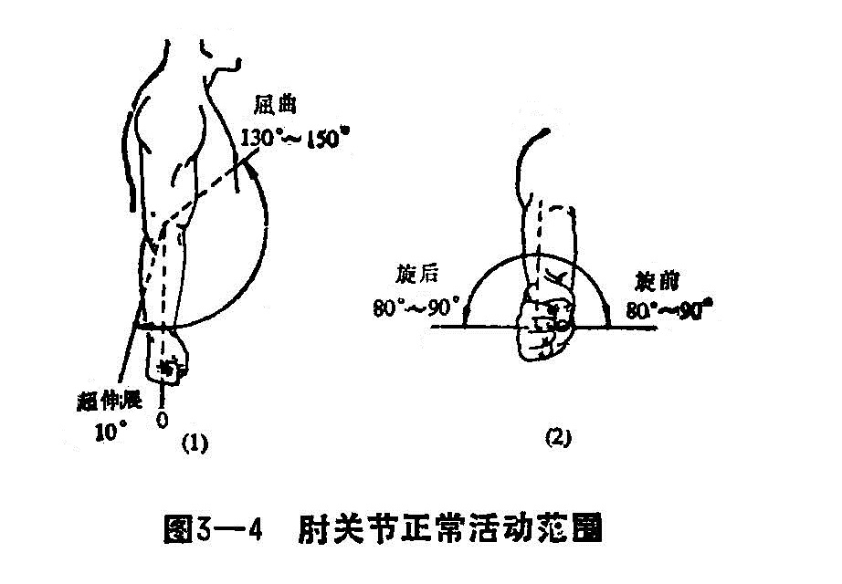
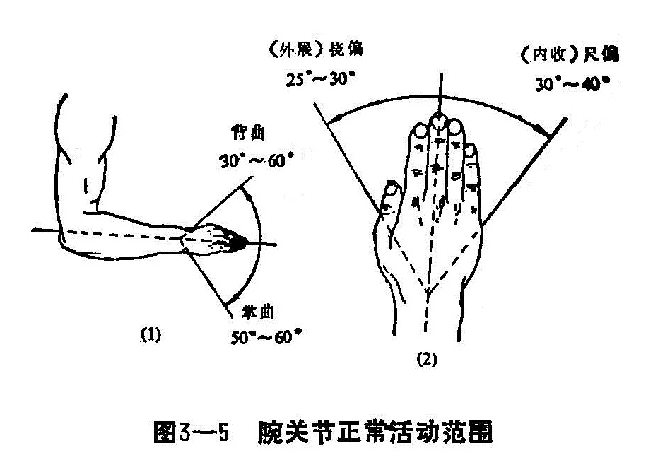
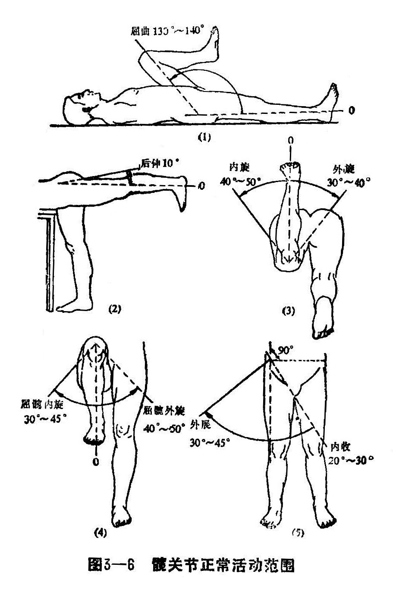

### 四、人体各关节测量法

（一）正常度数

1.颈部正常活动范围：颈椎有前屈、后伸、左右侧屈及旋转等运动。正常伸35°〜45°、屈35°〜45°、右侧屈45°、左侧屈45°，左旋60°〜80°，右旋60°〜80°（图3-1）。

2.腰段正常活动范围：腰部有伸、屈、侧屈、旋转等功能；正常屈90°、伸30°、侧屈20°〜30°，旋转30°（图3—2）。

3.肩关节活动正常范围：肩关节是全身运动幅度最大的关节，有外展、臂上举、内收、前屈、后伸、内旋、外旋等功能，正常外展90°、上举180°、内收45°、前屈90°、后伸45°、内旋80°、外旋30°（图3—3）。

4.肘关节正常活动范围：肘关节包括肱桡，桡尺、肱尺三个关节。有屈曲、伸肘、旋前、旋后等功能，正常屈曲140°、伸肘0°、旋前90°、旋后90°（图3—4）。

5.腕关节活动范围：腕关节有背伸、掌屈、桡侧、尺偏等功能。正常背伸35°〜60°、掌屈50°〜60°、桡侧25°〜30°、尺偏30°〜40°（图3—5）。

6.髋关节正常活动范围：髋关节有屈曲、过伸、外展、内收、外旋、内旋等运动。正常屈曲145°、过伸40°、外展25°、内收25°、外旋40°、内旋40°（图3—6）。

7.膝关节正常活动范围：膝关节有伸屈等功能，正常伸0°、屈145°、过伸10°、内旋10°、外旋20°（图3—7）。

8.踝关节正常活动范围：踝关节有背屈、跖屈等功能，正常背屈20°〜30°、跖屈40°〜50°（图3—8）。

（二）测量方法 可用关节量角器来测量关节活动范围，并以角度计算其活动的度数。正常度数或与健侧进行对比，如小于正常或健侧，则属关节功能异常；若影响功能，则应视为关节功能障碍。

操作时，应将量角器的轴对准关节中心，量角器的两侧紧贴肢体，并对准肢体的轴线，然后记载量角器所示的角度。本书采用的是中立位0°法，先确定每一关节的中立位为0°。如无量角器检查时，也可采用目测的方法进行估计，但一般不甚准确，仅作参考。
