### 三、常用手法

1.**拔伸** 术者和助手分别握住患肢的远端和近端，对抗用力牵引。手法开始时，可按肢体原来的体位先顺势用力牵引，然后再沿着肢体纵轴对抗拔伸（图4-1）。用力要轻重得宜，持续稳准。适用于骨折脱位而有重叠移位或筋络挛缩。

2.**旋转** 肢体有旋转畸形时，可由术者手握其远段，在拔伸手法下，围绕肢体纵轴向左或向右旋转，以恢复肢体的正常生理轴线（图4-2）。

3.**屈伸** 术者一手固定关节的近段，另一手握住远段，沿关节的冠轴摆动肢体，以整复骨折脱位（图4-3）

4.**横挤** 病人有侧方移位时，术者借助掌、指分别按压远端和近端横向用力夹挤，（图4-4）。

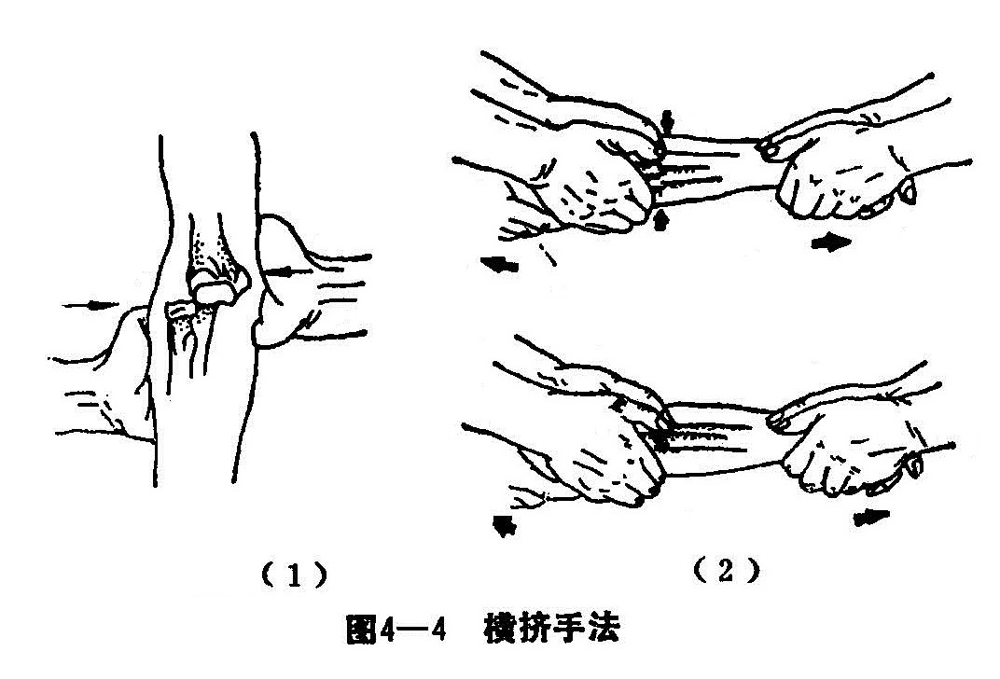

5.**分骨** 有两根以上并排骨骼发生双骨折，且两骨靠拢移位时，术者可用拇指与食、中、环三指，构成钳形在两骨之间用力钳夹，使两骨分开（图4-5）。适用于桡骨、尺骨、掌骨、跖骨骨折等。

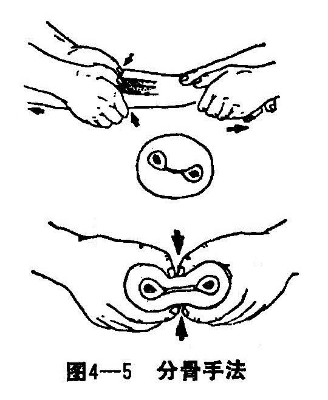

6.**折顶** 对肌肉发达而又重叠的横形或斜形骨折，有时一侧骨膜已断裂，另一侧骨膜尚完整，如用拔伸手法纠正重叠移位，就比较费力。可应用折顶手法：在原折断处加大成角，然后反折回来。使两断端相对而复位（图4—6）。但这一手法，操作时要仔细，以免骨锋损伤组织。

7.**回旋** 术者一手固定近端，另一手握住远端，按移位途径的相反方向回旋复位（图4-7）。施行逆向回旋手法要注意：如感觉有软组织阻挡，即应改变方向，以免损伤血管和神经。这一手法适宜断端间有软组织嵌入或背向重叠移位斜面骨折。

8.**纵压** 在横形骨折复位过程中，为了检查复位效果，可由术者两手固定骨折部，让助手在维持牵引下稍稍向左、右、上、下摇摆远端，术者双手可感觉到骨折的对位情况，然后沿纵轴方向挤压，若骨折处不发生缩短移位，则说明骨折对位良好（图4-8）。

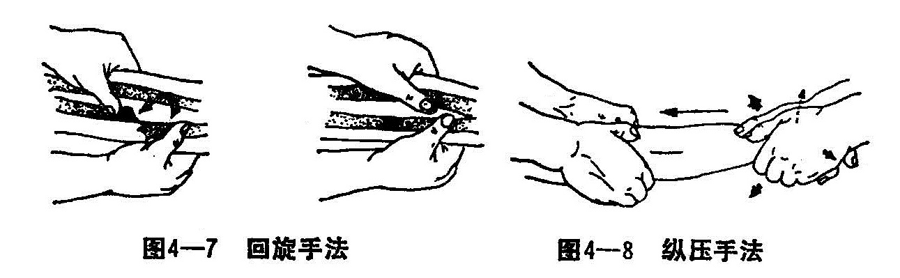

9.**分筋** 用手指尖压在患部穴位、痛点或肌肉筋结处搓按或点按（图4-9），手指移动幅度要小，用力由轻到重，直达组织深处。

10.**拨络** 用指腹或掌在皮肤上来回搓摩，盘施搓摩，用力较浅（图4-10）。

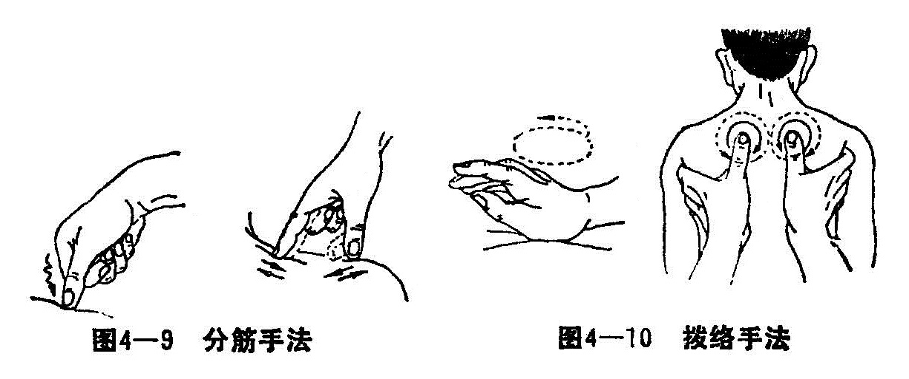

11.**理筋** 用拇指和其余各指构成钳形，插入肌肉间隙，沿直线或弧形运推。用力较深（图4-11）。

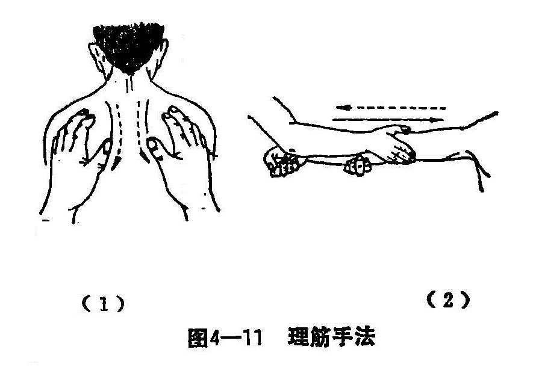

12.**弹筋** 用拇指和其余各指，构成钳形，用力捏拿起某一条肌肉或肌腱，然后放松弹回原位（图4-12）。

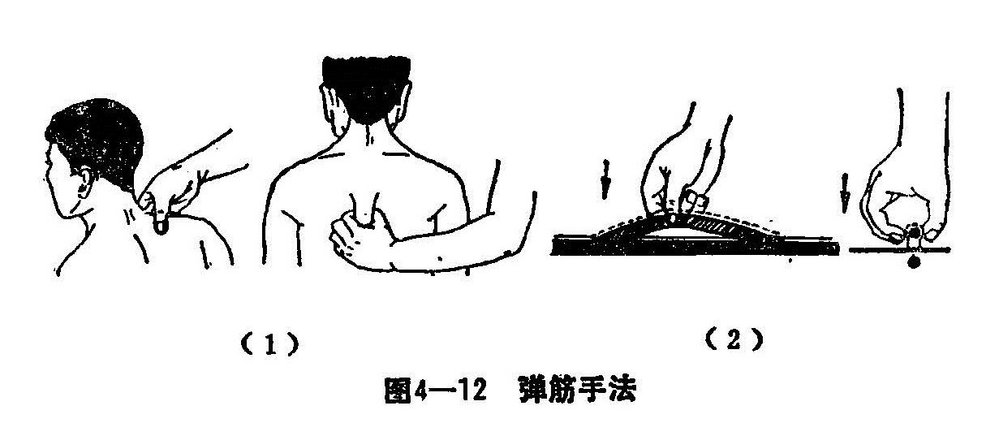

13.**推法** 用手指前端、大鱼际肌、小鱼际肌和掌根部，在受损的部位或穴位上，上下左右推动。可分为单手推法、双手推法、八字分推法、虎口推法和掌根推法五种（图4-13）。推时手掌或指腹应紧贴于病变部位的皮肤，着力均匀地推动，推至皮肤发红、发热为度。

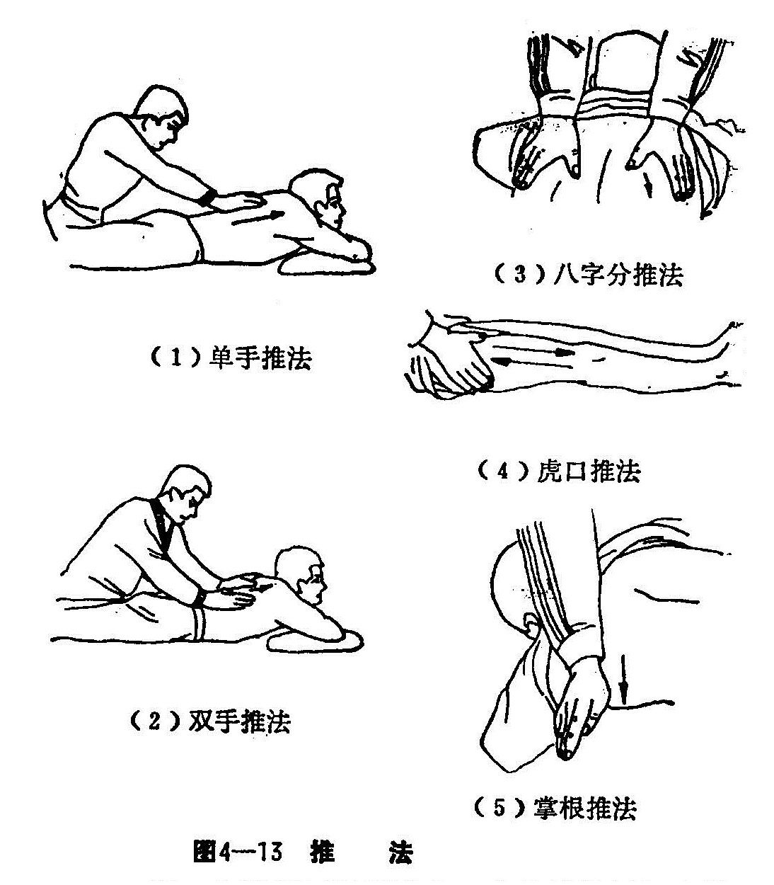

14.**拿法** 用手指相合用力作用于患者肌腹的一种方法。用指腹的力，将受损组织向上提拿，使受损的组织呈半圆型，然后突然放松，由轻到重，指力达到深层组织，重复数遍。一般在提拿时，方向应与肌腹垂直，也就是纵行肌腹横向提拿，横行肌腹纵向提拿（图4-14）。

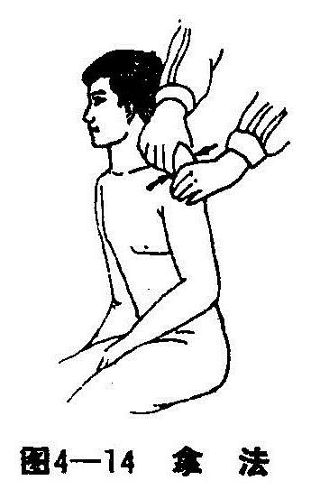

15.**按法** 医者用手指、手掌、拳、肘按压身体病变部位。手法可分为手指按压法、屈指按压法、屈肘按压法。一般先轻后重，并以颤动作向组织深部按压，以病人感到深部组织有酸、胀、麻感为宜（图4-15）。

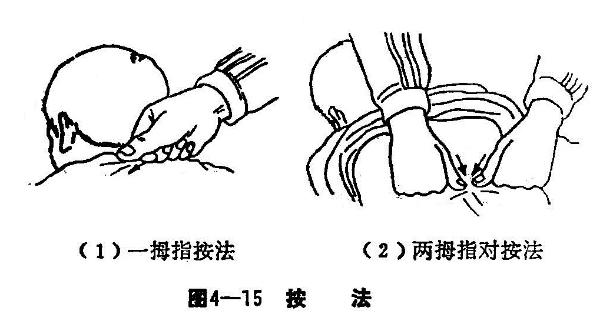

16.**摩法** 用手指或手掌于病人旳体表，轻揉地来回作抚摩动作。摩法的种类繁多，一般分为指摩法和掌摩法，但根据按摩的路线也可分为：直摩法、横摩法、揉摩法、斜摩法和束带摩法。因此，在施行手法时，医者肩部要放松，肘关节微屈，腕部维持在伸直位，摩动肘发力在肩，由肩至肘至手，手贴于皮肤，动作灵活，轻缓柔和（图4—16）。

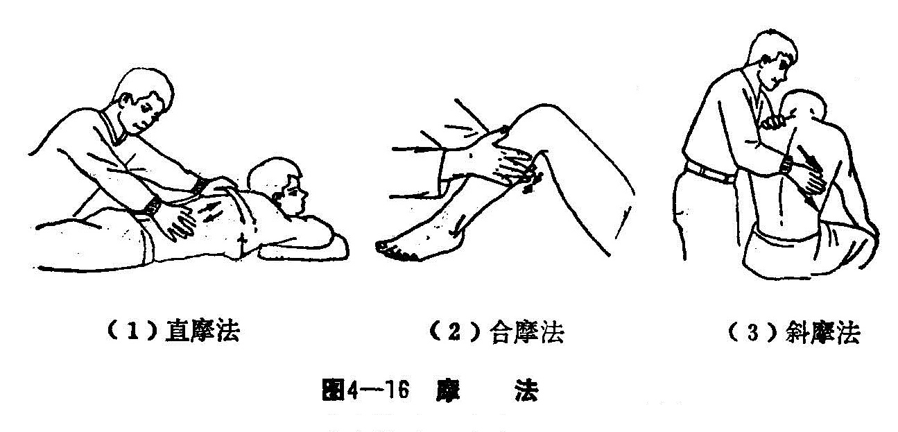

17.**揉法** 医者用手或前臂，在病人肢体部位回旋揉按，使其皮下组织随手而旋动。常用的手法有掌揉法、肘揉法、指揉法、前臂揉法（图4-17）。

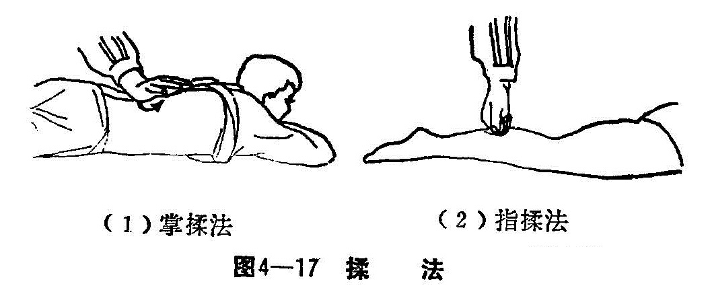

18.**摇法** 以关节为轴，使之被动地旋转、回旋、摇动和屈伸等动作。摇的幅度由小到大，直至最大可能的限度。但应注意，骨折或脱位及急性肌肉撕裂伤，禁用此手法。常用的摇法直摇肩、摇髋、摇踝等法（图4-18）。

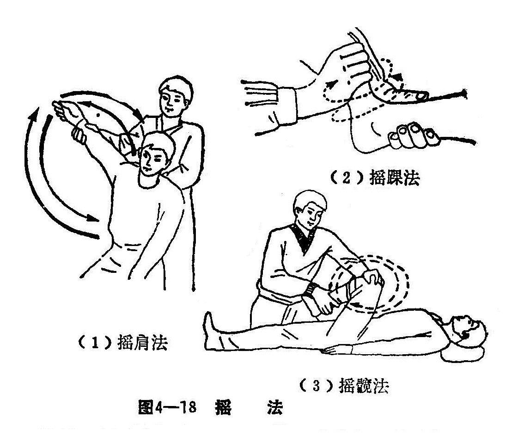

19.**㨰法** 用小鱼际和五、四、三掌骨及其掌指关节部分，着力于病人一定的部位上，使腕关节作屈伸外转的连续活动，带动着力部位的运动称为㨰法（图4-19）。㨰法作用力大且深透，接触面较广。适用于肩背、腰臀和四肢肌肉较丰厚的部位。

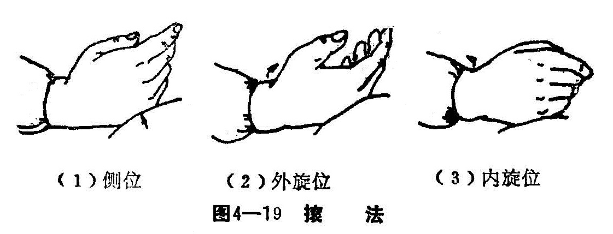

20.**拍击法** 用虚掌拍打体表，称为拍法；用拳背、掌根、掌侧小鱼际或特制的拍击棒叩击体表，称为击法。此二法动作相似，可归为拍击一法（图4-20）。拍击法适用于肩、背、腰、臀和下肢等部位。对风湿疼痛，感觉减退，肌肉痉挛等症，可用本法配合治疗。

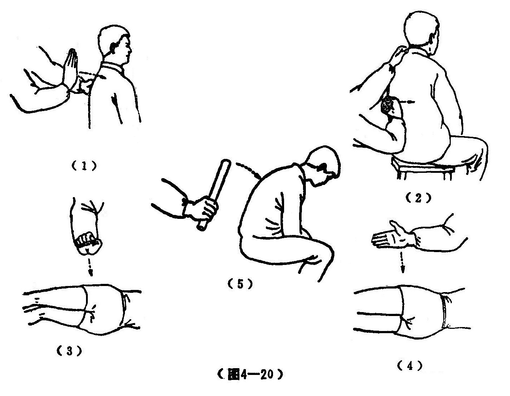

21.**抖法** 以双手握住病人肢体远端，微用力牵引，并作连续的小幅度的上下颤动，使关节有松动感，称为抖法（图4-21）。

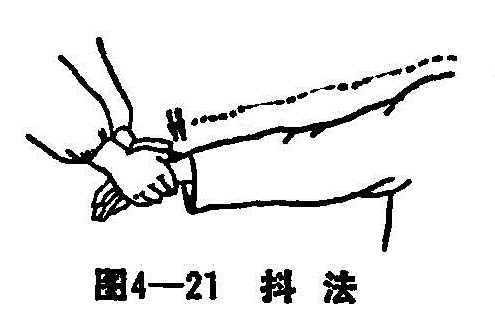

22.**扳法** 以一手扶住关节近端，另一手握住关节远端，用力扳动关节，称为扳法。使用扳法时，用力要稳，动作要缓和，两手配合要得当。腰部斜扳，在病人肌肉放松，无紧张感时进行，方易成功。扳法有滑利关节，松解粘连，纠正肢体关节畸形的作用。多用于陈伤、劳损、骨与关节损伤后关节功能障碍等疾病的治疗。新伤筋出槽、筋位不合者，亦多选用（图4-22）。

23.**点穴法** 以拇指或食指或中指在治疗部位或穴位上深点，称为点穴法。陈伤痛点准确者，可直接点压痛点。临床上多结合病情，根据经络循行，选择穴位配合治疗。有通利经络的作用。多用于陈伤，劳损等。
