### 一、外固定

外固定是指在骨折治疗时应用器械在肢体外面使骨折端牢固稳定的一种方法。《正骨心法要旨》指出：“跌扑损伤，虽用手法调治，恐未尽得其宜，以致有治如同未治之苦，则未可云医理之周详也。爰因身体上下，正侧之象，制器正之，用辅助之手法之不逮，以冀分者多合，欹者复正，高者就其平，陷者升其位，则危证可转于安，重伤可就于轻，再施以药饵之功，更示以调养之善，则正骨之道全矣”。

（一）小夹板固定法

1.原理：骨折复位后，由于肌肉收缩，肢体的重力及其他原因，可引起骨折端的再移位。为了防止再移位或纠正残留移位，为骨折愈合创造条件，所以需要固定。夹板局部外固定是一种能动的固定形式，它是通过：布带对夹板的约束力；夹板对伤肢的杠杆力；纸压垫对骨折端的效应力，来维持骨折复位效果；并充分利用肢体肌肉协调活动时所产生的内在动力，使肢体内部动力因骨折所致的不平衡重新恢复到平衡。

2.夹板制作：夹板采用具有弹性、韧性、可塑性的木板（柳木、麻柳、榆木等）、树皮、竹片、纸板等，材料应因地制宜，就地取材。现以木板、竹片为例，介绍不同部位夹板的式样及规格。夹板要光滑，与肢体接触一面应衬有棉花、驼绒或毛毡等软物。木板、竹板厚度约0.3~0.4厘米。

（1）前臂桡骨远端骨折外固定夹板（图4-23）。

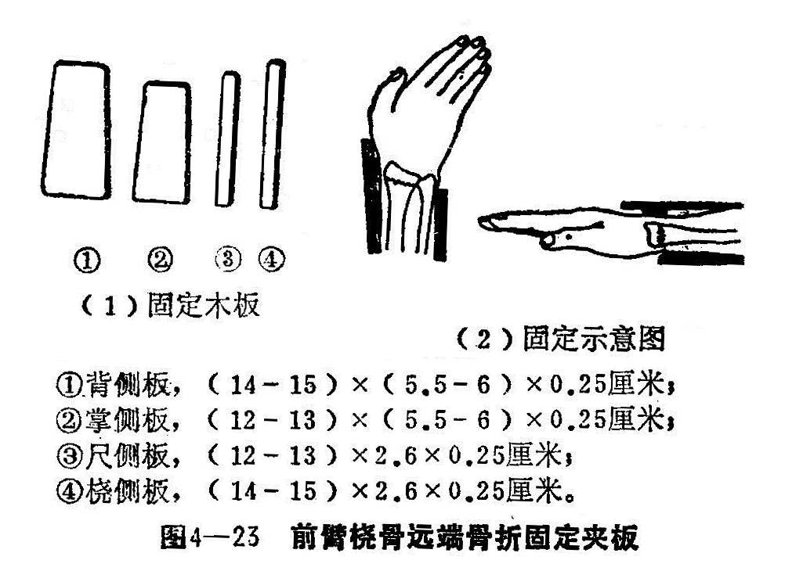

（2）前臂尺桡骨骨折固定夹板（图4-24）。

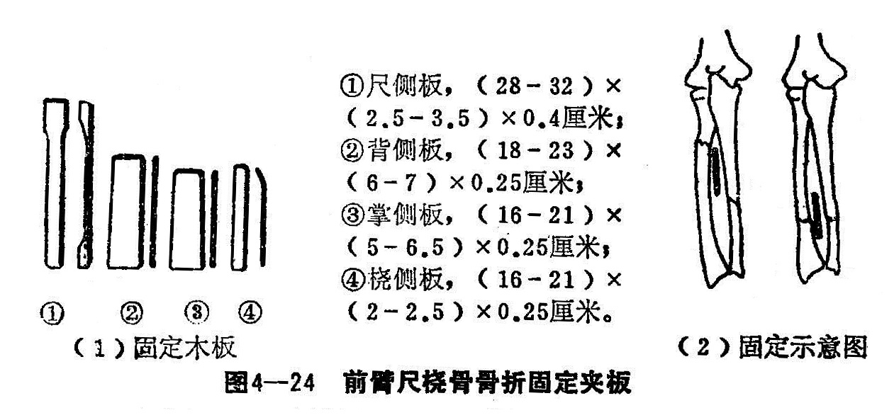

（3）肱骨踝上骨折固定夹板（图4-25）。

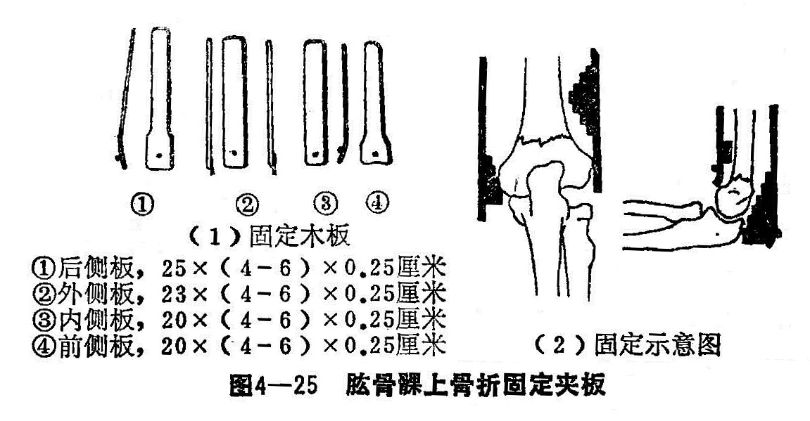

（4）肱骨干固定夹板（图4-26）。

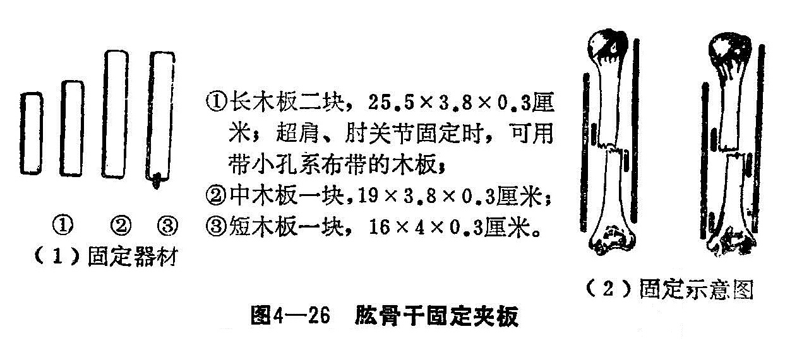

（5）肱骨外科颈固定夹板（图4-27）。

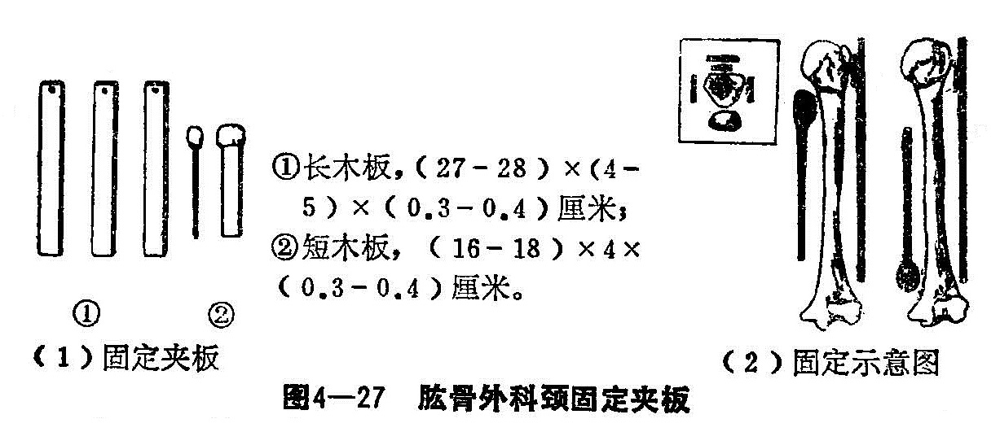

（6）股骨干骨折固定夹板（图4-28）。

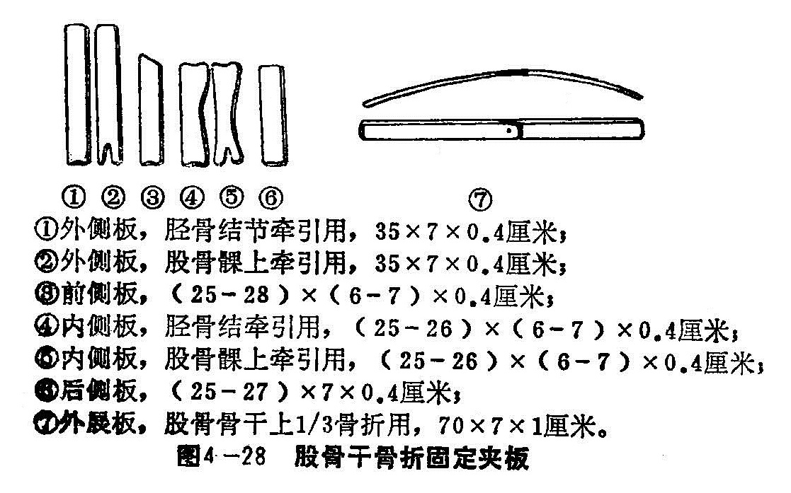

（7）胫腓骨骨折固定夹板（图4-29）。

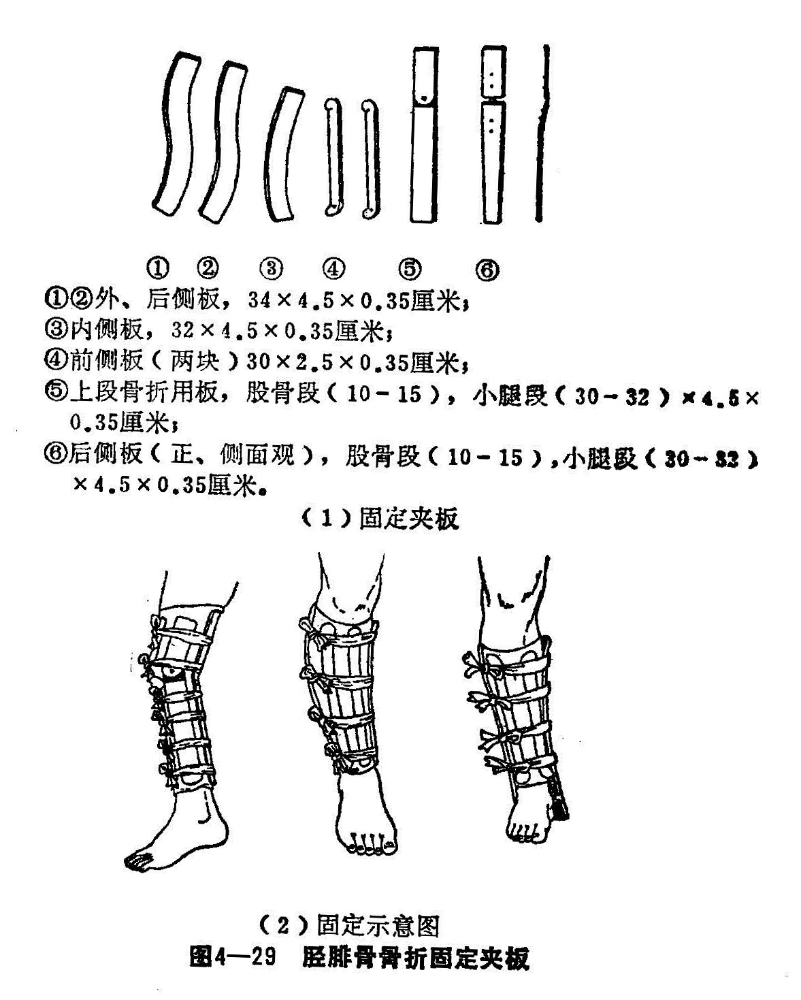

（8）内外踝骨折固定夹板（图4-30）。

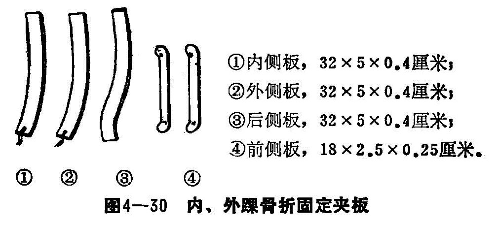

3.夹板的使用方法与步骤：

（1）外敷药或棉垫。骨折复位后，如是稳定骨折，可敷消肿止痛类药膏；如是不稳定骨折则放棉垫，以免反复换药造成骨折端再移位。不论药膏或棉垫，与皮肤之接触面要光滑平整，否则会起水疱。放棉垫或敷药膏后，用绷带松缠1〜2层。

（2）根据不同的骨折，将准备好的纸垫放在肢体的适当部位，并用粘膏固定好。纸垫的位置是根据骨折的类型、移位方向，按力学原理，可釆用二点或三点加压法，必要时加分骨垫。

（3）放夹板。按照夹板的固定位置，分先后放置，由一助手扶持固定。

（4）捆扎布带。用3条或4条布带（1.5厘米~2厘米宽市面买的）捆扎夹板，先捆中间两道，后捆扎二端。要求扎蝴蝶结，这样既结实又美观。布带松紧要合适，以能上下移动1厘米为度。

4.固定后的注意事项：

（1）夹板固定松紧要合适，过紧会压伤皮肤，阻碍肢体血运，甚至肢体坏死；过松起不到固定作用。过紧适当放松，过松适当调紧，调节时应一条一条进行，不能一次全放松，以免骨折移位。

（2）固定后检查肢端血运情况，如指、趾端发冷，呈紫色，或触痛等，是缺血挛缩的前驱症状。要及时放松布带，以免造成肢体缺血坏死。

（3）复位固定后，第二天要复查，以后1~3天复查一次，三次后改5~7天复查一次，但如有病情变化，嘱病人随时复诊。

（4）骨折固定后，肢体应放在肢体恢复功能的体位为宜。固定后患肢应适当抬高，冬天要注意伤肢的保暖。

（二）石膏固定 石膏为含水硫酸钙（CaSO<small>4</small>H<small>2</small>O生石膏）经煅制而成的白色粉末。吸水后可变成结晶石膏而凝固塑形，临床即用此特性进行固定。现临床应用是在医药商店售的石膏绷带，规格有：15厘米×500厘米、10厘米×500厘米、7厘米×300厘米三种。用温水浸至无泡时使用，固定5—7分钟后即可成形。成形后不再发生紧缩或扩张，故能使肢体保持所需固定位置。

1.使用方法：先将患处皮肤洗净，剃除毛发，涂抹酒精后，洒上滑石粉，以防汗腻。患肢用软垫或棉垫覆盖，保护好各关节骨隆起处。准备完毕后，扶持肢体于需要位置，即可将石膏卷浸泡于温水内2~3分钟，待无气泡后，用双手握其二端，提出水面，由二端向中央轻轻挤压，排出多余水分。由肢体近端开始作环形或螺旋形缠绕，后一卷盖住前一层的三分之一，卷2~3层后，即随时以手掌均匀用力轻轻按压涂抹，使各层均匀粘成一体。石膏绷带是贴上的而不是缠上的，所以缠时不要拉紧，使无皱褶即可。操作要迅速有序，否则先前的已硬化而后面的不易贴着。绕至二端接头将棉垫反折，再加石膏涂匀，使平坦美观。然后静止原位，待有相当硬度后再修正移动。一般石膏厚度以0.5～1厘米为佳，轻便易换。可根据需要加用补充石膏带加固。石膏带的制作是选用适当宽窄的石膏卷，依所要长度反折成八至十层，然后向中间折叠，浸泡后平铺于木板上，以手掌加压抹平，贴于患处，外缠石膏绷带或普通绷带即可。

2.石膏固定形式：石膏固定范围很广，常用的有石膏托、石膏夹板、石膏管型。两片石膏托合成为石膏夹板，多用于四肢骨折。石膏管型用于四肢，形成封闭性石膏管，固定效果较佳，但容易发生松动或过紧现象，并在某些情况下需要切开或更换。此外还有石膏领、石膏背心、肩人字石膏、髋人字石膏、石膏靴等，可随不同部位适当选用（图4-31）。

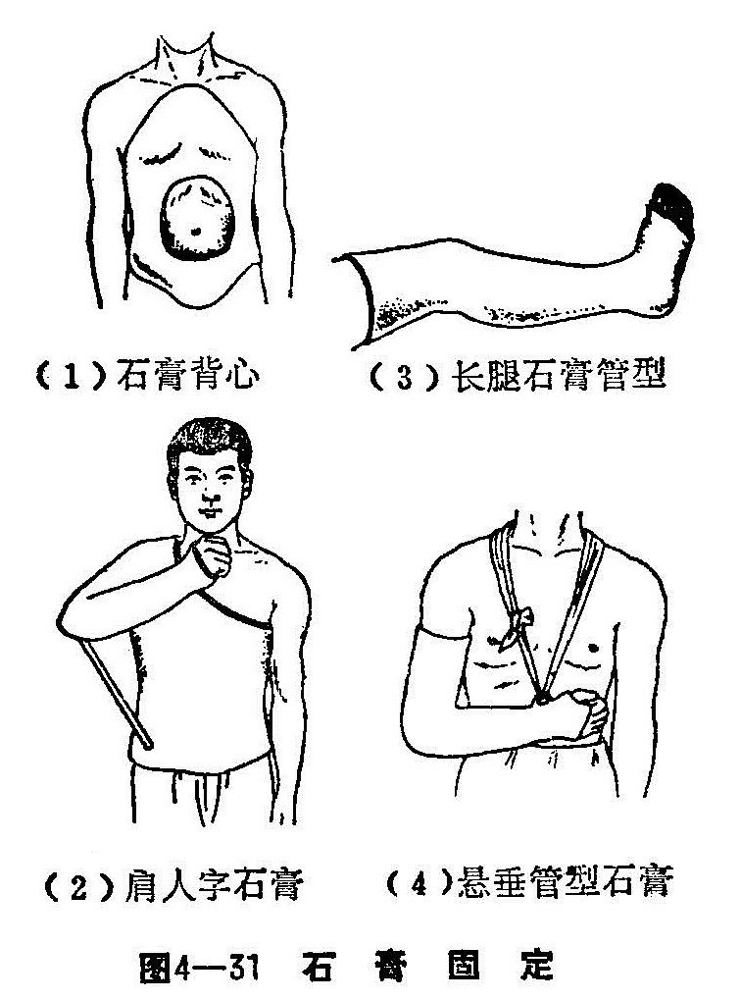

3.注意事项：

（1）石膏卷需浸泡、挤压适度，不可过干或太湿。

（2）固定前要保护好骨伤处，铺平棉垫。伤口应更换敷料，禁止环形贴粘膏，以防压伤和出现循环障碍。

（3）操作时要有专人扶持患肢所要求的位置，不要变动，以免石膏折裂、皱褶向内压迫肢体。扶持时要用手掌平托，忌用手指，以防石膏凹陷，引起压疮。

（4）四肢骨折固定，至少包括上下二个关节，否则会出现肢体旋转活动，不利折端稳定。同时应将指、趾端外露，以便观察颜色、温度和感觉等。

（5）石膏固定后，应抬高患肢，以利消肿，并注意保持石膏清洁。在石膏上注明固定日期，画上骨折位置，以便拆石膏时参考。

4.石膏固定的禁忌症：

（1）年老体弱者，易导致肌萎缩、关节强硬、肺部感染等并发症，应慎重选用。

（2）患肢肿胀严重，疑有循环障碍和神经损伤者。

（3）小儿易影响发育者。

（4）患肢萎缩及关节功能不好者。

（5）厌氧性细菌感染者。

（6）全身情况不能耐受长期固定者，以及妇女的胸、腹部。

（三）牵引技术 牵引与悬吊方法是骨科常用技术，骨科医护人员必须熟练掌握，合理应用，才能取得满意的疗效。

牵引原理：牵引是应用力学的作用与反作用的原理，缓解软组织的紧张和回缩，使骨折或脱位整复，矫正畸形。牵引多施用于肢体或脊柱。常用的牵引种类有器械牵引、皮肤牵引和骨牵引等。

1.器械牵引：多采用一些特制器械进行牵引。

（1）枕颌带牵引：用毛巾或布带等制成，内层可衬海绵垫。病人取坐位、卧位均可。配合滑车应用，重量2~4公斤，过重易压伤皮肤。牵引的时间，根据各病而有所差异。如骨折或脱位，需先纠正脱位或骨折，用颈围（石膏、皮革或其他材料做的均可）保护。适用于颈椎病牵引，每天1~2次，每次20分钟左右。应用于颈椎骨折、脱位，也用于纠正斜颈及治疗颈椎病。（图4-32）。

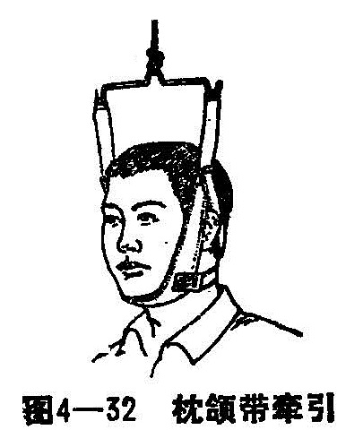

（2）骨盆牵引：用一长方形的粗帆布，两端穿上木棒，木棒二端系引绳，连于床架上方的滑轮和重物，向上牵引。用时病人取仰卧位，兜托住腰臀部，稍离床即可。适用于骨盆环多处骨折，耻骨联合分离，骶骼关节分离等（图4-33）。

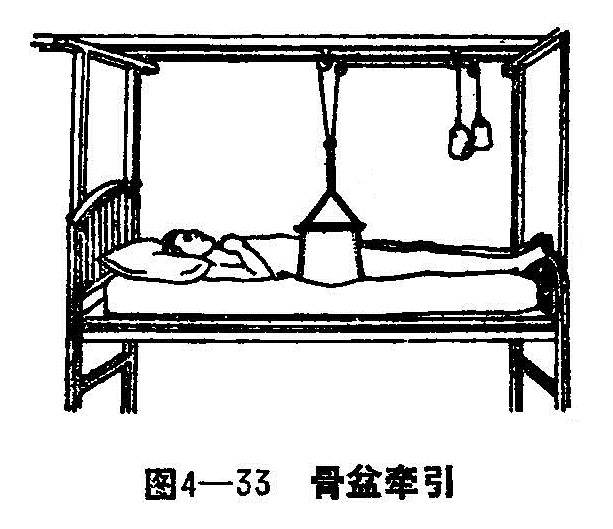

（3）袜套牵引：袜套牵引用针织袜套一条，上端套在大腿中部，下端超过足尖尺余，并系一绳，通过滑轮坠以重物，重量以能悬起下肢为度。每天作踩自行车的动作数百次。配合夹板应用治疗三踝骨折。（图4-34）。

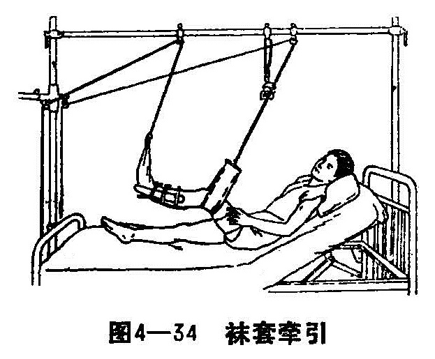

（4）腰椎牵引：用布制腰、胸带，分别固定住病人的骨盆和胸肋部，两边系绳，分别向头足反向牵引，牵引重量可达20~40公斤。主要用于脊椎胸腰段压缩性骨折或脱位，以及腰椎间盘突出症。

2.皮牵引：是用胶布直接地贴附在皮肤上，使牵引力作用于皮肤，间接地牵引肌肉与骨骼，以维持骨折端稳定和延长肢体作用。重量在5公斤以下。过重则皮肤不能承受，易滑脱。常用于儿童及体质虚弱肌肉不发达者。不适用于开放性骨折及皮肤有损伤、感染、化脓等。

（1）皮牵引的用具：宽胶布（5~7厘米）一条，长度为骨折端至肢体末端10厘米，牵引关节侧自关节平面下计算，将一头撕（剪〉成三开，以扩大皮肤的粘着面积；6厘米的小方木板一块，厚约1厘米，中央钻一0.5~0.6厘米孔，称分开板；纱布两卷，棉花适量，绳一条，滑轮一个，重锤适量。牵引架可利用牵引床的床头。

（2）具体操作：将皮肤洗净擦干，在骨隆起处和关节部位加棉花垫保护。将备好的胶布分别贴于患肢两侧皮肤上，与肢体长轴平行。粘贴时不可交叉重迭，以手掌压牢，使无皱褶。禁止用胶布在肢体上螺旋缠绕，以防发生血运障碍。胶布绕过足心处，将撑开板贴在胶布中央，在板的圆孔处把胶布钻穿，将牵引绳穿入，绳端打结，防止滑脱。绳的另一端穿过滑轮系于重物（铁砝码）。肢体贴胶布处用绷带适当地、均匀地加压包扎。胶布近端应外露，以观察有无滑脱。

皮肤牵引后应经常检查，牵引是否脱落，皮肤是否过敏、出现水疱，重锤是否触地或有障碍物，及时发现，及时调整（图4-35）。

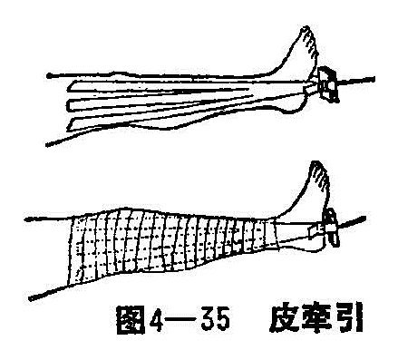

（3）小儿下肢悬吊或皮牵引（Bryant氏牵引）。适用于4岁以下小儿骰骨干骨折。牵引用胶布大小可根据患儿肢体来调整，牵引重物可用沙袋或砝码，重量以能将小儿臀部离床面2厘米左右为度。牵引时间一般21~25天，骨折可愈合。因此在牵引期间要经常检查对位情况，必要时用夹板、纸压垫固定，以防畸形愈合（图4-36）。

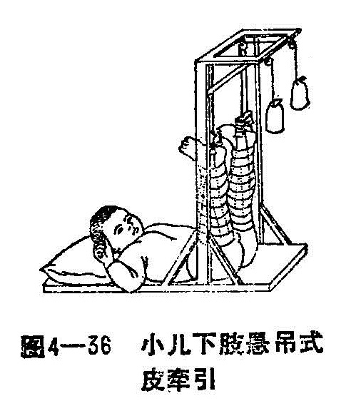

3.骨骼牵引：牵引力直接作用于骨骼，阻力小，收效大（图4-37）。能舒筋解痉，整复畸形，纠正重叠移位。常用于下肢不稳定骨折，壮年、肌力强大、需大力牵引者以及开放性骨折、皮肤破损和其他方法无法固定者。

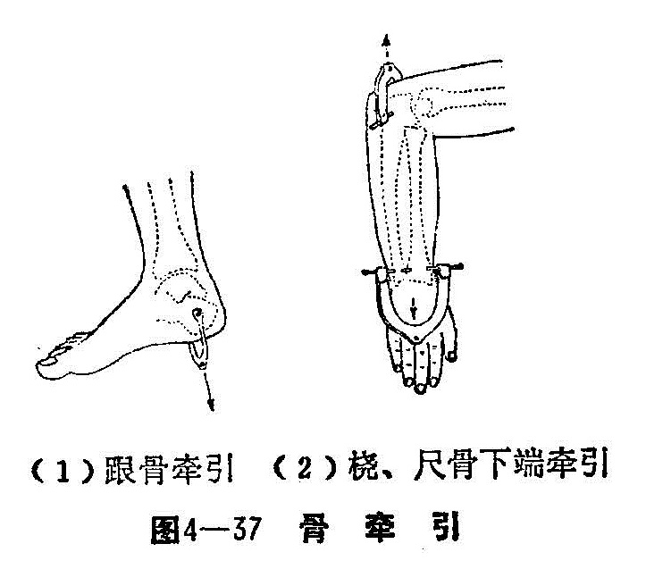

（1）用具准备：尖手术刀，骨圆针或克氏针，牵引弓，手钻，钳。消毒用具和牵引架、夹板、牵引绳、砝码（或重锤）等。

（2）操作方法：打牵引针部位的皮肤消毒后，铺消毒布单或孔巾。穿针部位皮下注射麻药直至骨膜，将钢针与肢体长轴呈垂直方向端平钻入即可，针尖直达对侧皮下，见针尖顶起皮肤时，用手压皮肤，针尖即可穿出皮肤，针露出体外两侧等长，然后略退针少许，以防入针的皮肤向针孔内卷压；再用酒精纱布保护好两侧针眼，安装牵引弓。钢针两端适当剪短，断端用青霉素瓶套上，以防伤及他处；将患肢置于牵引架上进行牵引。其牵引重量根据需要决定，一般上肢2~3公斤，下肢5~8公斤。并可据情增或减。

（3）骨牵引适应症：

牵引用于骨折急救，能使患肢舒伸，防止折端成角、重迭而加重损伤，解除肌痉挛，有止痛、防止休克等作用。

用于不稳定性骨折和肌肉丰厚部位骨折的整复和固定。如股骨干和小腿的斜形、粉碎性骨折等。

颈椎骨折、脱位，颈椎病，腰椎间盘突出症等，也可适当选用。

（4）注意事项：

牵引方向要与近侧断端轴线一致。

牵引量和牵引时间，应根据骨折类型、对位情况而定，一般4〜6周。但在纠正重叠、成角及侧方移位后，牵引重量适当减轻，严防牵力过大，造成骨折不愈合或延迟愈合。

骨牵引时，应注意穿针位置与方向，防止损伤血管、神经，小儿防止损伤骨骼和关节。一般胫骨结节牵引，应从外向内进针；股骨踝上、跟骨、尺骨鹰嘴骨牵引，应由内向外穿（进）针。

鼓励病人进行自我锻炼，防止肌肉萎缩，关节强直。

骨牵引穿针部位及牵引重量表

| 牵引针                         | 穿针部位      | 入针方向与标志                                               | 牵引目的                                                     | 重量（成人）                        |
| ------------------------------ | ------------- | ------------------------------------------------------------ | ------------------------------------------------------------ | ----------------------------------- |
| 颅骨钳                         | 颅骨顶部      | 两外耳道联线与两眉弓外缘向顶部所画线交点处                   | 颈椎骨折脱位、颈椎病或痉挛性斜颈                             | 开始重量7~15公斤，维持重量4～5公斤 |
| 克氏针 螺丝钩 手巾钳 | 尺骨鹰嘴突    | 由鹰嘴尖端向远侧1.5横指处与距皮缘1厘米画线交点处、由内向外，防止损伤尺神经 | 肱骨骨折，固定不稳的肱骨髁上骨折或局部明显肿胀和肱骨髁间骨折 | 开始重量2~3公斤，维持重量1~2公斤  |
| 克氏针                         | 桡尺骨下端    | 桡骨茎突上3.5厘米处                                          | 桡尺骨干骨折和肘关节损伤或疾病                               | 开始重量2~3公斤，维持重量1~2公斤  |
| 克氏针                         | 第2、3、4掌骨 | 横贯2~3或2、3、4掌骨干由桡向尺侧穿针                        | 前臂双骨折 桡骨下端骨折 腕关节疾病                 | 开始重量2~3公斤，维持重量1~2公斤  |
| 克氏针                         | 指骨          | 指骨远节基底远侧                                             | 掌骨、指骨不稳定性骨折和掌指关节损伤与指间关节损伤           | 用手套边橡皮圈                      |
| 克氏针 冰钳               | 股骨下端      | 髌骨上缘2厘米处或内收肌结节上二横指处由内向外，防止损伤血管。如用冰钳以内外髁中心为标志 | 股骨骨折、髋关节脱位、感染等                                 | 开始重量7~8公斤，维持重量3~5公斤  |
| 克氏针 骨圆针             | 胫骨结节      | 胫骨结节向后一横指即1.25厘米处在其平面下部由外向内，避免损伤腓神经 | 股骨骨折，膝关节内骨折和髋关节脱位或疾病                     | 开始重量7~8公斤，维持重量2~5公斤  |
| 克氏针 骨圆针             | 跟骨          | 外踝顶点下2厘米再向后2厘米垂直线的顶点处或内踝顶点下3厘米垂直线顶点处或自外踝顶点沿跟骨纵轴2横指 | 胫骨骨折、踝关节骨折脱位等                                   | 开始重量4~9公斤，维持重量2~3公斤  |
| 克氏针                         | 第2、3、4跖骨 | 横贯1、2、3跖骨                                              | 跗跖关节脱位                                                 | 开始重量2~3公斤，维持重量1~2公斤  |
| 克氏针                         | 趾骨          | 趾骨远节                                                     | 跗骨、跖骨骨折                                               | 用手套边橡皮圈                      |