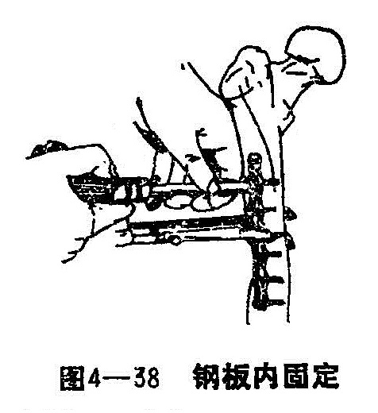
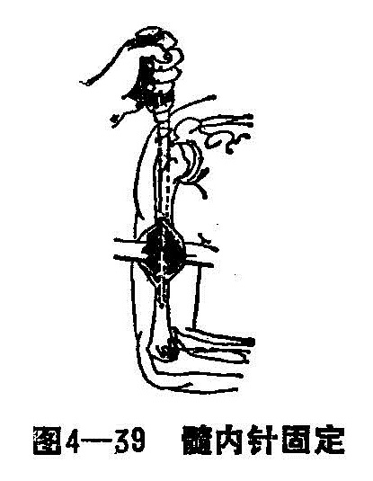
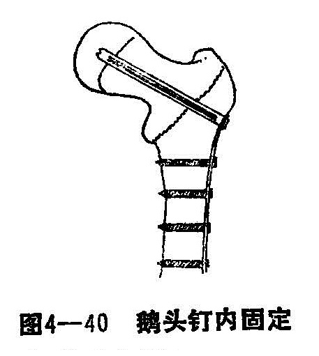

### 二、内固定

骨折内固定，是用不锈钢制成的各种固定物，直接固定在骨骼上，以辅助手法复位之所以不逮，能使骨折基本达到解剖复位。主要是可以避免骨折畸形愈合。另一方面在做骨折内固定手术时，必然要破坏局部血运，损伤骨膜，阻碍骨折端生理性的纵向压刺激，就会较闭合复合骨折愈合慢，且有感染的可能性。所以，做内固定手术，一定要慎重，只有使用手法确实不能复位或复位后无法妥善固定的，同时术者要具有熟练的手术经验，再做内固定手术。这样既能减少手术由固定中的不足，又可充分发挥手法治疗骨折的优势。应该指出：内固定是一种比较复杂的手术，既要求术者具有丰富的临床经验，又要求医疗设备合乎手术条件，才能够得以顺利进行。

适应症与禁忌症：

1.适应症：

（1）长管状骨骨折，折端间夹有软组织，用牵引或手法均不能解脱，复位者。

（2）撕脱性骨折，骨片分离较远者，如髌骨、肱骨大结节、尺骨鹰嘴突、肱骨内髁及肱骨外髁等。

（3）关节内骨折，如股骨颈骨折，股骨单髁骨折，髁间骨折，肱骨髁间骨折，三踝骨折等。

（4）一骨多段骨折和多发骨折。

（5）开放性骨折，血管、神经损伤的骨折，在做清创和探查、缝合术的同时，可做骨折内固定（小的开放创口，经清创缝合后亦可按闭合骨折处理）。

（6）陈旧性骨折（包括骨折畸形愈合，延迟愈合，骨不连接）手法和其它保守疗法无效者。

2.禁忌症：

（1）对开放创口大、消毒清创不彻底者，不宜做内固定手术。

（2）创口有感染、炎症未彻底消退者，不宜做内固定手术。

（3）螺丝钉内固定禁用于儿童的骨端，以免伤及骨骺，影响骨骼发育。

（4）骨折移位不大、身体健康者禁用内固定治疗。

（5）粉碎或多块骨折，股骨干不能拧三个以上螺钉者，禁用内固定治疗。

目前常用的内固定，有不锈钢板内固定、髓内针内固定，螺钉与钢丝内固定、三翼钉内固定、鹅头钉内固定及适用于关节附近和掌（蹠）、指（趾）骨骨折的克氏针与斯氏针内固定。

（一）不锈钢板内固定 适用于长管状骨的不稳定性骨折，关节附近骨折及开放骨折。

应选用同样材料制成的钢板与螺钉，钢板长度应等于所固定骨骼直径的4倍以上，而螺钉长度应恰好能穿过对侧骨皮质，过长过短都不宜使用。对股骨因肌肉丰富应用八孔或六孔钢板；肱骨和胫骨可用六孔或四孔钢板；桡、尺骨则以四孔钢板为宜。而二、三孔和三叉钢板则常用于肱骨下端。鹅头形钢板（即将钢板一端折成20°～40°角）用于股骨粗隆间或肱骨外科颈等处骨折（图4-38）。

（二）髓内针内固定 髓内针常见的有三种类型（梅花针、V字形、三角形等〉。适用于长管状骨之骨折在上1/3或中1/3，骨端嵌有软组织或其它原因不能复位者，长管状骨一骨多处骨折而非严重的粉碎性骨折者；长管状骨中，上1/3骨折畸形愈合，做截骨术的同时，可做髓内针内固定（图4-39）。

选择髓内针时，其长度应以针尖能达到骨折线下8~10厘米为度。如针短就起不到固定的作用，针长则不能完全进入髓腔。髓内针的粗细要适当，针细固定不牢，针粗有使骨质劈裂之虞，选择时髓内针要比X线照片的髓腔宽度窄2mm。术后不用外固定。

髓内针固定术可分为闭合性和开放性两种方法：

1.闭合穿针：首先将骨折闭合整复，在穿入髓内针的骨端部位做一小切口，能插入髓内针即可。再经切口凿开骨的一端，用锤把髓内针打入髓腔。但穿针多需在X线下进行，操作比较复杂，不适用于陈旧性骨折，故使用较少。

2.开放穿针 有顺行和逆行两种打针方法。其中逆行法操作简单，穿针方向易掌握，不易造成骨皮质劈裂或卡针等现象，故为临床所常用。用时将骨折部软组织切开，露出骨折端，将髓针尾部插入骨折上段髓腔内，针尖套上嵌插器，用骨锤将髓针打入上折段内，直至针尾从骨的近端穿出（如股骨即从大转子窝部穿出），针尖达皮下，再把该处皮肤切一小口，继续向上打针，令针尾从切口露于皮外，直至针体全部进入上折端髓腔内，针尖露于骨折端外约0.5厘米时，将下折端套在针尖上，用骨锤再从上将髓针打入下骨折段的髓腔内，把针尾有孔部分留于骨外，用生理盐水冲洗切口，彻底止血后缝合。

顺行开放髓内针固定，则是先在骨折部位切口，在直视下手法复位，折端对位良好后，在肱骨大结节（股骨大粗隆）处切一小口，将该处骨质凿一小洞，V形髓针尖端放骨洞内，对准髓腔，针嵴向外，针槽向内，针尾套上嵌插器，用骨锤向髓腔内打入髓针并通过骨折线进入下骨折段的髓腔中，直至针尾有孔部分恰好留在骨外为止。用生理盐水冲洗切口、止血、缝合。

（三）螺钉与钢丝内固定 螺钉与钢丝固定骨折，有单独使用，也常与钢板配合使用。在单独使用固定力弱，稳定性较差，应选好适应症。并多需配合适当的外固定。达到临床愈合后，去除外固定。

1.螺丝钉固定：多用于骨突部位的骨折，手法复位困难，外固定失败时。如常见的肱骨内、外髁骨折，尺骨鹰嘴骨折，股骨、胫骨的内、外髁骨折，肱骨大结节骨折等。

长管状骨的长斜形、大螺旋形骨折，手法复位失败时，可切开用几个螺丝钉作内固定，如肱骨的骨折。

一些部位的陈旧性脱位合并韧带完全断裂者，如肩锁关节、下胫腓关节皮。

2.钢丝内固定：只能做配合使用。如长管状骨折有较大骨折片时，在采取其它内固定的1小时，使用钢丝将易移位的骨片固定。

再如髌骨骨折或尺骨鹰嘴骨折，可用钢丝将骨片缝合。

某些肌腱附着部位的撕脱骨折或指伸肌腱断裂等，用其它固定方法难以奏效时，可用钢丝缝合。

（四）三翼钉内固定 三翼钉内固定有两种打法，一为闭合复位三翼钉内固定，一为开放三翼钉内固定，如有条件，应尽量釆用前者。此内固定法用于治疗股骨颈骨折较为理想，可避免病人长期卧床而引起的一系列并发症。

1.闭合复位三翼钉内固定：术前2~3天先行牵引复位。采用局麻或硬脊膜外麻醉后铺好消毒巾，自大粗隆上缘向下作一纵行约8厘米长的切口，按肌纤维分开股外肌直达股骨外侧。

插入导针，在大粗隆基底部下2~3厘米处切开骨膜，用圆凿凿成直径0.7厘米的骨洞，将带刻度的导针，用手钻由骨洞插入股骨颈直达股骨头内，一般可按不同方向插入2~3根导针，以便选择较好位置的导针留作打三翼钉的引路针。导针插好后，照X线片检查，拔出不合适的导针，最好距正确导针旁0.5~1厘米处再保留一根导针，并将其穿越股骨头固定于髋臼上，防止打三翼钉时股骨头发生旋转。

打三翼钉：用三棱凿按三翼钉的三个翼预定进入骨质处，先凿开骨皮质，再把三翼钉安放在打入器头部的螺旋上，不偏不倚地套在导针上，用左手稳固地把住打入器，右手持锤慢慢地将其向股骨颈内打入。三翼钉前端应达股骨头关节面下0.5厘米，针尾留在骨皮质外0.5厘米，然后拔出导针，再用嵌插器将骨折两折端嵌紧。打入三翼钉后，应再摄X线片以了解固定情况。三翼钉的尾部在骨皮质外应为0.5厘米，尖端距股骨头缘应为0.5厘米。三翼钉的方向与股骨颈内倾角一致或稍大，骨折端紧密接触，即为固定良好。

2.开放复位三翼钉内固定：适用于因条件所限，不能用闭合三翼钉内固定的股骨颈骨折者。此法是切开关节囊，在直视下进行复位，同时作内固定，在操作上比闭合复位简单，但易影响股骨颈的血循环，故在操作时要细致，以减少对骨折愈合的影响。

釆用髋关节前侧或外侧切口，经阔筋膜张肌与臀中肌的间隙进入关节囊。在关节囊上作“T”形切口，不要过多地剥离关节囊，显露骨折部位即可。然后在大粗隆基底下2~3厘米处，凿去0.6~0.7厘米的骨皮质，用手钻将导针插入股骨颈内，使骨折正确复位，然后将导针正确插入股骨头，顺导针打入三翼钉，再用嵌插器使骨折端嵌插紧密。固定后，生理盐水冲洗关节腔，逐层缝合切口。

（五）鹅头钉内固定 鹅头钉是弯颈接骨板用螺丝钉固定于三翼钉上，可根据骨板颈的角度来调节，故颈干角也可调节，患者可早期离床活动，本法多用于股骨颈基底部骨折、粗隆间骨折，主要有以下几种情况：

（1）股骨粗隆间骨折，折端分离较远，手法复位折端不稳者。

（2）年老体弱、不适于卧床治疗者。

（3）多发损伤，做内固定后可早期活动肢体者。

（4）严重的髋内翻或股骨颈骨折迟延愈合者。

术后可用皮肤牵引，3周后拆除可扶双拐下地，但忌用患肢负重走路，以防髋内翻，8周后逐渐负重走路。

操作方法：切口与股骨颈骨折做三翼钉内固定时基本相似，只是切口要长些，向下延至股骨粗隆下，以备安放骨板。先向股骨颈内打三翼钉，操作方法与股骨颈骨折三翼钉固定方法相同，只是在三翼钉尾部另加一块弯曲的接骨钢板，其弯度要符合骨骼外形，将一端的螺孔对准三翼钉尾部螺孔，用螺丝连接变成一体。将板体沿股骨干纵轴向下摆正，按板的钉孔用钻钻孔，按孔拧入螺钉，直达对侧的骨皮质上，一定要拧牢。然后摄X线片检查，证明位置良好，即可清洁切口，逐层缝合（图4-40）。

（六）注意事项

1.内固定手术，必须严密消毒，否则易引起术后感染，以致内固定手术完全失败。

2.术后除保持创口无菌外，应以抗菌素或中药（补气血、生肌长肉、清热解毒〉，服用1周，创口正常恢复即可停药。

3.钢板内固定一般应在骨折后4~6个月，骨折坚固愈合后取出钢板。

4.使用V形髓内针时，无论顺行或逆行进针，针嵴一定朝外，否则针尖会长在对侧骨壁上以致影响进针和打裂骨皮质。

5.打三翼钉时要防止股骨头旋转及钉上滑，或针尖超出股骨头钉入髋臼内。

6.手术操作用力要稳妥，循序渐进，遇到阻力不要强打。

7.术前应据X线片选择适当的器械。

8.术后摄X线片以明确器械的位置。