## 第五节　功能锻炼

功能锻炼，古称“导引”。它是一种通过自身运动、摩捏等来锻炼身体，预防和治疗某些疾病的方法。

功能锻炼，应以自动为主，被动活动为辅（属于理伤手法），以健肢带动患肢，动作要协调，对称平行，耐心细致，循序渐进，由少到多，逐步加大，切忌釆取任何粗暴的被动活动。根据受伤的时间、程度、性质、部位、类型以及骨折端整复后的稳定程度，决定功能锻炼的各种动作。通过练功来促进全身和局部的气血循环，脏腑功能协调统一，使患处气血灌流充足，皮肉筋骨得以濡养，损伤组织得以尽快修复；防止肌肉萎缩、骨质疏松、关节强直、疤痕粘连。骨折复位后，在妥实恰当的固定下，利用肌肉的弛张、拮抗、挤压作用，使复位的骨折端趋向稳定。进一步的练功可促进躯干和肢体各个关节功能早日恢复。但同时也应注意，不利的治疗（如前臂骨折过早的旋转活动，外展型骨折早期的外展活动等）应严格控制，防止发生疼痛、肿胀、再度移位、骨折等。

（一）颈部练功法 颈部练功法，适用于颈部肌肉劳损、落枕、颈椎关节突错位整复后，以及颈椎综合征等。可采用站立或坐位。站立时两足分开与肩同宽，双手叉腰进行深呼吸并做以下动作：

1.**前屈后伸法** 在练习前先进行深呼吸，吸气时颈部尽量前屈，使下颌接近胸骨柄上缘，呼气时颈部后伸至最大限度，反复7~8次（图4—41）。

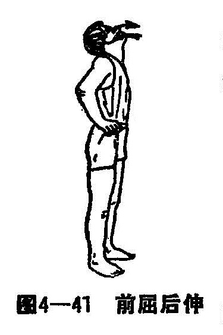

2.**左右侧屈** 吸气时头向左侧，呼气时头部还原正中位；呼气时头向左屈，吸气时还原，左右交替，反复7~8次（图4—42）。

3.**左右旋转** 深吸气时头部向左，呼气时由左向右转，左右交替，反复7~8次（图4—43）。

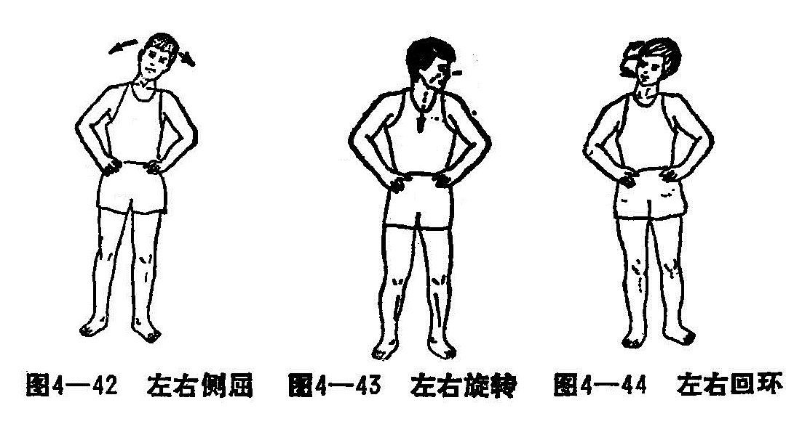

4.**左右回环** 头部作顺时针或逆时针方向回环活动，顺逆交替，小回环3~4次，最后作大回环顺逆方向各1次（图4—44）。

（二）腰背部练功法 适用于腰部扭伤、劳损、脊柱稳定骨折恢复期等。

1.**前屈后伸** 两足分开与肩同宽站立，双下肢保持伸直，双手叉腰，腰部作前屈、后伸活动，反复4~5次，活动时尽量放松腰部肌肉（图4—45）。

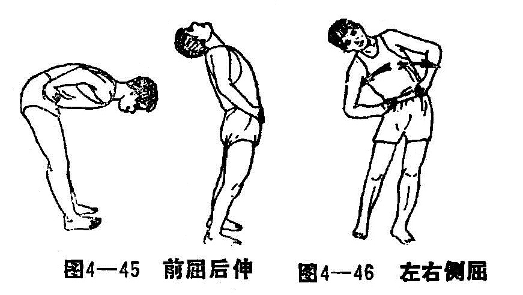

2.**左右侧屈** 两足分开与肩同宽站立，双上肢伸直下垂，腰部作左侧屈、左手顺左下肢外侧尽量往下，还原，然后以同样姿势作右侧屈，反复7~8次（图4—46）。

3.**拱桥式** 仰卧位，双侧屈肘、屈髋、屈膝，以头、双足、对肘五点作支撑，双掌托腰用力将腰拱起，反复多次。经过一段锻炼后，腰部肌力增强，可进一步练习腰部肌力；将双上肢屈曲放于胸前，以头及双足三点支撑拱腰锻炼，逐渐练习用双掌、双足四点作支撑，作拱桥状锻炼（图4—47）。

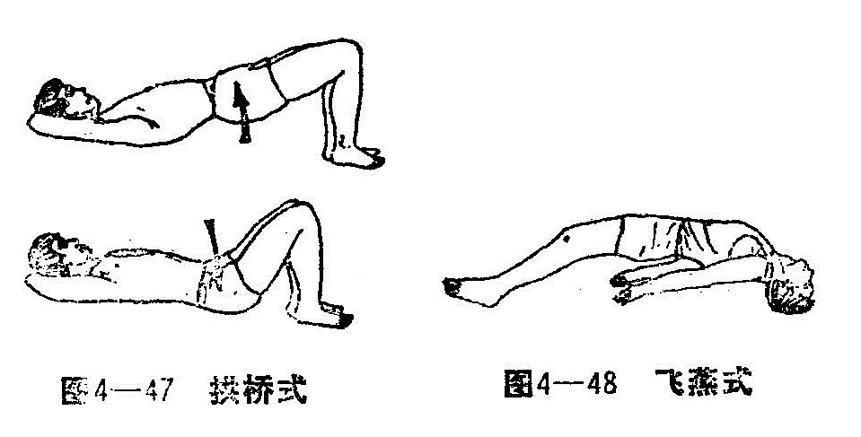

4.**飞燕式** 俯卧位，双上肢靠身旁伸直，把头肩井带动双上肢向后上方抬起，或双下肢直腿向后上抬高，进而两个动作同时进行呈飞燕状（图4-48），反复多次。

（三）肩、肘部练功法 适用于肩、肘关节脱位和肱骨骨折，尤其肩关节周围炎的病人更需锻炼肩关节功能。

1.**前伸后屈** 采取半蹲位，双手握拳放在腰间，用力将上肢向前上方伸直，用力收回。左右交替，反复多次（图4-49）。

2.**弯腰划圈** 站立后，两足分开，弯腰使患肢伸直下垂，作顺、逆时针方向划圈，由小到大，由慢到快（图4-50）。

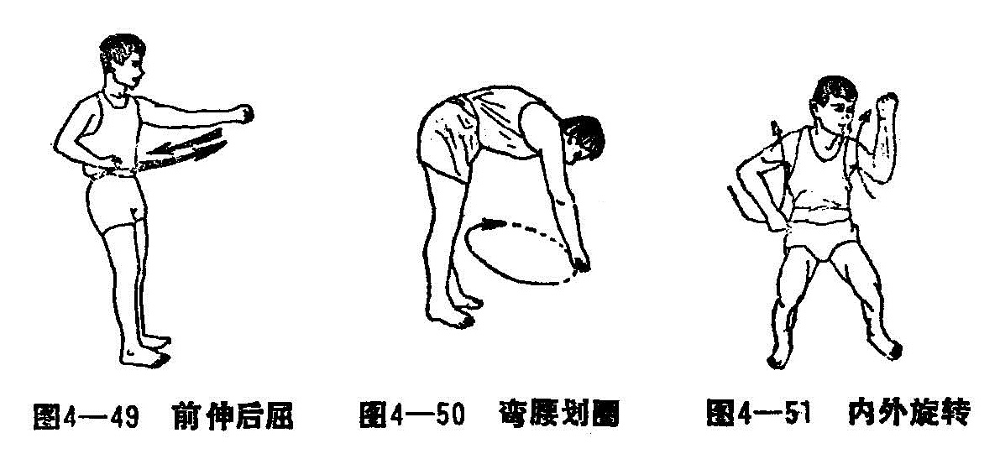

3.**内外旋转** 半蹲位，双手握拳，肘关节屈曲，前臂旋后，利用前臂来回划半圆圈作肩关节内旋和外旋活动，两臂交替，反复多次（图4-51）。

4.**上肢回环** 站立位，两足分开与肩同宽，一手叉腰，另一手握拳，整个上肢作顺、逆时针方向划圈回环，由小到大，由慢到快，左右交替，反复多次（图4-52）。

5.**手指爬墙** 两足分开站立，后面及侧身向墙壁，用患侧手指沿墙壁徐徐向上爬行，使上肢高举到最大限度，然后再沿墙归回原处，反复数次（图4-53）。

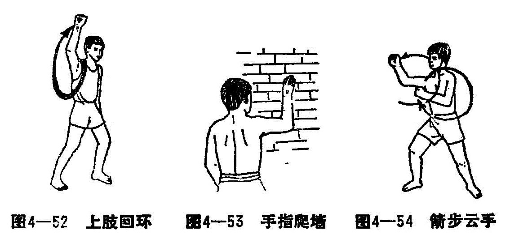

6.**箭步云手** 双下肢前后分开成箭步站立，用健手托扶患肢前臂使身体重心先后移，双上肢屈肘，前臂靠在胸前，每使身体重心移向前，同时把患肢前臂在同水平上作顺时针或逆时针方向弧形伸出，前后交替，反复多次（图4-54）。

7.**肘部屈伸** 坐位，患肢放在桌面的枕头上，手握拳，用力徐徐屈肘，伸肘，反复多次。

8.**手拉滑车** 安装滑车装置，病人在滑车下，坐位或站位，两手持绳之两端，以健肢带动患肢，徐徐来回拉动绳索（图4-55）。

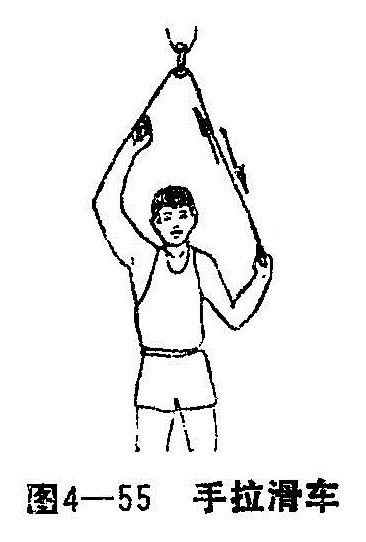

（四）前臂、腕、手部练功法 适用于桡尺骨下端骨折、前臂骨折、腕部扭伤或劳损、手部掌指或指间关节脱位、手部骨折和手部外伤。

1.**前臂旋转法** 将上臂贴于胸外侧，屈肘90°，手握木棒，使前臂作旋前旋后活动（图4-56）。

2.**抓空练习法** 将五指用力张开，再用力抓紧握拳（图4-57）。

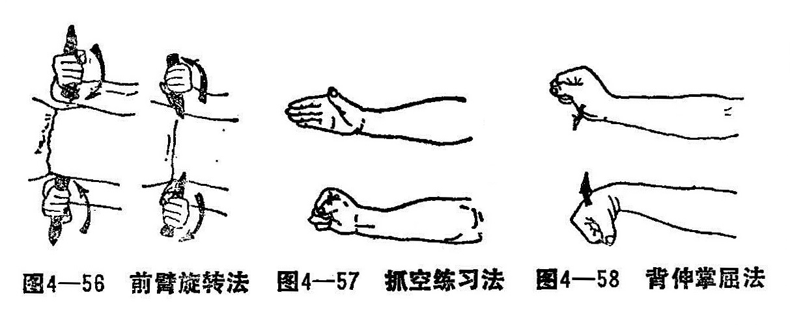

3.**背伸掌屈法** 用力握拳，作腕背伸、拳屈活动（图4-58）。

4.**手滚圆球法** 手握两个圆球，手指活动使圆球滚动或交换两球位置（图4-59）。

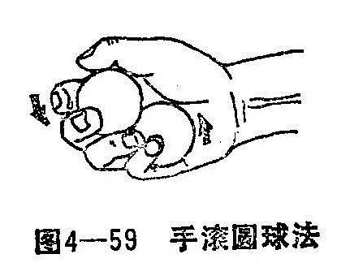

（五）下肢练功法 适用于下肢骨折及下肢的三大关节损伤，以及所遗留的关节功能障碍。

1.**举屈蹬腿法** 仰卧，将下肢伸直徐徐举起，然后尽量屈髋屈膝背伸踝关节，再向前上方伸腿蹬出，反复练习（图4-60）。

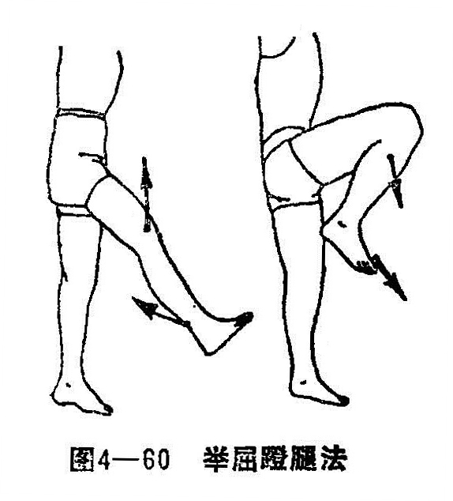

2.**旋转摇膝法** 两足并拢站立，两膝稍屈曲呈半蹲位，两手分别放在膝下，膝关节作逆、顺时针方向旋转活动，由伸直到屈曲，又由屈曲到伸直，反复多次（图4-61）。

3.**踝部伸屈法** 卧、坐位均可。足部背伸至最大限度，然后跖屈到最大限度，反复多次（图4-62）。

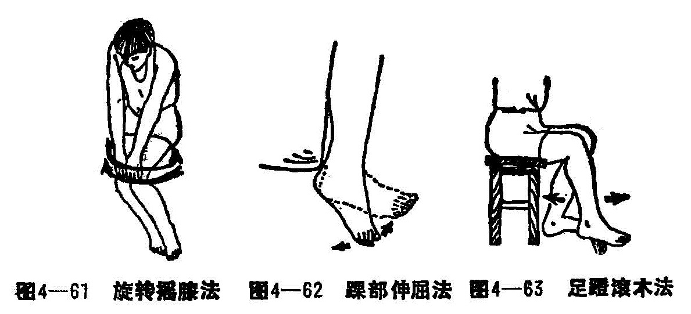

4.**足蹬滚木法** 患足蹬于圆形木棍上前后滚动，练习膝、踝关节伸屈活动（图4-63）。

5.**蹬车活动法** 坐在一特制的练功车上，用足尖练习踏车，使下肢肌肉及各个关节均得到锻炼（图4-64）。

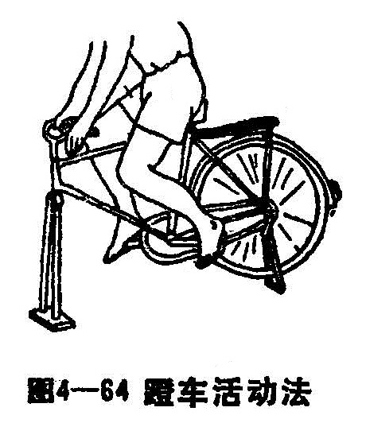

复习思考题

1.详述常用的整骨手法？

2.详述药物内、外两种方法的具体治法与方法？

3.筒述外固定的方法？

4.简述内固定的适应症与禁忌症？

5.试述功能锻炼的方法及其意义？