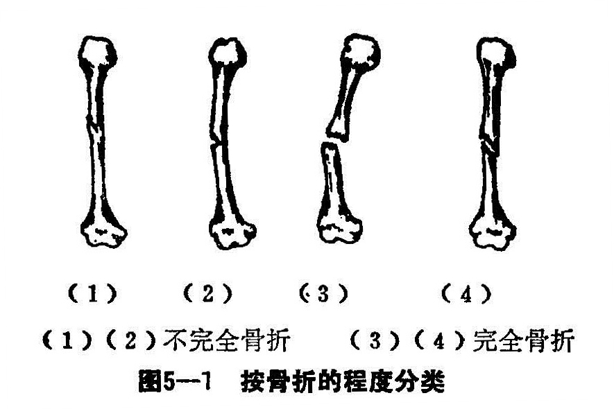
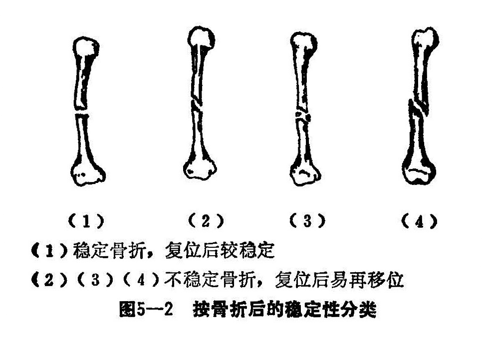
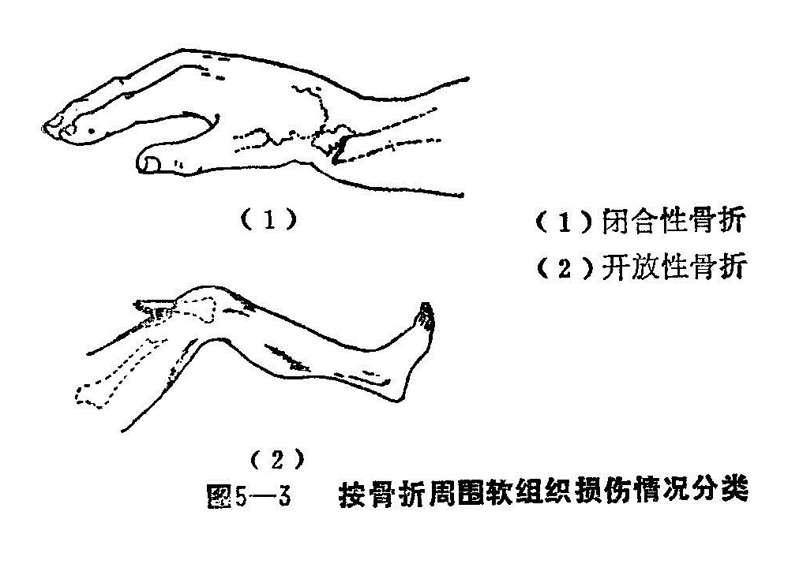
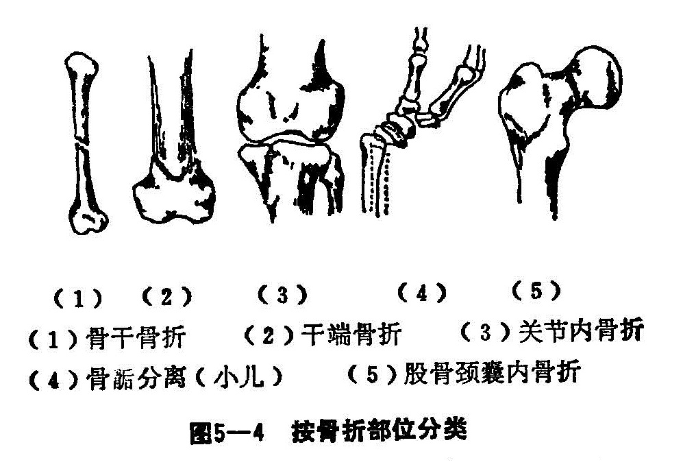

### 二、骨折的分类

根据与骨折有关的各种情况，种类很多，为便于辨证诊断和治疗，大致可分为以下几种类型：

1.按骨折的程度：可分为不完全骨折（即青枝型）与完全骨折。不完全性骨折是指骨或骨小梁的连续性仅有部分断裂者；而骨折后骨的连续性完全中断者，称为完全性骨折，骨折多有移位（图5—1）。

2.按骨折整复后的稳定程度：骨折端较稳定或经手法复位及适当的外固定后，不易再移位者，如横断骨折、压缩性骨折、嵌插性骨折等稳定性骨折（图5—2）。复位固定后骨折容易再移位者，如斜形骨折、螺旋形骨折、多段或粉碎性骨折等，称不稳定性骨折。

3.按骨折周围软组织损伤情况：骨折处皮肤或粘膜未破裂，骨折端与外界不相通者，称闭合性骨折；骨折处皮肤或粘膜破裂，骨折与外界相通者，称为开放性骨折。而骨折又根据其有否主要血管、神经的损伤，而分为复杂性骨折与单纯性骨折（图5—3）。

4.按骨折的部位分类：可分为骨干骨折、干端骨折、关节内骨折、骨骺分离及股骨颈囊内骨折等（图5—4）。

5.按骨折线方向及断端情况：可分为横断、斜行、纵行、螺旋形、粉碎牲及挤压性骨折等（图5—5）。

6.按骨折后的时间：可分为新鲜骨折和陈旧性骨折。一般以伤后三周以前就诊者为新鲜骨折；三周以后为陈旧性骨折。有些关节内或近关节骨折又应当别论，如肱骨外髁骨折有翻转移位者，一周以后复位即感困难。

7.根据受伤前骨骼有否病变分：骨折前，骨质结构正常，纯属暴力作用而产生骨折者，称外伤性骨折；如骨质原已有病变（如骨髓炎、骨结核、骨肿瘤等），遭受轻微暴力即能产生骨折者，称病理性骨折。
