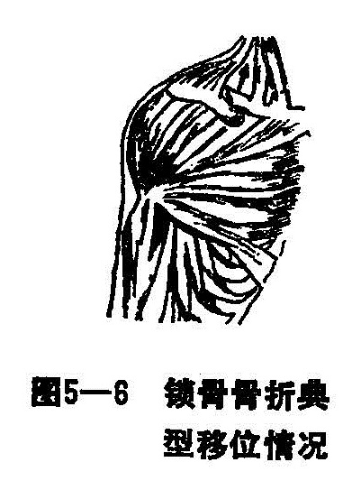
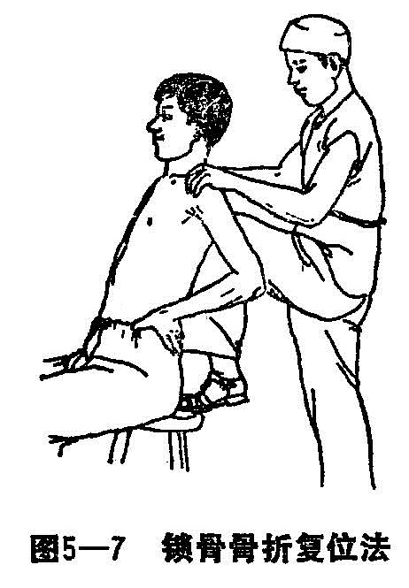
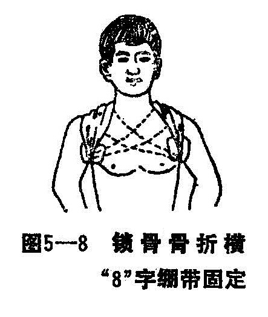

### 一、锁骨骨折

锁骨，又名锁子骨、缺盆骨、柱骨、肩整骨。它桥架于胸骨与肩峰之间，为唯一联系肩胛带与躯干的支架。它内端接胸骨柄，构成胸锁关节，外端连肩峰，构成肩锁关节。锁骨干较细，呈“〜”形，内侧的半段向前凸，外半段向后凸，其部位甚表浅，易于外力损伤而发生骨折。

〔病因病机〕

间接暴力或直接暴力均可造成骨折。间接暴力多因肩、肘部或手掌着地，暴力沿远侧段骨与关节向上传导至锁骨而造成骨折。直接暴力多因外力加于锁骨，多造成横断或粉碎性骨折。幼儿发生的骨折，多为横断或青枝型，由于幼儿骨质柔软，骨折后骨膜仍保持联系，在胸锁乳突肌的牵拉下，骨折处向上成角状如弩弓。成人骨折，多为横断型，偶有斜面或粉碎型。骨折好发于中段，在喙锁韧带与胸锁乳头肌锁骨头抵止部之间，骨折端除有重叠移位外，近折段因受胸锁乳头肌的牵拉，而向上、后方移位，远折段因受上肢重力和胸大肌、前锯肌的牵拉而向下、前方移位或短缩畸形（图5—6）。有时骨折可压迫锁骨下之神经及血管，如骨折端向外、上方移位时，可穿破皮肤而造成开放性骨折，但这两类骨折在临床上均少见。

〔诊断〕

锁骨位置表浅，骨折后局部肿胀，触之疼痛，易摸到骨折瑞，故诊断不难。但对幼年患者，由于缺乏自诉能力，锁骨部皮下脂肪丰富，畸形不明显，甚易误诊，经仔细询问，患儿均有跌伤病史。为了减轻胸锁乳头肌痉挛，头部多向患侧偏斜，下颏转向健侧，活动患肢或压迫锁骨折处均感疼痛，可诊断为锁骨骨折。有移位外1/3段骨折易与肩锁关节脱位相混淆，可拍摄锁骨正位X线片，有助于明确诊断。

〔治疗〕

一般无移位的锁骨骨折或青枝型骨折，局部外敷外伤驳骨膏，伤侧上肢肘屈90°，用三角巾悬吊固定1〜2周即可。有重叠或成角畸形者，可按以下各项治疗：

1.手法整复：患者取坐位，用1%普鲁卡因5〜10毫升注入骨折部血肿内，患者双手插腰，双肩外旋后伸挺胸。术者站于患者背侧，左足䠀于凳上，用膝前顶于患者两肩胛之间（图5—7），两手把住两肩的前外侧，向背徐徐扳拉，嘱患者挺胸，后伸肩部，外旋上肢，并在骨折端轻轻提拉、按压，直至骨折畸形消失。锁骨骨折一般不必强求解剖上对位，外敷消肿驳骨膏，即可作骨折外固定。如多发性骨折，不能坐起者，可取仰卧位，在患者两肩胛之间，纵行垫一枕头，助手站在患者头侧，用两手按压患者两肩部前方，嘱患者挺胸、耸肩，使锁骨承受牵拉力，矫正骨折短缩或成角畸形，术者用两手拇、食、中指作两点捺正法，整复侧方移位，此法安全、稳妥、效果亦佳。

（1）“8”字绷带固定法：整复后两侧腋窝下垫以薄棉垫，用双头绷带由患侧腋窝过背部，经过对侧肩部，再绕过肩部前方通腋窝，横过背部至患肩顶部，如此反复包扎10-12圈，此后，再用同等宽的胶布固定绷带固定一圈（图5—8）。

（2）双圈固定法：利用固定圈两个（用绷带顶制成，其大小以套入两肩部上、下布带联扎紧，两圈间相距2〜4公分为度），骨折整复后，外敷消肿驳骨膏，上安放高低纸压垫紧压远端骨折段，使移位骨端向下向前，将事先准备好双圈套入两肩部，患侧之圈须压住纸垫，使之承压纸垫之约束力，从背后紧拉双固定圈，先用短布带将两圈下部紧扎住，再用一短布带松松扎住两圈的后上部，用一稍长布带在胸前缚住两圈前方，以防固定圈松动滑脱。但注意不能过紧，特别前布带，过紧则使肩部前屈，失去固定作用。

3.术后处理和功能锻炼：整复固定后，每日主动握拳，伸屈肘关节，双手插腰后伸肩部活动，禁忌肩部前屈外展活动，定期复查，注意手部的血运，晚间平卧硬板床，背部稍为垫高，使肩后伸，一般固定3〜4周，粉碎骨折可适当延长，骨折临床愈合，去除外固定。
