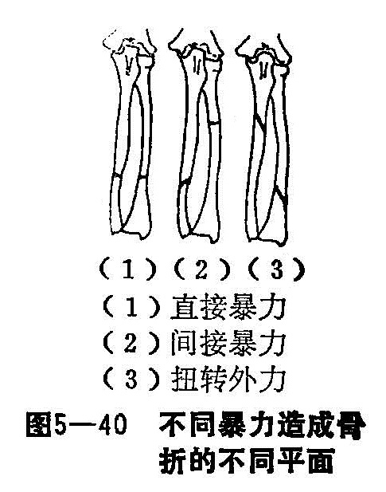
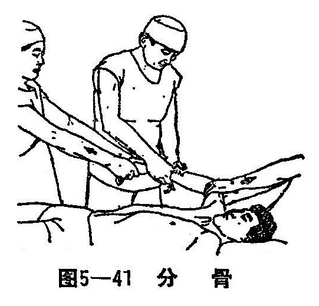
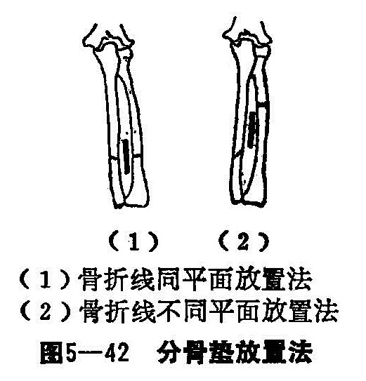
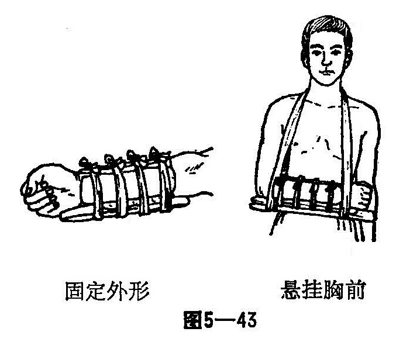

### 十、尺、桡骨双骨折

前臂由尺、桡骨并列组成。尺、桡骨又名辅、臂骨，有上、下尺桡关节连接。除尺桡骨有正常的生理弧度外，两骨之间有由桡向尺侧行走的骨间膜，桡骨借上、下尺桡关节及骨间膜的作用，能围绕尺骨作150〜180°的旋转活动，从而构成了前臂和手的灵活的旋转活动功能。前臂双骨折较常见，患者以青、少年为多。骨折后在骨折远、近段之间可发生重迭、旋转、成角和侧方移位。治疗时，须将两骨断端正确对位，畸形得到矫正，才能恢复前臂的旋转功能。

〔病因病机〕

当前臂遭受到直接或间接暴力或旋转暴力时均可发生此种骨折。

1.直接暴力：前臂受打击，重物撞碰或机器辗扎伤造成骨折，多呈横断或粉碎型，两骨的骨折线常在一或相近平面，软组织常伴严重损伤（图5-40（1））。

2.间接暴力：患者跌倒，掌心着地，暴力由掌面向桡骨上部传导，而致桡骨中、上部发生骨折，多呈横断型，然后残余暴力通过骨间膜即刻转移到尺骨，于是尺骨继桡骨而发生骨折，骨折线多呈斜型。软组织损伤较轻。在儿童则多为桡尺骨中段青枝型骨折（图5—40（2））。

3.扭转暴力：患者跌倒时由于前臂过度的旋转，故使前臂遭受传导暴力加扭伤暴力而造成骨折，两骨折部位不在一平面，尺骨多在近端，而桡骨多在远端，均呈斜面型，两骨折线走向一致（图5—40（3））。

骨折后断端的移位方向，多受肌肉牵拉及暴力的作用方向而定。如骨折发生在旋前圆肌止点以上，桡骨上骨折段因受旋后肌牵拉旋向前方，同时因受肱二头肌的牵拉而稍屈曲，其骨折下段则受旋前圆肌及旋前方肌牵拉向前旋转。如骨折发生在旋前圆肌止点以下，桡骨上骨折段因旋后肌及旋前圆肌的共同牵引而处于中间位，但其下骨折段因旋前方肌的作用而向前旋转。此外，由于前臂伸肌及屈肌的共同牵拉作用，上、下各骨端多有不同程度的重迭。

〔诊断〕

除具有骨折一般体征，如疼痛、肿胀与压痛外，前臂功能活动障碍，有明显的骨擦音及异常活动。不完全性骨折有明显的局部压痛，有时可摸到成角畸形，成人骨折时往往向背侧成角畸形。而儿童不完全性骨折一般向掌成角畸形。拍摄正侧位X线片，进一步明确骨折的类型及移位情况。

〔治疗〕

在治疗前，应根据前臂解剖、生理的特点与骨折后的病理变化进行具体分析，凡属闭合性各种类型的桡尺骨骨折，均可用手法整复，夹板外固定治疗。开放性骨折，伤口在3厘米以内，经清创缝合后，可按闭合性骨折处理。陈旧性骨折，骨折部骨痂不多，可试行手法整复对位，若骨折移位严重，手法整位经三次以上失败者，或有骨不愈合形成假关节者，可考虑转手术治疗。

1.手法整复：桡尺骨干双骨折，因骨折后形成四个骨折断端，存在着不同程度的旋转、成角、重叠和侧方移位，病理变化比较复杂，给骨折的整复和固定带来一定困难。我们在临床实践中，体会到在治疗尺、桡骨折中，旋转移位不获得矫正，不仅远近折段旋转不一，而且远、近骨间距不等，骨间膜松紧不均，桡尺骨干间的相互稳定性丧失，复位就难以成功。旋转移位是前臂骨折中主要矛盾，只要恰当地处理这主要矛盾，其他移位才能获得矫正。一般采用臂丛麻醉，上1/3骨折前臂取旋后位整复，中1/3和下1/3骨折时，前臂取中立位整复。双骨折中考虑一是稳定型骨折（如横性），一是不稳定型骨折（如斜螺旋或粉碎性等），应先整复稳定型骨折。若两骨均属不稳定型骨折，上1/3骨折先整复尺骨1/3骨折，下1/3骨折先整复桡骨骨折。在任何情况下，先整复比较难复位的一骨为首，如一是横断型骨折，一是斜形背靠背旋转180°移位，应先整复背靠背旋转移位之骨折，再整复横断型骨折，具体方法如下：

（1）牵引：患者取平卧位，肩外展90°，屈肘90°，中、下1/3骨折前臂置中立位，上1/3骨折前臂稍旋后位，两助手分别握住患肢腕部和肘部，顺势牵引3〜5分钟，以矫正重迭及成角畸形。

（2）分骨：是前臂整复的重要手法，术者用两手拇指及食、中、环指由骨折的掌背侧对向夹挤骨间隙，使向中间互相靠拢的桡尺骨断端，向桡尺骨各自分离。分骨时，由远至近端，手指与皮肤紧密相接，千万不要在皮肤来回磨擦，避免损伤皮肤（图5—41）。

（3）折顶：前臂肌肉比较发达或局部肿胀明显时，单靠拔伸牵引尚不能把重叠移位完全矫正，一般而应用折顶手法，此法既能比较省力地整复残余重迭，又能顺利地矫正侧方移位。分骨后，术者两拇指推按向上突出的骨折断端，其余手指托住向下陷的骨折断段，拇指用力下压，四指轻轻上托，使骨折原来的成角畸形变大，当拇指感到骨折的两断端在一侧相损时，就突然反折，即四指把下陷的骨折断端猛然用力向上提，拇指时续向下压突出的骨折断端，骨折可基本复位。

（4）端挤提按：折顶后，术者检查断骨情况，如仍有一些错位，再予矫正。术者一手拇指在分骨，食指握住固定骨折一端，如果断骨为上、下错位，另一手就把下陷的骨端向上提；如断骨为左、右错位，另一手就把骨折另一端向中心推挤，矫正骨折断端的残余侧方移位。

（5）摇摆：为使骨折断端接触更紧密，再行摇摆手法。术者两手拇指和食指从掌侧、背侧两面捏住骨折部，先让牵引远折端助手轻轻上下左右摇摆，然后术者再捏住骨折部上下摇动，摇动时可听到（或感到）轻微的骨擦音，待骨擦音消失，说明骨折已复位稳定。

2.固定：两助手维持牵引，术者在骨折部外敷消肿驳骨膏，松缠绷带3〜5层，放分骨垫：背侧的骨间隙放棒状分骨垫，掌侧骨间膜放塔形分骨垫。桡、尺骨在同一水平位骨折时，分骨垫中点正对着骨折处；桡、尺骨不在同一水平骨折时，分骨垫放在两骨的骨折处之间。棒状分骨垫放置时要靠近尺骨。分骨垫位置放准后，用手指用力挤压，胶布条固定（图5-42）。

放平纸压垫：在前臂背侧的上、下两头各放一平垫。因桡骨容易向桡侧移位，在骨折处的桡侧再安放一小平垫，分别用胶布条固定。

夹板安放：术者先放好掌、背侧夹板，用手固定，再放桡尺侧夹板，尺侧的带头夹板超腕关节、掌指关节部，然后用四条扎带分别捆好夹板。

伤臂以屈肘90°，前臂贴胸，指头到上之中立位、用托板三角巾悬吊在胸前（图5—43）。儿童多为不全之青枝骨折，如有成角畸形，只矫正畸形即可外敷中药、夹板外固定即可。

3.功能锻炼：术后一般分四步进行：

（1）术后鼓励伤员用力练习捏拳和耸肩活动。

（2）手部肿胀消退后，练习小云手。

（3）伤臂有力，不需健手托扶时，练习大云手。

4.成人一般在18周后（儿童4周）骨折临床愈合，去除外固定夹板、练习反转手，外用四肢损伤洗方。
