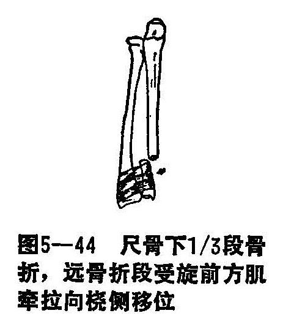

### 十一、尺骨干骨折

尺骨又名臂骨，位于前臂内侧。此骨上段粗大，为构成肘关节的主要部分。骨干横切面为三角形，外观可分三缘：前缘和后缘之间是内侧面，后缘的全长浅在皮下；外侧缘锐利，又名骨间嵴，与桡骨嵴相对峙，为骨间膜附着处。骨干中、下段逐渐变细，下端为尺骨小头，小头端的周围为关节面，与桡骨远端内侧的桡尺切迹，构成下桡尺关节。

〔病因病机〕

尺骨干骨折为常见骨折之一，多为直接暴力所引起。骨折多呈横断或粉碎型。因尺骨下段细弱，且浅在皮下，故此段发生骨折为多。

间接暴力亦可造成骨折，如前臂遭受极度旋前的暴力损伤时，可引起尺骨下1/3段骨折，因受旋前肌的牵拉，骨折远段易向桡背侧移位（图5-44）。

〔诊断〕

骨折均有明显外伤史，肿胀，局部疼痛，因尺骨位置表浅，易于摸到骨断端及骨折的异常活动或骨擦音，伤肢抬举受限，若在尺骨鹰嘴处作纵轴叩击试验，骨折处疼痛加剧。尺骨下1/3骨折严重移位和成角畸形，常合并下尺桡关节脱位，故诊断前应注意检查上、下桡尺关节有无脱位。拍摄前臂上侧位X线片时，应包括肘、腕关节，可确诊。

〔治疗〕

尺骨干骨折，一般移位不大，且表浅于皮下，手法整复对位比较容易，前臂小夹板固定，辨证施治，均取得预期效果。

1.整复手法：患者平卧位，在局麻或臂丛麻醉下，肩外展50〜70°，肘屈90°，前臂中立位，一助手握住伤肢拇指及鱼际部，另一手握住余四指，另一助手双手握住上臂，作对拉牵引，矫正骨折重叠移位。若单纯的尺骨中、上段骨折有侧方移位者，术者可用“分骨法”整复，使尺骨远段向桡侧移位得到矫正，如若重叠移位在拔伸牵引时尚未能矫正者，亦可用“折顶法”或“回旋法”加以矫正，使骨的重叠、缩短移位得到复位。

尺骨下段骨折合并有下桡尺关节脱位时，尺骨小头向上脱出，下桡尺关节分离，应先将尺骨骨折端的短缩移位矫正，尺骨小头一般能自然的还纳回桡骨尺切迹的水平位上。此时，术者再用两手掌在尺、桡骨的下端作向轴心位相对夹挤，使下桡尺关节分离移位得到整复。

2.固定：尺骨骨折的固定，原则上同前臂双骨折。但因属单尺骨骨折，故选用之纸压垫要小，仅用于尺骨即可。如骨折有前后移位时，整复后可用两垫挤压法固定，纸压垫分别置于两骨端的掌、背侧，并同时在骨折的骨间隙加放分骨垫，以抵住向桡侧移位的骨折端。下桡尺关节脱位者，需在关节背尺桡侧安放合骨垫，以免使复位之关节再度分离。夹板外固定后，如为尺骨中上段骨折者，用三角巾将前臂处于肘屈90°中立位，而尺骨下段则以旋前位为妥。固定时间为4〜6周，待骨折达骨性愈合，再拆除外固定。

3.功能锻炼：与前臂尺、桡骨折相同。
