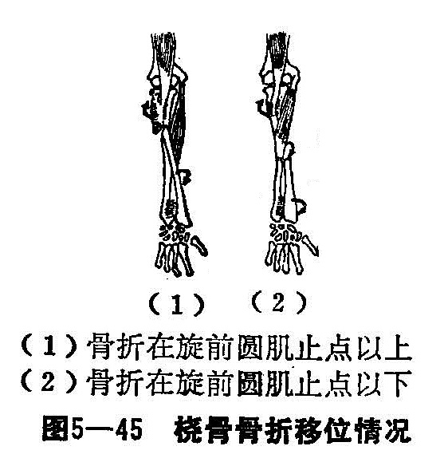

### 十二、桡骨干骨折

桡骨又名辅骨，桡骨干系指桡骨颈以下至腕关节以上3厘米段之坚质骨。桡骨除支持前臂外，主要参与前臂的旋转活动，其通过上端桡骨头的“自转”和下端围绕尺骨的“公转”，使前臂具有旋前、旋后的功能。桡骨干单骨折，因有尺骨的支持，一般骨折重叠移位不多，而主要是肌肉造成的旋转移位。骨折常以青少年多见。

〔病因病机〕

桡骨干单骨折，可由直接暴力（打击伤或挤压伤）或间接暴力，如患者跌倒，掌心着地的传导作用造成。当桡骨干上1/3骨折时，由于附在桡骨结节的肱二头肌及旋后肌牵拉作用，骨折近段向后旋转移位。附于桡骨中、下段的旋前圆肌及旋前方肌的作用，将骨折远段向前旋转移位。桡骨干中1/3或中、下1/3段骨折时，骨折线位于旋前圆肌之下，因肱二头肌与旋后肌的旋后倾向，被旋前圆肌的旋前力量抵消，骨折近端处于中立位，而骨折远段受旋前方肌的影响，即向前移位（图5—45）。

〔诊断〕

一般局部肿胀，触之骨折部疼痛，若为完全性骨折，可摸到骨折端的异常活动和骨擦音，前臂旋转功能障碍。应拍摄包括腕关节的正、侧位X线片，以便确定骨折类型和有否下桡尺关节脱位。

〔治疗〕

单纯桡骨干骨折，一般移位不大，主要为旋转移位，或因骨间膜的挛缩而造成的向尺侧成角畸形，骨折远、近段很少发生重叠。无移位的骨折，仅敷消肿驳骨膏，给予夹板外固定2〜3周，早期功能锻炼。有移位之骨折，亦容易整复和维持骨折稳定。

1.手法整复：患者平卧位，臂丛麻醉。患肢肘关节屈曲位，一助手把住拇指与四指，另一助手握住上臂作对抗牵引。骨折在中、下段前臂中立位牵引，中、上1/3段骨折旋后位牵引。两助手持续牵引3分钟左右，待骨折分离后，以分骨法：术者两拇、食指分别在骨折的掌、背侧，由远到近顺次向骨间膜隙夹挤。然后术者一手固定住骨折近端，而另一手的拇、食、中、环指捏住向尺侧倾斜移位的远折段向桡侧提拉，矫正向尺侧移位。如有掌、背侧移位可加用折顶法，一般都可以复位成功。

桡骨干上1/3段骨折时，桡骨近端向桡倾，后旋，而远折段尺倾，前旋移位，复位时应充分考虑到骨折移位与前臂诸肌肉的牵拉作用之机理，此时应用前臂旋后位牵引，令另一助手在两手分骨下，固定骨折远端，并用力将远段推向桡侧、背侧，术者用拇指向尺侧、掌侧挤按近段。骨折复位后，术者两手捏住骨折部，嘱牵引助手将臂旋回到中立位。经X线透视，如对位满意，再敷消肿驳骨膏，行前臂夹板外固定。

2.固定：在维持牵引下，先敷消肿驳骨膏，缠绷带3层，骨折部分别在背、掌侧放置分骨垫各一个，用胶布固定；再将前臂夹板，用四条布带捆扎，前臂中立位，肘屈90°，胸前三角巾悬吊固定。

3.术后管理与功能锻炼：基本与前臂双骨折相同，但每步骤可比前臂双骨折提前1周进行。
