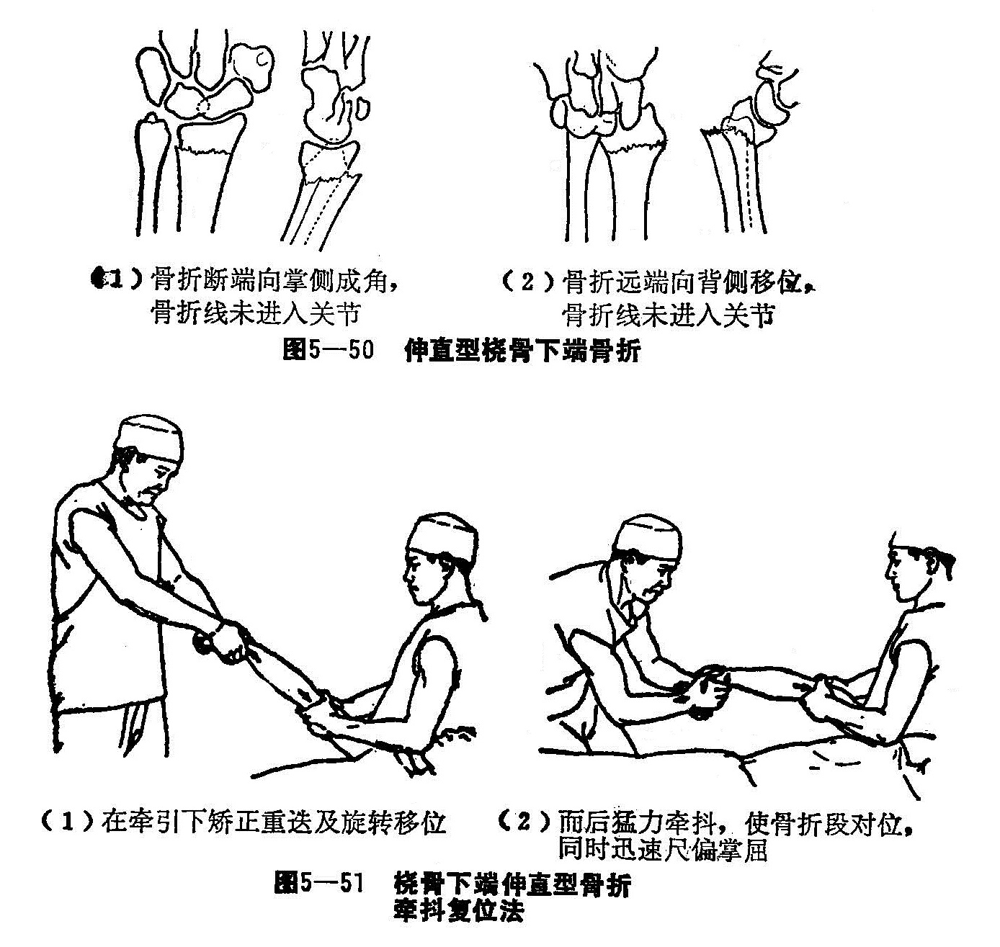
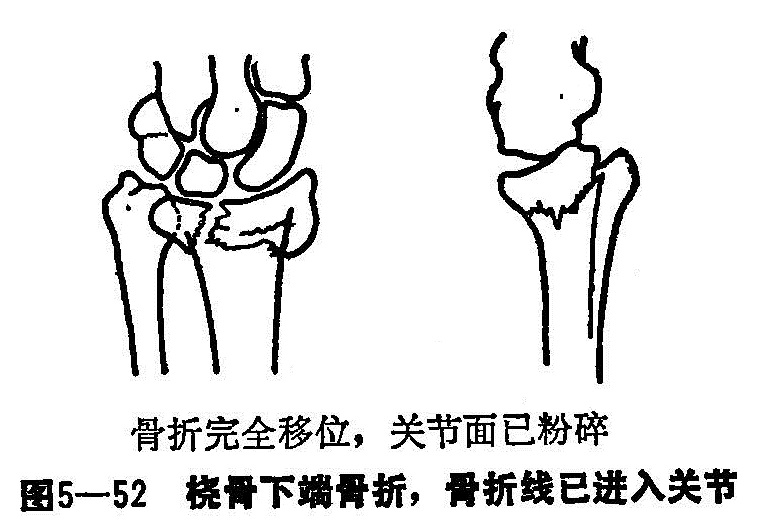
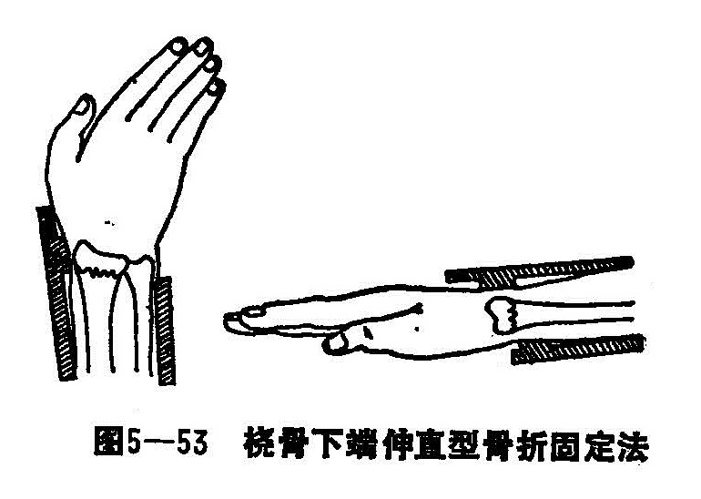

### 十四、桡骨下端骨折

桡骨下端骨折，又名辅骨下端骨折。此骨折比较常见，以骨折发生在桡骨下端2〜3厘米范围内。多发生在成人及老年患者。桡骨下端与腕骨组成桡腕关节，为松质骨，背侧表面不平。正常时桡骨下端关节面向掌侧倾斜10〜15°，向尺侧倾斜20〜25°，桡骨茎突较尺骨茎突长1〜1.5厘米，因关节面以上2〜3厘米处为坚质骨与松质骨接壤处，故此处易发生骨折。

〔病因病机〕

直接暴力和间接暴力均可发生桡骨下端骨折，但以间接暴力所致多见。根据所遭受暴力的作用方向，受伤时患者的体位和所产生骨折的病理变化，临床分为伸直型和屈曲型：

1.伸直型：桡骨下端伸直型骨折，又名科累斯氏骨折，多为间接暴力所致。当患者前臂在旋前、腕背伸位跌倒，手掌着地时，由于身体重力向下的力量与地面向上的反作用力，交集作用于桡骨远端，引起骨折。骨折后，桡骨下端关节面的倾斜度改变。偶见于直接暴力，如驾驶员在摇发动机之摇杆打击于桡骨远端引起骨折。暴力轻者，发生的骨折无明显移位，若暴力持续作用时，则腕关节的正常关系改变，骨折远端向背桡侧移位。近段向掌侧移位或上、下骨折端互相重叠，桡骨远段关节面正常解部发生改变。若并发尺骨茎突骨折，下桡尺关节之三角形纤维软骨盘随骨片分离移位，如骨片完整，移位明显时，三角韧带可能发生撕裂，掌、背侧屈、伸肌腱亦发生移位，肌腱滑动将发生障碍。

2.屈曲型：桡骨下端屈曲型骨折，又名史密撕氏骨折。它和桡骨下端伸直型骨折相反，在临床比较少见。一般为间接暴力所造成。如跌倒时，前臂旋前腕关节掌屈，手背部触地，身体重力沿桡骨向下冲击，地面反作用力沿手背向上作用于桡骨下端，骨折线由背侧下方斜向掌背上方，远端骨折呈三角形，骨折块连带腕骨向掌桡侧移位。直接暴力造成的骨折，如在桡骨远端的背侧被重物打击，撞碰或轧压等，也可产生此类骨折，其骨折特点与上述相同。

〔诊断〕

一般患者都有明显外伤史，局部肿胀，腕关节活动障碍，典型伸直型桡骨下端骨折，骨折远端向背桡侧移位，前臂下端有向掌侧隆起畸形，背侧凹陷。X线片显示：桡骨远段关节面改向背倾斜，而向尺侧倾斜减少或完全消失，甚至成相反方向，在背侧可摸到骨断端。

屈曲型桡骨下端骨折，前臂下段有轻度向背隆起畸形，掌侧凹陷，从侧面观看呈“壶嘴”样畸形。

若为幼儿骨骺块压缩性骨折或裂纹骨折，畸形不明显，只局部压痛，腕关节功能受限，拍摄正侧位X线片，有利确诊和分型。

〔治疗〕

对无移位的裂纹性骨折或轻度嵌插型骨折，可不用整复，外敷消肿驳骨膏、小夹板外固定，三角巾肘屈位悬吊胸前2〜3周，骨折临床愈合，即拆除外固定。对于有移位的骨折或骨骺分离，皆需施行手法整复，骨折局部小夹板外固定。

1.整复手法：整复前先了解受伤原因，局部肿胀情况，结合X线片认清骨折的移位方向及情度。可用1%普鲁卡因5〜10毫升作骨折内血肿注入（先抽血然后再注入）。

（1）伸直型桡骨下端骨折整复法：

牵抖复位法：适用于骨折断端向掌成角或骨折远端向背侧移位，但骨折线未进入关节骨折不粉碎者（图5—50）。患者取坐位，对年老体弱者取平卧较妥。肘部屈曲90°前臂中立位，一助手握住肘部，术者两手紧握手掌，两拇指并列置于远段的背侧，其余四指置于腕掌部，扣紧大、小鱼际肌。触摸准确后，在牵引下适当矫正旋转移位，稍旋后10〜15°而后猛力牵抖。牵抖时仍用力牵引，利用牵引力，顺纵轴方向骤然猛抖，使之加大牵引力而对位，同时迅速尺偏掌屈，不要旋转，骨折即可复位（图5—51）。如未完全整复，术者把患手交给另一助手在维持牵引下，然后再两拇指捏住骨折部，迫使骨折远端尺偏掌屈，可达到解剖对位。

提按复位法：适用于老年患者，骨折线已进入关节，骨折粉碎者（图5—52）①牵引：患者肘关节屈曲90°，前臂中立位，一助手握住患者手拇指及其他四指，另一助手紧握患肢上臂，两助手对抗牵引，持续2〜3分钟，使骨折断端的嵌插完全解脱，一般骨折远段容易旋前，应同时矫正旋转移位。②矫正侧方移位：术者站于患肢外下方。一手握住前臂下1/3向桡侧推挤，另一手握住腕部向尺推挤。矫正骨折远段的桡侧移位。③矫正掌、背侧移位：术者两手食、中、环指重叠，置于近段背侧，向上端揭，两拇指并列顶住远端的背侧，向掌侧挤按，使之向掌侧复位。矫正掌背侧移位。

（2）屈曲型桡骨下端骨折：

整复方法：在局麻下，肘关节屈曲90°，前臂中立位，一助手持握手指，另一助手握上臂，对抗牵引待骨折重叠牵开后，术者可用两手拇指由掌侧将远段骨折片向背推挤，同时用食、中、环三指将骨折近段由背侧向掌侧压挤。复位后术者捏住骨折部，牵引手指的助手徐徐将腕关节背伸，使屈肌腱紧张，防止复位的骨折片移位。

每当骨折完全整复，腕部外形恢复正常后，均应辅用舒理伸、屈肌腱，避免骨折整复后筋仍出槽，达到筋骨并治的目的。

2.固定：骨折整复后，外敷消肿驳骨膏，再用绷带包缠。先将横档表垫放于桡骨远段的背桡两侧，掌侧放方形平垫，（要求厚度稍大于横档表垫），然后安放桡骨下段小夹板固定，用三条布带捆扎。桡背侧夹板应超过桡腕关节，限制手腕的桡偏和背伸活动（图5—53）。屈曲型骨折，在掌、背侧各置平纸方垫一个，掌侧平垫在前，压远端向背侧：背侧平垫在后压近端向掌。掌侧夹板下端越过腕关节以下2〜3厘米，防止掌屈。背侧板下端平桡骨茎突以下使腕关节能背伸20〜30°活动。夹板与伸直型相同，肘屈90°胸前三角巾前臂中立位固定。

3.术后注意事项及功能锻炼：与前臂双骨折相同。
