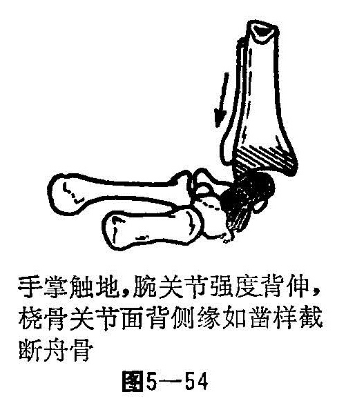
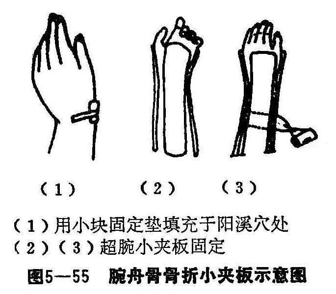

### 十五、腕舟骨骨折

腕舟骨又名高骨，又名龙骨。腕舟骨是近腕骨中最大的一骨，位于腕部外侧，呈长弧形，其状如舟，故名舟骨。其远近两端较粗，中段较细似腰，该骨四面为软骨关节面，缺少骨膜组织，一般血液供应为一支血管由远侧舟骨端进入，另一支血管由舟骨腰部背侧进入，故舟骨腰部发生骨折或近端骨折，常影响其血运不良，对骨折的愈合带来影响。

〔病因病机〕

腕舟骨骨折多发生于青壮年，儿童到7〜8岁舟骨骨化中心始出现，故儿童舟骨不易产生骨折。此骨折常由于间接暴力所致，患者跌倒时，手腕部极度背伸桡偏，手掌着地，地面冲击暴力由舟骨结节向上传导，舟骨被锐利的桡骨下端切入暴力，而发生骨折（图5—54）。根据骨折发生部位，可分为三型：

1.腰部骨折：为关节内骨折，最为常见。骨力作用产生骨折后，一般骨折无移位，若暴力过大，可使骨折近段向掌、尺侧移位，远骨折段向背、桡侧移位，由于血液供应差，误诊失治，可致骨折延迟愈合或不愈合，或发生骨折近段缺血性坏死。

2.结节部骨折：舟骨结节即舟骨远端，在关节外，有掌侧腕韧带附着，血运充足，骨折多能愈合。

3.近端骨折：为关节内骨折，舟骨近端处于桡骨下端关节窝部，大部为软骨关节面所覆盖，无血管进入，骨折后，舟骨结节和腰部进入血液断绝，发生骨不愈合或缺血性坏死可能性大。

〔诊断〕

新鲜舟骨骨折鼻烟窝处多显肿胀，且有明显压痛。桡偏腕关节或沿2、3掌骨头作纵轴叩击时骨折处疼痛，腕关节有一定限制，确诊需拍摄腕关节正、侧、斜三种方位的X线片，若骨折线不清，而临床症状怀疑骨折时，应暂按骨折处理。待两周后，再重拍片，由于骨折处骨质吸收，骨折线多能明显认出。但应与先天性双舟骨及陈旧性舟骨折鉴别。先天性双舟骨在X线片上，两块骨之间，界线清楚，边缘整齐、光滑，无致密坏死或边缘不整齐的现象。

〔治疗〕

一般新鲜性舟骨无移位骨折，可用纸夹板或短臂石膏管型将患肢腕关节固定在背伸30°，稍尺侧偏斜、拇指对掌之前臂中立位。固定范围包括远至掌横纹，近至前臂上1/3段为限，以不妨碍捏拳及各手指伸、屈活动为度（图5—55）。固定时间应根据骨折情况而定，一般需2〜4个月，腰部及近端骨折固定时间应较长。如骨折不愈合或缺血性坏死，经治疗仍未愈合，疼痛严重，且妨碍伤肢功能者，可考虑手术治疗。

1.整复手法：在无麻醉下，患者坐位或仰卧，肩外展80〜90°，取前臂于轻度旋前，腕关节中立稍尺偏位，一助手握住肢拇指，一手握住伤肢2〜4指，另一助手握住上臂作对抗牵引3〜5分钟，术者站于伤肢外侧，面对伤肢远端，以两拇指按住远折的背桡侧，余指重叠地托住腕关节掌尺侧，助手先将腕关节背伸，轻度桡偏，术者两拇指向掌、尺侧按压。然后助手随之将腕关节掌屈、尺偏，骨折一般都可整复，骨折多较稳定。

2.固定：同桡骨下端骨折。

3.功能锻炼：固定后，即嘱患者加强作握拳、手指伸活动，促进血液循环，由于肌肉收缩力而使两骨折产生纵轴加压而紧密吻合，待骨折愈合，拆除外固定。腕关节的各种活动，在外洗舒筋活络中草药后进行。
