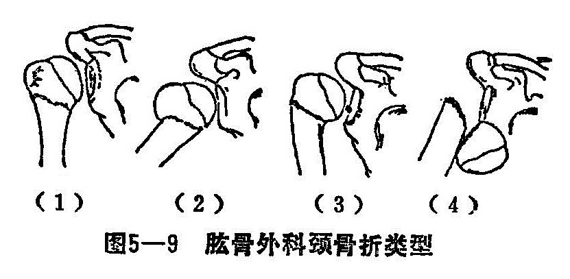
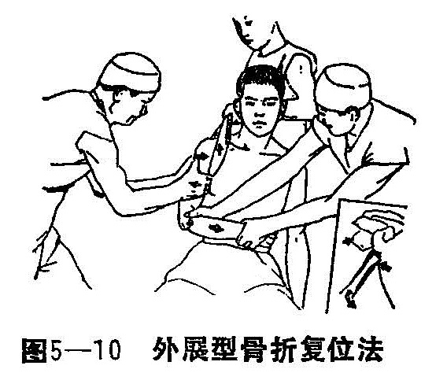
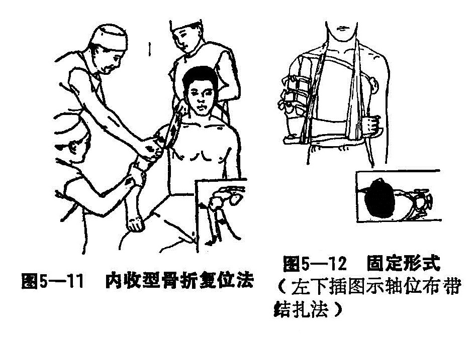
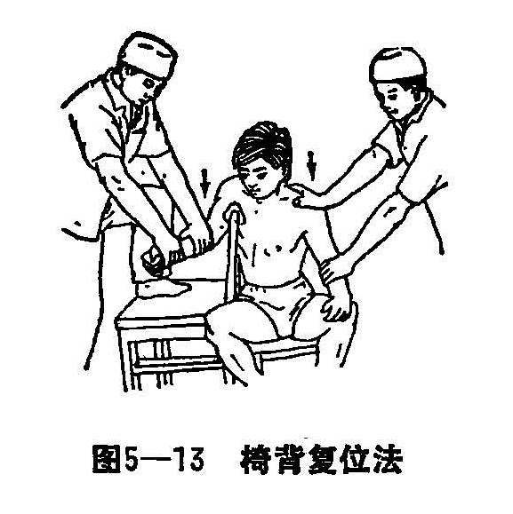

### 二、肱骨外科颈骨折

肱骨外科颈位于解剖颈下2〜3厘米，相当于大小结节移行于肱骨干的交界处，为松质骨与坚质骨接壤之处，在肱骨结节下部与胸大肌等附着点之间，该处无肌肉附着，最容易发生骨折，故称肱骨外科颈骨折，临床上较为多见。

〔病因病机〕

多为间接暴力的传导，是造成骨折的主要原因。当跌倒时，腕肘部伸直着地，身体倾向患侧，暴力向上传导，或由于跌倒时肘部着地而造成。直接暴力亦可发生骨折，如外力直接打击或摔倒时肩部着地而造成。当跌倒时上肢呈外展位，即造成外展型骨折，如上肢在内收位跌倒，即造成内收型骨折。骨折后断端相互嵌入，如非嵌入，不论其为外展型或内收型，均为以下的移位：由于岗上、岗下肌的牵拉，上骨折段外展外旋，由胸大肌背阔肌及大圆肌的牵引作用，下骨折段向内、向前移位，同时由于肱二头肌、三头肌的牵引并向上移位。并由于暴力及伤肢的重力影响，均可造成不同程度的向前成角畸形。如上臂在外展外旋位，遭受较严重的暴力，造成外展移位大骨折，其暴力未减而继续作用于骨折端，挤推肱骨头，形成肱骨头向前、下方脱出肩关节盂，上肢自身重力下垂，形成肱骨头骨折面向外、上方，远折段向外、上方严重的侧方移位和成角畸形。但此型在临床上罕见。

〔诊断〕

受伤后肩肿胀，上肢功能障碍，局部触痛，上臂纵轴叩击骨折处有锐痛，肩部常出现青紫瘀斑。除无移位的骨折外，伤肢较健侧略短，均可出现畸形、骨擦音和异常活动。肩关节脱位型骨折，肩部肿胀及青紫瘀斑亦较严重，肩峰下凹陷，在腋下可摸到肱骨头，但无关节脱位的弹性固定征。搭肩试验阴性，可与单纯肩关节脱位相鉴别。拍摄正侧位X线片，可助确诊骨折类型，加摄轴位或穿胸位X片，可了解骨折的移位情况。骨折类型临床分四型：即裂纹型、外展型、内收型和骨折并肩关节脱位型（图5—9）。

〔治疗〕

无移位的裂纹型骨折或外展型骨折有嵌入，仅有20°以内的成角及轻度侧方移位者，尤其是老年人，可不作整复复位，用三角巾悬吊伤肢肘屈90°于胸前3〜4周。有移位骨折，需在局麻或氯胺酮麻醉下，行徒手整复、夹板外固定术。

1.手法整复：

（1）外展型骨折整复法：患者仰卧位，伤肢外展45°，前伸30°，腋窝下置一牵引布带，助手作对抗牵引，矫正骨折嵌插或重叠移位。术者两手环抱骨折部，两拇指抵于骨折近段的外侧，其他各指抱骨折远段内侧，将骨折远段向外拉，同时令助手在牵引下内收肘部，矫正骨远段的内侧移位（图5—10）。助手持捏前臂，在继续牵引下前屈上举过顶，此时术者两拇指置于骨折远段后侧向前推顶，其余指环抱前侧（相当于骨折前成角处）挤按成角部，矫正骨折向前成角畸形。然后逐渐将患肢放下，置于肩外展10°，前伸20°〜30°，肘屈曲位，用上臂超肩关节夹板外固定。

（2）内收型骨折整复法：患者坐位或仰卧位，肩外展70°，前展30°，肘屈90°作持续牵引，术者两拇指抵住骨折部，将骨折远段断端向内推，其余四指拉骨折远段外展，助手在牵引下外展肘部，加大伤肢外展至90°〜120°左右，以矫正骨折向外成角及侧方移位（图5—11）。再辅以过顶手法，矫正骨折向前成角畸形。然后伤肢用上臂超肩关节夹板外展10°，前展30°，屈肘90°。胸前三角巾固定（图5—12）。

（3）肱骨外科颈骨折并肩关节脱位法：在麻醉生效后，患者取坐椅位，外展肩关节45°〜70°，伤肢腋窝跨处于椅托架上（也可用1〜2筒脱脂纱布直架于椅背上代之）。以伤侧高于健侧为宜，术者站于伤员患侧，一手推患肢腕掌部，使患肢在外展、外旋、肘屈90°，另一手按压肘前部，沿上臂纵轴向下徐徐牵压，利用椅托支点的杠杆作用，使脱位之肱骨头自脱位之反方向沿关节囊破裂处滑回关节盂内，此时随之感有还纳声，使脱位之肩关节还纳成功（图5—13），再按内收型整复法处理骨折。

（4）皮牵甩肩法：皮牵甩肩法，是利用皮牵引的适当重量及患肢自身的下垂，通过患者作主动活动操练，使骨折周围肌肉舒缩，从而达到骨折自行复位的一种治疗方法。此法操作简单，外用较方便，能防止肩周围组织粘连，肩关节活动恢复好的效果。适当于1、2、3型骨折。

2.固定：骨折复位后维持牵引下，外敷消肿驳骨膏，用绷带将上臂缠绕4〜5周。外展型骨折，取用超肩关节肱骨外科颈夹板，内侧板之蘑菇头板置于腋窝部，前、后、外侧夹板均超出肩关节约3厘米，用三条扎带先扎中段，后扎上、下端固定好。夹板上端系带，分别栓住带环于肩上，另用绷带绕过对侧腋窝前打结固定，注意用棉垫衬托好肩上带环及腋窝，以免皮肤损伤。内收型骨折固定与外展型相同，唯有内侧夹板倒置，将蘑菇头放置在肱骨内踝上部。

皮牵甩肩法之固定：患者取坐位，嘱患者握住1〜2公斤重量（儿童酌减），然后缓慢地伸直肘关节，医者用宽约5〜8公分的长条胶布自伤侧上肢肩峰贴至桡侧指端以下4公分，放一扩张板在其中（板中央钻一小孔）。再将胶布条向上粘贴尺侧至腋下（胶布粘贴范围超过骨折线为度），用绷带将胶布从肩至肘臂缠绕加固胶布2〜3周，松紧为度，扩张板下悬吊1〜2公斤的重量。

3.功能锻炼：固定后注意伤肢的血运情况，调节布带的松紧度。术后即开始功能锻炼，一般先作握拳活动，使上肢肌肉紧张，一周后开始耸肩活动。锻炼时外展型避免上肢外展动作，内收型避免上肢内收动作。一周后活动范围和活动量可以逐渐加大。

皮牵甩肩法的活动锻练，待皮牵做好后，即嘱患者做矢状面前后摆动，做时患者上半身略向伤侧倾斜。2〜3天后，患者上半身略向前倾，然后使伤肢在额状面作左右摆动锻炼，3〜4天后还要做伤肢做画圈动作锻炼。睡觉时，对内收型骨折，将伤肢外展40-50°，外展型可于中立位前屈30°作牵引，用2公斤重量在滑轮上维持牵引。

定期复查，了解骨折对位及愈合情况，每周改换外敷药一次，待骨折临床愈合，去除夹板，外洗舒筋活络中草药，积极锻炼肩关节活动功能。
