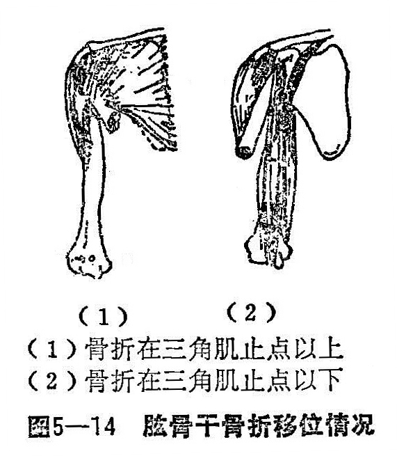
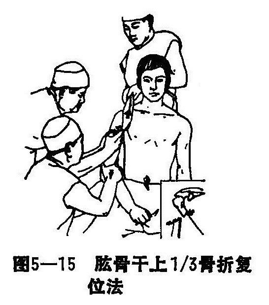
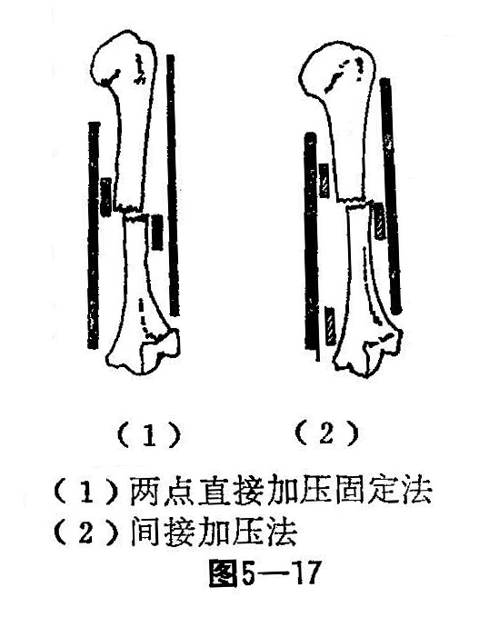

### 三、肱骨干骨折

肱骨，又名臑骨，俗名胳膊骨。肱骨干是指外科颈以下至肱骨髁上以上处之间而言。肱骨干为管状骨，其上部较粗，自中1/3以下逐渐变细，至下1/3渐成扁平状，并向前倾。桡神经自腋部发出，绕肱骨中段后侧，沿桡神经沟，紧贴肱骨干，自内后向前外斜行而下，故肱骨中下1/3交界处骨折容易损伤桡神经。

肱骨干周围有许多肌肉附着，三角肌抵止于肱骨干外侧的三角肌粗隆，胸大肌抵止于大结节嵴，以及肱骨干前后的肱二头、肱三头肌、喙肱肌和肱肌等。由于以上肌肉的牵拉作用，在不同平面的骨折，可造成不同的方向移位。临床上，肱骨干骨折较为多见，骨折常分上1/3，中1/3及下1/3三部位。

〔病因病机〕

肱骨干骨折，可发生于任何年龄，但多见于成人。多为直接暴力所致，如重物撞、挤、压、打击，常使骨干上部和中部骨折，多数为横断形成粉碎形骨折，或开放性骨折。骨折线在三角肌止点以上时，骨折近段因胸大肌、背阔肌及大圆肌的收缩向前、向内移位。骨折远段因三角肌的牵拉，向上、向外移位。骨干中部骨折位于三角肌止点以下肘，骨折近段因三角肌及喙肱肌的收缩向上移位（图5—14）。此外，造成骨折的暴力及受伤后前臂的位置，也影响远段的移位方向。一般骨折后，患者常前臂旋前，附贴在胸壁上固定，造成远段内旋。

骨干下部骨折，多为间接暴力所造成。如跌倒时，手或肘部着地，暴力经前臂或肘部传导至肱骨，多发生斜面或螺旋形骨折，骨折后多发生成角畸形，其成角可向前、向后，也可向内、向外。

〔诊断〕

移位不明显或无移位的骨折，伤臂可无明显畸形，但根据以下几点可确定诊断：局部有轻度压痛；上臂纵轴叩击痛；局部有轻度的柔软活动；测听骨传导音减弱。骨折移位明显者，均有显著疼痛，上臂短缩或成角畸形，有异常活动和骨擦音，上肢功能障碍者，拍摄正侧位X线片，以确定骨折部位和移位情况。

检查桡动脉搏动及手部的功能，有无虎口部麻木，腕、指能否背伸，以便确定是否合并桡神经损伤。

〔治疗〕

无移位的肱骨干裂缝骨折，无需整复，仅用夹板固定，内外用药，练功即可。有移位的肱骨干骨折，一般在局麻或臂丛麻醉下，徒手复位，小夹板外固定，辨证运用中药内服外用，练功，均能起到解剖或近解剖对位愈合。在治疗过程中，常因伤肢重力的下坠而易发生骨折的对位后分离，引起骨折迟缓愈合，为防止其发生，在骨折复位和夹板外固定时，常加以“触碰”手法（即在骨折的上、下端加以1〜2下扣击，使上下骨折端扣紧稳定），出现骨折端有分离现象，要加以弹力绷带肩肘绷扎固定；骨折合并桡神经、血管损伤，在利用整复和夹板固定治疗，必须密切观察伤肢的血运和神经恢复的情况，如4〜6周内功能无改善，或者确定有合并神经、血管损伤时，应考虑尽早手术探查。因为桡神经的走向与肱骨干中段紧贴下行，故肱骨中下1/3交界处骨折时，该神经不会受损，但在骨折固定或骨折愈合过程中，可能由于疤痕或骨痂的生长压迫，而产生桡神经迟延性损害，此时要考虑作桡神经探查松解术。

1.手法整复：

（1）在臂丛麻醉下，患者取坐位（幼儿和体弱老人可平卧），由两助手沿上臂肢体的纵轴对抗牵引，一人用布带兜过腋窝向上牵引，一人持握前臂于中立位向下牵引，一般牵引力不宜过大，矫正骨折重叠移位。

（2）上1/3骨折（骨折线有三角肌止点以上）：术者站于患侧，两拇指抵住骨折远段外侧，其余四指将近折段端提向外，使与远段轻微向外成角，继而两拇指由外侧挤按骨折远段向内，矫正侧方移位（图5—15）。

（3）中1/3骨折（骨折线在三角肌止点以下）：两拇指抵住骨折近段外侧，其余四指环抱骨折远段内侧。在维持牵引下，两拇指推按近折段断端向内，同时环抱四指将远折段断端向外端提，使骨折两断端内侧平齐，并轻微成角，两拇指再稍向内按，环抱四指再稍向外提，纠正成角（图5—16）。然后，术者捏住骨折部，助手放松牵解，此时再用“触撞”手法，使两断端互相接触，骨折基本复位。

（4）下1/3骨折：多为螺旋或斜行形骨折，整复时牵引力不宜太大，仅矫正过多的重叠移位或成角畸形。能将两斜面对合挤紧并将螺旋面扣上，两骨折段可留少许重叠，这样，可加大两折端的接触面，有利于骨折愈合。

（5）粉碎性骨折复位时，一般不用牵引，亦不用较重的整复手法，可由术者从两侧或前后挤压骨折部，使骨折面相互接触即可。

2.固定：骨折整复后维持牵引情况下，外敷消肿驳骨膏，用绷带缠绕4〜5周，并根据移位和成角情况，可采用两点或三点纸压垫加压，放置的位置与骨折移位方向相同（图5—17）。

夹板的安扎，一般将事先准备好三四块夹板，先安前后，后安内外侧夹板，用四度扎带捆扎，先扎中段二条，后扎上下二条，原则是上1/3骨折用超肩关节夹板固定，中1/3骨折不超关节，下1/3骨折超肘关节夹板固定。前臂置中立位三角巾肘屈90°胸前固定。

3.练功：患者半卧位，术后即可鼓励其做握拳及耸臂动作，使上肢肌肉处于紧张状态；做腕肩关节活动，注意避免前臂左右摇拉。定期复查，注意布带的松紧度及手指的血运情况。一般固定4〜6周左右，骨折达到临床愈合标准时，去除外固定，外用四肢损伤洗方，至骨性完全愈合。
