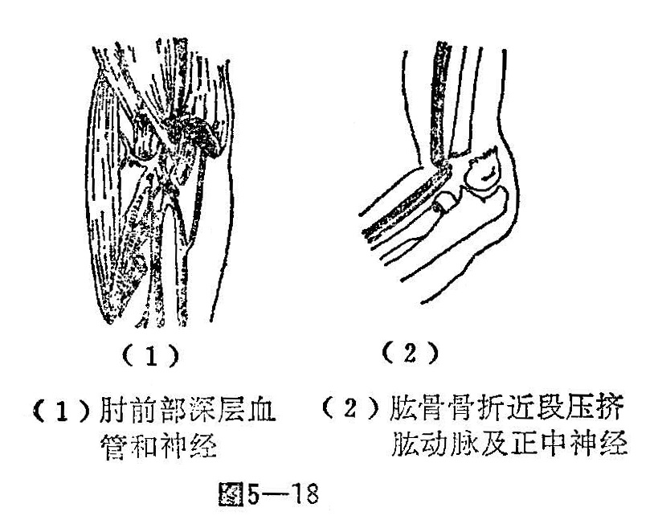
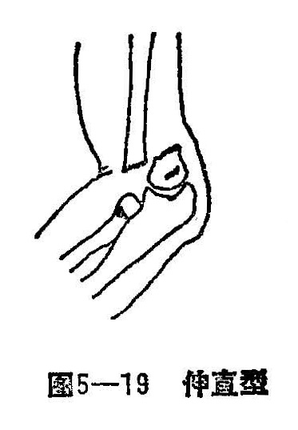
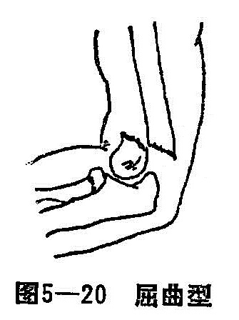
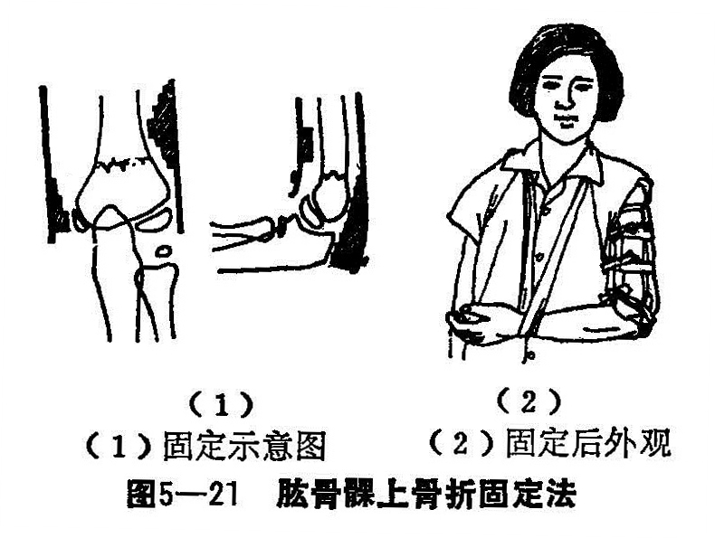

### 四、肱骨髁上骨折

肱骨髁上骨折，又名臑骨下端骨折。由于肱骨下端前后薄，而内外宽，呈一扁形骨端，其前有冠状窝，后有鹰嘴窝，两窝之间仅隔一层薄骨板，故髁上部位易发生骨折。窝的内下方为滑车，外为肱骨小头，二者连成一块，并与肱骨长轴向前呈30〜50°的前倾角，正常时滑车比小头高，伸直位时造成5〜15°携带角。肘关节屈曲时，携带角消失。

肱骨髁部前方有肱动静脉和正中神经，于肱头肌筋膜下通过进入前臂。肱骨髁上骨折，易挤压或刺伤肱动静脉，引起缺血或正中神经损伤。临床上有因前臂缺血造成肌挛缩（浮克曼氏缺血挛缩），处理时要特别加以注意（图5—18）。

〔病因病机〕

此类骨折常发生于5〜10岁儿童，多为间接暴力所致。由于受伤时体位不同，致发生骨折移位有异。临床上分为伸直型、屈曲型两类，以伸直型多见。

1.伸直型：儿童跌倒前扑，肘关节在半层位或过伸位掌心着地，暴力经前臂向上传导，作用于肱骨下段，将肱骨髁部推向后方；由自上而下的身体重力，将肱骨干推向前方，形成了骨折线前下斜向后上方，使骨折近端向前方移位，骨折远段后移，造成了特有畸形（图5—19）。

当暴力同时来自肱骨髁部的前外方，肱骨髁部被推向后向尺侧方移位，即出现尺偏型肱骨髁上伸直型骨折。此类型骨折发生肘内翻率较高。当暴力同时来自肱骨髁前内方，肱骨髁部被推向后面桡侧方移位，即出现桡偏型肱骨髁上伸直型骨折，故在伸直型肱骨髁上骨折中，又有桡偏移位和尺偏移位之分。

2.屈曲型肘关节在屈曲位跌倒，肘后侧触地，暴力由后下方向前上方撞击尺骨鹰嘴，使肱骨髁上脆弱部发生骨折，远端向前移位，骨折线由后下方斜向前上方（图5-20）。根据暴力的来源和骨折段移位的情况，也可出现尺偏型和桡偏型。

〔诊断〕

根据患者跌倒的姿势，肘部疼痛、肿胀。移位小的，肿胀也轻，移位大的，其肿胀也较严重，局部压痛甚剧，肘关节功能丧失。伸直型骨折肘关节呈半屈位，肘部后突，骨折近段因前移，使肘窝上方软组织前凸，有时可触及近折端的骨尖。局部伴有皮下出血，患肢较健侧短缩。

肱骨髁上骨折在临床上，易误诊为肘关节脱位。肘关节脱位以尺骨鹰嘴后凸较明显，肘屈功能受限较明显。肘后三角消失，拍肘关节正侧位X线片，即可确诊。

〔治疗〕

肱骨髁上骨折，如无移位，仅用肱骨髁上夹板或石玉托外固定；有移位者，肿胀不甚严重，皮肤无张力性水泡和血管神经损伤者，均可用手法复位，超关节夹板局部外固定，辨证用药。如肿胀严重，有水泡的病例，可在无菌操作下，将局部水泡穿破，抽尽渗出液体后，外敷金黄膏，使肿胀消退，防止感染。此时复位后以小夹板外固定，绷扎要稍松，术后严密观察伤肢血液循环。对于合并有血管神经损伤的患者，应及早进行手术治疗。

1.整复手法：麻醉生效后（一般用局麻或臂丛，必要使用氨胺酮麻）。患者取坐位或仰卧位，先矫正重叠移位，再矫正侧方移位，后矫正前后移位，以患肢右侧为例，其具体操作如下：

（1）拔伸牵引：前臂取旋后位，一助手握住患侧上臂，另一手握前臂，两助手顺势对抗牵引，矫正重叠畸形。

（2）矫正侧方移位：在维持牵引下，术者左手握骨折近端外侧，右手握骨折远端内侧，两手相对挟挤，侧方移位均获矫正。

（3）纠正前后移位：当重叠及侧方移位矫正后，术者双拇指在肘后推顶远端骨折向前，其他四指环抱骨折近段前侧牵拉向后，同时令牵引前臂之助手，在牵引下逐步曲屈肘关节近90°，矫正骨折前后移位。

2.固定方法：骨折整复后，外敷消肿驳骨膏敷料，在肘至上臂中下段，绷带适当松度缠绕包扎3层，肱骨髁上内后侧夹板远端各安放一梯形垫对鹰嘴部和内髁部，外侧夹板远端上方安放一塔形垫放骨折远端外侧。四块夹板相对放好，内、外、后侧夹板均超肘关节3厘米。然后用三条扎带捆好肘上及上臂扎带，保持上下移动1厘米松紧为度，最后将内、外侧夹板末端系带在肘下系带结扎。前臂中立位肘屈90°三角巾胸前固定（图5-21）。

3.术后处理：骨折复位固定后，注意检查和调节布带松紧度，桡动脉的搏动情况，伤肢肤温及血运情况，定期X线复查。患者术后即可开始练握拳、耸肩活动。练功过程中，避免做前臂伸直活动，每周在维持牵引下换外用药一次，辨证分期内服中药，3〜4周根据愈合情况解除外固定，外用四肢损伤洗方，练功肘关节功能。

〔注意事项〕

肘内翻是肱骨髁上骨折的主要并发症，因而在治疗中，要注意预防其发生。大多学者认为，肘内翻的发生原因，是由于损伤而影响肱骨下端骨骺发育。内外髁发育生长不均衡而造成尺偏型骨折部，尺侧骨皮质遭受挤压而产生一定的缺陷或嵌插，故在临床上尺偏肘内翻的发生率最多见。

骨折远端旋前移位也可以产生内翻畸形，因骨折部扁平远端旋前位时，则两断端形成交叉。骨折远段由于重力及肌肉牵拉，形成向内倾斜，也可造成内翻畸形。因此，对于尺偏型骨折，在复位时，切勿使尺侧骨膜断裂，以防骨折对位不稳。在其夹板外固定时，尺侧纸垫要低，作用点须在骨折部，并略偏高为妥。
