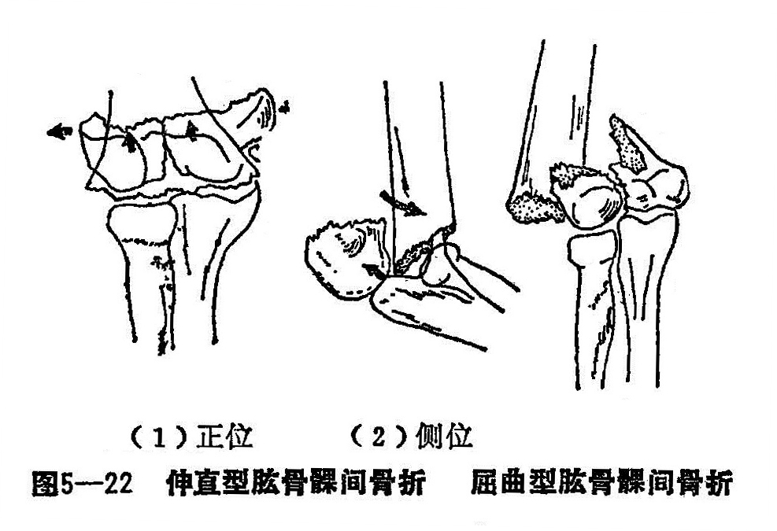
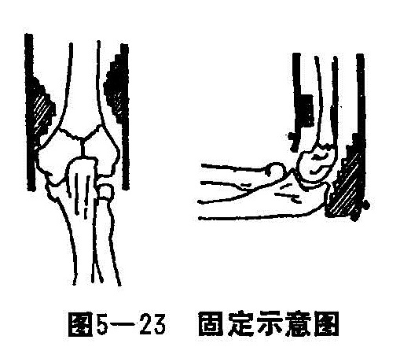

### 五、肱骨髁间骨折

肱骨髁间骨折，又名臑骨下端岐骨“T”或“Y”字形骨折，临床上较少见。常因肱骨下端的薄弱环节，受到压缩性的暴力影响，产生纵形的劈裂，破坏关节，故为关节内骨折。其整复及固定较困难，处理不当常遗留肘关节活动障碍。由于该部为骨松质，局部血液循环丰富，骨折即易愈合。根据治疗后的功能要求，在整复时，除要求骨折力线好以外，更重要的是务必恢复其关节面之整复，方能达到治疗的预期效果。此骨折多见于青壮年。

〔病因病机〕

患者跌倒时，肘伸直位手掌着地，由地面向上传导暴力将肱骨髁向后推，由上而下的冲力将肱骨干向前推移，在造成髁上骨折的同时，尺骨鹰嘴的半月切迹撞击滑车沟，将肱骨髁再劈成两半，向后移位。或跌倒时肘关节屈曲着地，尺骨鹰嘴推顶滑车沟，在造成髁上骨折时肱骨髁劈成两块，并向前推移。根据骨折的受伤机理和骨折断端的移位方向，可分为屈曲型及伸直型（图5—22）。伸直与屈曲两型骨折均可造成“T”字型、“Y”字型和粉碎型骨折，一般粉碎型骨折除远段三块碎片以上，尚有一较大的游离碎片者，可称为粉碎型。鉴于造成髁间骨折的暴力较大，其骨折均有严重移位，内外两髁向两侧分开，有时且为穿破皮肤，造成开放性骨折。

〔诊断〕

有明显外伤史，肘部肿胀、疼痛严重，关节皮肤常有瘀血斑，常可摸到突起骨折端，压痛甚明显，稍被动伸屈肘关节时，可有骨磨擦音，内外髁间距离比健侧增宽，肘后等腰三角消失，肘关节功能丧失。应注意伤肢的感觉、肤温和血运情况，鉴别有否合并神经或血管损伤。摄取肘部正侧位X线片，可帮助骨折诊断。

〔治疗〕

对于此类骨折的治疗，其复位的重点是矫正远侧骨折片的侧方分离移位与关节面的平正，应从伤肢的功能恢复来决定治疗方针。对骨折远近端有移位而两髁尚未分离者，可按肱骨髁上骨折法治疗。髁上骨折远近段有重叠移位，且髁间分离者，手法复位，纸压垫和超关节肱骨髁上夹板固定不稳，需行尺骨上端骨牵引结合来维持骨折稳定。开放性骨折，伤口在1〜2厘米左右者，在清创术时可行手法复位，用消毒纱垫保护伤口，可用纸压垫、肱骨髁上夹板外固定，结合尺骨上端骨牵引。待骨伤一期愈合后，再稍加小夹板外固定的约束力维持治疗。如伤口较大，或合并有血肿、神经受压，可在清创术时行骨折复位克氏针（或骨栓）内固定。

1.手法整复：患者取平卧位，在臂丛麻醉下，肩外展70°〜80°，前臂中立位，术者站于患肢前外侧。

（1）夹挤抱髁：术者两手掌在肘部侧面抱髁，并向中心夹挤，以免在牵引时再加重两髁分离。

（2）牵引：一助手握上臂，另一助手把持前臂，肘关节在120°〜140°屈曲位作对抗牵引3〜5分钟，使重叠移位完全矫正。

（3）矫侧方移位：矫正骨折远端的尺偏或桡侧移位，在助手保持拔伸矫正近远折骨折重叠移位后。如远折段尺偏移位时，术者抱髁外侧之手掌徐徐移至外髁上，紧贴皮肤，与抱内髁部之手掌，作对抗推挤，有时可听触到骨折断端骨磨擦音，然后外侧之手掌下移，恢复两掌抱髁，并稍加用力，再作对向夹挤，使矫正之两髁侧移相互挤紧。如为桡偏型，一般轻度移位可不做整复，让其稍矫枉过正，移位较重者，此时术后内侧之手掌徐徐移至内髁上方，紧贴皮肤，与抱外髁部之手掌，作对抗挤压，亦可听触到骨断端骨擦音，然后内侧手掌下移，恢复两掌抱髁，并稍加用力作对向夹挤向中心挤压，叩紧分离两髁。

（4）矫正前后移位：术者两手仍为抱髁状，此时两手四指移至骨折近端，环抱于肘前，两拇指移至远端到尺骨鹰嘴处，两手虎口处对向压挤两髁，环抱两手四指将骨折近段拉向背，两拇指将骨折远段推向前，令牵引前臂之助手徐徐牵引将肘屈曲到90°，使四方的力量联合一致，同时合力，在保持两髁复位的情况下，矫正前移位。

一般的骨折经上述手法后，都能达到基本复位。但要注意，常因骨折远端的两髁近端受两侧关节囊韧带的牵拉，或术者在整复时两虎口未能紧压挤髁部，时有向外、内旋转分离，使滑车关节面不平。因此，术者一手需继续抱髁，另一手在髁上向中心推挤，使骨折扣紧。

骨折整复位，安放纸压垫及肱骨髁上夹板超关节固定绷扎，做术后X线复查，如关节面平整，仅有骨折远近段稍许重叠者，可用尺骨上端骨牵引来复位，如单一侧髁骨折片仍有分离时，可用拇指挤压或安置纸压垫处理，不必再行手法整复，如两髁明显移位，须再行复位，达到满意对位为止。

2.固定：根据肢体长短不同，可选用合适的肱骨髁上型超肘关节夹板，外、内侧夹板在髁上各放塔形垫，后侧夹板安放梯形垫抵压骨折远端；前侧夹板安放平垫抵住骨折近段，先捆上臂三条布带，最后将超肘关节之内、外侧夹板末端的系带结扎固定。前后侧板斜行结扎，布带卡在铝钉上，以免滑动。布带要松紧合适（图5—23）。

如骨折移位很大，手法复位或夹板固定骨折不稳定，在采用人骨上端牵引时，一助手固定骨折部，另一助手握住前臂，取尺骨鹰嘴下二横指穿针：常规消毒铺巾后，用骨钻钻入细克氏针，其力线与上臂纵轴一致，患臂置于活动的牵引架上，牵引重量1.5〜2公斤，患肢与躯干呈70°〜80°外展前臂中立位，肘关节屈曲90°〜120°范围内。

3.功能锻炼：在麻醉消退后，即可使患者做握拳锻炼。初期，一般只有10°〜20°的主动伸屈肘活动。要求患者在无痛下，自动加重活动范围，一般2〜3周后，其活动范围可40°〜50°左右，卧床骨牵引为4周以后，如经X线检查，骨折对位好，可解除牵引，再继续夹板外固定，待临床检查骨折部无痛，肘关节用力作伸屈活动，骨折临床愈合，即可解除外固定，外用四肢损伤洗方，直至肘关节恢复正常功能。
