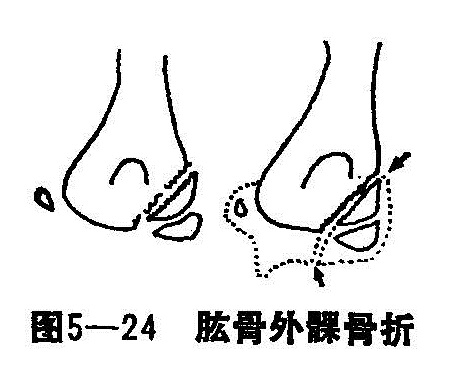
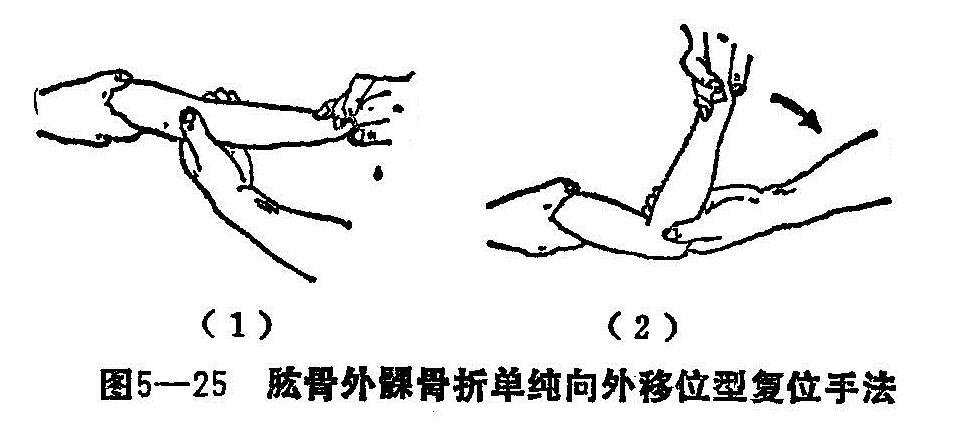
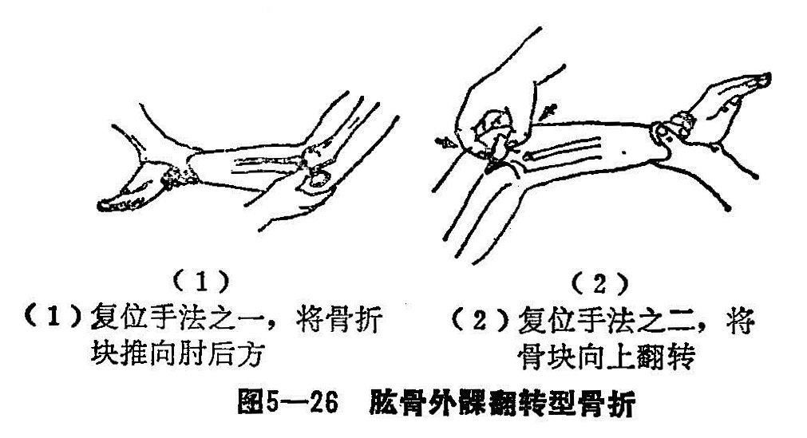
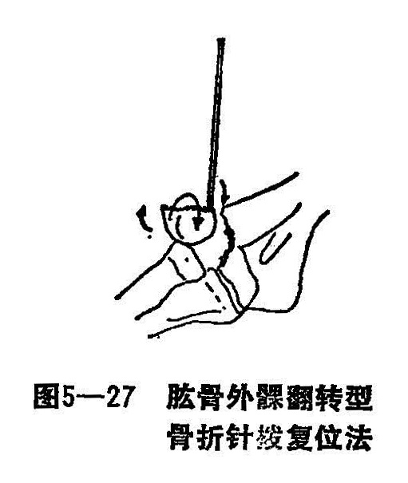
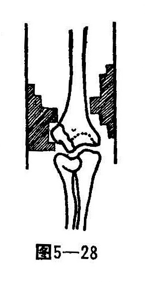

### 六、肱骨外髁骨折

肱骨外髁骨折又名臑骨下端外岐骨折，亦称肱骨小头骨骺分离。骨折远端往往包括外上髁、肱骨小头骨骺，部分滑车骨骺及干骺端的骨质（图5—24）。多发生于5〜10岁的儿童。

〔病因病机〕

多为间接暴力所致。因受伤时前臂伸肌腱的收缩力的大小不同，肘关节在跌倒时位置不同，以及前臂的旋转方向不同而骨折远端的移位亦就有异。在肘关节伸直情况下过度外展，桡骨小头撞击肱骨小头而产生骨折，骨折远端常向上、外、后方移位，肘关节在内收位受伤时骨折远端向下前方移位，又因肌肉收缩，牵拉骨折块发生旋转和翻转，有的甚至达180°，根据骨折移位情况，可分为三型：

1.无移位型：骨折线仅有为一裂隙，骨折面接触好。

2.轻度移位型：骨折块轻度外移，无旋转畸形。

3.旋转移位型：骨折后，由前臂传导来的暴力未减，骨折块被桡骨小头的压挤及附着于肱骨外髁后、外侧的桡侧伸腕长、短肌和伸指总肌的牵拉，使骨折段发生矢状面和冠状面的严重旋转移位，骨折块在冠状面上向外旋转可达90°〜180°。

直接暴力所致，肱骨外髁骨折，如跌倒时，肘关节屈曲，肩关节内收位，肘后、外侧着地，暴力由后向前撞击肱骨外髁而发生骨折。骨折块前移，同时受前臂伸肌群的牵拉而沿矢状轴向外翻转骨折，此型骨折较为少见。

〔诊断〕

肱骨外髁骨折的患者，肘关节呈半伸直位。肘部肿胀，在受伤早期可见到肿胀局限在肘关节外侧，局部触痛，有移位骨折者可轻度肘外翻，肘外侧可摸到活动的骨折块以及骨擦音，肘伸屈或外展活动疼痛加剧。骨折块一般比外上髁大。X线检查，有助了解骨折的移位和分型。

〔治疗〕

肱骨外髁骨折为关节内骨折，要求解剖对位，否则会影响肘关节功能。骨折的复位时间愈早愈好，历时愈久，骨折周围血肿→机化→粘连，给骨折整复将带来一定困难。无移位肱骨外髁骨折，可用石膏托肘关节屈曲90°固定，早期作空手握拳，耸臂功能锻炼，2〜3周后，视骨折稳定，可解除石膏外固定，外洗舒筋活络骨洗剂，行肘关节伸、屈功能锻炼。

1.手法整复：

（1）单纯向外移位之轻型骨折：在无麻醉下，术者一人整复。以患肢右侧为例，术者右手握住患肢腕背侧，将前臂旋后关节屈曲130〜150°，左手拇、食指抵住骨块的外后部将骨折块向内上挤压，同时右手在牵引下将肘关节外展、内收前臂，使两骨折端相互对位吻合，整复后，左手拇、食指捏住骨折块，余指环扣肘内侧，以肋助拇、食指加固骨折部，右手作轻度的伸屈肘关节数次，使骨折稳定（图5—25）。

（2）旋转移位型骨折：术者用左手拇指先将骨折块向肘后方按压，使骨折块推向肘后，右手在牵引下将肘屈曲并外展外旋前臂，左手拇食指叩住骨折块的外上端，由外下方推向外上方挤按，矫正骨块旋转的同时，将骨块向前、内侧挤压，将骨块复位吻合，整复后，再按轻度移位型稳定法固定骨折（图5—26）。

（3）针拨整复法：若手法复位不成功，可采用针拨法，在严格无菌操作下，摸住外髁滑车端（可配合X线透视下定位），用细克氏针刺入将滑车端顶入肘外侧间隙内的近段骨折面处，将肱骨外上髁端向外翘起：再用手指将外上髁向上翻转复位（图5—27），复位成功后，再按轻度型骨折处理。也可行闭合克氏针内固定，针尾留于皮外，石膏托肘屈90°位固定。

2.固定：可参照肱骨髁上骨折固定法。即在骨折复位满意后，外敷消肿膏敷料，缠上绷带2〜3周，用肱骨髁上夹板、纸垫进行固定。外侧板下端固定以有缺口的梯型垫，放置时缺口对准骨折块，内侧板以塔形垫压于髁上部（图5—28）。在固定过程中，不应放松对骨折块的挤压。布带捆好后透视复查，只要骨折面相对即可。

3.功能锻炼：早期以空手握拳，耸肩为主，中期在早期的基础上，做小云手练习骨折达纤维愈合，可适当做肘关节半伸曲活动，但活动度不宜过大，后期骨折已骨性愈合，应加强肘关节的伸屈活动，并配合肘关节功能。
