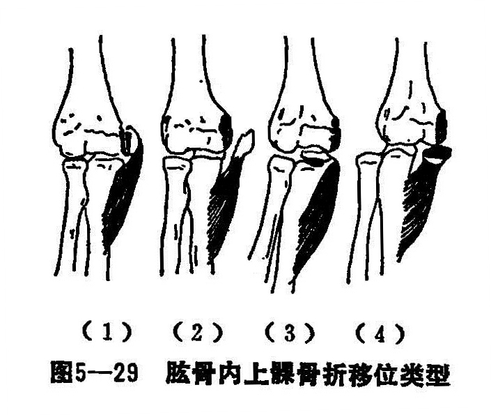
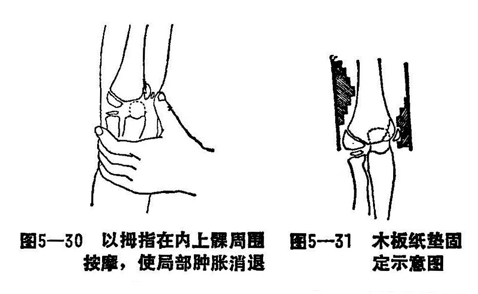

### 七、肱骨内上髁骨折

肱骨内上髁骨折，又名臑骨下端内岐骨折、肱骨内上髁骨骺分离。常见于青少年。肱骨内上髁部附着强有力的前臂的屈肌群，肘关节尺侧副韧带也附着于该处，这些肌群的强烈收缩，是产生骨折的主要原因。其后方有尺神经沟，尺神经由此通过，故骨折易损伤尺神经。其骨化中心5岁儿童出现，18〜20岁闭合，儿童时期外伤常易发生骨骺分离。

〔病因病机〕

伤肢遭受直接和间接暴力均可产生骨折，但此种骨折在临床上以间接暴力多见。如跌倒时，由于前臂的过度外展，手掌着地前臂屈肌急骤收缩，肱骨内上髁被屈肌群牵拉而撕脱，骨折块向前下方移位，过重的暴力，甚至产生骨块旋转，肘关节脱位或内侧关节囊撕裂，骨折块嵌夹在关节内。直接暴力打击或撞碰于肱骨内髁处而产生的骨折者，但甚少见。根据骨折块的移位情况，可分为四种类型：

1.无移位型：无移位或有极轻度分离，其所受暴力较轻，骨折局部筋膜未破裂（图5—29（1））。

2.轻度移位：有明显分离或轻度旋转移位，因局部筋膜部分撕裂，骨折块仍位于肘关节平面以上（图5—29（2））。

3.嵌入关节型：骨折块有较大移位，且被嵌入关节内，这是由于伤肢遭受较大的外翻力，肘内侧关节囊撕裂，肘内侧关节间隙张开，使完全撕脱的骨块被屈肌腱牵拉到肘关节水平位，被关节腔的负压力吸肱尺关节腔内（图5—29（3））。

4.嵌入并关节脱位型：骨折块较大的移位，同时并肘关节向后外侧脱位，撕脱之肱骨内上髁被拉向肱骨滑车内，骨折面朝向肱骨滑车，此类骨折易被忽略，常易误为单纯肘关节脱位给予复位，以致骨折块被钳夹在尺骨半月切迹和肱骨滑车之间（图5—29（4））。

〔诊断〕

肘关节内侧肿胀，皮下瘀血，局部触痛，肘内侧牵拉性疼痛，肘关节活动功能受限，可触及活动的骨折块及锐利骨折部，6岁以下儿童骨骺尚未出现，X线检查一般为阴性，只要临床符合即可确诊。

〔治疗〕

无移位的肱骨内上髁骨折，可外敷消肿膏，用小夹板或石膏托固定于肘屈曲凹90°即可。骨折明显移位，但骨块翻转不超过90°者，用手法整复，纸垫、小夹板超关节外固定。整复不需麻醉，先在内上髁周围轻轻按摩，迫使局部肿胀消退，摸清楚骨折块及骨折部（图5—30）。然后屈曲肘关节135°左右，前臂呈中立位，术者用拇、食指固定骨折块，拇指自骨折块下方向上方推挤，使其复位。对位满意后在骨折部外敷消肿膏，绷带包缠3〜4周，用小夹板、纸垫固定。其外侧用塔形垫，内侧夹板下端固定以有缺口的梯形垫，使缺口对准骨折块（图5—31），在固定过程中，不应放松对骨折块的挤压。布带捆好后，透视检查复位后的情况，只要骨折面相对，待血肿吸收后，骨折面即可相接。术后每天检查，调整扎带的松紧度，2〜3周解除夹板，练肘关节功能。

对嵌入并关节脱之3、4型骨折，骨折块向关节内移位，影响肘关节功能，必须先使关节间隙内的骨折块逸出，而转化为1、2型骨折，再按1、2型骨折处理。

以右侧为例，术者左手握住伤肢前臂外侧近肘关节处、右手握伤肢掌指关节处，使伤肢前臂旋后，肘关节处于肘屈130〜140°之间，此时术者左手固定肘外侧略向内推、使肘关节内侧间隙口张开，右手使伤肢腕、指关节背伸，并使肘关节外翻伸直，上述三个手法同时在一瞬间进行，利用前臂屈肌群的骤然牵拉力及尺骨半月切迹关节面内移位的作用，使关节内骨块逸出，如复位成功，可按2型整复手法处理。此法操作时切勿用力过猛，必要时可反复数次进行，一般均能将3、4型骨折轻化为1、2型后，再按2型骨折处理。

如手法整复不成功，可采用切开复位，克氏针固定术。陈旧性肱骨内上髁骨折，无骨性连接，也可考虑手术治疗。若无神经损伤症状，虽有移位，不影响关节功能，则不需再进行手术治疗。

固定与功能锻炼：基本与肱骨外髁骨折相同，不同的是在安置纸垫时，内侧板安置梯形垫，缺口对准骨折块，外侧板安置塔形坠于髁上部。
