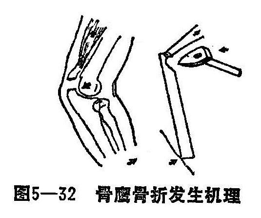

### 八、尺骨鹰嘴骨折

尺骨鹰嘴又名肘骨，此处较尺骨其他部位粗大，前侧为尺骨半月切迹，是构成肘关节的主要部分，肱三头肌的肌腹下部，形成一个强韧的肌腱，向下止于尺骨鹰嘴。由于尺骨鹰嘴较表浅，也易遭受到直接暴力损伤。在儿童期尺骨上端短而粗，较肱骨下端坚固，故儿童尺骨鹰嘴骨折少见，多发生于成人。

〔病因病机〕

多为间接暴力所致，如跌倒时，肘关节半屈位，手掌着地，肱三头肌急骤性收缩，迫使肘关节伸展，暴力沿着手掌到前臂传导至肘关节，身体自身的重力沿肱骨下端直压在尺骨半月切迹上，致使尺骨鹰嘴发生骨折（图5—32）。骨折一般多为横断或小斜形，随着暴力的大小和肱三头肌腱膜的破裂程度，可发生不同程度的移位。

直接暴力所致骨折发生率较少，如在屈肘位跌倒时，肘部直接撞地或暴力直接撞碰于肘部造成尺骨鹰嘴骨折，多发生粉碎性骨折。

〔诊断〕

结合外伤史诊断比较容易，骨折后局部肿胀和明显压痛，关节活动障碍，有时在局部可触及到明显的骨折裂隙或骨擦音，损伤严重肘关节内积血，鹰嘴两侧凹窝处隆起。肘后三角的形态有改变，拍肘关节正侧位X线片，确诊骨折及移位情况。

〔治疗〕

尺骨鹰嘴除小块撕脱骨折外，都涉及关节，故强调正确对位，愈合坚固。若为无移位的裂缝骨折或移位不大的粉碎性骨折，可仅用上肢直角托夹板或石膏托肘伸直位外固定3周，须早期做恰当功能锻炼，有移位的骨折，肿胀较严重，需在无菌操作下，先抽出关节内瘀血再行手法整复，小夹板固定。

1.手法整复：患者仰卧，肘关节呈10°〜30°微屈位，助手固定伤肢前臂。术者以点穴按摩法先松解肱三肌和上臂挛缩肌肉，然后以一手拇、食指推压在移位的尺骨鹰嘴上端的内、外侧，向远侧方向按挤，直到两骨折面接触，另一手再协助将骨折块向远折端按压，并稍作摇晃，令助手将肘关节直伸，使两骨端紧密对合。再轻推骨折块无移动亦无触感到骨擦音时，说明两骨折端分离移位已整复，此时术者仍须紧推固定骨折块，令助手将肘关节缓慢小幅度伸屈伤肢数次，利用肱骨滑车对骨折处的模造塑形，使半月板切迹的关节面复平。用超肘关节鹰嘴夹板加合骨垫肘屈30°胸前外固定。

如骨折块不稳定或复位不成功，行闭合克氏针固定法。在严格无菌操作下，在尺骨鹰嘴上端的外、内侧进针，分别交叉斜向将尺骨鹰嘴骨块固定，要求两针尖穿过尺骨后缘骨皮质处，将针尾弯曲置于皮外或埋于皮下覆盖无菌纱布，石膏托外固定。

粉碎型骨折移位较大，考虑关节面难以恢复平整，估计以后会产生创伤性关节炎者，可以将骨折近端切除，并将肱三头肌肌腱与修整后的鹰嘴断面缝合。亦可考虑行三头肌成形术。

2.固定：在固定的方法中须注意固定的早期，观察伤肢远端的血运情况，尤其5〜7天内，随着伤肢肿胀消退，肌肉挛缩的缓解，夹板易出现松动，骨折易在此时发生分离移位，故应及时调整、定期X线检查，了解骨折对位情况，如有分离移位，需及时予以纠正，使两骨折端在紧密吻合下生长愈合，小夹板固定三周后，逐渐加大肘关节屈曲固定，骨折临床愈合，解除外固定，外洗舒筋活络洗剂。

3.功能锻炼：早、中期可作伤肢空握拳及耸肩活动，骨折临床愈合开始作肘关节伸屈功能锻炼。
