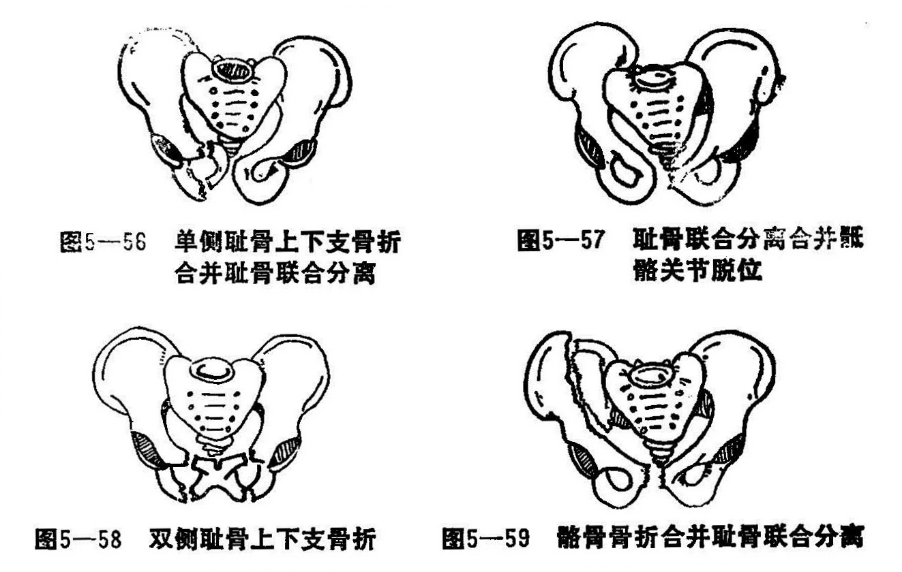

### 一、骨盆骨折

骨盆又称盆骨或盆骨环，系由骶、尾、髂、耻、坐骨连结形成一完整的骨环，整个骨盆形如盖又名盖骨。尾骶骨又称尻骨，坐骨又称髓骨，耻骨又称交骨。各骨借骶髂关节及耻骨联合彼此连接。幼年时各骨间借软骨连接，16岁以后相互融合，髋向在髂*、*耻、坐之骨交界处，与股骨头构成髋关节。骨盆有保护盆腔内脏，成为躯干与下肢的桥梁，有传导躯干重力到下肢，下肢的震荡传达脊柱的作用。骨盆有负重的主弓和副弓各两个，站立时重力线经骶髂关节至两侧髂关节称为骶般弓，即主弓。另外两个副弓起约束作用，重力线经骶髂关节至两侧坐骨结节称为骶坐弓，即副弓。副弓比较薄弱容易发生骨折，主弓有骨折时副弓大多同时有骨折。骨盆周围除骨隆起部位，如坐骨结节、耻骨联合及髂前上棘等处外周围肌肉较多，血液供应丰富，骨折后易于愈合。

〔病因病机〕

骨盆骨折常见的原因是：骨盆环受到侧或前后方的挤压，如车压、房塌或其他重物撞击等。挤压引起骨盆骨折多发生在薄弱的耻骨支，也可以累及其他部位；肌肉强烈收缩造成骨盆边缘部撕脱性骨折；直接暴力冲击，如向后跌倒可引起骶骨骨折，可常发生尾骨脱位。

1.骨盆环保持完整的骨折：如骶前上下棘和坐骨结节撕脱骨折，髂骨翼骨折，一侧耻骨骨折、骶骨骨折和尾骨骨折，这种骨折对骨盆的持重功能无大影响。

2.骨盆环断裂骨折：可发生于单处或多处。如耻骨上下支单侧骨折并耻骨联合分离（图5—56）或耻骨联合分离并一侧骶髂关节脱位或（图5-57）两侧耻骨上下支骨折（图5-58）或髂骨骨折并耻骨联合分离（图5—59），这种骨折下来的折块处于游离状态，移位大而不稳定，影响骨盆持重，且骨折片常造成盆腔内脏或局部神经的压迫等。

〔诊断〕

骨盆骨折除局部疼痛、肿胀、皮下瘀斑、下肢活动和翻身困难外，因盆腔血管丰管可造成大量出血而出现休克。一般检查可出现挤压试验阳性，尚可能有下肢缩短畸形。如骶尾骨骨折，肛门指诊可有压痛并可触到移位的骨折片。X线片检查，可以明确诊断，但必须包括整个骨盆和两侧髋关节拍摄，如考虑骶尾骨骨折或脱位，还必须摄侧位片。

有腹膜后血肿时，可有腹胀、腹痛、腹肌痉挛、压痛、反跳痛等腹膜刺激症状，须注意与肠管破裂和腹膜炎的鉴别。

骨盆骨折时，骨折端可能刺破膀胱，引起腹膜炎、腹外盆腔炎等；耻骨支骨折，易损伤尿道，两者都可发生尿痛、血尿、排尿困难、尿失禁等。

骨盆骨折还有可能损伤直肠，引起直肠周围感染，发生腹膜炎，以及神经受压迫而引起麻痹等，也应加以注意。

〔治疗〕

应注意全身的情况，如有休克或危及生命的并发症应首先处理。

1.骨盆边缘骨折：骨盆环边缘骨折而骨盆环保持完整，骨折无移位或移位不明显者，可以卧床2〜3周，即可起床下地练功。但要注意相应的体位：发生在髋前上、下棘的骨折，可取屈髋屈膝位，坐骨结撕脱骨折可取伸膝位。

2.骨盆环骨折：骨盆环骨折，如发生于一侧或两侧耻骨升支和降支，闲孔附近的骨折，耻骨联合轻度分离等，一般移位不明显，可取屈髋卧床体位休息3周，即可下床练功。若骨盆环两处中断，游离段发生移位或并耻骨联合分离，骶髂关节脱位等骨折严重，骨环解体，易发生并发症，治疗较为复杂，较常见的有：

（1）双侧耻骨上下支骨折：由于腹肌的牵拉，使游离骨折段向上、向后移位。复位的方法是患者仰卧，助手站在患者头侧双手分别扳住患者双腋窝向上拔，术者同时双手扣住游离骨用力向下扳压捺正，术后触骨折处平整即已复位。术者再用力两手对挤髂骨，使骨折端互相嵌插，助手用多头布带外包扎固定，或用帆布兜带悬吊骨盆4〜6周，即可下地练功。

（2）单侧耻骨上下支骨折并耻骨联合分离：复位手法与上述基本相同。

（3）单侧耻骨上下支骨折并骶髂关节脱位：复位的手法是助手仍扳住两腋窝向上拔伸，还需一助手在患肢相对拔伸下肢，术者轻推患侧髂骨向外以解除嵌插，利于复位；再向下推按髂骨嵴，有时可听到“喀嚓”声，触摸骨折处无凹凸畸形，用多头布带或骨盆兜夹板包扎固定，同时做患侧下肢皮牵（4〜6公斤），垫高床尾，早期做股四头肌和踝关节活动，4〜6周去掉皮牵，卧床做屈髋膝关节活动，6周以后，考虑下床活动。

（4）耻骨联合分离并骶髂关节脱位以及髂骨骨折并耻骨联合分离：复位的手法与单侧耻骨上下支骨折合并骶髂关节脱位基本相同。

3.功能锻炼：通过肌肉的舒缩、上下关节的活动，有利于血液循环、消肿，防止肌肉萎缩和关节僵硬。所以一般骨盆骨折后第一周可做局部肌肉的舒缩活动，第二周做关节活动，第三周可下床扶拐慢走。对有移位的，因影响负重，应相应推迟一周练功。
