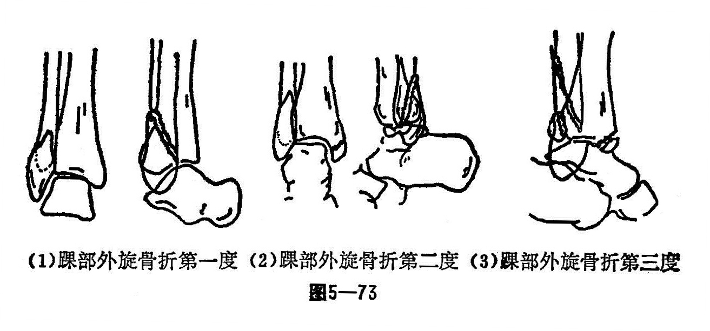
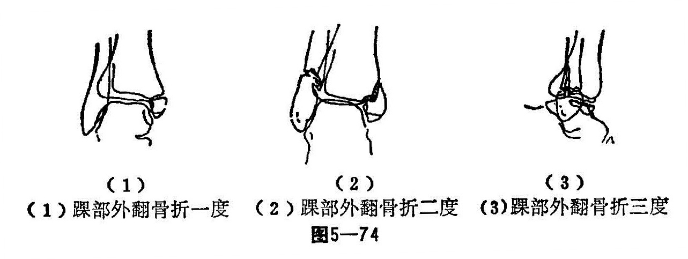
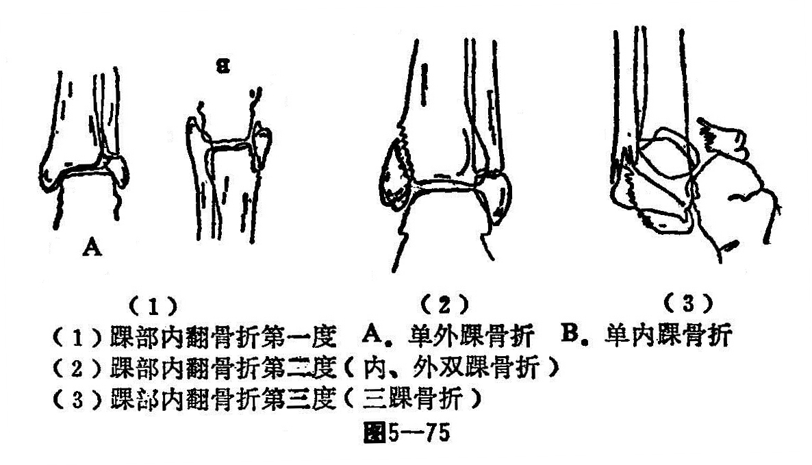

### 十、踝部骨折

踝骨是胫腓骨下端内外突出的骨突，分别称之为内踝和外踝，与下面的跟骨构成踝关节，内踝俗称合骨，外踝俗称核骨，胫骨后下端后踝即踝关节的第三踝。踝部骨折包括：单、双三踝骨折、踝上骨折，胫骨下关节面前后缘骨折等。此骨折可合并踝关节的内外侧韧带或下胫腓联合韧带断裂或撕脱和跟骨向外，向内、或向后脱位，踝关节主要以背屈和跖屈为主。踝关节的活动范围是：25°（背屈）⇌45°（跖屈〉，足外缘与小腿垂直时为中立位。因负重较大骨折的机会亦多，常见于青少年，有些病例的骨折部位，骨折形态或合并距骨脱位情况，几乎完全相同，但其骨折的机制却完全不同甚致相反治疗上亦不相同。各型踝骨折除踝上骨折外，均在关节内。所以整复时要十分注意正确性，因为即使遗留极轻度的移位，亦会妨碍踝关节的活动功能，或日后引起损伤性关节炎。

〔病因病机〕

根据其受伤的机制，解剖的改变，常见有外旋骨折、外翻骨折、内翻骨折、垂直压缩骨折。

1.外旋骨折：发生在小腿不动，足部强力外旋或足部不动，小腿强内旋时，距骨体的前外侧挤压外髁的前内侧，迫使其向外向后移位，一般下胫腓联合韧带的坚强性超过两踝的骨质，因而发生了下列变化，如距骨的外旋力量加大，使腓骨下端发生斜形或螺旋形骨折，而成第一度损伤；若暴力继续进行，内侧韧带断裂，或内踝被撕脱，发生双踝骨折，称二度骨折；若暴力继续增大，因内侧韧带牵掣消失，距骨及外踝向外向后侧及向外旋转移位，严重时可将胫骨关节面后缘碰折一块，造成三踝骨折（图5—73）。

2.外翻骨折：是由于足强力外翻引起，如由高处落下时，足内侧着地，或小腿外侧下方受暴力直接冲击，若暴力先作用在内侧韧带，因为韧带甚坚强，不易撕断，遂将内踝撕脱，即为一度骨折，如暴力继续作用，由于距骨体向外上方推挤，致使腓骨在胫腓联合的下方发生横形或斜骨折称二度骨折；如暴力继续作用，偶尔发生胫骨下关节面后缘骨折，造成三踝骨折称之为三度骨折（图5—74）。

3.内翻骨折：由于足强力内翻引起，如从高处落下，足外缘先着地或小腿内下方受暴力直接打击等使足突然内翻，外侧韧带部分断裂，是常见的踝部内翻扭伤，有时外踝尖部小块骨质撕脱，或整个外踝被横行拉断，属一度骨折；内外踝同时骨折属二度骨折；若暴力再大，胫骨下关节面后缘骨折和距骨脱位，属三度骨折（图5—75）。

4.垂直压缩骨折：高处落下足底着地，踝关节中立位，暴力垂直作用发生粉碎骨折或Y型、T型骨折。若踝关节过度背屈或跖屈，可发生胫骨下关节面前缘或后缘骨折，同时可发生距骨向前脱位或向后脱位。另外外界直接暴力撞击多为粉碎性骨折。

〔诊断〕

一般均有明显的外伤史，症状明显，局部疼痛、肿胀，多有瘀斑瘀血，有不同程度的畸形，功能丧失，有明显的压痛，有时可有骨磨擦音，被动活动局部疼痛加剧，X线片可以明确诊断。

〔治疗〕

1.手法整复：患者平卧，膝关节90°屈曲，在腰麻下一助手站于患者外侧，用臂夹住患肢大腿（右患肢用左臂，左患肢用右臂），双手抱住膝腘窝往上拔伸；另一助手在足部踝关节跖屈位，一手托足跟，一手握足前部，顺着骨折移位的方向徐徐用力向下牵引。内翻骨折先内翻拔伸，外翻骨折先外翻拔伸，无内外翻畸形的一般则垂直牵拉，但用力要均匀。

纠正内外翻畸形前，首先纠正旋转畸形，一般情况下，外翻骨折都有外旋，内翻骨折则有内旋，外旋骨折必有外翻，所以拔伸足部的助手将足内旋或外旋并同时改变拔伸的方向，外翻骨折的拔伸方向由外翻逐渐变成内翻，内翻骨折的拔伸方向，由内翻逐渐变成外翻，同时术者在踝关节上下对抗挤压，促使复位，内翻时内侧手掌在踝上，外侧手掌向内推送外踝；外翻时，外侧手掌在踝上，内侧手掌向外推内踝。

对有胫腓联合分离的病例，术者用手紧贴内外踝部，嘱助手同时稍稍旋转变方向牵引，术者反复扣挤两踝，直至分离消失，距骨内外侧脱位完全整复为止。

最后木板固定。术者一手握足前部向前拉，另一手把住小腿下端向后推，使后脱位的距骨回到正常位置。在推拉过程中，将踝关节背屈至90°，使向前张口的内踝亦随之复位。如仍有裂口，可用拇指由内踝的后下方向前方推挤。复位满意后，用踝关节活动夹板固定。

三踝骨折一般均有移位。骨折发生的机制距骨可向外后（外翻骨折）或向内向后（内翻骨折）或向外旋转移位（外旋骨折），后髁骨折块不超过胫骨下关节面的1/3时，都可以手法复位。整复时，先整复固定内、外两踝，然后再整复后踝。整复后踝时，一助手用力挤压两侧木板，术者一手握胫骨下端向后推，一手握足向前拉，慢慢背屈，使向后脱的距骨回到正常的位置，同时在背屈踝关节时，可利用紧张的后侧关节囊把后踝拉下，直到与胫骨下关节面相平，透视检查复位满意后，用踝关节活动夹板固定。

对后踝骨折超过胫骨下关节面的1/3以上时，单纯夹板不易达到解剖对位。可先整复两踝后，在患腿套上一个袜套，袜套上达大腿根部，用宽约8厘米的胶布一半粘在皮肤上，一半粘在袜套上。袜套下端超过脚尖20厘米。用细绳结扎，然后再根据骨折的类型整复内外两踝，放好纸压垫，木板超过关节固定。将膝关节屈曲位做悬吊牵引。

2.固定方法：手法复位后，在维持牵引下，踝部敷上外伤膏，绷带松缠，在内外踝的上方，各放一塔形垫，下方各放一梯形垫，使上下固定垫的高度与两踝突出的部份平面一致。主要是使各部位承受木板的平均压力，以免木板因受力不均而发生倾斜以及皮肤压伤。

对仅有两踝侧方移位的骨折，用直型木板将足固定于中立位，内外翻骨折，须将足固定在与原骨折类型相反的位置。内翻骨折，在内踝下方的梯形纸压垫适当加厚，使固定后的足轻度外翻；外翻骨折，外踝下方的梯形纸压垫加厚些，使足轻度内翻。然后用胶布两道固定纸压垫，木板放置好，先捆扎小腿部的三道布带。最后捆扎足底的一道，捆扎这道时，布带作“8”字形交叉，松紧度一定要适宜。最初1周透视1〜2次，经过2次透视，骨折仍维持在整复后的位置，以后的骨折则不再变位。

3.功能锻炼：术后抬高患肢，注意观察血运以及布带的松紧度，纸压垫和木板有无移位。第1周内应透视1〜2次，若有骨折移位，应及时调整整复。自行活动足趾和一定背屈位的踝关节活动约为10〜20°。第2周可加大踝关节的活动。三踝骨折对上述活动稍晚1周。4〜6周可以解除外固定。
