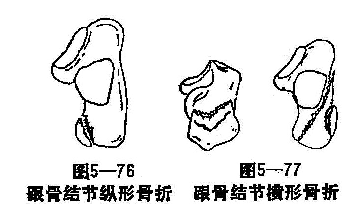
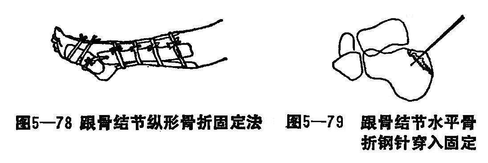

### 十二、跟骨骨折

跟骨又名立骨、踵骨，是最大的一块跗骨，近长方形，呈弓状，分体部和跟结节。体的上前有前、中、后关节面与距骨相应，跟骨结节与体后关节面间联线及体的前、后关节面间联线构成结节关节角，正常约40°。

跟骨骨折，是跗骨骨折中常见之一，且多发生于中年男性。由于跟骨骨折可严重地破坏跟距关节，引起粘连、僵硬、骨刺形成和跟骨畸形愈合，可遗留患足疼痛和运动功能障碍。治疗时着重于功能锻炼，以求功能恢复，不必过分强调骨折的解剖复位和坚强的固定。

〔病因病机〕

跟骨骨折最多见的原因是从高处跌下，足跟着地，暴力垂直从距骨传到跟所造成。按骨折的部位、形态可以分为二类：

1.跟骨体压缩性骨折：从高处跌下，足跟先着地，暴力由距骨冲击跟骨可造成跟骨体压缩骨折。根据挤压的程度的不同，又可分为三度：①轻度，跟骨体压缩骨折，这时结节关节角减少，但骨折线未进入关节面。②中度，跟骨体压缩骨折结节关节角减少，部分跟距关节面塌陷。③重度，跟骨体压缩性骨折，结节关节角明显减少或消失，跟距关节面严重粉碎塌陷。

2.跟骨周围边缘骨折：由高处跌下，足跟后部先着地，造成跟骨结节纵行骨折（图5—76）；足尖先着地，腓肠肌突然收缩使跟腱猛烈向上牵拉，造成跟骨结节横行骨折（图5—77）。以及跟骨前部扭转外力所造成的载距突骨折和跟骨前外侧撕脱骨折等。

〔诊断〕

症状典型，足后跟后有剧烈疼痛、肿胀，局部有瘀血斑和压痛，严重者引起压缩性骨折，出现足底扁平，增宽，外踝下部正常凹陷消失，足内、外翻活动功能完全丧失。X线拍片时，应拍正、侧、轴心位片。由于本骨折常影响脊柱和颅底，所以应特别加以注意检查。

〔治疗〕

1.手法整复及固定：治疗过程中要严格防止后遗症的发生，如跟骨增厚及骨刺形成，足跟变宽，足跟外翻，距下关节或其他跗骨间的外伤性关性炎，跗骨周围粘连等。具体的方法如下：

（1）对未累及关节面的跟骨骨折：无移位的局部敷外伤膏，缠以绷带夹板固定，抬高患肢。骨片有移位者，采用手法复位后固定。

①跟骨结节纵行骨折无移位或轻微者，外敷消肿膏加压包扎，不负重活动3〜4周即可。对移位较大的需在跟骨结节钢针牵引下使骨折复位，术后夹板固定，取跖屈位和屈膝30°位4〜5周。固定的方法：跟骨两侧各置一梯形固定垫，用小腿两侧弧形夹板作超关节固定，前面用一弓形夹板维持患足于跖屈位，小腿后侧弓形板下端抵于跟骨结节之上缘，足底放一平足垫（图5-78）。5周后拔针去固定，练习功能活动。

②跟骨结节水平骨折，需在局麻下自跟骨后中部穿钢针至跟骨外侧骨块前部，并向下搬动，使骨折恢复位和恢复跟骨结节节角（图5—79）。夹板固定4周后拔针。6周去固定。练习足、踝及距下关节活动。

（2）移位不明显的跟骨体压缩骨折：轻度压缩者，仅在两侧对挤压后，包扎固定3〜4周即可下床步行。中度压缩者需手术及牵引复位后，夹板固定，重度压缩者疗效较差。

（3）粉碎性骨折：对结节移位体部粉碎性骨折情况较轻者，行手法复位，夹板固定3〜4周。情况严重者，需手术及牵引才能矫正复位，然后夹板固定6〜8周，方可下床活动。

2.功能锻炼：根据骨折的情况，分别进行适当的功能锻炼。对未累及关节面的，练功宜早些，负重亦宜早；累及关节面的，练功可以晚些，但负重也不宜提前。
