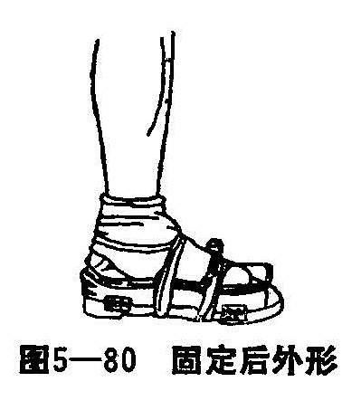

### 十三、跖骨骨折

跖骨又名力骨，每足共28块，正常足有三个主要的足弓：内侧纵弓、外侧纵弓、前跖骨弓。足有三大功能：负重、行走和跑跳。本病的治疗，采用特制木平足鞋，以平足鞋的鞋垫来维持足的纵弓；以木板当中的横突经过两侧木板的挤压，来保持横弓的完整，再利用背侧跖骨间的分骨垫，跗加竹帘的弹性的作用，避免侧方移位。早期练功，以恢复生理弹性。

〔病因病机〕

跖骨骨折多因重物直接打击足背所致，以基底部骨折为多见，骨干骨折次之。直接暴力打击以粉碎型骨折多见，或穿过皮肤开放性骨折，也可有单纯的横断骨折。斜面型多为间接扭转外力造成，移位一般不明显。但少数骨干骨折，因暴力作用也有成角畸形或重迭畸形。跖骨骨折常为多个，单发少见，并多有跖跗关节脱位，以第一及第五趾骨脱位为常见，有时跖骨全部脱位。

〔诊断〕

有明显的受伤史，脚的局部肿胀、疼痛，行走时尤甚，足背肿胀，皮下瘀斑瘀血，局部压痛，纵向挤压加甚。常可触知骨擦音和骨擦感。X线片一般不难诊断。

〔治疗〕

治疗时要注意足三个着力点，复位要求较高。

1.手法复位：无移位的裂纹骨折，不需整复，仅用竹片或硬纸壳包扎固定。有移位的，在麻醉下，患者平卧，一助手固定小腿下部，术者一手将骨折远端对抗拔伸3〜5分钟，一手纠正跖骨成角和重迭，施行挤按提等手法，使骨折整复。若跖骨骨折合并跗跖关节脱位，应先整复脱位，在拔伸牵引下，施行顶推提挤按法使脱位整复，后行整复骨干骨折，整复完成后，用两手掌在跖跗关节外由背跖两侧相对挤按，再将足的内外两侧相对挤按，使完全复位。

2.固定：复位后在维持牵引下，先敷外伤膏，绕绷带顺跖骨间安放分骨垫，用胶布二道固定，安放扇状小竹帘。此帘要求顺跖骨方向，其压力才平均，竹帘放妥后，用二道胶布固定，再用绷带松缠，穿上木板鞋，两侧木板再用布带固定结扎（图5—80）。

目前亦常用石膏固定，对复位失败者也用切开复位法髓内针固定，趾骨牵引。

3.术后处理：术后抬高患肢，作踝关节背伸活动和抬腿屈膝动作，2周后更换外伤膏一次。2周后根据骨折类型及X线片复位满意者，可下床双拐不负重步行。3周后改单拐，4周下去拐，4〜5周左右解除外固定，改换带有平足垫的鞋练习行走。但对合并跖跗关节脱位者，下地步行及解除外固定，应推迟1〜2周。
