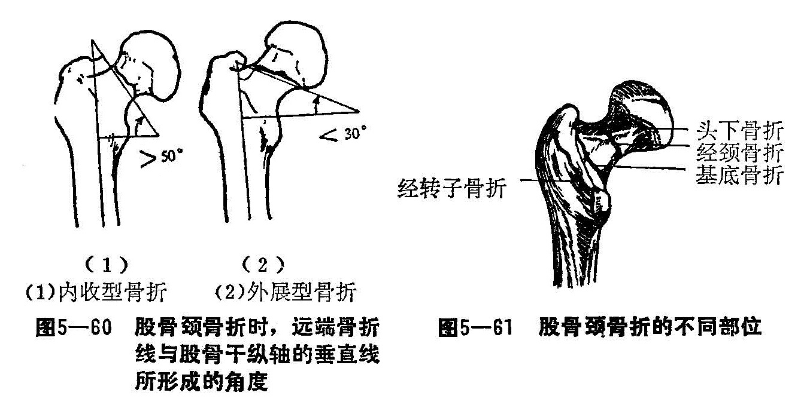
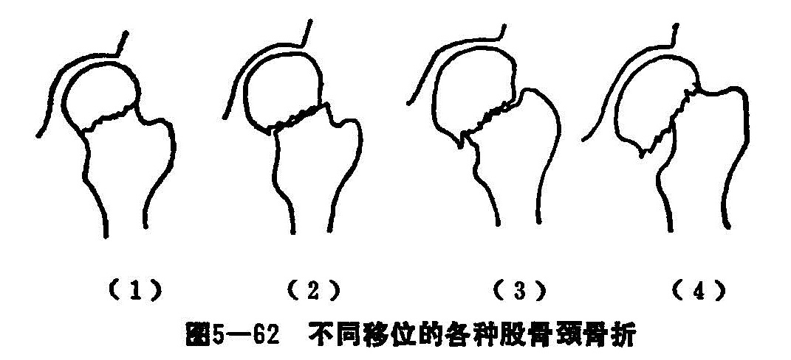

### 三、股骨颈骨折

股骨头、颈又称髀杵俗称胯骨轴。股骨骨折是老年人常见的损伤，女性多于男性。老年人的骨质疏松，不小心滑、跌倒，极易引起骨折，预后亦较差。

股骨颈与股骨干轴线形成一个颈干角，正常范围为110〜140°，平均为127°，儿童可达150°，大于正常为外翻，小于正常为内翻。股骨颈与股骨干不在同一平面，股骨头稍向前倾斜与股骨干的额状面成一个痛度称之为前倾角，幼年时该角较大，随着年龄的增大逐渐减小，至成人约是12～15°。

关节囊起于髋血内缘，大部分止于股骨颈的基底部，其前上方有髂股韧带加强，后上方、内方有坐股韧带加强，仅有后外下方小部份暴露于关节囊之外，所以股骨颈骨折，大多属囊内骨折，少数属囊外骨折。

股骨大转子处附着臀大、中、小和股外侧肌，小转子附着髂腰肌，股骨的内后方有内收肌群附着，由于股骨颈骨折后关节囊与韧带失去轴性的作用，肌肉的收缩使下肢外旋和断端发生剪刀式应力，所以复位和固定较为困难。

股骨头的血液供应，来自三个主要途径：①关节囊支来自旋股内口外侧动脉，是股骨头的最主要供血途径，旋股内侧动脉分成上下干骺端动脉和骺外侧动脉，经关节囊进入股骨头，并在股骨头内互相交通。旋股外侧动脉供应股骨头的4/5～2/3范围，但供血量转旋股内动脉少，故损伤旋股内动脉易引起股骨头坏死。旋股内外侧动脉的分支在股骨颈基底组成一个动脉环。②圆韧带支，供血少只局限于股骨头的凹陷处。③骨干营养动脉一般仅达股骨颈，对股骨颈的血液供应甚少。

〔病因病机〕

多见于60岁以上的老年人，由于骨质疏松，一不小心滑倒，或由床上跌下，或下肢突然用力扭转，或外力撞击，均可引起股骨颈骨折，若发生于青壮年，一般均有严重的外伤史。偶因负重或行走过久，而发生的骨折，称之为疲劳骨折。根据骨折不同情况，分类如下。

1.按骨折的X线片表现分类：

（1）内收骨折：为临床上较常见的骨折，远端骨折线与股骨干轴线的垂线的交角大于50°（图5-60（1）），这是由于肌肉的收缩力影响而发生的剪刀力作用，使骨折远端向上，又因髂腰肌及外旋小肌收缩和下肢的重力的作用，致使下肢外旋位。

（2）外展骨折：这种骨折较为少见。骨折远端骨折线与股骨干轴线的垂线的交角小于30°者（图5—60（2）），即为外展骨折。这种骨折由于体重和肌肉的收缩作用，易呈嵌插状，故骨折易愈合。

2.按骨折部位分类：可分为：①头下骨折。②经颈骨折。③基底部骨折（图5—61）。前两者称为囊内骨折，后者称囊外骨折。头下骨折，由于血液供应量差，极容易造成缺血性股骨头坏死，是三种中最严重的一种经颈骨折，血液供应比头下骨折稍好，但血液供应亦相对差，也易发生骨不连接，预后不良。基底部骨折血供良好，一般愈合图良好。

3.接移位程度分类：可分为：①不完全性骨折；②完全性骨折不移位；③完全性骨折部位移位；④完全性骨折完全移位（图5—62）。

〔诊断〕

多见于老年人，且有外伤史，患侧髋部疼痛，压痛明显，不能活动，有大转子突出和患肢缩短，伤肢外旋畸形，再加X线，不难诊断。但必须注意嵌顿型的患者股骨颈断后尚能走路来就诊，疼痛甚轻，但有下缩短，局部有压痛和叩痛，总有外旋畸形。

〔治疗〕

1.外展（嵌入）型骨折：仰卧硬板床持续皮牵1〜2公斤，纠正外旋畸形，必要时可穿一只丁字鞋，2周后拍片复查，若无移位，可以后用单杖。5个月左右拍片，若有大量的骨痂形成，骨折线模糊，可以弃杖行走。

2.内收型骨折或有移位型：是治疗上较为多见的一种骨折。目前一般早期以手法复位或三刃钉、三根钢针内固定，采取硬膜外麻醉或局部血肿内麻醉，前者效果好，肌肉松弛完全，但对血压影响大，老年人，体弱者不宜用。手法复位法：患者仰卧，助手固定骨盆，一助手顺患肢畸形方向将患肢缓伸直，向远端牵引，以恢复患肢长度，同时纠正重叠，二助手内旋股骨并外展至20〜40°，同时术者用手掌推大转子向内侧，一般可使两骨折面相互对准复位，用皮牵引或骨牵引。经X线片或X线透视，若上述手法不能正确复位，可采取下一步方法：一助手固定骨盆，术者一手放置腘窝，一手扶住踝部，使髋、膝关节均曲至90°，用力往上拔大腿，将髋关节外展20〜30°并在拔伸，外展内旋髋关节的同时，将下肢伸直，如足不再外旋，表示复位成功。按上述方法牵引，并穿一只丁字鞋以保持下肢的中立位，防止伤肢外展、外旋。三个月后可以扶拐下床活动，6个月后弃杖行走。

手术内固定的方法适用于内收型有移位的骨折，陈旧性股骨颈骨折，儿童以及年龄较大的人的股骨颈骨折。对陈旧性的股骨颈骨折国内近来有人采用三刃钉内固定，疗效良好，骨折获得愈合。儿童股骨颈骨折一般均属基底部骨折引起缺血性坏死较成人更易见。因此通常使用钢钉内固定再加以外展夹板固定或穿丁字鞋，对于年龄较大的股骨颈骨折一般因易发股骨头缺血性坏死机会亦大，一般适宜做手术内固定，对70岁以上的高龄患者即使做内固定，但未必有骨折愈合，所以一般在全身情况的允许下，行股骨头置换，三周后即可下床扶杖行走。若全身情况差，应做皮牵引，穿丁字鞋，半卧位，三个月后可以下床扶杖行走。

3.功能锻炼：手法复位或内固定后，可以逐渐作股四头肌的舒缩活动和踝关节的活动，但不能翻身、坐起和盘腿等。X线片检查待有骨折愈合后，方可下床活动，后期辅以手法治疗和熏洗。
