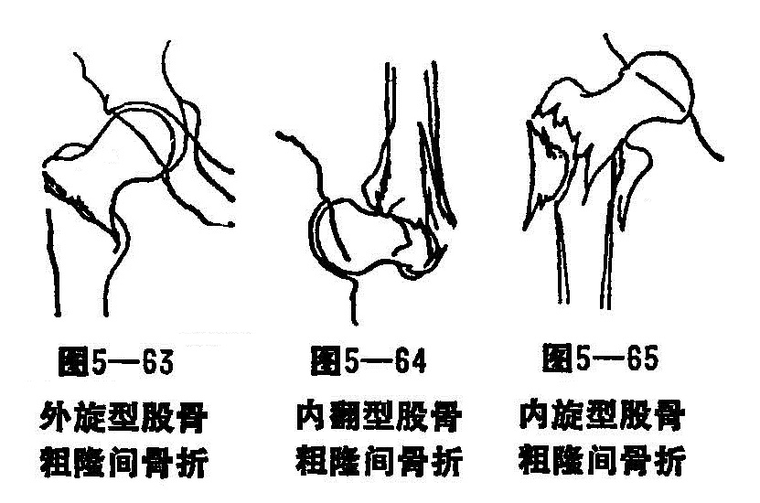
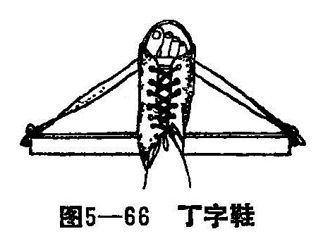

### 四、股骨粗隆部骨折

股骨粗隆部骨折，亦叫未躯骨上骨折。系指股骨颈基底至小粗隆水平以上部位发生的骨折，是老年人常见的骨折。由于粗隆部血液供应丰富，骨折面接触又大，所以一般均能骨折愈合，但易发生髋内翻、畸形愈合，处理过程中，必须加以注意。

〔病因病机〕

老年人均有不同程度的骨质疏松，若过度外展、内旋、内翻或跌倒撞击大粗隆部，可发生骨折。按损伤的原理，一般可分为三型：

1.外旋型骨折：骨折线自小粗隆或小粗隆的稍上、下部位，斜行向外上方与股骨干纵轴相交成较小的锐角，小粗隆可单独撕脱或连同其上下的部分骨皮质一起骨折，成为外旋型股骨粗隆部骨折的一部份，因肌肉收缩和重力的影响使远端后上及外旋移位，但颈干角变化不大（图5—63）。也有少数患者因肢体的内收而发生髋内翻畸形。这种骨折（除严重粉碎者外）一般手法整复、牵引、外展夹板固定后，骨折即不再移位。这是最多见的一种稳定性的骨折。

2.内翻型骨折：这种骨折的部位接近股骨颈的基底部，较外旋型骨折部位高，骨折线由内下方向外上斜行至大粗隆与股骨长轴形成一较大的锐角，内侧骨皮质因受内翻应力的影响，常互相嵌插，小粗隆亦因受暴力的作用，发生类似长骨干蝶形的骨折，颈干角变小（图5-64），因内侧骨皮质受破坏较严重，常遗留髋内翻畸形。

3.内旋型骨折：骨折线由小粗隆与股骨颈基底之间开始由内上斜行向外下达股骨干上端外侧，呈斜形或短螺旋形骨折。小粗隆有时连在远段断端上，也可以发生撕脱骨折，骨折近段因外展外旋肌的牵拉，形成外展外旋畸形（图5—65）。远端因内收肌与腰大肌的强力牵拉，向内和内上移位，形成髋内翻畸形，这种骨折整复后，容易再重迭移位，是一种不稳定性骨折，但不易发生髋内翻。

〔诊断〕

一般症状比较明显，患者不愿坐位和站立、行走。局部疼痛不严重，但髋关节的主动运动或被动活动，均使局部疼痛加剧。患肢缩短内收、外旋畸形，大转子往上移，局部有按压痛和叩痛，且肿胀，皮下瘀斑，有时可触到骨擦感，这种骨折不易与股骨颈骨折相鉴别，需拍X线片，以明确诊断。

〔治疗〕

本病的治疗主要是手法整复和外展固定夹板固定。

1.嵌插或不全性骨折：这种骨折不需手法复位外固定，仅穿丁字鞋（图5—66），及砂袋固定即可。保持患肢外展，足稍内翻或中立位，4〜5周后，复查X线片，骨折稳定，骨痂生长良好，可以在外展夹板的保护下，起床扶杖步行。待骨折愈合后，开始患肢负重。

2.完全骨折部份移位或年龄较大不适合骨牵引：可手法整复后皮牵引，手法前用血肿内麻醉法，助手固定骨盆，术者握住患肢，顺中立位拔伸，待骨折部有向下摩擦重叠矫正后，按骨折类型将患肢置于适当的位置。如外旋骨折应外展内旋；内翻骨折应将远端向内推，患肢外展内旋；内旋骨折患肢保持中立位。复位后X线照片显示满意者，将患肢放在妥马氏架上直膝作皮牵引，牵引重量约2〜4公斤，要防远端向上移位。4〜5周后，改用外展夹板。6〜7周后，在外展夹板的保护下，扶杖下地活动。8周左右，根据骨折愈合情况，改为单拐负重步行。

3.完全骨折移位大：全身情况许可，可做骨牵引。牵引的重量，根据病人的体重、局部肌力强弱而定，一般用4〜6公斤，24小时后X线片检查，整复满意后，维持牵引4〜6周，再拍X线片骨折端稳定，可考虑除去牵引，改用外展夹板固定。5〜6周后，可持双拐步行。8周后，可单拐步行。

4.功能锻炼：固定后不能盘腿和侧卧，在牵引的条件下，常起坐和做股回头肌舒缩和踝关节活动，以及上肢活动。解除牵引后，在外展夹板的保护下，可扶双拐步行。对不稳定的骨折，待骨折临床愈合后，方能逐步负重。
