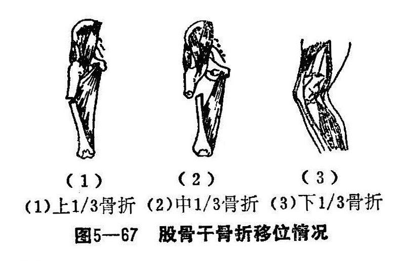
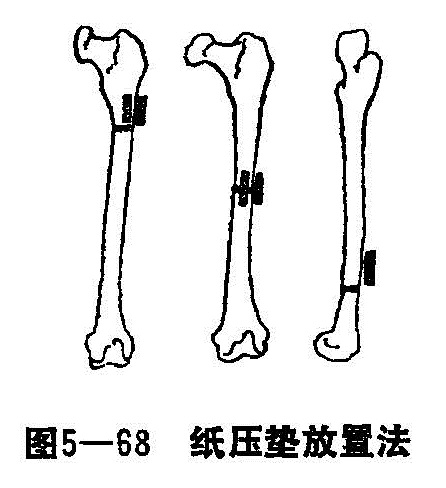
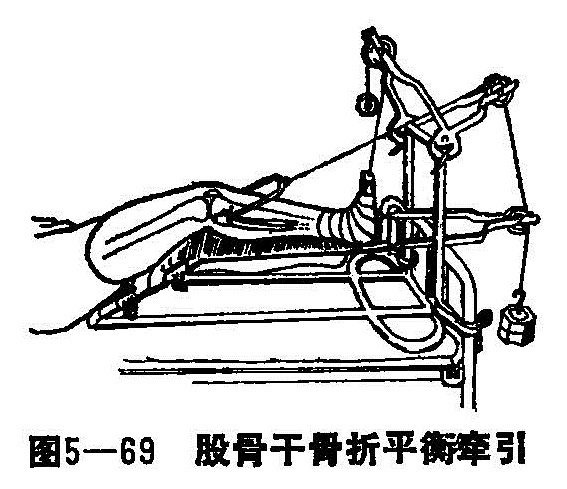

### 五、股骨干骨折

股骨又称髀骨、大腱骨，是人体中最大的管状骨，它可以承受较大的支柱作用。股骨干的皮质很致密，因此骨折的愈合，要较长时间才能恢复正常强度。其表面光滑，在后方有一粗线隆起称股骨嵴，有许多肌肉附着，整复或手术切开复位时，骨嵴是骨折端是否对准的重要标志。股骨的营养血管多由骨嵴进入，手术和手法整复时，应尽量减少损伤。股骨干周围有三群肌肉包围，其中伸肌群最大，屈肌群次之，内收肌群最小。

由于肌内大厚，釆用中西医结合治疗骨折时，除用木板纸压垫包扎固定外，还要短期的骨牵引。股动，静脉在骨干中下1/3交界处穿内收肌孔紧贴股骨干下1/3的后侧，因此下1/3股骨干骨折，最易损伤血管，可造成大量出血，而合并休克。

〔病因病机〕

直接暴力，如重物击伤、车轮辗轧、火器伤等，均可引起股骨的横型或粉碎骨折。间接暴力如从高处跌下、车撞伤、机器绞伤等，可引起斜形或螺旋形骨折。儿童骨皮质柔软，骨折的一侧皮质断裂而对侧皮保持完整，这种骨折称为青枝骨折。

1.股骨上1/3骨折：骨折近段因受髂腰肌、臀肌及其他外旋肌群的影响，有屈曲外展外旋的移位，骨折远段向上后向内移位（图5—67（1））。

2.股骨干中1/3骨折：两骨折端除有重迭畸形外，常随暴力的方向而变化。当两骨折段尚有接触而无重迭时，远段因内收肌的牵拉而向外成角畸形（图5—67（2））。

3.股骨干下1/3骨折：因腓肠肌的牵拉作用，使远端骨折向后倾斜移位，并且可能压迫损伤腘动脉、静脉以及坐骨神经（图5—67（3））。

〔诊断〕

患者都有比较严重的外伤史，并可能有出血性休克，自觉局部疼痛，不愿做髋、膝活动，局部肿胀，可有缩短畸形，活动异常，压痛、叩痛明显，被动运动和主动运动疼痛加甚，有时可触到骨摩擦感和听到骨摩擦音。X线拍片，可明确骨折的部位、类型和移位的情况。注意检查患肢的血液循环和坐骨神经的情况，以排除动脉和神经的损伤。

〔治疗〕

股骨骨折可根据病的年龄、骨折部位、骨折类型和骨折的移位方向的不同，采用不同的治疗方法。

1.手法整复：

（1）上1/3骨折：近端因髂腰肌、臀肌及其他肌肉的牵拉，而呈屈曲、外展、外旋移位。手法开始先抬高患肢，外展并略加外旋以适应近端移位。拔伸牵引消除重迭后，术者一臂放于近骨折段的外前方，另一臂放在远侧骨折段的内后方，同时用力使两臂之间形成一个钳式剪力，迫使骨折对位。对位满意后，牵引稍松，以免过度，用小夹板屈髋外展位固定、牵引。

（2）中1/3骨折：除有重迭外，因受内收肌的牵引，骨折端多向外成角，故复位时患肢应在外展牵拉位，开始时牵拉力较大，当听到骨折端有骨擦音时，牵引力不再加大；术者用双手左右挤夹，直至骨折端摩擦音消失，断端稳定为止，并保持牵引，调整牵引的重量。保持中立位或稍屈髋稍外展位。

（3）下1/3骨折：因骨折远端受膝后方关节囊及腓肠肌的牵拉，一般都向后旋转移位，复位时膝关节屈曲牵引，以放松腓肠肌，向后旋转移位即基本复位。若移位不理想，术者可以用两臂上、下挤夹，挤远端的骨折向前，压近端的骨折向后，骨擦音消失两折端稳定即可复位。并继续稍屈髋中立位维持牵引。

2.固定与牵引：经过上述手法复位后，X透视整复理想，即在大腿周围敷外伤膏，缠好绷带，根据骨折部位放置纸压垫，以防成角畸形。小夹板固定方法：上1/3骨折时，应将纸压垫放在近段断端的前立和外方；中1/3骨折时纸压垫应放在骨折线的外方和前方；下1/3骨折时纸压垫应放在骨折近段端的前方（图5—68）。然后用胶布把纸压垫固定，放置木夹板。外侧板上达股骨大粗隆尖，下至股骨外踝下缘；内侧板分叉向上使内收肌位于分叉之间，下达股骨内踝的内收结节处；前侧板上达腹股沟斜缘，下至髌骨上缘；后侧板上至坐骨结节，下至腘窝，以不妨碍膝屈曲为度。各板放妥后，用4条布带结扎固定，带的松紧度以1公斤的力上下拉动约1厘米为度，木板固定后把大腿置于牵引架上继续牵引。

（1）竹帘固定法或硬纸壳固定法：对无移位或移位很少的新生几股骨骨折，仅用竹帘固定或硬纸壳固定，移位大的可以加拔伸复位即可固定或患肢与健肢绷在一起固定法，2周后可除去固定。

（2）重直悬吊法皮牵：适用于三岁以内的儿童。胶布粘粘在两大腿的内、外侧皮肤上，胶布的近端最低不得低于骨折线下4厘米，用滑车将两腿同时垂直向上吊起，重量以臀部刚离床面为度，健侧的重量应比患侧的重量轻，牵引3周左右即可，牵引过程中注意肢体的血运和肤温及胶布有否脱落等。

（3）平衡牵引：适用于3岁以上的儿童至15岁左右的青少年以及成人的股骨干骨折，可用持续皮牵引或骨牵引，并放在Braun氏架上（图5—69），这种既有复位又兼有固定的作用，在牵引的早期要进行密切的观察，纠正成角缩短，旋转等移位。并有侧方移位可以用小夹板和固定垫进行调整。牵引力与股骨长轴平行，皮牵引时踝关保持90°，开始时的复位重量一般用1/8〜1/7体重，以后根据情况调整维持重量。

（4）悬浮牵引法：适用于成年人。牵引时病人可以自由活动不影响牵力。方法是：将患肢放在妥马氏架上，膝关节屈曲，小腿放在Pearson氏连接架上，妥马氏圈足端和连接架以及胫骨的牵引针均通过滑车系统，系以重量，伤肢和支架一起浮动，并保持牵引力的作用。重量约为体重的1/8〜1/7，7〜10天内复位符合要求后，调整重量为维持量，切忌过度牵引。8周后改皮牵引。

（5）90°—90°—90°牵引法：适用于已感染的开放性骨折，既方便换药和引流，又有利于腘绳肌放松，有利于控制和对合两断端。方法是：在小腿上打石膏管，然后在股骨踝上位或胫骨胫骨结节处作骨牵引，向上作垂直牵引，保持髋、膝、踝关节90°位。牵引的重量约1/8～1/7体重。

3.功能锻炼：麻醉消退以后做股四头肌的舒缩以及踝关节活动。1周后开始锻炼髋膝关节伸屈动作。3周加大伸髋、膝关节活动，4周左右在上述操作下，两手拉横牵引杆可以站立床上。5周后根据临床表现和X线片，骨折段稳定，骨折线模糊有少量骨痂形成，即可解除牵引。6周以后可考虑双拐下床活动，逐渐换单拐。达临床愈合后可弃拐解除外固定。
