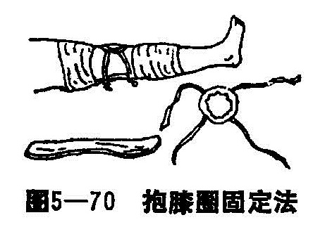

### 六、髌骨骨折

髌骨又称连髌骨、膝盖骨，是人体最大的一个子骨，呈三角形的扁骨，为股四头肌伸膝作用的主要支点。它位于膝的前方，后与股骨髁部面构成髌股关节，下部附着股四头肌韧带松成完整的一个伸膝关节装置，加强行走和跑跳的作用。本病多见于壮年男性。

〔病因病机〕

1.横形骨折：多数是由于间接暴力引起，占髌骨骨折的多数。当患者步行，膝关节微屈时，髌骨正在股骨滑车面的顶点，股四头肌为维持关节的位置正在用力收缩，此时若膝关节因外力而骤然增加屈曲，髌骨可发生横行折断。因此这种骨折，多发生于跳跃运动，由高处落下和失足滑倒时而发生骨折。骨折线经过下1/3部最为常见，经过上1/3或中央部比较少见。下段骨折块多呈粉碎性，髌骨两旁的股四头肌筋膜，关节囊及滑膜亦被横行撕裂。撕裂的程度与肌肉的收缩力成正比，上段被股四头肌牵引向上移位，最多可达2〜3厘米，软组织撕裂严重者，其移位也明显，下段无肌肉牵拉，移位甚少，移位亦轻微。

2.粉碎性骨折：多由于暴力直接作用于髌骨上所致，如踢伤、车撞伤、重物打击伤等。这种骨折移位甚少，关节囊及髌骨旁腱膜多保持完整，但髌骨与其触碰的股骨髁关节面损伤较严重，影响日后的功能。

〔诊断〕

患者伤后即觉膝部疼痛、无力，不能完全伸直膝关节，不能站立，髌骨前面局部有明显的血肿和皮下瘀斑，明显压痛，虽有肿胀，但因髌骨位置浅，仍可触到骨折端，若移位明显可触到骨折间凹沟，骨块可以上、下推动。X线片可以明确骨折的类型和移位的情况，注意边缘骨折须与副髌骨相鉴别。

〔治疗〕

在整复前，应根据病人受伤的原因，肿胀的情况，X线片所见，准备好所需的固定器材，确定整复的步骤。

1.手法整复：首先行股N阻滞淋麻醉或硬膜外或腰麻，抽净关节内的血肿，以利于整复。

髌骨骨折的最大特点是骨折端向上、向下移位，骨折远段只有较短的髌韧带附着，伸展性不大；而骨折近段则附着股四头肌腱，伸展性大，故复位时须用近端去对远端，才能获得整复。患肢伸直位或膝关节微屈160〜170°，术者站于患侧，一手拇中指捏挤远段向上推，并固定；另一手拇中指捏挤近段上缘的内外两角向下推挤，使骨折段接近。经上述手法后，如以手指触摸有不平感，X线透视有前后移位时，一手食指固定向后下陷的一端，一手食指挤按向前突出的一端，使之对齐。最后将骨折远近段端挤紧，用纸压垫，弹性带固定。再作X线透视，若仍有移位，再根据情况施行整复手法。有时骨折之关节面已平坦，而髌骨前面尚有一哆裂缝，亦认为是满意的，隔1〜2日再推挤一次，有时第一次整复，只能达到基本整复，虽然有哆裂缝隙，在用弹性带固定后，可遂步持续对位。

2.固定：

（1）布兜多头弹性带固定法：上述复位后，两拇中指将上下骨折段相对挤按，再将活动木板置于膝关节后，活动板的活动轴正对膝关节活动处，外敷外伤膏，将半月形抱骨垫分别卡于髌骨上下缘，正好是两手推挤的位置。并用两道粘胶固定，再用半月状多头弹性带先固定在远端的抱骨垫上。兜带稍向膝上方伸斜，将5根弹性带分别系于活动板的螺丝鼻上，后再用另一多头弹性带固定在近端的抱骨垫上，此带稍向膝下方偏斜，将5根弹性带分别系于活动板的螺丝鼻上。上下的2〜3条弹性带可在膝侧交叉，松紧度要一致，然后再放上髌前弹性带，此带通过抱骨垫对骨折断端直接产生压力，弹性带过松失去固定的作用，过紧可压伤皮肤，过于偏斜使骨折线裂隙张开或使骨折段向关节内倾斜。

因此弹性带必须松紧度适宜，上下左右用力要均衡，才达到固定的作用。最后用绷带将膝后活动木板绑在大腿上以及小腿上，以免滑动。固定的方法、方向与抱骨垫的位置厚薄、随患肢的胖瘦而有所不同，须灵活掌握运用。

术后抬高患肢，在一周内应透视1〜2次如有移位应及时纠正，每日观察弹性带松紧以及布兜有无移动，有无腓总N受压现象。2周后可做被动活动膝关节，但范围不超过150°，3周后不负重持双拐下床步行。4〜5周收单拐结合X线片，骨折愈合可解除木板，练习膝关节功能，活动度逐渐增大，以病人不痛为度。

（2）棉圈抱膝方法：此法适用于无移位或移位不多容易整复也比较稳定的病人的髌骨骨折，根据髌骨的轮廓大小用绷带做成一个圆圈，缠以棉花，圈上另加布带4根、各长60厘米。整复时患膝伸直，常规消毒抽去膝内积血，注入局麻药，对轻度移位者，用手法轻轻推挤髌骨上下远近端，整复满意后或原来无移位者，敷上外伤膏后上抱膝圈，膝关节后置活动木板，将抱膝圈缠至木板上结扎（图5—70）。第一周透视1～2次，如有移位应及时纠正，每天观察固定带的松紧，固定圈有无移动，若肿胀消退，根据髌骨的大小缩小抱膝器，3～4周后解下棉圈、练习活动。

