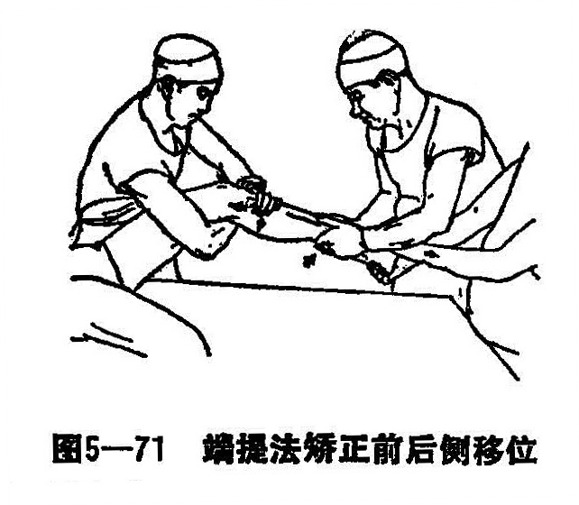
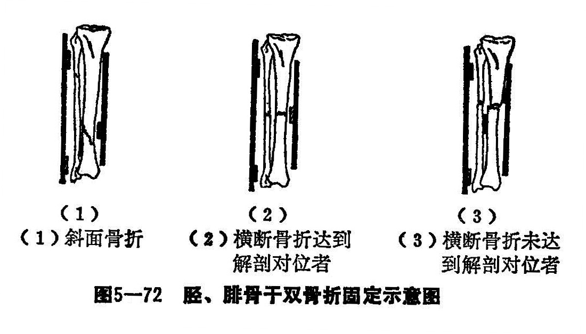

### 九、胫腓骨干双骨折

胫腓骨是膝下踝上小腿骨的总称，俗名膁胫骨，古称臁骨。胫腓骨两骨组成不腿骨，上端胫骨与股骨下端组成膝关节。胫骨下端坐于距骨之上，与腓骨一起组成踝关节（距上关节）胫骨是支承体重的重要骨骼，其干呈三棱形管状骨，中上1/3部横断面呈三角形，下1/3部横断面呈四方形，中下1/3交界处骨质细弱，因此在此易骨折。胫骨前内侧面仅有皮肤覆盖，骨折时断端易穿破皮肤，因此胫骨骨折常为开放性骨折并易引起感染。胫骨略有生理弓形，但膝踝两关节面是互相平行的，这种解剖关系可作为骨折复位是否符合的准则。胫骨的营养动脉，自骨干上.1/3后侧进入，中下1/3骨折后由于血液循环不佳，常发生延迟愈合和不愈合。胫腓骨骨折临床上最常见，儿童尤为多见，其中胫骨干骨折占多数，胫腓骨双骨折次之，腓骨骨折最小。

〔病因病机〕

直接暴力：小腿遭受重物的打击，踢伤、撞伤、砸伤、车轮压伤等直接暴力，均可造成胫腓骨干骨折。其中以横断型骨折和短斜面型居多，也可能有粘碎型。两骨的骨折线常同一平面且常在暴力作用的一侧有一三角形碎骨片。肌肉的牵拉可造成骨折端重迭或侧方移位。重力和外力的作用，可造成骨折远端成角和旋转。

间接暴力：如从高处跌下、扭伤、滑倒也可造成骨折，此时腓骨的骨折线较胫骨的骨折线高。多为斜面、螺旋型。横断、粉碎型少见。与直接暴力一样两骨折段可造成重迭和成角或旋较畸形。按骨折不同情况分类：

1.上1/3骨折：近端因股四头肌和腘绳肌的内则头牵拉常发生向前、向内移位。远端因肢体重力和小腿三头肌的作用，常发生向后、向上移、多有外旋畸形。

2.中下1/3骨折：视暴力方向不同，可向前、向后等移位，又由于重力的影响，远端多有外旋畸形。

3.下1/3骨折：其移位的情况，因伤力的作用方向和大小的不同而不同。但小腿受外前方的暴力多，所以向后向内成角移位畸形居多。

〔诊断〕

伤肢局部疼痛、肿胀、压痛明显，功能丧失，可有骨摩擦音，严重者可见患肢缩短及成角畸形或足外旋，一般在胫骨前面可以摸到骨折端，X线片检查可明确诊断，注意检查足部神经的功能看有无腓总神经的损伤。

〔治疗〕

整复前要结合X线片，了解骨折类型、部位、移位情况，确定整复的步骤，以及骨牵引的指征。如小儿骨膜下骨折及成人无移位骨折；勿需整复：有移位的稳定性骨折如横断型骨折则需手法复位后，用纸压垫和木板固定，如长螺旋型及长斜面型骨折则手法整复后，用纸压垫和木板固定。但此型复位不甚理想。其他不稳定的骨折，如粉碎性骨折，除手法复位和木板、纸压垫固定外，还要跟骨牵引，预防股骨短缩。对开放性骨折应处理伤口，在清创缝合植皮时即行手法整复，跟骨维持牵引。待伤口愈合后，才用纸压垫和木板固定。整复前，先根据移位多少以及肌力强弱等选择麻醉方法，麻醉有效后，才能开始手法整复。

1.手法整复：患者仰卧位，屈膝呈150〜160°，一助手握住大腿下部或腘窝部，另一助手握住足踝部，对抗牵引，3〜5分钟后，矫正重迭或成角畸形。如有前、后侧移位，一助手用肘关节套位患膝腘窝，双手固定近段勿动，术者用两手拇指置于远段前侧，其余四指环抱小腿后侧，在维持牵引下，近段拔伸之助手将近段向后按压，而术者的两手四指端提远段向前使之对位（图5—71）。如仍有左右侧移位，可同时施以挤捺手法，捺近段向外，挤远段向内，一般即可复位。

此时术者向内、外侧作轻轻摇摆，可以使骨折更紧密相接。然后在胫骨前嵴和内侧面触摸，看是否平整，最后在X线透视下复位，外敷外伤膏，上纸压垫和木夹板固定，按上述情况选择是否牵引。

2.固定：在维持牵引下，术者捏住骨折部，先敷以外伤膏，缠上绷带，对斜面骨折在骨折远端的前面（相当于胫腓骨间）放分骨垫，分骨垫上缘平骨折线，然后在骨折部内侧及小腿外侧的上下两端各放一个纸压垫。对横断骨折的已解剖对位者，不用分骨垫。余同斜面骨折加垫。未达到解剖对位者，一般近端易向内，可将内面的纸压垫放在向内移位的骨折端，分骨垫放至远端的前外侧（图5—72）。外用两道胶布固定。再用木板固定。根据骨折的部位的不同木板放置的方法亦不同。

上1/3骨折：膝关节屈曲呈100〜140°位，内外侧板下达内外踝上4厘米，上超过膝关节10厘米，胫骨前嵴两侧放前侧板。靠外面的前侧板正压在分骨垫上。前侧板上平胫骨内外两髁，下达踝上4厘米，后侧板上端超腘窝部，在股骨下端作超膝关节固定。

中1/3骨折：外侧板下平外踝，上达胫骨外髁上缘。内侧板下平内踝，上达胫骨内髁上缘后侧板下端抵于跟骨结节跟缘，上达腘窝下2厘米，以不妨碍膝关节屈曲90°为度，两前侧板下达踝上，上齐胫骨结节。

下1/3骨折：内、外侧板上达胫骨内外髁平面，下达跟骨结节下缘，两前侧板与中1/3骨折同。

按上述放置好木板后，用4条布带，先在中间捆扎两道，后捆扎两端。

下1/3骨折的内外侧板在跟骨结节下缘作超踝关节结扎固定，上1/3骨折内外侧板在股骨下端作超膝关节结扎固定。对不稳定性骨折，除手法整复夹板固定外，还需跟骨牵引配合。其方法是：在局麻和无菌操作下，于伤肢的内踝与跟骨连线的中点处打一细钢针，穿针时跟骨外侧比内侧要高1厘米，约有15°斜角，当垂直牵引时，细钢针的15°斜角即变平行，力量集中传导向上在骨折部。

3.术后处理 抬高患肢，小腿于中立位，膝关节屈曲呈150°〜160°左右，每天观察血运以及布带的松紧度，木板和纸压垫有无移动，应及时纠正。

此外还有用接骨板、螺丝钢钉内固定，也有髓内钢针固定。对陈旧性骨折和畸形愈合不能手法折断以及不愈合者，仍考虑手术治疗。

4.练功：术后即可背屈活动踝关节及股四头肌舒缩活动跟骨牵引者，此时要两手支持起臀部作此活动，以免因牵引力之重量使骨折段向前成角。2周后可以抬腿屈曲膝关节活动，3周后可双拐下床不负重步行。跟骨牵引者，X线片有骨痂形成，骨折稳定。3周可去牵引并在床上再练功1周，方可下床双拐不负重步行，病人不疼痛，自觉有力，即可改用单拐。
