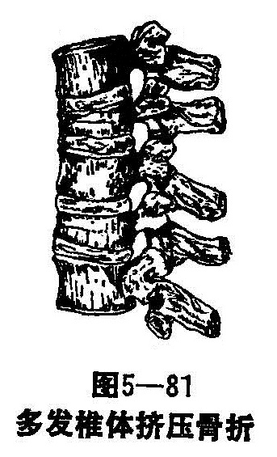
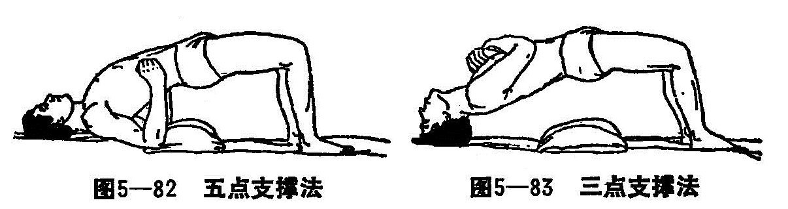

## 第四节　脊柱骨折与脱位

脊柱由23个椎体构成，其中颈椎7个，胸椎12个，腰椎5个，骶椎5个（成人融合成一块），尾椎3〜5个。颈、胸、腰、尾椎的各椎体各分开，骶骨互相融合。正常脊柱有4个生理性弯曲，颈段、腰段向前突，胸段和骶段向后突。

除第1、2颈椎及骶、尾椎外，其余的椎骨结构基本相似。脊椎分开为椎体、椎弓根、椎板、横突、上下关节突和棘突构成。椎弓根都有一个切迹，上下两椎弓根的切迹组成椎间孔，为脊神经通过之处。两侧椎弓根向后相互合并成为椎板和棘突并与椎体的后壁共同构成椎孔，各椎孔连结构成椎管，内为脊髓。

相邻的椎体间以椎间盆相连结，骶椎的椎间盆成年后发生骨化。椎间盆由玻璃样软骨盆、髓核和纤维环构成。

各椎骨间有韧带相连结。椎体前面有前纵韧带，后面为后纵韧带，在各横突间有横突间韧带，各棘突间有棘上韧带和棘间韧带。颈部的棘上韧带特别发达，称项韧带，故上位颈椎不易在皮下触及。椎板间亦有坚强的韧带连结，该韧带略呈黄色，称黄韧带。各韧带在维护关节和脊柱运动功能上极为重要。

脊髓呈圆形，位于第一腰椎下缘平面以上的椎管内。脊髓发出31对脊神经，包括颈神经8对，胸神经12对，腰神经5对，骶神经5对，尾神经1对。在人体的生长发育过程中，脊髓的生长速度比脊柱慢，成人的脊髓末端达第一腰椎的下缘，第二腰椎以下无脊髓，只有马尾神经，所以椎体的节段与脊髓的节段是不相符合的。一般说来，颈部脊髓分节平面等于颈椎数目加1，如第五颈椎平面，脊髓分节应为第6颈神经，上胸段脊髓分节平面相当于胸椎数目加2，下胸段为胸椎数目加3，腰脊髓位于第10〜11胸椎之间，骶尾脊髓位于第12胸椎〜第1腰椎之间。

脊髓有两个扩张部，一个在第3〜7颈椎之间，称颈膨大，上肢的运动和知觉中枢集中于此；另一个在第10胸椎〜第1腰椎之间，称腰膨大，下肢的运动和知觉中枢及膀胱自主排尿中枢集中于此。大脑通过椎体束控制脊髓中枢。椎体束控制上肢脊髓中枢的神经纤维排列在外围，控制下肢脊髓中枢的神经纤维排列在内侧。因此，在颈部脊髓受到外来压迫时，往往先影响上肢，有时上肢发生麻痹，而下肢仍能活动自如。

〔病因病机〕

多由于间接暴力所致。例如自高处坠下，足或臀部先着地，或重物由高处落下，冲击患者头部，肩部或背部，或因翻车、跳水等事故，脊柱受到的冲击、压缩的暴力，均可引起脊柱骨折或脱位。暴力使脊柱骤然过度屈曲所致者，称为屈曲型骨折脱位，临床上占所有脊椎骨折脱位的90%以上，其中大部分（超过70%）发生在胸腰段。由于脊柱在屈曲位所伤，外力集中到一个椎体前部，同时又受到上下椎体的挤压，故该椎体被压缩成楔形。若生理前凸较大的第3〜4腰椎椎体受到平均挤压力时，则可使椎体增宽压成偏平状，如受伤时患者体位倾斜，椎体被挤压部位局限于一侧，可引起椎体一侧挤压较多（图5—81）。暴力强大，椎体可被压成碎块，并向各方向移位，暴力继续作用，则可发生上部脊椎向前或向侧方移位，这种情况提示有椎弓骨折或关节突骨折，脊髓往往遭致损伤。此外，还可合并椎间盘和韧带的损伤。

若患者从高处仰面跌下，背部或腰部冲击在地面的木梁或其他坚硬物体上，使脊柱骤然过度后伸，可发生脊椎骨折脱位，还可能合并前纵韧带、椎板、关节突或棘突骨折，称为伸直型骨折脱位，临床上比较少见，仅限于颈椎和腰椎。此类损伤比较严重，特别是颈椎部，可伴发致命的脊髓损伤。

此外，突然旋转、强力伸屈可引起椎弓峡部骨折，肌肉骤然猛烈收缩可引起棘突骨折，直接暴力打击也可造成横突骨折。

根据骨折的稳定程度，临床上把单纯椎体压缩性骨折，椎体压缩在1/2以下，不合并附件骨折或韧带撕裂、或单纯附件（横突、棘突或椎板）骨折，称为稳定型骨折；骨折伴有脱位，附件骨折或韧带撕裂等，称为不稳定型骨折。椎体压缩性骨折好发于第12胸椎、第1、2腰椎，脱位好发于第1、2、5、6颈椎。

〔诊断〕

脊柱损伤的诊断，要结合临床的检查，进一步分析是否合并有脊髓损伤，以及其部位、性质和程度，对脊髓损伤作出比较准确的诊断。诊断标准如下：

1.骨关节的损伤：

（1）骨折类型：分为屈曲、屈曲旋转、屈曲伸展、伸直等四型。

（2）椎体压缩的程度：侧位X线片上，将伤椎上、下椎体中线高度之和的平均值，分为四等分：Ⅰ度：在1/4以内；Ⅱ度，在1/4-1/2；Ⅲ度：1/2〜3/4；Ⅳ度：为3/4以上。

（3）椎体楔度程度：在侧片X线片上，将椎体前缘高度的平均值分为四等分：I度：在1/4以内；Ⅱ度：1/4〜1/2；Ⅲ度：1/2-3/4；Ⅳ度：为3/4以上。侧方楔度的分度方法与此法相同。

（4）椎体脱位程度：脱位方向以上一椎体为准，将其下缘分为四度。脱位1/4以内者为I度，1/4〜1/2为Ⅱ度，1/2〜3/4为Ⅲ度，脱位3/4以上者Ⅳ度。

2.脊髓的损伤（截瘫指数）：脊髓主要功能分为运动、感觉和括约肌三部分。各种功能丧失程度以0、1、2表示。0为正常，1为部分丧失，2为完全丧失。例如，某一伤员下肢感觉运动完全消失，大小便不能控制，其截瘫指数为6（运动2、感觉2、括约肌2）。根据数字的大小可以推断截瘫的轻重。数字越大损伤越重，反之损伤越轻。

3.截瘫的定位：外伤性截瘫根据感觉、运动和植物神经系统的功能来定位，临床检查时，应注意以下几点：

（1）感觉：完全性截瘫和不完全性截瘫用针尖刺激以检查痛觉范围。

（2）运动：按通用的0〜5级评定主要的肌力，然后综合分析节段性支配区域及其平面。肌电图检查在定位中有相当价值。

（3）膀胱功能：以膀胱功能作为植物神经功能代表，也可同时观察排便和出汗等功能。膀胱的功能按泌尿外科分为四种，即：随意膀胱、反射性膀胱、自主性膀胱、无张力性膀胱。

胸腰椎骨折脱位所引起的脊神经根损伤，多为牵涉性，影响的平面较高。所以在确定损伤平面时，不能只按感觉、运动和植物神经系统的功能来确定。应以骨折平面推算损伤节段数，作为脊髓损伤的部位。

〔治疗〕

（一）颈椎损伤

颈椎损伤约占脊柱损伤的3.8%，以屈曲型损伤为主，其次是颈椎伸展型损伤。颈椎活动度大，关节腔的方向接近水平，易致脱位而损伤脊髓。

颈椎损伤后属于何种类型，在现场难于判断。在这种情况下应使伤员仰卧，颈部固定于中立位，搬运时，将颈部固定。合并颈髓损伤者，应注意保持呼吸道通畅。

1.颈椎骨折：

（1）单纯压缩骨折：这种骨折较少见，多发生于下部颈椎，受伤的椎体被压成楔形，有时有骨块分离，但无脱位，损伤的颈椎后部结构保持完整，故不易出现脊髓压迫症状。单纯颈椎压缩骨折可以牵引复位，复位后带一颈围领（石膏、皮革式均可）固定。至X线显示骨折愈合。

（2）颈椎棘突骨折：这种骨折多发生于颈7胸1，多因背部肌肉强烈收缩所致。但直接暴力也可引起骨折。前者为撕脱性骨折，后者骨块为纵行方向，多与棘突分离。早期石膏围领或皮革围领固定。如不愈合，仍有症状，可将骨片切除。

2.颈椎骨折和脱位：

（1）环椎脱位：由于环枢关节的活动度较大，附着于关节面上的韧带比较松弛，故环枢之间容易脱位。伤员有颈位损伤史，检查是颈部活动受限，并固定在某一位置。双侧环椎脱位，颈部倾向前方。单侧脱位，则面部旋向健侧，颈部向患侧倾斜。X线侧位和开口位摄片可以确定诊断。用颌枕带牵引复位，围领固定3周，然后练习活动。用手法复位治疗环椎脱位应当慎重，要在有经验的医师指导下进行。

（2）枢椎齿状突骨折合并环椎脱位：因交通故或从高处跌下所致，多为前脱位。损伤的情况不同，临床表现也各异。轻者可步行就诊，只感颈部疼痛，转动受限。因枕大神经在环枢两椎板的韧带中穿行，上行至枕部，因此枕部感到疼痛。环椎向前脱位合并齿状穿行，上行至枕部，因此枕部感到疼痛。环椎向前脱位合并齿状突骨折多无脊髓受压症状，而向后脱位可累及脊髓，轻者上肢麻木疼痛，四肢感觉减退，重者因延髓受压迫发生高位截瘫甚至迅速死亡。有的伤员因骨折逐渐移位，晚期才出现脊髓受压症状。前后位和侧位X线片可以确诊。经过颅骨牵引，多数脱位伤员能获得整复。如齿状突骨折处无明显移位，只用围领固定。经上述牵引和石膏固定治疗后仍有再移位时，则考虑行颈椎~1、2、3~融合术。

（3）环椎骨折：垂直的暴力打击于头部并传导至环椎，可致侧块后方的后弓断裂，有时前弓也可断裂。临床表现为颈部肌肉紧张痉挛，活动受限，枕大神经支配区有放射性疼痛，侧位X线片可见骨折和移位。如无脊髓和神经压迫症状，可用颅骨牵引，使骨折复位，然后再用头颈部石膏背心固定。如遗有颈部疼痛，活动受限，可行颈枕融合术。

（4）单纯颈椎脱位：颈部屈曲型损伤可致单纯颈椎脱位。颈~4、5~或颈~5、6~之间是好发部位。常伴有严重颈髓损伤。过伸性颈部损伤可致后脱位，同时前纵韧带撕裂，椎间盘向后突出甚至出现脊髓压迫症状。

颈椎单侧关节绞锁也属于颈椎半脱位。头颈部常处于半屈位或有轻度斜颈，易被误诊为颈部扭伤。X线片可确诊，用颅骨牵引，解除绞锁。

（二）胸腰椎损伤

胸腰椎骨折和脱位，是常见的脊柱损伤。上胸椎因有肋骨固定，活动度小，骨折机会较少。胸10〜腰2骨折最多见。直接暴力所致的胸腰椎伸展型损伤和椎弓骨折也偶有所见。

单纯胸腰椎骨折：

单纯胸腰椎骨折比较多见。轻者有椎体的楔形变，重侧压缩椎体的前缘，可以有碎骨片脱落，严重者则为粉碎性骨折。胸腰段屈曲型骨折，受挤压处多为椎体上缘，还可以见椎间盘破裂脱出、胸腰部肌肉及韧带撕裂、关节突分离、前纵韧带皱折，有时碎骨片脱落或挤于椎旁。

诊断：

伤员从髙处落地双足着地，同时有足跟部疼痛。胸腰段骨折造成的畸形比胸椎明显局部软组织肿胀和压痛，有时皮下有血肿出现。由于椎前出血，后腹膜血肿刺激，肠蠕动减弱而致腹胀。如合并内脏严重损伤，可出现休克。

早期诊断主要依靠典型的受伤史和X线检查。前后位和侧位X线片可显示骨折部位和损伤程度。椎体的压缩、楔变、脱位可用四度分类来说明损伤程度。陈旧性胸腰椎骨折应与脊椎结核鉴别，后者椎体有破坏，椎间隙变窄或消失，并有骨密度变化炎症改变，再结合化验，不难鉴别。伤员无外伤史，局部无症状，胸~1、2~椎体如有轻度楔变，这种改变也常见于正常范围以内。

治疗：

1.功能锻炼疗法；对于单纯胸腰椎骨折的治疗，近年来均采用功能锻炼疗法。专家们认为，胸腰椎骨折后治疗得好坏并不决定于复位，而视其腰背肌锻炼得如何，如背部肌力加强，受伤脊柱可因椎间盘代偿性扩张来调节，弧度仍可保持正常。传统的复位后石膏背心固定法的疗效远不如功能疗法。对粉碎性胸腰椎压缩骨折，用垫枕复位和功能锻炼法，也收到良好的效果。

具体做法：骨折1〜2周以内，局部仍疼痛、肿胀，甚至有血肿，最好通过肌肉的收缩和放松，促进血液回流，使组织肿胀尽快消退，预防肌肉萎缩。先是做仰卧五点背部肌肉锻炼法（图5—82）。次数多少，量力而行，每日练三次。骨折2〜3周后，改为三点背部肌肉锻炼法（图5—83），4周以后行飞燕点水法练功，每日坚持锻炼，逐渐增加运动量。不练功时，需卧硬板床，背部垫枕，以利自动慢性复位，枕头规格长30厘米，宽20厘米，高10〜15厘米，如小于这个规格则起不到复位作用。不稳定型胸腰椎骨折，可在局麻下一次复位。伤员俯卧位，胸和骨盆处垫枕，助手在双腋下及双下肢对抗牵引，畸形处（或疼痛处）加压复位。然后翻身垫枕维持。同时施行功能锻炼。约在2〜3月左右，背肌有力，骨折处压痛消失，可以持拐下地活动，但不应蹲坐或弯腰，并继续加强锻炼，直至去拐活动无任何背部酸痛为止。

在治疗过程中，根据病期可选用中药对症治疗。早期活血化瘀，中期固本培元、强筋健骨。早期亦可外敷药膏，有利于消肿止痛。但有皮肤过敏者不宜使用。

2.外固定疗法：近年来，国内外对胸腰椎骨折椎体压缩小于50%的患者，早期在胸（腰）背支架或塑料紧身背心的保护下，下床活动。对于压缩大于50%以上者，可以外固定3〜4月，早期炼功及下床活动。如果晚期骨折处出现不稳定，应行手术固定。

另外有双踝悬吊法：患者俯卧，两踝部衬上棉垫后用绳缚扎，将两足徐徐吊起，使身体与床面约成45°角，术者可将后突处适当按压，以恢复脊柱轴线，复位后采用垫枕法，适用于屈曲型单纯性胸腰椎压缩性骨折且体格健壮者。

两桌（或三桌）整复法：患者俯卧于高度不同的两桌（或三桌）上，桌面高度相距约25〜30cm，使其上肢和下颌伏于高桌上，下肢自大腿中部以下伏于低桌上，躯干悬于两桌之间，此法可借患者自身重量使骨折复位，复位后应继续用垫枕法。适应症与双踝悬吊法相同，这两种方法可根据伤员及环境条件选用。

（2）胸腰椎骨折脱位合并脊髓和神经损伤：胸腰椎骨折脱位合并截瘫，是脊柱创伤中比较严重的损伤。致伤主要原因为骨折或脱位致椎管内径变窄压迫或切断脊髓；另外，也可为损伤的软组织、椎间盘或碎骨折片挤入椎管造成脊髓的压迫，再次为受压部位缺血坏死和微循环障碍造成脊髓继发性损伤。

胸腰椎段脊髓解剖结构比较特殊，可以出现不同类型的损伤。如为胸11以上的骨折脱位，多引起脊髓横断。腰2以下的骨折脱位属于单纯马尾神经损伤。胸~11~〜腰~1~的骨折脱位，除可能伤及脊髓和圆椎体，周围还有多个脊神经根和马尾神经，故损伤时可出现单纯脊髓损伤，脊髓和神经根部分损伤，脊髓和神经根完全损伤。脊髓比神经根脆弱且容易损伤，单纯受压在4〜6小时内解除，还有恢复希望，如损伤或受压时间延长，则难于恢复。神经根和马尾属于周围神经，即使受压或已切断，可通过减压和修复使其功能有所恢复。

〔诊断〕

通过拍X光照片可明确胸腰椎骨折及脱位情况，及类型、程度可按前述。脊髓损伤的情况则检查伤员的感觉、运动及膀胱功能等来确定诊断。

〔治疗〕

目前对胸腰椎骨折脱位合并截瘫治疗的意见仍有分歧。根据国内外文献记载，有人主张所有的截瘫均行非手术治疗，而另有人主张早期手术，甚至急症手术减压。现将各种疗法分述如下：

1.过度伸展复位法：伤员仰卧硬板床上，背部垫一软垫，每2小时翻身一次。在翻身过程中，可调整垫枕高度，使骨折逐渐得到复位。

2.早期手术疗法：脊柱骨折合并截瘫的非手术疗法与手术疗法的疗效虽然大致相同，但手术减压和复位固定，对某些类型和特定的部位仍然是必要的。如胸腰段脊椎骨折脱位累及腰骶髓、神经根或马尾，应行手术减压和探查。

根据实验研究和临床实践，早期手术和彻底减压，恢复椎管内径，解除压迫等，是非常必要的积极措施，要早期手术治疗，在探查时，即或发现脊髓已横断或已液化，只要在有坚强的内固定保护之下，术后也可以早期功能锻炼。

3.合并症的防治和护理：外伤性截瘫的合并症主要是长期卧床所致。其中以褥疮和泌尿系感染最易发生，因此，护理工作非常重要。

（1）褥疮：应强调以防为主。硬板床上铺有平整而厚软的垫褥，患者皮肤和床单要保持干燥、清洁，防止粪便污染，若已污染要及时更换床单，并用温水洗净皮肤，骨突部位如骶部、股骨粗隆、足跟、双膝内侧的皮肤，易因受压而发生缺血坏死，故应该用气垫软枕或棉圈保护。要勤翻身，一般每2小时一次。白天对褥疮好发部位要在翻身后擦红花酒精（或50%酒精），干后扑上爽身粉或滑石粉。可改善局部血液循环，增强皮肤抵抗力。

如已发生褥疮，应积极处理，局部可放拔毒生肌膏或象皮生肌膏等药。并要勤变换体位，不使疮面受压，若继发感染，要加用抗菌素。褥疮较大时，应输液和少量多次输血，加强营养，待全身情况改善后，施行植皮术。

（2）泌尿系感染：住院后，应留置导尿管，导尿管用无菌橡皮管接床边消毒瓶，夹住橡皮管，每4小时开放一次，每周换尿管一次。换导尿管时先排空膀胱，少饮水，最好让尿道有6〜7小时休息，当膀胱有明显膨胀时再放入导尿管。每次放夹排尿时应鼓励患者使用腹压或作下腹按摩，逐步训练建立自动膀胱，形成反射性排尿。一旦这种反射建立，则可去除导管行自动排尿试验。如果排空良好，则可去除留置导管。若残余尿多或有尿路感染出现，仍需留导尿管，继续进行训练。

如发生尿路感染，应积极处理，鼓励患者大量饮水，每日约饮2500〜3000毫升左右，若不能饮足，宜静脉补足。有留置导尿管者应持续开放引流。尿量每日不应少于1500毫升。同时每日用1/4000呋喃西林液冲洗膀胱1〜2次，保持尿路通畅，尽快控制感染。

（3）便秘：内服麻仁丸或双醋酚汀。亦可用生理盐水或肥皂水灌肠，每3天一次，逐渐训能自动排便。如粪块积聚，灌肠仍不能排便时，可戴手套，手指涂润滑油挖粪块。

（4）肺炎：长期卧床易引起坠积性肺炎，原因是一方面机体抵抗力差，二是肺活量减少，排痰不畅等。要经常翻身、拍背，鼓励患者排痰（咳痰），给予化痰止咳、消炎等药物。

功能锻炼：为了使患者早日康复，努力恢复肢体的功能，并为下地活动准备条件，应尽早鼓励患者开始肌肉锻炼。对于瘫痪的肢体及关节，亦应早期做按摩和被动活动，并尽可能要达到正常活动范围，以防挛缩和畸形。按摩手法应轻柔，不可用力过猛。早期功能锻炼还可预防呼吸系统、泌尿系统的并发症。

早期（伤后数天）即开始锻炼上肢肌力，可手拉弹簧、举哑铃等；其他关节作被动伸屈活动；急性期以后，练习抓住床上支架作坐起、翻身、坐轮椅等活动；后期练习双杠法、推车法、然后扶双拐、单拐，逐渐能生活自理及到户外活动。