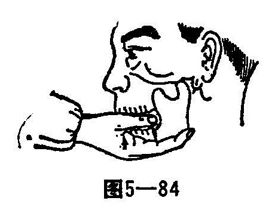

### 一、颞颌关节脱位

颞颌关节由颞骨的下颌窝和关节结节与下颌骨的关节突构成，左右各一关节。

在颞颌关节的关节腔内有一软骨盘，软骨盘将关节划分为上下两部，关节上部控制下颌骨前进，后退，关节下部使嘴张开和闭合。

关节囊的前壁比较松弛，也没有韧带加强，在大力张口时，下颌骨的关节突已滑到颞骨的关节结节处，故容易造成下颌骨向前方脱臼。

〔病因病机〕

张口过大，打呵欠，大笑或呕吐时，由于翼外肌骤然强烈收缩，使下颌骨的关节突向前滑动。处于不稳定的位置而发生脱位。

〔诊断〕

1.双侧脱位：双侧脱位时，下颌松垂，突向前方，口不能闭，不能说话和咀嚼，口涎不断流出。两侧关节处凹陷，托下颌时上下牙齿不能闭合。

2.单侧脱位：单侧脱位时，下颌骨突向健侧，患侧较健侧低，口部外形不对称。能说话，但不清晰。健侧关节的解剖关节正常；患侧关节处凹进，可在原正常位置的前方摸到下颌骨的关节突。

〔治疗〕

1.双侧脱位的复位法：患者头靠墙而坐，医者立于患者前方，两手拇指裹以纱布伸入患者口腔，分别按在下颌骨两侧的下臼齿上，向下用劲；其余四指在口外将下颌骨向上托起，即可复位（图5—84）。复位后，口即能闭，此时医者应速将两拇指向两旁移至臼齿与颊部之间或收至口外，以防患者骤然闭口将拇指咬伤。

2.单侧脱位的复位法：术者两拇指分别置于惠者下颌骨两侧的下臼齿上方，患侧的拇指用力下压，健侧的拇指轻轻扶住，进行复位。复位后，用绷带将下颌托起。1〜2周内不应张大口腔，以待破裂的关节囊愈合。
