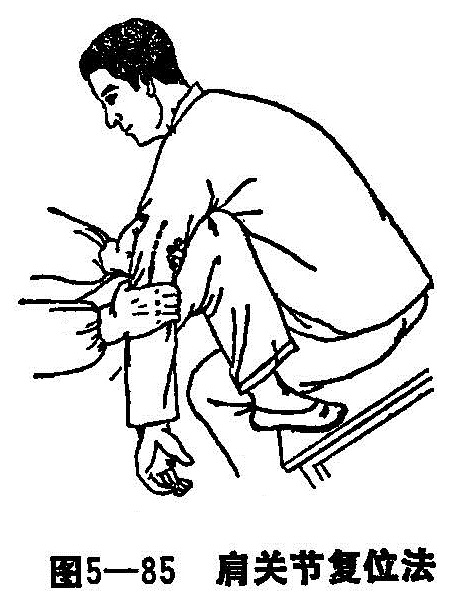

### 二、肩关节脱位

肩关节脱位比较多见。因肱骨头大，肩胛骨关节盂浅小，关节囊松弛，关节囊的下方缺少韧带和肌肉的保护，而肩关节又是人体运动范围最大的关节，因此当遭受外伤时，肱骨头很容易自关节的前下部穿破关节囊而发生脱位。肩关节脱位，按肱骨头位置可分为前脱位、盂下脱位和后脱位三种，以前脱位最多见。临床所见的喙突下脱位和锁骨下脱位均属前脱位类型。

〔病因病机〕

前脱位发生于上肢外展，后伸而跌倒时手或肘着地。后脱位系在上肢向前屈曲并内收时跌倒，手或肘着地所致，机理与前脱位相反。亦可因直接暴力所致。

肩关节前脱位时，有时由于大结节与肩胛盂前下缘相撞，造成大结节撕脱骨折，约占肩关节脱位的1/3。骨折片大小不一，有的可不分离，有的则完全分离，被冈上肌拉向内上方。腋神经有时因牵拉或被肱骨头压迫，而发生暂时性损伤，引起三角肌麻痹或肩部感觉消失，一般都能自行恢复。

〔诊断〕

肩部疼痛与肩关节功能障碍，用健手托住伤肢前臂，肩部外形呈“方肩”畸形。触诊时有肩峰下空虚感，在腋下，喙突下或锁骨下可摸到移位的肱骨头。将伤肢手掌放于健侧肩部，其肘关节内侧不能靠贴胸壁，如肘关节靠贴胸壁，则伤肢手掌不能触及健侧肩部。X线检查可以了解脱位类型，或有无合并骨折。

〔治疗〕

肩关节脱位后立即来诊治者可不用麻醉，或仅予吗啡10毫克皮下注射，或杜冷丁100毫克肌肉注射。在伤后几小时，可采用针刺麻醉。若肩峰下脱位已数日，由于脱位关节周围的肌肉挛缩，应考虑用全身麻醉。

1.手法整复：

（1）牵引手压法：患者取坐位，助手由健侧环抱伤肩腋下，另一助手握住伤肢前臂部由轻而重，向前下方作牵引。以后逐渐转为内收内旋位，在牵引与反牵引的同时，术者立于伤肩外侧，二手大拇指压住肩峰，两手其余四指安放于腋下，将肱骨头向外上方托起，即可复位（图5-85）。此法安全易行，适用于各种类型的肩关节脱位，是临床上最常用的手法复位法。

（2）牵引足蹬法：病员仰卧，术者二手握住伤肢腕部，外展60〜70°，将一足置于腋下（脱去鞋子，左肩关节脱位用左足，右侧用右足），逐渐用力向下牵引外旋，同时足跟用力略向外顶腋窝，并将伤肢在继续牵引下过度内收，此时即以足跟为支点，将肱骨头挤入关节盂内。

（3）椅背复位法：将伤侧腋窝跨于一衬垫好的椅背上，然后屈曲肘关节，沿上臂纵轴方向牵引，直至复位成功。

2.固定方法：肩关节复位后，必须给予固定，否则日后可引起习惯性脱位。固定方法为：

（1）放棉垫于伤侧腋下。

（2）用绷带围绕上臂与胸壁。

（3）前臂用三角巾悬吊。

固定2〜3周后拆除。在固定期间可作肘关节，腕关节与手指活动，拆除固定后，肩关节要作自动活动锻炼，切忌作强力的被动牵伸活动，防止发生外伤性骨化性肌炎。
