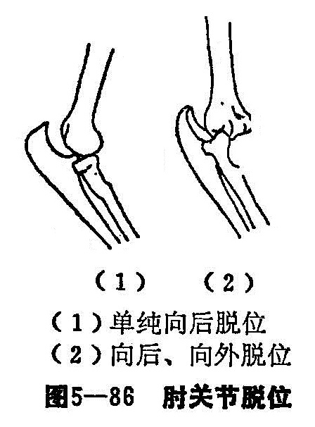
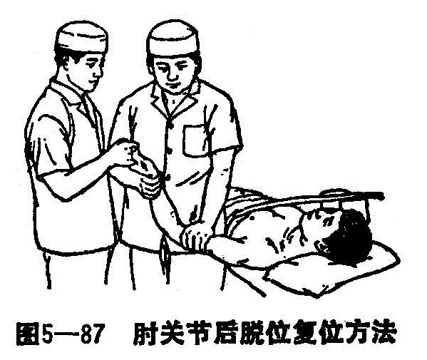

### 三、肘关节脱位

肘关节是屈戍关节，由三个关节（肱尺关节，肱桡关节和上尺桡关节）组成，共有一个关节囊。肱尺关节是肘关节的主要活动部分。肘关节囊的前后部松弛，后方较前方薄弱，两侧部紧张，坚厚，有尺侧副韧带，桡侧副韧带和桡骨环状韧带加强；关节后面的尺骨鹰嘴凸出，前面的冠突不显著，故肘关节后脱位较为多见，而前脱位必伴有尺骨鹰嘴部骨折。

〔病因病机〕

肘关节后脱位最为常见，极少发生前脱位。肘关节后脱位，多因间接暴力所致，跌倒时上肢外展，肘关节过度伸直位，前臂旋后，手掌着地，此时暴力向上传导，即可将关节囊后侧方撕裂，造成肘关节后脱位。由于环状韧带和骨间膜将足、桡骨比较牢固地束缚在一起，所以通常前臂两骨均向背侧移位。

肘关节脱位的绝大部分是单纯的向后脱位，但尚有一小部分是属于一些少见的类型，其中以向后外脱位较为多见（图5—86）。因为跌倒时，以手撑地，前臂处于旋前位时，暴力向上传导，除可造成肘关节向后脱位外，也可以造成肘关节向后、向外脱位。当前臂向后向外移位的同时，肱骨内上髁也可以撕脱，有时尺骨喙突也可发生骨折。

〔诊断〕

受伤后肘部肿胀，剧痛，肘部功能障碍，弹性固定在120°左右半伸位，尺骨鹰嘴明显向后突出。要注意与肱骨髁上骨折相区别，触摸肘部骨性标志。肱骨髁上骨折时，肘三角关系正常，在肘关节后脱位时，肘三角正常关系消失。正常情况下在肘关节外侧面触诊可摸得肱骨外上髁比桡骨头稍突出一些。如果摸得桡骨头和肱骨外上髁相平，或前者反而更为突出，即应注意肘关节是否有向外脱位的可能，须仔细观察X线片，以免漏诊。

〔治疗〕

1.手法整复：

（1）肘关节后脱位复位法：患者仰卧或取坐位，肩关节外展。助手握住伤肢手部，术者一手握住上臂远段前侧方，固定肱骨作对抗牵引，另一手握住前臂远段，与助手同时顺肘关节原有畸形的方向进行牵引（图5—87），即可听到复位的滑动声，检查肘部骨性志时，肘三角正常关系已恢复。做手力牵引时，应顺肘关节原有畸形方向进行牵引，不可在过伸位或屈曲成直角进行牵引，否则可增加肱前肌或肱三头肌肌纤维的损伤。

（2，肘关节向后、向外脱位复位法：肘关节向后、向外脱位时，除关节两侧的韧带撕裂外，关节囊和其周围的软组织常被嵌于关节内，因而采用上述单纯的牵引方法，不易达到完全复位的目的。复位的方法，患者仰卧，在麻醉下先用错对捺正手法整复向外侧的脱位，使其转变为单纯的向后脱位，再采用上述牵引方法，就易于使复位完全成功。复位完成后，须仔细触摸肘部骨性标志，观察肘后部肘三角正常关系以及肘外侧部桡骨头与肱骨外上髁的正常关系是否已恢复，并须过细阅读正、侧位X线片，观察复位是否确已成功。若在复位前未过细触诊肘部骨性标志及阅读X线片（特别是正位X线片），只见到一般多见的明显的向后脱位，而未注意到同时还合并有向外侧脱位，因而复位时仅采用牵引法，虽说也可听到滑动声响，肘部明显的尺骨鹰嘴向后突出的畸形也已消失，侧位X线片上也可显示已复位，但事实上这只过是一个假象。如果在这种情况下即将肘关节固定于90°功能位置，则待3〜4周拆除外固定后，经过后续治疗，伤员肘关节活动功能未能恢复，到这时再摄正、侧位X线片，方才发现肘关节向外脱位已漏诊与漏治，以致形成了陈旧性肘关节向外脱位。这时，用手法复位已较困难。

2.固定方法：用上肢直角托板固定肘关节于屈曲90°位置，并在上臂与前臂之间加“8”字形绷带包扎，防止肘关节伸展活动（上肢直角托板规格同肱骨髁上骨折的后侧夹板）。

3.术后处理及功能锻炼：

（1）注意手部血液循环，抬高伤肢。

（2）外固定4周。

（3）术后应作上臂及前臂肌肉收缩活动，腕部及手指伸屈，以及肩部各种活动等。

（4）拆除夹板后应逐渐作肘关节的主动伸屈活动，并用舒筋汤熏洗，切勿作强力的被动牵伸活动，以免产生损伤性骨化，影响关节功能恢复。
