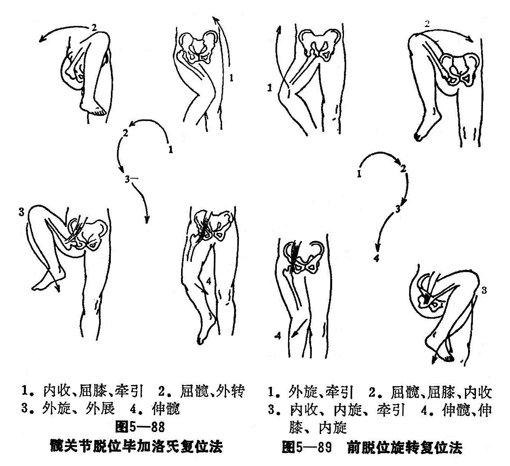

### 五、髋关节脱位

髋关节是人体最稳定的关节，由股骨头和髋臼组成。髋臼深而大，边缘有一层环状纤维软骨，围绕其上方、前方和后方，能容纳整个股骨头，使之不易脱出。髋臼下缘较浅，有一切迹，有一横韧带填于其上。髋臼底为骨盆外侧壁，有一粗糙面，有圆韧带附着，通过圆韧带与股骨头相连。髋关节所以稳定，除此之外，还有强有力的关节囊和韧带，前面有髂股韧带最坚韧，后方有耻骨关节囊韧带和坐骨关节囊韧带，均较前者薄弱。因此，髋关节脱位多由强大的间接暴力所致。以后脱位最多见，前脱位和中心脱位少见。

〔病因病机〕

髋关节后脱位，多由间接暴力引起。在髋关节屈曲90°时，股骨在内收内旋位，股骨头易受杠杆的作用离开髋臼，如膝受到由前向后的冲击外伤，即可造成后脱位。前脱位因髋关节强度外展，大粗隆顶端与髋臼上缘接触，伤力再使肢体外旋，股骨头即突破前关节囊而形成脱位。中心脱位是外力作用于大粗隆，而将髋臼底造成骨折，外力继续作用，股骨头突入臼底，形成为中心性脱位。

〔诊断〕

髋部均有肿胀，疼痛和功能障碍，但根据脱位部位不同，临床症状亦有不同，其不同体征见下表。X线照片，可明确诊断。

髋脱位症状表

| 部位    项目 |        外形        | 肢体长度 |     股骨头     |     髂坐线     |
| :----------: | :----------------: | :------: | :------------: | :------------: |
|    后脱位    | 髋关节内收骨旋屈曲 |   短缩   |    臀部摸到    | 大粗隆起过此线 |
|    前脱位    | 髋关节外展外旋屈曲 |   增长   | 腹股沟附近摸到 | 大粗隆低过此线 |
|   中心脱位   |     无明显改变     |  无改变  |     摸不到     | 大粗隆不易触及 |

〔合并症〕

1.髋关节脱位可合并髋臼、股骨头和股骨干骨折：有股骨干骨折者，可先将骨干骨折开放复位内固定，然后手法整复髋脱位。

2.神经损伤：后脱位可挫伤坐骨神经，前脱位可挫伤闭孔神经，所产生的麻痹均可逐步恢复。后脱位复位困难时，要考虑坐骨神经有被夹在髋臼和股骨颈之间的可能，应行开放复位。

3.无菌性坏死：股骨头无菌性坏死，是髋关节脱位的晚期合并症。由于关节囊、圆韧带断裂，使内骺和外骺动脉也可能受到不同程度的损伤，使股骨头血运不足而造成。采用措施无效，可发展为严重的创伤性关节炎。

4.创伤性关节炎：是晚期合并症之一，因复位后处理不当，可以使之发生或提前发生。故在复位后2〜3年内，患者应尽量避免负重过多及步行和站立过久的工作，可以减少或推迟创伤性关节炎的发生。

〔治疗〕

新鲜髋关节脱位，应在腰麻或用2.5%硫喷妥钠20毫升，加弗来西德40—80毫克，静脉麻醉下，进行手法复位。若有髋臼大片骨折，碎片夹在股骨头和髋臼间等合并症时，则应采用手术切开复位术。其复位手法很多，我们常用的复位方法如下：

1.后脱位整复手法：患者仰卧位，助手两手按压髂嵴以固定骨盆。术者将患肢徐徐屈髋屈膝至90°位，一手前臂绕过腘窝向上牵拉，一手按住小腿上端下压，使股骨头向前移位接近髋臼，在此牵引下，内收旋转大腿多能使复位成功，此即阿力斯复位法。术者亦可骑跨于患小腿上，双臂上提腘窝进行整复，若仍不能成功，可在牵引下使髋膝关节极度屈曲，并内收旋转股骨，同时助手二可向前顶推大粗隆，即能取得复位的成功，此即毕加洛氏复位法（图5—88）。

2.前脱位整复手法：患者仰卧位，一助手扶按髂嵴把住骨盆，二助手双手环抱膝关节在屈膝90°，髋外展外旋姿势下进行牵引，在牵引中加大外展、外旋和髋关节屈曲，使股骨头离开耻骨横枝和闭孔，术者双手在股骨上份的鼠蹊韧带下，将股骨向外及下方按压，将股骨头推入髋臼，使复位成功（图5—89）。

3.中心脱位的治疗：中心脱位不主张快速人力手法整复，因为复位的目的不仅整复股骨头脱位，而且要整复髋臼底的粉碎骨折片的移位，故以采用持续骨牵引为好。方法：健肢用裤型石膏固定，患肢用股骨髁上牵引，重量为6〜12公斤，应根据具体情况调整。在髋关节外展30°位进行牵引，应在2〜3天使脱位复位。再改用4〜6公斤的维持重量牵引，至8〜12周，移除牵引，逐渐锻炼髋关节活动，负重要晚一点，以减轻和推迟创伤性关节炎的发生。

4.复位后处理：复位后，患肢用皮肤牵引，或石膏裤固定在轻度外展位。前脱位，则应避免在外展位固定。牵引及固定时间3周，即可扶双拐下地活动，3月后才能渐次负重活动，经X线摄片证明股骨头血运良好，才能弃拐步行。

合并髋臼边缘骨折，一般复位后骨折片亦能复位。若不能复位，骨片应行开放复位内固定；骨片小，可以不处理；骨片进入关节，应用手法将骨片挤出，不成功应用手术摘除。复位后，可以用石膏裤固定3〜6周。

5.陈旧性髋关节脱位：脱位超过3周，即为陈旧性脱位。脱位超过3个月后，髋关节周围软组织均已愈合，手法复位很难成功。我们曾对脱位6周的老年患者复位成功，超过此期限者，还未取得成功。在青壮年脱位3〜4周后，复位即很困难，不可勉强用暴力复位，以免造成股骨颈骨折。尤以软组织内有钙化者，开放复位都很困难。在手法复位前，应先行骨牵引，将股骨头拉至髋臼平面，再按总论叙述的方法解除粘连，然后按新鲜脱位复位手法复位。不能成功者，则开放复位。
