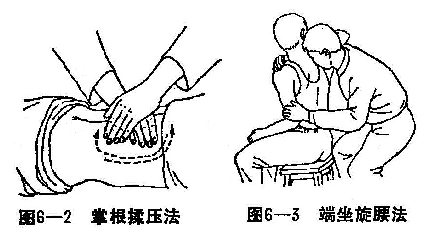
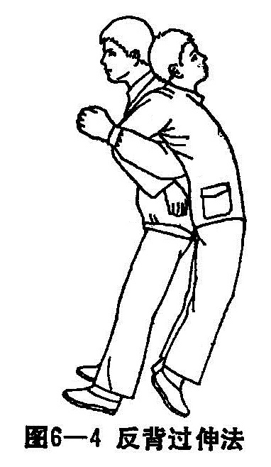

### 五、腰椎后小关节紊乱症

腰椎后小关节紊乱症，常有局部肌肉痉挛，严重者可致腰部功能障碍。

〔病因病机〕

引起腰椎后小关节紊乱的原因，多因外伤或腰部扭伤，使腰椎后小关节错缝，以至腰部肌肉痉挛，两侧失去平衡，当骨膜被嵌入关节面之间时刺激骨膜，常引起严重的腰腿痛症状。

〔诊断〕

患者有外伤史，损伤的腰部一侧，疼痛非常曲显。任何加重挤压或嵌顿滑膜动作，都会引起腰部疼痛。检查病员棘突可见明显偏歪，腰部相应区域压痛，部位多在腰4、5或腰5骶1之间，腰部后伸严重受限。

〔治疗〕

1.手法治疗：

（1）掌根按揉法：病人俯卧位，医者立于病员左侧，用右手拇指或掌根部，按揉腰部棘突两旁。按揉时由上而下，由健侧到患侧，往返重复8〜12次，然后两手重叠，用掌根揉压腰部两侧（图6—2）。

（2）端坐旋腰法：病员端坐椅上，两腿分开，面向椅背，两手放于靠背上。术者立于病员背后，右手上臂和肘部置于病人右腋下，前臂手腕绕过左肩上方，手掌按于颈背部，左手拇指背前端顶住偏向右侧的棘突。然后两手配合，右手向左方旋转，左手拇指用力向左前上方推动。重复操作2〜3遍。如手法正确，可在拇指下感觉到棘突复位的响声。最后用双手拇指在扶正的棘突两侧和棘上韧带处，作上下挤压、推按，可使棘上韧带和棘间韧带理顺复位（图6—3）。

（3）反背过伸法：病人站立，腰部尽量挺直。术者与病员背靠背，用两肘弯挽位病人两臂之肘弯，向上慢慢地将病员背起。术者两下肢膝关节屈曲，使骶尾部抵于病人的骶尾部，然后嘱病人放松全身肌肉。术者以骶尾部抵住病人下腰之患处，两下肢膝关节一伸一屈，用力震动15〜20次，再向左右摇摆3〜5次，重复2〜3遍（图6—4）。

2.药物治疗：内服活血丸、补筋丸、外敷消瘀膏、舒筋膏。

3.功能锻炼：仰卧时可屈双膝，足踏床面使腰后伸离床练习腰背肌肉，俯卧时可将头足抬离床面，使腰后伸以练腰肌。
