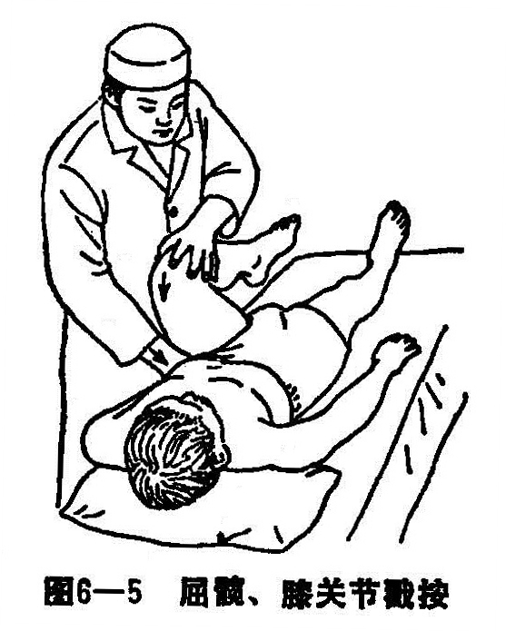

### 二、闪髋症

闪髋症是儿童的一种特有性损伤，所以临床又称小儿髋部伤筋，或髋部损伤。发病年龄5〜10岁最多见，尤其是男孩。

〔病因病机〕

如摔跤、跳绳、跳皮筋、踢球、踢毽，由高坠下、赛跑、练腿等原因，使下肢突然外展和内收，导致髋部肌肉撕裂伤。肌肉损伤后可因疼痛的刺激而痉挛，痉挛又可引起疼痛，互为因果痉挛不易解除。内收肌痉挛时，可牵骨盆向健侧倾斜，患肢相对变短。外展肌群痉挛时，可牵骨盆向患侧倾斜，患腿相对变长。不论患腿变长或变短，可使股骨头在髋臼内处于非正常位置。长期位置不正，则圆韧带便能受到反复捻挫和挤压出现水肿，圆韧带的供血受到障碍。如股骨头长期供血不全，则出现缺血性坏死。小儿的股骨头无菌性坏死是否与此有关，临床应加注意。

〔诊断〕

有受伤史，但部份患儿不能主诉原因亦有之。症见髋关节痛，屈髋痛重，跛行。检查可见骨盆倾斜，两腿长短不齐。如用皮尺按骨性标志测量，两腿是等长，故亦称“假性延长和假性缩短”。两侧腹股沟不对称，膝、跟不在同一水平位。患侧腹股沟压痛，腿短者内收肌紧张，屈髋外展外旋受限且引起剧烈疼痛。腿长者臀部肌肉紧张，屈髋内收内旋受限且有剧烈疼痛。腿长者走路呈拖拉步态，腿短者跛行。初时X线片上无变化。此时则也可诊断为股骨头无菌性坏死、股骨头骨软骨炎。

〔治疗〕

1.手法治疗：患儿仰卧床上，医者站在伤侧，将髋、膝关节屈曲，使膝靠近胸部，足跟接近臀部，并用顶腹股沟部之手由膝向上到腹股沟捋顺之，同时将伤肢拨直（图6—5），接着一手握住小腿下端，另一手扶着膝部，将伤肢拨直，环转摇晃伤肢的髋关节6〜7次，最后患者转侧卧位，患肢在上，将伤肢尽量屈曲，使膝靠近胸部，足跟接近臀部，另一手在髋部用力向下按压。

2.固定疗法：新伤手法后不用固定，只在3〜5天内不让患者站立走路即可防止复发。若损伤超过一个月以上者，手法后将两腿用宽布带固定在一起，勿使两腿分开活动，在两脚并拢的情况下也可走路，一般固定2〜3周。

3.药物治疗：新伤一般不必用药，陈伤者可内服补筋丸，或活络丸等。外用海桐皮汤局部热敷。
