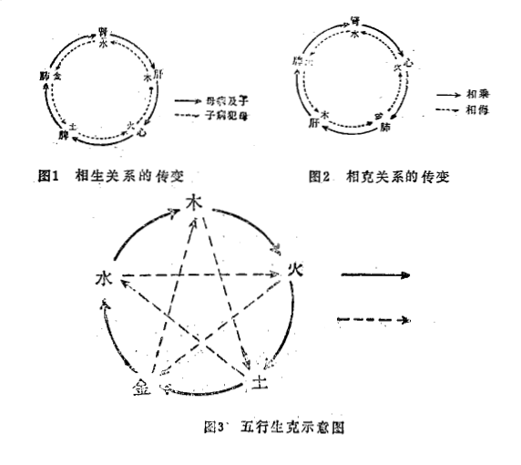

#### （二）五行的相互关系*

五行不是各自孤立、静止的，而是相互联系的统一的整体。在五行之间的相互关系中，最基本的原则是相生与相克。正是这种相生与相克，才维持了五行这一整体的相对协调平衡状态。无论是缺少相生或相克（即依存，制约），还是这种相生相克不能维持正常水平（太过或不及），五者之间的协调平衡都将遭到破坏，在自然界就要发生灾害，在人体就要发生疾病。而生克的太过与不及，则称之为乘侮胜复，正如张景岳所说：“造化之几（机），不可无生，亦不可无制，无生则发育无由，无制则亢而为害。生克循环，运行不息，而天地之道，斯无穷已”（《类经图翼·运气》）。

##### 1.相生相克

相生，就是相互孳生资助，相互促进。五行之中这种相互资生、相互促进的关系，称为相生关系。五行的相生关系依次是：木生火，火生土，土生金，金生水，水生木（见图1）。

相克，就是制约。五行之中这种相互制约的关系，称为相克关系。五行相克关系依次是：木克土，土克水，水克火，火克金，金克木（见图2）。这种相生相克是五行正常的运动变化，是维持自然界和人体协调平衡的不可缺少的两个条件。有生有克，事物才能正常地、不断地发展变化。因而，对于人体来说，生克是属于生理过程。由于五行之间存在着生克关系，所以五行中任何一行，都有“生我”和“我生”；“克我”和“我克”四方面关系。五行相生关系，又称“母子”关系，即“生我”者为母，“我生”者为子。如木生火，则木为火之母，火为木之子。而火又生土，故火又为土之母。所以，五行中任何一行都同时具有“我生”、“生我”的母与子的双重关系。五行相克关系，又称为“所胜”、“所不胜”。“我克”即是我“所胜”，“克我”即是我所不胜。如土克水，则土所胜者为水；木克土，则土所不胜者为木。因此，每一行又同时具有“所胜”（我克）和“所不胜”（克我）两方面关系。

由于五行中，每一行都有“生我”、“我生”、“克我”、“我克”四个方面，所以，每一行都与其他四行存在相生或相克关系。以木为例，木与火、水为相生关系，木与金、土为相克关系；又如土，土与金、火为相生关系，土与木、水为相克关系。五行缺一不可，无木则不能生火、制土，无水则不能生木、制火等等。五行中缺少任何一行，都会引起五行运动整体的破坏。所以，五行是一个相互作用、相互影响的运动整体，而这一整体正是在相生与相克的作用下，处于相对平衡状态，从而决定着事物正常地发生、发展、变化，即所谓“生克制化”（见图3）。

##### 2.乘侮胜复

前面所讲的五行之间的相生相克，是五行运动的正常变化，而五行的“乘侮、胜复”，则是五行运动的异常变化，在人体即可发生疾病，在自然界即发生灾害。五行运动过程中出现“乘侮、胜复”的异常变化，是由于某些原因导致五行中某一行偏亢（太过）或偏衰（不及）所引起的。

乘侮，即相乘，相侮。相乘是以强制弱，以盛制衰，是五行中某一行太过，从而产生对所克一行克制过度的过程。出现五行相乘的原因有两个方面：①绝对偏亢。某一行由于某种原因导致其绝对偏盛，因而出现对其所克者克制过度，使被克者衰弱。如大怒之后，出现不思饮食，甚至腹胀便溏等。肝属木，脾属土，肝木过亢，则克制脾土过度，从而引起脾土虚衰，不能运化水谷，故出现上述症状。这时的土衰是由于木过亢而克制土的结果，木属于绝对偏亢（太过）。这种木盛克土太过的现象即称为“木乘土”。为区别于“土虚木乘”，一般又称为“木盛乘土”。② 相对偏亢。即某一行本来处于正常水平，但其所克的一行因其他原因偏衰，从而使克者相对偏盛，导致对所克一行的过度克制。如：木本来不亢，其对土的克制是正常水平的，但由于土本身衰弱（不及），则木即相对亢盛，从而产生对土的过度克制，使已处于衰弱状态的土，进一步衰弱。这种情况也属“木乘土”，但为区别于“木盛乘土”，又称为“土虚木乘”。前者“木盛”是相乘的原因，后者“土虚”是相乘的原因。五行相乘，实质是一个相克过程，区别在于是否超过一定水平和限度。在一定限度之内即为相克，属正常变化；超过一定限度即为相乘，属异常变化。

相侮，即是反克，又称反侮，是五行中某一行过亢，从而对原来“克我”者产生的反方向的对抗制约的过程。这种偏亢，或为绝对偏亢，或因另一方的虚衰而相对偏亢。如：水克火，但当火过亢，超过了水对火的制约能力时，水不仅失去对火的制约，反而出现火对水的反方向的对抗和制约，这就是反侮（反克），称为“火侮水”或“火盛侮水”。至于因水之偏衰，使火相对偏亢，致使火来侮水，则称为“水虚火侮”。

相乘与相侮在五行运动的异常变化中，常常是同时出现。在五行出现相乘情况时，盛者即可反侮于“克己”者。如木盛乘土，土气必衰，土衰不能生金，则金衰，金衰不能制木，一方面致使木气更盛，另一方面亢盛之木即可反侮于金（木乘土侮金）。在五行出现相侮时也一样，盛者即可乘己之所胜（我克者）。火盛侮水，水不制火，则火无所制，必乘己之所胜者一金（火侮水乘金）。因此，相乘相侮是密切相关的。《素问·五运行大论》对此做了明确地阐述：“气有余，则制己所胜，而侮所不胜；其不及，则己所不胜，侮而乘之，己所胜，轻而侮之”。

五行胜复。胜、复又称胜气、复气。胜复实质就是亢与制，但其中包含着两个制约的过程。胜是五行运动的异常变化，而复则是五行自身对异常变化的自我调节（制其胜），以达到五行的总体平衡，如朱震亨所说：“气之来也，既以极而成灾，则气之乘也，必也复而得平”（《丹溪心法·亢则害承乃制》）。对胜复，张景岳解释说：“彼来胜我，故子必起而报之，故谓之复”“因胜而报者谓之复，胜复相仍，本无罅隙”（《类经·运气》）。因为“凡有所胜，必有所败，有所败，必有所复，母之败也，子必救之”（《类经图翼·运气上》）。如水太过，则必乘（胜）于所克之火，使火衰弱，而火之子土，即起来对水加以制约。其中土（子）制水的过程就是复。所以张景岳说：“復者，报复之义”（《类经·运气》），即“子报母仇”。从中可以看出，胜复包含着两个制约的过程，一个是“彼来胜我”，一个是“子必起而报之”。

五行胜复在自然界气候变化中尤为明显，如大寒（凉）之后，必出现大热（温）；大热之后，必有大寒。闷热天气经过一定时间后，必随之而出现冷雨凉风。五行胜复程度是彼此相应的。有胜则有复，无胜则无复，胜甚则复甚，胜微则复微。

##### 3.五行的本化与兼化

五行的本化，是指五行中每一行自身基本属性所应出现的征象，为其本身所固有的表象。如，动摇不定即是木的变化。又如，湿盛身体重着不移，臃肿胀满为土的变化，等等。而兼化是指五行中出现二行以上的气化表现称为兼化。如高热（火）病人，同时出现恶寒战慄（水）之象，即为兼化。刘完素说：“所谓五行之理，过极则胜已者反来制之。故火热过极，则反兼于水化”（《素问玄机原病式·五运主病》）。刘氏又说：“夫五行之理，微则当其本化，甚则兼有鬼贼”（《素问玄机原病式·六气为病》）。总之，五行之理，亢而不极则表现为本化，亢极则出现兼化。简言之：微者本化，甚者兼化。

兼化的出现，大致有两种情形：①兼其相生者即同气之化；②兼其相克者即异气之化。如：热（火）极生风（木），即是火极而兼木化。又如“诸热瞀瘈，……疼痠……”（《素问玄机原病式·六气为病》），“诸热瞀瘈”为火病，而疼痠为木病，木即为兼化，此由于火亢极则制金，金衰则不能制木，致使木旺而为兼化（火与木为相生关系）。火极似水，以及木极似金，金极似火等，即属“己亢过极，则反似胜己之化”（《素问玄机原病式·自序》），属相克及异气兼化。火极兼木化，则属于相生及同气兼化。一般说，同气兼化多见，异气兼化少见，二者有着本质区别，即异气兼化中之兼化征象均为假象，如水极似火，则火为假象，实非真火；而同气兼化则本化与兼化，实为两行本化相兼，如木、火多兼化，水、土多兼化。以五行化生之六气言，则风、火、暑、燥（温）多兼化，寒湿多兼化。

总之，五行生克及互生互克是维持五行正常运动变化的决定因素，而乘侮胜复则是五行运动变化的异常状态，及在异常状态下的自我调节过程。而五行的本化与兼化则是五行自身的基本功能和属性在运动过程中表现出的征象。
