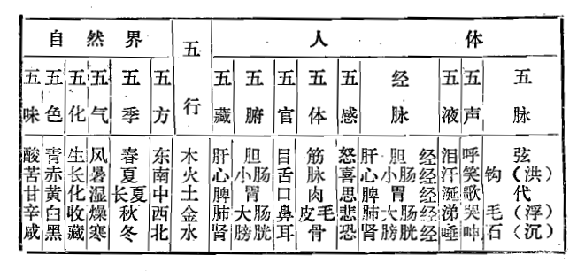

### 二、五行学说在中医学中的应用

五行学说在中医学中，主要用于阐述人与自然界的整体关系，脏腑功能及其整体关系，五脏病理及其相互影响，用于指导辨证，确定治法等，兹分述如下：

#### （一）论证人与自然界是一个统一整体

五行学说认为，自然界中的万物均由木、火、土、金、水五种基本物质构成，而万物的发生、发展变化，是在五行运动变化支配下出现的。人做为自然界中的一员，当然也不例外地受五行的支配。所以，既可用五行的基本属性去归类自然界万物，也可用五行的基本属性归类人体。尽管自然界的事物和人体脏腑器官彼此之间是毫不相干的，但按不同的五行基本属性，都可以归纳于五行之内（见下表）。这样，就建立了自然界内部和人体内部以五行为枢纽（中心）的整体联系，如五行中“木”，将自然界的东、风、青、春、酸等与人体的肝胆……统一为一个整体等等。这是中医学天人一体观的理论依据之一。从这一思想出发，中医学认为，自然界的正常或异常的发展变化，都直接地对人体的健康与疾病发生影响。如五行化生的五气（风、火、湿、燥、寒）就是直接地影响着人体的健康和疾病的发生。

#### （二）概括五脏的气化功能及其整体关系

五行学说将人体五脏分属于五行，以五行的基本属性和相互关系，概括五脏的部分生理功能和五脏之间的相互联系，并说明五脏是一个统一整体。

##### 1.概括五脏的气化功能

按五行基本属性，五脏中肝属木、心属火、脾属土、肺属金、肾属水。木性伸展、通达、敷散，肝属木，所以肝有喜条达、恶抑郁的特点，具有疏泄气机的功能。火性炎热、红亮、色赤，而主上升，心属火，所以心有上升、润泽面容的特点，具有主血脉的功能。土性受纳、生化，为万物之母，脾属土，所以脾有受纳、运化水谷（仓廪之官）和生化营养精微的特点，具有生化气血的生理功能。金性清肃敛降，肺属金，所以肺有以清宣下降为顺、壅滞失降为逆的特点。水性寒，主下行、闭藏，肾属水，所以肾有藏五脏六腑之精的特点，具有气化的功能。

##### 2.概括五脏气化的相互关系

按照五行生克制化的观点，五脏之间是相互促进和相互制约的，并以此维持五脏气化功能的协调平衡。

按五行木、火、土、金、水、木的相生顺序：木生火，肝 （木）对维持心（火）的正常功能，有资助作用，肝藏血，心藏神，神赖血养，血藏于肝而养心神。火生土，则心对脾有资助作用，心主血，脾统血，二者相辅相成，才能血行正常。土生金，肺金恶燥，必得阴精以滋润，而脾能“散精，上归于肺”，即是补脾益肺治法（即培土生金）的道理之所在。金生水，是指肺（金）有资助肾（水）的作用，肾主水的气化，而肺有“通调水道”的作用，“通调水道”，以助水的气化，所以，肺即有生肾之义。水生木，肾藏阴精以滋养肝木，肾水不足，则肝阳（或火）即偏亢，或上炎，或化风内动，补肾阴（水）即可平肝木之亢。以上是以五行相生关系阐述五脏在气化（生理）方面的相互资助的整体关系。

按五行相克顺序：金、木、土、水、火、金，则肺制肝，肝制脾，脾制肾，肾制心，心制肺。肺的肃降，可以抑制肝的升发太过（如不使肝阳上亢）。肝的疏泄条达，可以抑制脾气的壅滞，使脾维持正常运化水谷的功能而不致停饮停食。脾主运化水湿，可以制止肾封藏过度而造成水饮停聚与泛溢。肾水上济心火，不使心火亢盛上炎。心火之温煦，可以抑制肺金的清肃太过。五脏就是在相互资助、相互制约的运动变化中，维持着正常的气化功能和整体平衡。

#### （三）概括五脏病变及其相互影响

##### 1.用五行基本属性概括五脏病变

木性升发、化风、动摇，故肝的病变可出现肝火（阳）上冲，内风，眩晕振掉等症，所以《素问·至真要大论》说：“诸风掉眩，皆属于肝”。火性炎热、上行，故心的病变可出现红肿热痛的疮疡，口舌生疮，咽喉肿痛及血热妄行的吐血、衄血等。土性主静，主化生，故脾的病变可出现水湿停留，脾气壅滞的痞满，及水谷不化之泄泻等。金性燥，主收敛、清肃，故肺的病变可出现肺燥咳嗽，气上逆之喘促，肺气壅遏之喘满等。水性寒，滋润而下行，主静主藏，故肾的病变可见水肿（下肢），肾阳不足之寒证，及肾虚封藏失司的遗精早泄小便频数等。

##### 2.用五行概括五脏病变的相互影响（传受）

由于五脏之间是一个统一整体，所以任何一脏的病变，都可能影响其他一脏，即一脏病可以传至他脏。五脏病变相互传变有一定规律，按五行学说予以概括则分为相生关系的传变和相克（乘、侮、复）关系的传变。

（1）相生关系的传变包括“母病及子”和“子病犯母”这两个方面：①母病及子是指五脏病变，从母脏传及子脏。如脾（土）病传肺（金），脾为母脏，肺为子脏（土生金），为脾病而及于肺。如脾虚不能运化水湿，聚而为饮，饮邪犯肺，发为咳嗽，喘促等，即为母病及子。以此类推（见图1）。②子病犯母（又称子盗母气），是指五脏病变由子脏传及母脏。如：心（火）病传肝（木），木生火，肝为心之母；心病及肝，即为子病犯母。如：心血不足，不能养肝，致使肝阳偏亢为病，即为子病犯母。余者类推（见图1）。

（2）相克关系的传变包括乘、侮、胜、复。乘、胜、复实质是一个，即克制太过。按五行相克顺序传变，肝乘脾，脾乘肾，肾乘心等，即肝病传脾，脾病传肾，肾病传心等（见图2）。侮则是反克，按五行相克顺序的反方向传变。如金克木，木气过亢则反克于金，中医学中的肝火（木）犯肺（木火刑金），即为木侮金，是肝先病而后传之于肺（见图2）。

五脏病在生克关系的传变中，五脏相生传变的母病及子，一般为病较轻浅易愈；子病犯母，一般为病深重难愈。五脏相克传变中，相乘传变为病多深重，相侮传变为病多轻浅。

应当指出，以五行学说概括五脏的生理、病理及其相互影响，只能说明五脏的部分、而不是全部生理功能和病理变化。

#### （四）用于指导辨证

1.以五行归属四诊资料、确定病变所属脏腑

人体是一个统一的整体，体内的五脏病变必然反映到体表，而出现一系列证候表现。因此，可以通过在外的证候表现，推断五脏的病变。即“视其外应，以知其内脏，则知所病矣”（《灵枢·本脏》）。临床上通过四诊可以获得内脏病变的“外应”，即病情资料，通过五行归类，初步推测病变所属脏腑。如病人面见青色，脉见弦象，即可初步确定属肝病，因为青属木色，弦亦属木，肝属木，所以属肝病。如果面赤、口苦、脉洪等，即可知为心火病证，因为赤属火，苦属火，洪脉亦属火，所以属心病。面黄、口甘等，为脾病，因为黄属土，甘亦属土，脾属土，所以为脾病。

2.以五行生克分析四诊资料，判断病证顺逆

临床上应用五行生克来归纳分析四诊资料，从而判断病证预后顺逆，主要是分析望诊与脉诊所得的资料。一般来说，色脉相合者，病情平稳。所谓色脉相合，即指色和脉应属五行之中同一行。如肝病，肝属木，则应见青色（木）和弦脉（木）。肾病，肾属水，应见黑色（水）和沉脉（水）。心病，心属火，应见赤色（火）和洪脉（火）。色脉相合，主病顺。

病证与色脉相生者，主病向愈为顺。如肝（木）病，水生木，若得沉脉（水），为相生之脉，为顺，病证一般预后良好。若心病得肾（水）之沉脉，为相克之脉（水克火），为病逆。脾病而面见青灰色，为木克土，为病逆。即脏与色、脉相克者，一般预后多不良。总之，从脏腑病证与所现之色脉的相合、相生、相克与否，可以初步推断病证预后的善恶顺逆。

3.以五行生克概括五脏病机

以五行学说来分析概括脏腑病变机理，亦是中医学常用的病证分析方法。有关这方面内容在前面已经陆续涉及到了，这里简单介绍一下。用五行归纳脏腑病机，有如肝木乘脾、水（肾）不涵木（肝）、肝气犯胃（木克土）、肝气犯肺（木侮金）、土不生金（脾肺两虚），水亏火旺（肾水不足，不能上济心火）等等，都是中医学常用的分析病机和辨证方法。

#### （五）用于确定治疗法则

1.用五行相生关系确定治疗原则

用五行相生关系确定治疗原则，主要是指母子补泻法，即《难经·六十九难》所说：“虚则补其母，实则泻其子”的原则，所谓“虚则补其母”，即补本脏之母，用于本脏虚证，如肝木阴虚，不直接补肝，而是补其母——肾水，水能生木，从而达到补肝的目的。肺金不足，可补其母——脾土，土能生金，从而达到补肺的目的。所谓“实则泻其子”，即泻本脏之子，用于实证。如肝木气盛（阳亢等），可不直接泻肝，而是泻其子脏——心火，以达到泻肝之目的，因为子能令母虚，子夺母气，从而使其母脏之盛气得以平复。运用中，可根据实际病情，或单纯补母、泄子，或母子兼顾。在针灸学中，“虚则补其母”，则凡是某经虚证，即可单补其母经或本经母穴，如肝经虚证，则或补其母经——肾经合穴（水穴）阴谷，或补其本经合穴（水穴）曲泉。“实则泄其子”，则凡是某经实证，即可单泻其子经或子穴。如肝经实证，可取其子经——心经荥穴（火穴）少府，或本经荥穴（火穴）行间。

除“母子补泻法”外，还有滋水涵木法，培土生金法，金水相生法等。滋水涵木是滋养肾水，以养肝木，又称滋肾养肝，用于肾阴亏损而肝阴不足，或肝阳偏亢之证。培土生金是补脾气以益肺气，即补脾益肺，用于脾虚肺虚之证。金水相生是补肺滋肾，用于肺肾阴虚之证。“金能生水，水能润金”（《时病论》卷四），金水相生，肺肾同治。

2.用五行相克关系确定治疗原则

用五行相克关系确定的治疗原则，主要是指抑强和扶弱两方面，即亢则平之，衰则益之。如抑木扶土；培土制水；佐金平木；泻南补北等。抑木扶土是疏理肝木，补益脾土，即调理肝脾，用于木盛乘土，木郁土壅之证。培土制水，是温补脾土，以制肾水，用于脾肾阳虚，不能化气行水之证，治当脾肾兼顾。佐金平木，是清肃肺金以平抑肝木，用于肝火亢盛，肺失清肃之证。泻南补北，即泻南方火，补北方水，心属火，火在五方为南，水为北，肾属水，即滋阴降火法，用于肾水不足，心火亢盛之证。

五行学说在治疗中除上述应用外，还用于情志疾病的治疗，如悲能胜怒（金克木），怒能胜思（木克土），思能胜恐（土克水）等，就是用情志的五行所属和相克关系，以情志治疗情志疾病。

#### （六）五行学说在医学其他领域中的应用

五行学说还用于对十二经脉及其井、荥、俞、经、合穴的五行归类。即手太阴经和手阳明经属金，足少阴经和足太阳经属水，足厥阴经和足少阳经属木，手少阴经和手太阳经属火，足太阴经和足阳明经属土，手厥阴经和手少阳经属火（相火）。井、荥、俞、经、合穴分别属于木、火、土、金、水五行。

五行学说，还将人按其不同属性归为木形人，火形人，土形人，金形人，水形人五种，并指出各自不同的生理、病理方面特点（参见《灵枢·阴阳二十五人》）。这种对人群的五行归类，在中医学中的意义，尚待进一步研究。
