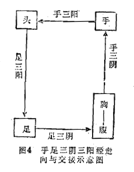

### 二、十二经脉的循行走向和交接规律

1.循行分布规律

十二经脉在人体的循行部位有一定的规律。①在四肢：阳经行于肢体外侧（阳侧），阴经行于肢体内侧（阴侧）。同时，表里两经基本上相对应地分布于肢体前、中、后同一部位的内、外两侧。如手太阴肺经和手阳明大肠经为表里两经，二者都分布于上肢前缘——一内一外相对应。足太阴脾经和足阳明胃经互为表里，二者都分布于下肢前缘——一内一外相对应，余者类推。六阳经与六阴经又各有自己的分布规律，六阳经则手足阳明经分别居于上肢和下肢外侧前缘，手足少阳经分别居于上、下肢外侧中线，手足太阳经居于上、下肢外侧后缘。六阴经则手足太阴经居上、下肢内侧前缘，手足厥阴经居于上、下肢内侧中线，手足少阴经居于上、下肢内侧后缘。

2.走向和交接规律

手三阴经，从胸走手；手三阳经，从手走头；足三阳经，从头走足；足三阴经，从足走腹。手足三阳经交接于头；手足三阴经交接于胸腹；手三阴三阳经交接于手；足三阴三阳经交接于足。如此，十二经脉形成一个“阴阳相贯，如环无端”（《灵枢·营卫生会》）的循环经路，见图4手足三阴三阳经走向与交接示意图。

