### 五、十二经脉的循行部位

#### （一）手太阴肺经

起于中焦，下络大肠，还循胃口（下口[幽门](https://www.gmzyjc.com/read/zjs/zjs3.1.7-8-0.0.2.3.21.md)，上口贲门），通过膈肌，属肺，至喉部，横行至胸部外上方（[中府](https://www.gmzyjc.com/read/zjs/zjs3.1.1-3-0.1.1.3.1.md)穴），出腋下，沿上肢内侧前缘下行，过肘窝入寸口上[鱼际](https://www.gmzyjc.com/read/zjs/zjs3.1.1-3-0.1.1.3.10.md)，直出拇指之端（[少商](https://www.gmzyjc.com/read/zjs/zjs3.1.1-3-0.1.1.3.10.1.md)穴）。

分支：从手腕的后方（[列缺](https://www.gmzyjc.com/read/zjs/zjs3.1.1-3-0.1.1.3.7.md)穴）分出，沿掌背侧走向食指桡侧端（[商阳](https://www.gmzyjc.com/read/zjs/zjs3.1.1-3-0.1.2.3.1.md)穴），交于手阳明大肠经。（图5）

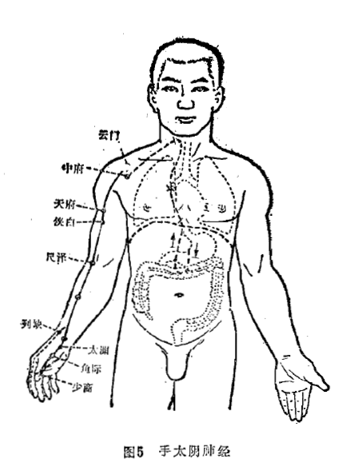

#### （二）手阳明大肠经

起于食指桡侧端（[商阳](https://www.gmzyjc.com/read/zjs/zjs3.1.1-3-0.1.2.3.1.md)穴）经过手背行于上肢伸侧前缘，上肩，至肩关节前缘，向后到第七颈椎棘突下（[大椎](https://www.gmzyjc.com/read/zjs/zjs3.2.2-0.0.1.3.14.md)穴），再向前下行入锁骨上窝（[缺盆](https://www.gmzyjc.com/read/zjs/zjs3.1.1-3-0.1.3.3.12.md)），进入胸腔络肺，向下通过膈肌下行，属大肠。

分支：从锁骨上窝上行，经颈部至面颊，入下齿中，回出挟口两旁，左右交叉于[人中](https://www.gmzyjc.com/read/zjs/zjs3.2.2-0.0.1.3.26.md)，至对侧鼻翼旁（[迎香](https://www.gmzyjc.com/read/zjs/zjs3.1.1-3-0.1.2.3.20.md)穴)，交于足阳明胃经。（图6）

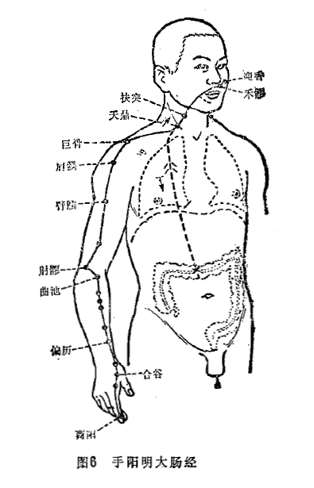

#### （三）足阳明胃经

起于鼻翼旁（[迎香](https://www.gmzyjc.com/read/zjs/zjs3.1.1-3-0.1.2.3.20.md)穴），挟鼻上行，左右侧交会于鼻根部，旁行入目内眦，与足太阳经相交，向下沿鼻柱外侧，入上齿中，还出，挟口两旁，环绕嘴唇，在颏唇沟[承浆](https://www.gmzyjc.com/read/zjs/zjs3.2.1-0.1.1.3.22.md)穴处左右相交，退回沿下颌骨后下缘到[大迎](https://www.gmzyjc.com/read/zjs/zjs3.1.1-3-0.1.3.3.5.md)穴处，沿下颌角上行过耳前，经过[上关](https://www.gmzyjc.com/read/zjs/zjs3.1.9-12-0.0.3.3.3.md)穴（客主人），沿发际，到额前。

分支：从[大迎](https://www.gmzyjc.com/read/zjs/zjs3.1.1-3-0.1.3.3.5.md)穴前方下行到[人迎](https://www.gmzyjc.com/read/zjs/zjs3.1.1-3-0.1.3.3.9.md)穴，沿喉咙向下后行至[大椎](https://www.gmzyjc.com/read/zjs/zjs3.2.2-0.0.1.3.14.md)，折向前行，入[缺盆](https://www.gmzyjc.com/read/zjs/zjs3.1.1-3-0.1.3.3.12.md)，深入体腔，下行穿过膈肌，属胃，络脾。

直行者：从[缺盆](https://www.gmzyjc.com/read/zjs/zjs3.1.1-3-0.1.3.3.12.md)出体表，沿[乳中](https://www.gmzyjc.com/read/zjs/zjs3.1.1-3-0.1.3.3.17.md)线下行，挟脐两旁（旁开二寸），下行至腹股沟处的气街穴。

分支：从胃下口[幽门](https://www.gmzyjc.com/read/zjs/zjs3.1.7-8-0.0.2.3.21.md)处分出，沿腹腔内下行到气街穴，与直行之脉会合，而后下行大腿前侧，至膝膑，沿下肢胫骨前缘下行至足背，入足第二趾外侧端（[厉兑](https://www.gmzyjc.com/read/zjs/zjs3.1.1-3-0.1.3.3.45.md)穴）。

分支：从膝下三寸处（[足三里](https://www.gmzyjc.com/read/zjs/zjs3.1.1-3-0.1.3.3.36.md)穴）分出，下行入中趾外侧端。

分支：从足背上[冲阳](https://www.gmzyjc.com/read/zjs/zjs3.1.1-3-0.1.3.3.42.md)穴分出，前行入足大趾内侧端（[隐白](https://www.gmzyjc.com/read/zjs/zjs3.1.4-6-0.0.1.3.1.md)穴），交于足太阴脾经。（图7）

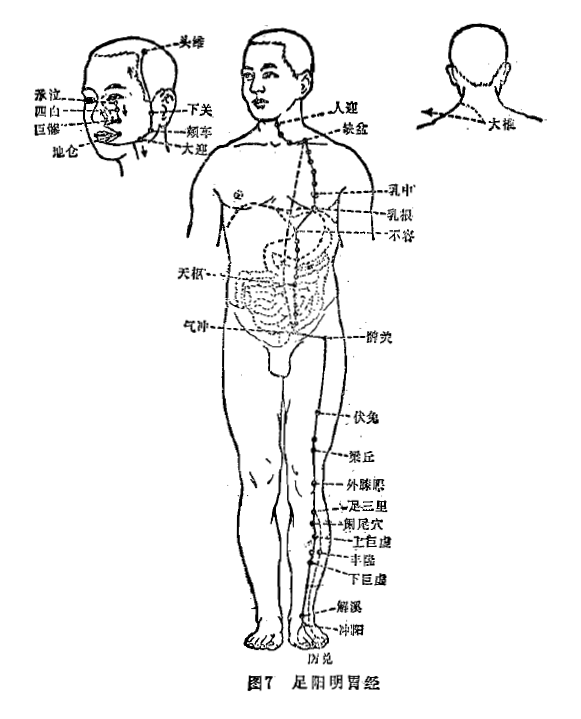

#### （四）足太阴脾经

起于足大趾内侧端（[隐白](https://www.gmzyjc.com/read/zjs/zjs3.1.4-6-0.0.1.3.1.md)穴），沿内侧赤白肉际，上行过内踝的前缘，沿小腿内侧正中线上行，在内踝上八寸处，交出足厥阴肝经之前，上行沿大腿内侧前缘，进入腹部，属脾，络胃。向上穿过膈肌，沿食道两旁，连舌本，散舌下。

分支：从胃别出，上行通过膈肌，注入心中，交于手少阴心经。（图8）

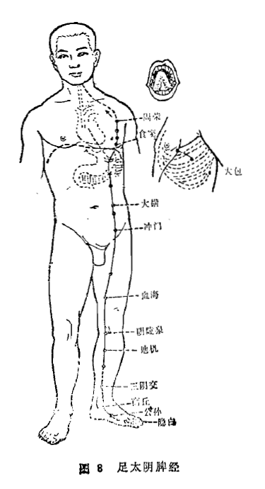

#### （五）手少阴心经

起于心中，走出后属心系，向下穿过膈肌，络小肠。

分支：从心系分出，挟食道上行，连于目系。

直行者：从心系出来，退回上行经过肺，向下浅出腋下（[极泉](https://www.gmzyjc.com/read/zjs/zjs3.1.4-6-0.0.2.3.1.md)穴）沿上肢内侧后缘，过肘中，经掌后锐骨端，进入掌中，沿小指桡侧，出小指桡侧端（[少冲](https://www.gmzyjc.com/read/zjs/zjs3.1.4-6-0.0.2.3.9.md)穴)，交于手太阳小肠经。（图9）

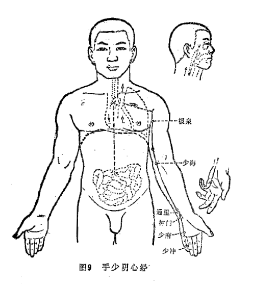

#### （六）手太阳小肠经

起于小指外侧端（[少泽](https://www.gmzyjc.com/read/zjs/zjs3.1.4-6-0.0.3.3.1.md)穴），沿手背、上肢外侧后缘，过肘部，到肩关节后面，绕肩胛部，交肩上（[大椎](https://www.gmzyjc.com/read/zjs/zjs3.2.2-0.0.1.3.14.md)穴)，前行入[缺盆](https://www.gmzyjc.com/read/zjs/zjs3.1.1-3-0.1.3.3.12.md)，深入体腔，络心，沿食道，穿过膈肌，到达胃部，下行，属小肠。

分支：从[缺盆](https://www.gmzyjc.com/read/zjs/zjs3.1.1-3-0.1.3.3.12.md)出来，沿颈部上行到面颊，至目外眦后，退行进入耳中（[听宫](https://www.gmzyjc.com/read/zjs/zjs3.1.4-6-0.0.3.3.19.md)穴）。

分支：从面颊部分出，向上行于眼下，至目内眦（[睛明](https://www.gmzyjc.com/read/zjs/zjs3.1.7-8-0.0.1.3.1.md)穴），交于足太阳膀胱经。（图10）

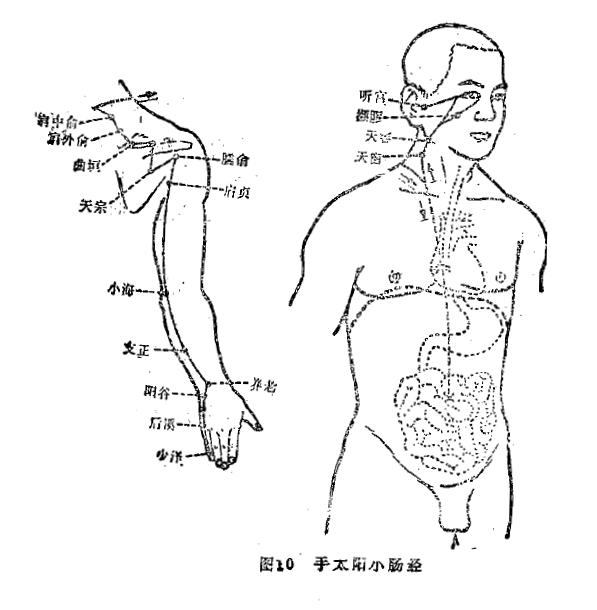

#### （七）足太阳膀胱经

起于目内眦（[睛明](https://www.gmzyjc.com/read/zjs/zjs3.1.7-8-0.0.1.3.1.md)穴)，向上到达额部，左右交会于头顶部（[百会](https://www.gmzyjc.com/read/zjs/zjs3.2.2-0.0.1.3.20.md)穴）。

分支：从头顶部分出，到耳上角部。

直行者：从头顶部分别向后行至枕骨处，进入颅腔，络脑，回出分别下行到项部（[天柱](https://www.gmzyjc.com/read/zjs/zjs3.1.7-8-0.0.1.3.10.md)穴），下行交会于[大椎](https://www.gmzyjc.com/read/zjs/zjs3.2.2-0.0.1.3.14.md)穴，再分左右沿肩胛内侧，脊柱两旁（一寸五分)，到达腰部（[肾俞](https://www.gmzyjc.com/read/zjs/zjs3.1.7-8-0.0.1.3.23.md)穴），进入脊柱两旁的肌肉（膂），深入体腔，络肾，属膀胱。

分支：从腰部分出，沿脊柱两旁下行，穿过臀部，从大腿后侧外缘下行至腘窝中（[委中](https://www.gmzyjc.com/read/zjs/zjs3.1.7-8-0.0.1.3.40.md)穴）。

分支：从项分出下行，经肩胛内侧，从[附分](https://www.gmzyjc.com/read/zjs/zjs3.1.7-8-0.0.1.3.41.md)穴挟脊（三寸）下行至髀枢，经大腿后侧至腘窝中与前一支脉会合，然后下行穿过腓肠肌，出走于足外踝后，沿足背外侧缘至小趾外侧端（[至阴](https://www.gmzyjc.com/read/zjs/zjs3.1.7-8-0.0.1.3.67.md)穴)，交于足少阴肾经。（图11）

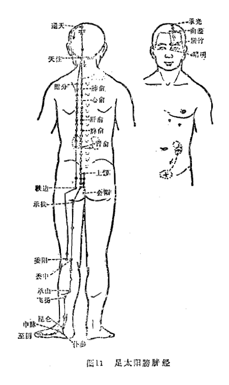

#### （八）足少阴肾经

起于足小趾下，斜行于足心（[涌泉](https://www.gmzyjc.com/read/zjs/zjs3.1.7-8-0.0.2.3.1.md)穴），出行于舟骨粗隆之下，沿内踝后，分出进入足跟，向上沿小腿内侧后缘，至腘内侧，上股内侧后缘入脊内（[长强](https://www.gmzyjc.com/read/zjs/zjs3.2.2-0.0.1.3.1.md)穴），穿过脊柱，属肾，络膀胱。

直行者：从肾上行，穿过肝和膈肌，进入肺，沿喉咙，到舌根两旁。

分支：从肺中分出，络心，注于胸中，交于手厥阴心包经。（图12）

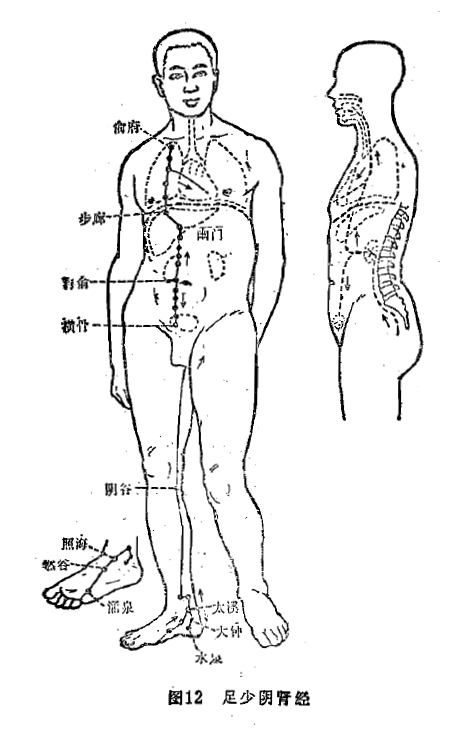

#### （九）手厥阴心包经

起于胸中，出属心包络，向下穿过膈肌，依次络于上、中、下三焦。

分支：从胸中分出，沿胸浅出胁部当腋下三寸处（[天池](https://www.gmzyjc.com/read/zjs/zjs3.1.9-12-0.0.1.3.1.md)穴），向上至腋窝下，沿上肢内侧中线入肘，过腕部，入掌中（[劳宫](https://www.gmzyjc.com/read/zjs/zjs3.1.9-12-0.0.1.3.8.md)穴），沿中指桡侧，出中指桡侧端（[中冲](https://www.gmzyjc.com/read/zjs/zjs3.1.9-12-0.0.1.3.9.md)穴）。

分支：从掌中分出，沿无名指出其尺侧端（[关冲](https://www.gmzyjc.com/read/zjs/zjs3.1.9-12-0.0.2.3.1.md)穴），交于手少阳三焦经。（图13）

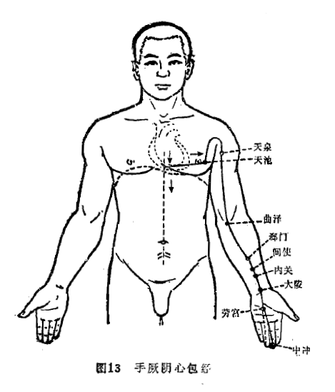

#### （十） 手少阳三焦经

起于无名指尺侧端（[关冲](https://www.gmzyjc.com/read/zjs/zjs3.1.9-12-0.0.2.3.1.md)穴），向上沿无名指尺侧至手腕背面， 上行尺骨、桡骨之间，通过[肘尖](https://www.gmzyjc.com/read/zjs/zjs3.4-0.1.4.5.0.md)，沿上臂外侧向上至肩部，向前行入[缺盆](https://www.gmzyjc.com/read/zjs/zjs3.1.1-3-0.1.3.3.12.md)，布于[膻中](https://www.gmzyjc.com/read/zjs/zjs3.2.1-0.1.1.3.16.md)，散络心包，穿过膈肌，依次属上、中、下三焦。

分支：从[膻中](https://www.gmzyjc.com/read/zjs/zjs3.2.1-0.1.1.3.16.md)分出，上行出[缺盆](https://www.gmzyjc.com/read/zjs/zjs3.1.1-3-0.1.3.3.12.md)，至肩部，左右交会于[大椎](https://www.gmzyjc.com/read/zjs/zjs3.2.2-0.0.1.3.14.md)，上行到项，沿耳后（[翳风](https://www.gmzyjc.com/read/zjs/zjs3.1.9-12-0.0.2.3.17.md)穴），直上出耳上角，然后屈曲向下经面颊部至目眶下。

分支：从耳后分出，进入耳中，出走耳前，经[上关](https://www.gmzyjc.com/read/zjs/zjs3.1.9-12-0.0.3.3.3.md)穴前，在面颊部与前一分支相交，至目外眦（瞳子髎穴），交于足少阳胆经。（图14）

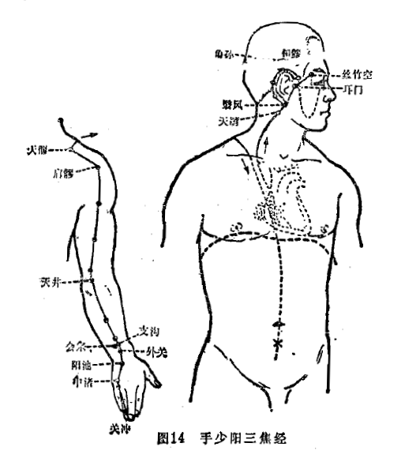

#### （十一）足少阳胆经

起于目外眦（瞳子髎穴），上至头角（[颔厌](https://www.gmzyjc.com/read/zjs/zjs3.1.9-12-0.0.3.3.4.md)穴），再向下到耳后（[完骨](https://www.gmzyjc.com/read/zjs/zjs3.1.9-12-0.0.3.3.12.md)穴），再折向上行，经额部至眉上（[阳白](https://www.gmzyjc.com/read/zjs/zjs3.1.9-12-0.0.3.3.14.md)穴），又向后折至[风池](https://www.gmzyjc.com/read/zjs/zjs3.1.9-12-0.0.3.3.20.md)穴，沿颈下行至肩上，左右交会于[大椎](https://www.gmzyjc.com/read/zjs/zjs3.2.2-0.0.1.3.14.md)穴，前行入[缺盆](https://www.gmzyjc.com/read/zjs/zjs3.1.1-3-0.1.3.3.12.md)。

分支：从耳后进入耳中，出走于耳前，至目外眦后方。

分支：从目外眦分出，下行至[大迎](https://www.gmzyjc.com/read/zjs/zjs3.1.1-3-0.1.3.3.5.md)穴，同手少阳经分布于面颊部的支脉相合，行至目眶下，向下的经过下颌角部下行至颈部，与前脉会合于[缺盆](https://www.gmzyjc.com/read/zjs/zjs3.1.1-3-0.1.3.3.12.md)后，进入体腔，穿过膈肌，络肝，属胆，沿胁里浅出气街，绕毛际，横向至[环跳](https://www.gmzyjc.com/read/zjs/zjs3.1.9-12-0.0.3.3.30.md)穴处。

直行者：从[缺盆](https://www.gmzyjc.com/read/zjs/zjs3.1.1-3-0.1.3.3.12.md)下行至腋，沿胸侧，过季肋，下行至[环跳](https://www.gmzyjc.com/read/zjs/zjs3.1.9-12-0.0.3.3.30.md)穴处与前脉会合，再向下沿大腿外侧、[膝关](https://www.gmzyjc.com/read/zjs/zjs3.1.9-12-0.0.4.3.7.md)节外缘，行于腓骨前面，直下至腓骨下端，浅出外踝之前，沿足背行出于足第四趾外侧端（窍阴穴）。

分支：从足背（临泣穴）分出，前行出足大趾外侧端，折回穿过爪甲，分布于足大趾爪甲后丛毛处，交于足厥阴肝经。（图15）

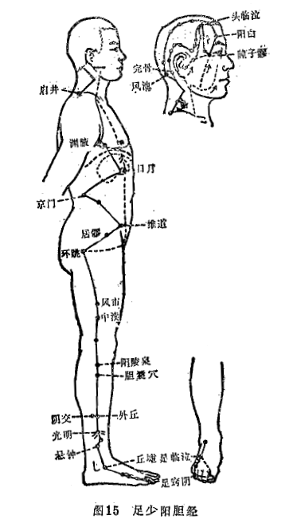

#### （十二）足厥阴肝经

起于足大趾爪甲后丛毛处，向上沿足背至内踝前一寸处（[中封](https://www.gmzyjc.com/read/zjs/zjs3.1.9-12-0.0.4.3.4.md)穴），向上沿胫骨内缘，在内踝上八寸处交出足太阴脾经之后，上行过膝内侧，沿大腿内侧中线进入阴毛中，绕阴器，至小腹，挟胃两旁，属肝，络胆，向上穿过膈肌，分布于胁肋部，沿喉咙的后边，向上进入鼻咽部，上行连接目系，出于额，上行与督脉会于头顶部。

分支：从目系分出，下行于颊里，环绕在口唇的里边。

分支：从肝分出，穿过膈肌，向上注入肺，交于手太阴肺经。（图16）

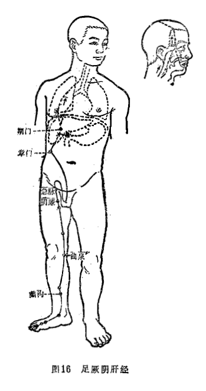
