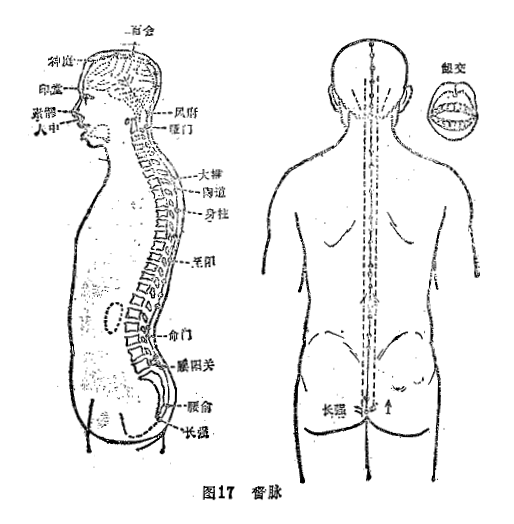
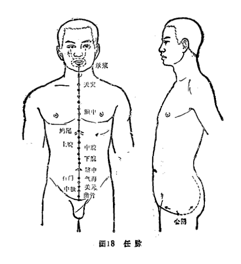
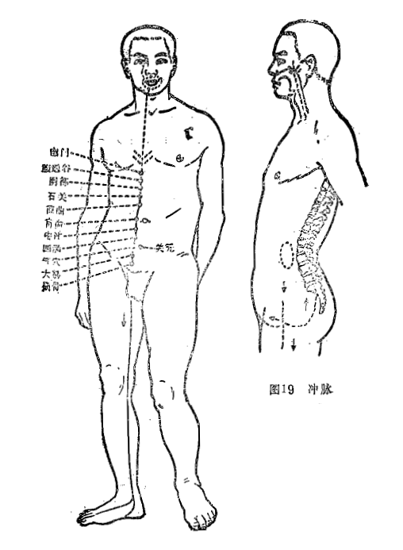
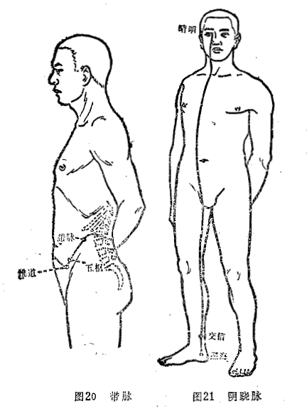
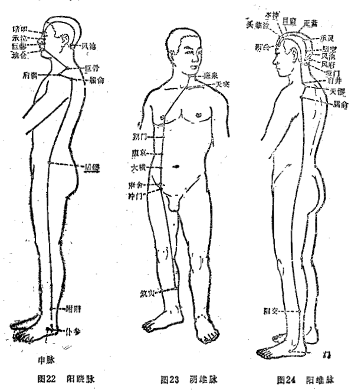

## 第三节　奇经八脉

奇经之所以称“奇”，一是奇经独立于十二经脉之外，不受十二经支配（“不拘于经”）；二是无直接配合的脏腑；三是无表里配偶之经。奇经包括督脉、任脉、冲脉、带脉、阴跷脉、阳跷脉、阴维脉、阳维脉八脉，所以又称奇经八脉。

奇经八脉中除任、督二脉有专有的俞穴及任、督、带有独立地循行径路外，其余五经（带脉亦无专有俞穴）均无自身的俞穴，也无独立循行径路，而是主要依附于十二正经之中循行，有的奇经本身，就是十二正经的分支，如阴跷脉、阳跷脉，分别是足少阴肾经和足太阳膀胱经的分支。所以，元·滑伯仁等医家将具有专有俞穴的任、督二脉并入十二正经，合称十四经。

任、督、冲三脉均起自胞中，又同出于会阴之后，任脉行于前，督脉行背，冲脉并足少阴肾经挟脐而上，其中任、督二脉上行至头，交接于唇内；冲脉分支在背脊中与督脉相会合。所以任、督、冲三脉，始则一分为三，终则三合为一。八脉中，除带脉起于季胁，环腰一周外，任、督、冲三脉均起于胞中，终于头面；阴跷、阳跷、阴维、阳维均起于两足，终于头项。因此，八脉（除带脉）都汇聚于头部。

奇经八脉纵横交叉于十二经脉之间，具有如下三方面的作用：①进一步密切十二经脉之间的联系。如阳维维系于阳经，联络所有的阳经，阴维维系于阴经，联络所有的阴经；带脉环行于腰部，沟通循行于腰部、腹部的经脉；冲脉通行于上下，渗灌三阴、三阳；督脉则总督诸阳经；任脉则汇合诸阴经。②调节十二经脉的气血。十二经脉气血有余时，则流注于奇经八脉，蓄以备用；十二经脉气血不足时，可由奇经溢出，给予补充。③奇经与肝、肾等脏及女子胞、脑、髓等奇恒之腑的关系较为密切，相互之间在生理病理上均有一定的联系。

### （一）督脉

1.循行部位

循行部位：起于胞中，下出会阴，沿脊柱里面上行，至项后风府穴处进人颅内，络脑，并由项沿头部正中线，经头顶、额部、鼻部、上唇，到上唇系带处。

分支：从脊柱里面分出，属肾。

分支：从小腹内部直上，贯脐中央，上贯心，到喉部，再向上到下颌部，环绕口唇。向上至两眼下部的中央。（图17）

2.基本功能

督，有总管、统率的意思。督脉行于背部正中，其脉多次与手足三阳经及阳维脉交会，能总督一身之阳经，故又称为“阳脉之海”。其次，督脉行于脊里，上行入脑，并从脊里分出属肾，它与脑、脊髓和肾有密切的联系。

### （二）任脉

1.循行部位

起于胞中，下出会阴，经阴阜，沿腹部和胸部正中线上行，至咽喉，上行至下颌部，环绕口唇，沿面颊，分行至目眶下。（图18）

2.基本功能

任，有担任、任受的意思。任脉行于腹面正中线，其脉多次与手足三阴及阴维脉交会，能总任一身之阴经，故又称“阴脉之海”。任，又与“妊”意义相通。其脉起于胞中，与女子妊娠有关，故称“任主胞胎”。

### （三）冲脉

1.循行部位

起于胞中，下出会阴后，从气街部起与足少阴经相并，挟脐上行，散布于胸中，再向上行，经喉，环绕口唇，到目眶下。

分支：与足少阴之大络同起于肾，向下从气街部浅出体表，沿大腿内侧进入腘窝，再沿胫骨内缘，下行到足底；又有支脉从内踝后分出，向前斜入足背，进入大足趾。

分支：从胞中出，向后与督脉相通，上行于脊柱内。（图19）

2.基本功能

冲，有要冲的意思。冲脉上至于头，下至于足，贯串全身，成为气血的要冲，能调节十二经气血，故有“十二经脉之海”之称。冲脉又称“血海”，同妇女的月经有密切关系。

### （四）带脉

1.循行部位

起于季胁，斜向下行到带脉穴，绕身一周。在腹面的带脉下垂到少腹。（图20）

2.基本功能

带脉围腰一周，犹如束带，能约束纵行诸脉。

### （五）阴跷脉、阳跷脉

1.循行部位

跷脉左右成对。阴跷脉、阳跷脉均起于足踝下。

阴跷脉从内踝下照海穴分出，沿内踝后直上下肢内侧，经前阴，沿腹、胸进入缺盆，出行于人迎穴之前，经鼻旁，到目内呲，与手足太阳经、阳跷脉会合。（图21)

阳跷脉从外踝下申脉穴分出，沿外踝后上行，经腹部，沿胸部后外侧，经肩部、颈外侧，上挟口角，到达目内眦，与手足太阳经、阴跷脉会合，再上行进入髮际，向下到达耳后，与足少阳胆经会于项后。（图22）

2.基本功能

跷，有轻健跷捷的意思。有濡养眼目、司眼睑之开合和下肢运动的功能。古人还有阴阳跷脉“分主一身左右之阴阳”之说。

### （六）阴维脉、阳维脉

1.循行部位

阴维脉起于小腿内侧足三阴经交会之处，沿下肢内侧上行，至腹部，与足太阴脾经同行，到胁部，与足厥阴经相合，然后上行至咽喉，与任脉相会。（图23）

阳维脉起于外踝下，与足少阳胆经并行，沿下肢外侧向上，经躯干部后外侧，从腋后上肩，经颈部、耳后，前行到额部，分布于头侧及项后，与督脉会合。（图24）

2.基本功能

维，有维系的意思。阴维脉的功能是“维络诸阴”；阳维脉的功能是“维络诸阳”。
