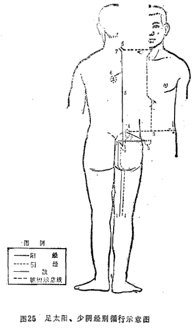
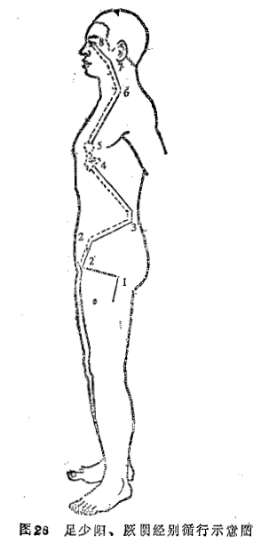
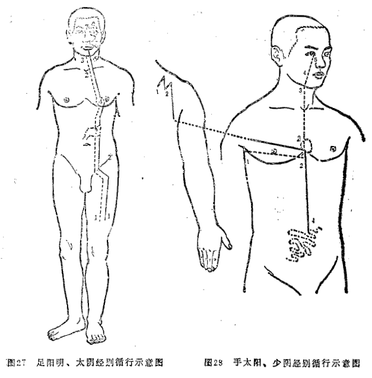
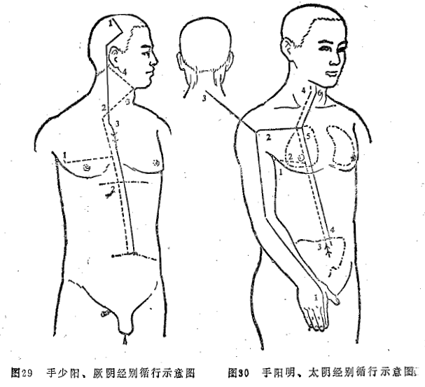

## 第四节　十二经别

### 一、概说

经别是从十二经分（别）出的经脉，是另有自己的循行径路的正经，因而属于十二正经范围之内。经别虽属于正经，但它与正经分支不同：正经分支（支脉）从本经分出后，不再复归于本经；经别则不同，阴经经别在循行一段经路后，与相表里之阳经经别相合，最终归于阳经经别之本经，而不回归阴经经别之本经。如足少阴经经别最终合于足太阳经经别，二者再共同归于足太阳经经别之本经——足太阳经。

十二经别在人体中循行的基本规律，可概括为“离、入、出、合”四个字。十二经别都是从十二经脉循行四肢处（多在肘膝以上）别出（离），再深入胸腹腔内部（入），然后外出肌表（出），上行于头面；在头面处，阴经经别入合于相表里之阳经经别，阳经经别再回归于本经（合）。这就是十二经别的“离、入、出、合”或称“离、合、出、入”的循行规律。由于每一对表里经别有一合，故十二经别共有六合。

### 二、经别的作用和意义

由于有的十二经别循行部位是十二经脉循行所不及之处，所以十二经别在生理、病理、治疗等方面都是对十二经脉的重要补充：

（1）加强了十二经脉中相为表里的两条经脉在体内的联系  十二经别进入体腔后，表里两经经别相并而行，并经过相为表里的脏腑，在浅出体表时，阴经经别合入阳经经别，共同注入阳经经别之本经。因此，有加强表里经脉相互联系的作用。

（2）加强了体表、四肢与体内、脏腑之间的向心性联系  由于十二经别都是从十二经脉循行于四肢部分别出，进入体内后又是向心性走行，因而加强了经络的由外而内的联系。

（3）建立了六阴经与头面的联系  六阴经，除足厥阴经外，均不上行于头面，而十二经别不仅六阳经经别循行于头部，而且六阴经经别亦上达于头部。足三阴经经别在合入阳经经别之后上达于头；手三阴经经别，均经喉咙而直接达于头面部，为“十二经脉，三百六十五络，其血气皆上于面而走空窍”（《灵枢·邪气脏腑病形》）的理论奠定了物质基础。

（4）补充了某些疾病的辨证，扩大了十二经脉主治范围  由于十二经别的循行部位弥补了十二经脉所不到之处，因而对某些疾病的准确辨证定位，提供了启示和理论依据。如头痛，三阴三阳经均有头痛，但三阳经和厥阴经的经脉直接行于头部，而三阴经经脉并不走行于头部，为什么仍会有头痛呢？这是因为三阴经经别分别入合于与已相表里之阳经经别，最后归于阳经，借阳经经脉抵达于头部，因而三阴经病变也会引起头痛。《素问·五脏生成篇》说；“头痛巅疾，下虚上实，过在足少阴巨阳”。后来的宋、金、元时期的医家，如许叔微、李杲、朱震亨等都有关于三阴头痛的论治。李杲说：头痛“亦有三阴三阳之异”，朱震亨说：“诸经气滞，亦作头痛”。因此，头痛一证，不限于三阳经和厥阴经，这是经别等在起作用。

十二经别还扩大了经络穴位的主治范围。如足太阳经脉并不到达肛门，但该经经别却“别入于肛”，所以足太阳经的承山、承筋等穴可治疗肛门病。

（5）加强了足三阴三阳经脉与心的联系  足三阴三阳经经别上行经过腹胸，除加强了腹腔内脏腑的表里联系之外，又都与胸腔内的心相联系。因此，十二经别对于分析腹腔内脏腑与心的生理、病理联系，有重要意义。所以，十二经别为“心为五脏六腑之大主”的理论提供了依据。

### 三、十二经别的循行

#### （一）足太阳与足少阴经别　一合

足太阳经别  从足太阳经脉的腘窝部分出，其中一条支脉在骶骨下五寸处别行进入肛门，上行归属膀胱，散布联络肾脏，沿脊柱两旁的肌肉到心脏后散布于心脏内；直行的一条支脉，从脊柱两旁的肌肉处继续上行，浅出项部，脉气仍注入足太阳本经。（图25）

足少阴经别  从足少阴经脉的腘窝部分出，与足太阳的经别相合并行，上至肾，在十四椎（第二腰椎）处分出，归属带脉；直行的一条继续上行，系舌根，再浅出项部，脉气注入足太阳经的经别。（图25）

#### （二）足少阳与足厥阴经别　二合

足少阳经别  从足少阳经脉在大腿外侧循行部位分出，绕过大腿前侧，进人毛际，同足厥阴的经别会合，上行进入季胁之间，沿胸腔里，归属于胆，散布而上达肝脏，通过心脏，挟食道上行，浅出下颌、口旁，散布在面部，系目系，当目外眦部，脉气仍注入足少阳经。（图26）

足厥阴经别  从足厥阴经脉的足背上处分出，上行至毛际，与足少阳的经别会合并行。（图26）

#### （三）足阳明与足太阴经别　三合

足阳明经别  从足阳明经脉的大腿前面处分出，进入腹腔里面，归属于胃，散布到脾脏，向上通过心脏，沿食道浅出口腔，上达鼻根及目眶下，回过来联系目系，脉气仍注入足阳明本经。（图27）

足太阴经别  从足太阴经脉的股内侧分出后到大腿前面，同足阳明的经别相合并行，向上结于咽，贯通舌中。（图27）

#### （四）手太阳与手少阴经别　四合

手太阳经别  从手太阳经脉的肩关节部分出，向下入于腋窝，行向心脏，联系小肠。（图28）

手少阴经别  从手少阴经脉的腋窝两筋之间分出后，进入胸腔，归属于心脏，向上走到喉咙，浅出面部，在目内眦与手太阳经相合。（图28）

#### （五）手少阳与手厥阴经别　五合

手少阳经别  从手少阳经脉的头顶部分出，向下进入锁骨上窝，经过上、中、下三焦，散布于胸中。（图29）

手厥阴经别从手厥阴经脉的腋下三寸处分出，进入胸腔，分别归属于上、中、下三焦，向下沿着喉咙，浅出于耳后，于乳突下同手少阳经会合。（图29）

#### （六）手阳明与手太阴经别　六合

手阳明经别  从手阳明经脉的肩髃穴处分出，进入项后柱骨，向下者走向大肠，归属于肺；向上者，沿喉咙，浅出于锁骨上窝，脉气仍归属于手阳明本经。（图30）

手太阴经别  从手太阴经脉的渊腋处分出，行于手少阴经别之前，进入胸腔，走向肺脏，散布于大肠，向上浅出锁骨上窝，沿喉咙，合于手阳明的经别。（图30）