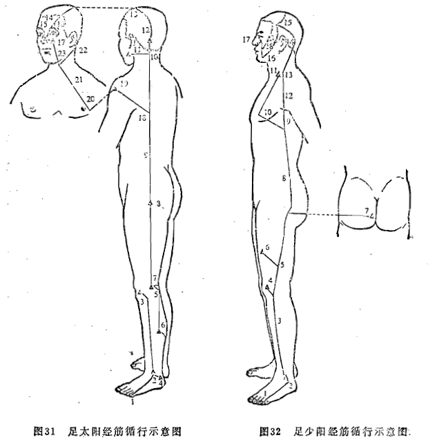
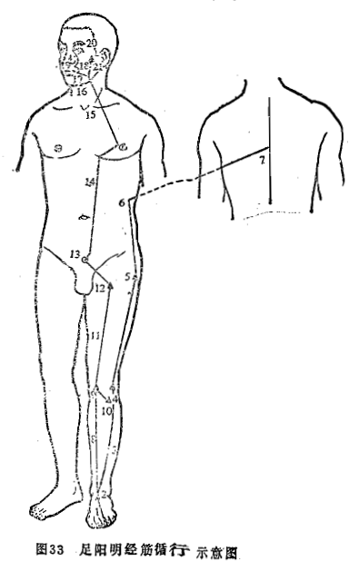
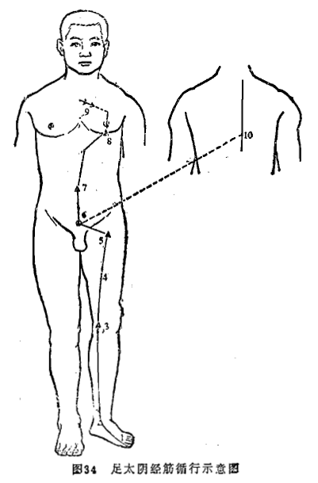
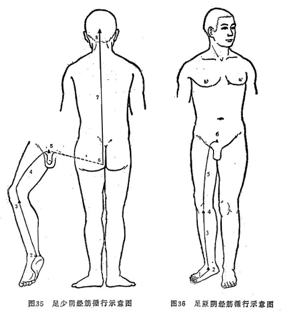
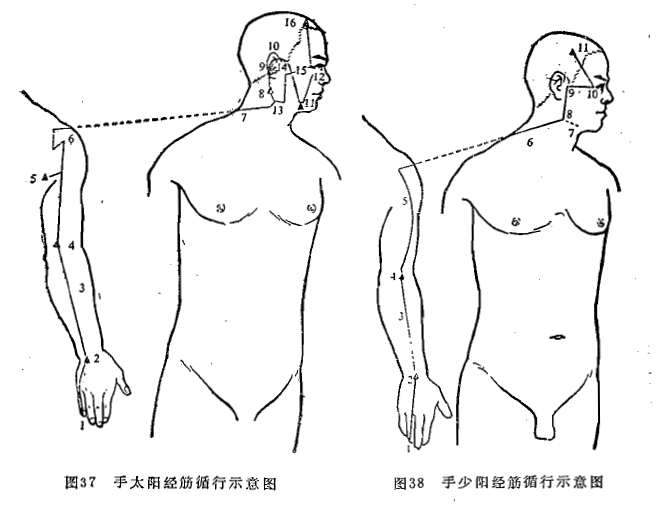
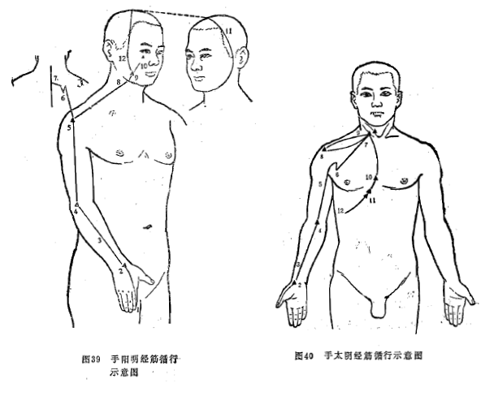
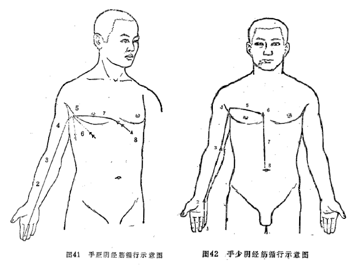

## 第六节　十二经筋

### 一、概述

前以提及，经筋是十二经脉的延续，是十二经脉分布于筋肉的部分，所以称为经筋。经筋也有相应的十二个系统，即手足三阴三阳经筋。由于经筋是分布于筋肉之中的，主司筋肉的运动，所以经筋的作用，主要表现为筋肉的运动，其病变也反映为筋肉的病变。而筋肉的运动又控制着骨骼、关节、肢体的屈伸，因此，说经筋是“主束骨而利机关”《素问·痿论》。

经筋分布的特点是：其循行部位不完全与十二经脉一致。经筋循行于人体浅层，不入内脏。经筋均起于四肢末端，并分布于四肢关节（包括肩、髀关节）、头面、胸腹、肌表。经筋有汇聚之处：如足三阳经筋，起于足趾，行于下肢外侧，上达于头面部；足三阴经筋，起于足趾，行于下肢内侧，上达于胸腹背；足三阴经筋和足阳明经筋还汇聚于阴器（小腹部）；手三阳经筋，起于手指，行于上肢外侧，上达于头面部；手三阴经筋，起于手指，行于上肢内侧，达于胸腹。前面已经讲过，经筋是一个系统，而不是一条，因此一个系统的经筋可分布于多处肌肉关节之中。脏象学说指出：肝主筋。而肝主筋是通过足厥阴经筋对诸系统经筋的联络实现的（“足厥阴之筋”“络诸筋”——《灵枢•经筋》）。从上述十二经筋分布来看，经筋是遍布于头面、胸腹、四肢，即周身。同时，足三阴三阳经筋交接于足趾；手三阴三阳交接于手指；手足三阳交接于头面；手足三阴交接于胸腹。这样就形成了一个十二经筋的整体系统。所以，有些经筋的病变（如强直、抽搐等）往往是全身性的。

经筋的病变，主要表现筋肉的痉挛拘急、疼痛和痿废弛缓。十二经筋在治疗上的意义是扩大了十二经脉上的俞穴治疗范围。足阳明胃经循于下肢、胸腹、面部，但该经所属的梁丘、阴市、足三里等穴，却能治疗腰痛，是由于足阳明经筋亦循行于腰背。

### 二、十二经筋的循行部位

#### （一）足太阳经筋

足太阳经筋，起于足小趾，向上结于外踝，斜上结于膝部，在下者沿外踝结于足跟，向上沿跟腱结于腘部。其分支结于小腿肚（腨外），上向腘内侧，与腘部另支合并上行结于臀部，向上挟脊到达项部；分支入结于舌根；直行者结于枕骨，上行至头顶，从额部下，结于鼻；分支形成“目上网”（一作“目上纲”，即上睑），向下结于鼻旁；背部的分支从腋后外侧结于肩髃；一支进入腋下，向上出缺盆，上方结于耳后乳突（完骨）；又有分支从缺盆出，斜上结于鼻旁。（图31）

#### （二）足少阳经筋

足少阳经筋，起于第四趾，向上结于外踝，上行沿胫外侧缘，结于膝外侧；其分支另起于腓骨部，上走大腿外侧，前边结于“伏兔”，后边结于骶部。直行者，经季胁，上走腋前缘，系于胸侧和乳部，结于缺盆。直行者，上出腋部，通过缺盆，行于太阳经筋的前方，沿耳后，上额角，交会于头顶，向下走向下颌，上结于鼻旁；分支结于目外眦，成“外维”。（图32）

#### （三）足阳明经筋

足阳明经筋，起于第二、三、四趾，结于足背，斜向外上盖于腓骨，上结于膝外侧，直上结于髀枢（大转子部），向上沿胁肋，连属脊椎。直行者，上沿胫骨，结于膝部；分支结于腓骨部，并合足少阳的经筋；直行者，沿伏兔向上，结于股骨前，聚集于阴部，向上分布于腹部，结于缺盆，上颈部，挟口旁，会合于鼻旁，下方结于鼻部，上方合于足太阳经筋一一太阳为“目上网”（上睑），阳明为“目下网”（下睑）。其分支从面颊结于耳前。（图33）

#### （四）足太阴经筋

足太阴经筋，起于足大趾内侧端，向上结于内踝；直行者，络于膝内辅骨（胫骨内踝部），向上沿大腿内侧，结于股骨前，聚集于阴部，上向腹部，结于脐，沿腹内，结于肋骨，散布于胸中；其在里的，附着于脊椎。（图34)

#### （五）足少阴经筋

足少阴经筋，起于足小趾的下边，同足太阴经筋并斜行内踝下方，结于足跟，与足太阳经筋会合，向上结于胫骨内踝下，同足太阴经筋一起向上，沿大腿内侧，结于阴部，沿脊里，挟膂，向上至项，结于枕骨，与足太阳经筋会合。（图35）

#### （六）足厥阴经筋

足厥阴经筋，起于足大趾上边，向上结于内踝之前，沿胫骨向上结于胫骨内踝之下，向上沿大腿内侧，结于阴部，联络各经筋。（图36）

#### （七）手太阳经筋

手太阳经筋，起于手小指上边，结于腕背，向上沿前臂内侧缘，结于肘内锐骨（肱骨内上踝）的后面，进入并结于腋下，其分支向后走腋后侧缘，向上绕肩胛，沿颈旁出走足太阳经筋的前方，结于耳后乳突；分支进入耳中；直行者，出耳上，向下结于下颌，上方连属目外眦；还有一条支筋从颌部分出，上下颌角部，沿耳前，连属目外眦，上额，结于额角。（图37）

#### （八）手少阳经筋

手少阳经筋，起于手无名指末端，结于腕背，向上沿前臂结于肘部，上绕上臂外侧缘上肩，走向颈部，合于手太阳经筋。其分支当下颌角处进入，联系舌根；另一支从下颌角上行，沿耳前，连属目外眦，上经额部，结于额角。（图38）

#### （九）手阳明经筋

手阳明经筋，起于食指末端，结于腕背，向上沿前臂结于肘外侧，上经上臂外侧，结于肩髃；其分支，绕肩胛，挟脊旁；直行者，从肩髃部上颈；分支上面颊，结于鼻旁；直行的上出手太阳经筋的前方，上额角，络头部，下向对侧下颌。（图39）

#### （十）手太阴经筋

手太阴经筋，起于手大拇指上，沿指上行，结于鱼际后，行于寸口动脉外侧，上沿前臂，结于肘中；再向上沿上臂内侧，进入腋下，出缺盆，结于肩髃前方，上面结于缺盆，下面结于胸里，分散通过膈部，会合于膈下，到达季胁。（图40）

#### （十一）手厥阴经筋

手厥阴经筋，起于手中指，与手太阴经筋并行，结于肘内侧，上经上臂内侧，结于腋下，向下散布于胁肋的前后。其分支进人腋内，散布于胸中，结于膈。（图41)

#### （十二）手少阴经筋

手少阴经筋，起于手小指内侧，结于腕后锐骨（豆骨），向上结于肘内侧，再向上进入腋内，交手太阴经筋，行于乳里，结于胸中，沿膈向下，系于脐部。（图42）
