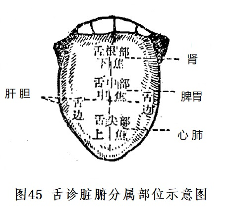

### 四、望舌

望舌，又称舌诊，是望诊的重要内容，也是中医辨证的重要依据。所谓舌诊，即观察舌象（包括舌形、舌质、舌苔）的变化。由于心开窍于舌，又为脾之外候；五脏六腑之经脉又直接或间接地与舌相通，所以，舌象的变化与脏腑，经络病证直接相关。一般来说，舌苔反映人体气（主要指胃气）的变化，舌质反映血的变化，所以有“气病观苔，血病观质”之论。若由舌苔变化发展到舌质变化，是疾病向深重方向发展的征象。

舌面划分为四部分，并反映各部分所属的脏腑（或三焦）的病变（图45）。舌尖属心肺（上焦)，舌中属脾胃（中焦），舌根属肾（下焦），舌两边属肝胆（舌诊的五脏分属部位，在舌诊形成和发展过程中，略有出入，但舌尖属心肺，舌中属脾胃，舌根属肾是一致的）。

#### （一）舌苔

舌苔是胃气所生。常人仅有一层薄白苔，干湿适中。察苔，主要是察苔色、苔质两方面。

##### 1、苔色

苔色主要有四种：白、黄、灰、黑。苔色的变化，主要反映病邪深浅（表、里）及病邪性质（指寒、热）。在外感疾病中，苔色由白而黄，而灰而黑，又是病邪由表及里，逐渐深入的反映。

（1）白苔  多主表证、寒证。薄白苔本为正常舌苔，但在感受外邪时，则表现邪犹在表，尚未传里。舌质淡而苔白，为里寒证。若舌上白苔满布，如白粉堆积，抚之不燥，为积粉苔，常见于瘟疫，为外感秽浊之气，毒热内盛所致。亦见于内痈。

（2）黄苔  主里证、热证。一般来说，黄色之深浅，表示热邪之轻重，焦黄则热结。舌苔由白转黄，为外邪由表入里化热。由于黄苔主里、主热，因此黄苔又常与红、绛舌质主热并见。苔黄滑润兼见舌淡胖嫩者，多为阳虚水湿不化。苔黄滑腻，为内有湿热。

（3）灰苔  主里证，见于里热证或寒湿证。灰色即浅黑色，灰苔和黑苔常同时并见，也可与黄苔并见。灰苔滑润，为寒邪内阻，或痰饮内停。灰苔干燥多为热盛津伤，或阴虚火旺。

（4）黑苔  主里证，主热极或寒盛。黑苔多由灰苔或焦黄苔发展而来，常见于疾病的严重阶段。黑苔燥裂，甚则苔生芒刺，多为热极津枯。黑苔滑润，多为阳虚寒盛。

##### 2、苔质

苔质是指舌苔的厚薄、润燥，腐腻、剥脱、有根无根。

（1）厚薄  反映病邪轻重及病情进退。薄苔多为疾病初起，病邪在表，病情较轻；厚苔多为病邪在里，病情较重，或内有食饮痰湿积滞。舌苔由薄转厚，表示病邪由表入里，病情由轻转重，为病进；舌苔由厚转薄，是邪气由里出表，病情由重转轻，为病退。

（2）润燥  正常舌苔是滋润的，为津液正常上承之象。舌苔的润燥，反映津液的盈亏。苔燥，甚则粗糙起刺，为津液亏耗，或阳虚不能化津上承；舌苔滑湿，多为水湿内停。

（3）腐腻  腐是苔如腐渣，揩之即去，是胃中浊腐之气上升；腻是粘腻，舌面多有盖一层粘液，腻苔剥之不去，是阴邪阻遏阳气，多为痰饮湿浊食积。

（4）剥脱  指舌苔消失。若舌苔突然退去而不再复生，舌面光洁如镜，即为光剥舌，又称“镜面舌”，系胃之气阴大伤所致。若舌苔局部脱落，剥脱处光滑无苔，称为花剥舌，也属胃之气阴两伤之征。若花剥舌而有腻苔，为痰浊不化，正气已伤。舌心无苔是阴虚、血虚或胃气已伤所致。总之，舌苔无论全部或局部剥脱，都是正气损伤之候。

（5）有根无根  有根是指舌苔刮之不去，舌苔与舌体如同一体，称为有根苔，又叫真苔。无根是指舌苔如同涂于舌上，刮之即去，称为无根苔，又称假苔。舌苔有根表示有胃气，主实证、热证；无根表示胃气已衰，主虚证、寒证。

总之，舌苔厚薄，辨邪气深浅；润燥，辨津液存亡；腐腻，辨脾胃湿浊；舌苔有无，辨胃气盛衰；舌苔真假，辨胃气有无、病证虚实。

#### （二）舌质

察舌质（即舌体)，包括察舌质颜色和舌体形态。正常舌质呈淡红色而润泽，舌体柔软灵活。

##### 1、颜色

疾病时舌质颜色的异常改变常见有淡白舌、红舌、绛舌、紫舌等，其主病意义简述如下：

（1）淡白舌  舌色较正常浅淡，为阳虚、气血不足，不能温养于舌所致，见于阳虚寒证及血虚病证。

（2）红色  舌色深于正常，因热盛而气血充溢所致，见于里实热证，也见于阴虚内热证。

（3）绛舌  舌色深红，见于温病热入营血阶段；内伤杂病，则见于久病、重病之阴虚火旺。

（4）紫舌  舌色暗红呈紫色。绛紫而干，为邪热亢盛，阴津耗伤，气血郁滞之征。淡紫或青紫而湿润，为阴寒内盛，血脉瘀滞。舌上有紫色斑点，称为瘀斑、瘀点，多为血瘀之证。

##### 2、形态

观察舌体形态，主要是观察舌体胖瘦老嫩，有无裂纹齿痕，以及舌体运动状态等。舌体润泽为荣，是津液充盛；舌体干瘪为枯，是津液不足。舌体纹理细腻，浮胖娇嫩为嫩，多主虚证、寒证。舌体运动状态，主要有强硬、痿软、颤动、吐弄、歪斜、短缩等。

（1）胖大舌  舌体胖大。舌体胖大而嫩，舌质色淡，为多属脾肾阳虚，水湿不化；舌体胖大，肿胀满口，舌质色红，多属心脾热盛，气血壅滞。舌体胖大青紫，多见于中毒。

（2）瘦薄舌  舌体瘦瘪，是阴血不足，不能充养舌体，瘦薄色淡，为气血两虚；瘦薄而干，舌质红绛，为阴虚火旺，或津液耗伤。

（3）裂纹舌  舌上可见有明显裂纹，多为津血亏损，舌体失于滋润（个别常人亦可见有裂纹舌）。舌质红绛而有裂纹，多为热盛津伤；舌质淡白而有裂纹，则为血虚。

（4）齿痕  舌体边侧，印有牙齿痕迹，多因舌体胖大被牙齿压迫所致。所以，齿痕舌常与胖大舌并见，多属脾虚。若兼见舌质淡白湿润，为脾虚寒湿壅盛。

（5）舌强  是舌体强硬，不能屈伸转动。见于温病，为热入心包，痰浊内阻，或壮热伤阴；见于内伤杂病，则多为中风征兆。

（6）舌痿  舌体痿弱无力，多属气血津液大亏，筋脉失养。久病舌淡而痿，是气血两亏；舌绛而痿，是阴津亏极。新病舌质干红而痿，为热盛伤阴。

（7）舌颤  是舌体颤动，不由自主。久病舌颤，为气血两虚，或肝风内动。外感热病，多为热极生风。

（8）吐舌  弄舌  舌伸长，吐出口外，为吐舌。舌时而伸出口外，立即收回，如此反复，或舌舔口唇，为弄舌。两者均属心脾有热。吐舌可见于疫毒攻心，或正气已绝。弄舌，多为动风先兆，或小儿脾燥。

（9）歪舌  舌体向一侧偏斜。多为中风，或中风先兆。

（10）缩舌  舌体收缩，不能伸展。舌体缩短，多为重危病候。舌淡湿润而缩，多为寒凝筋脉。舌质红干短缩，为热病伤津。舌胖而短缩，是痰湿内阻。凡舌体短缩强硬，均属危候。

临床上，舌苔、舌质、舌体的异常变化，常相兼出现，所以应综合分析。舌诊是中医诊法中十分重要之一法，从舌诊上，基本反映了脏腑气血盛衰、病位深浅、病邪性质（寒热、虚实）及病情进退等几个方面。察舌时还应注意光线及食物药物对舌苔颜色的影响。另外，用口呼吸者，舌苔也燥，应当注意。
