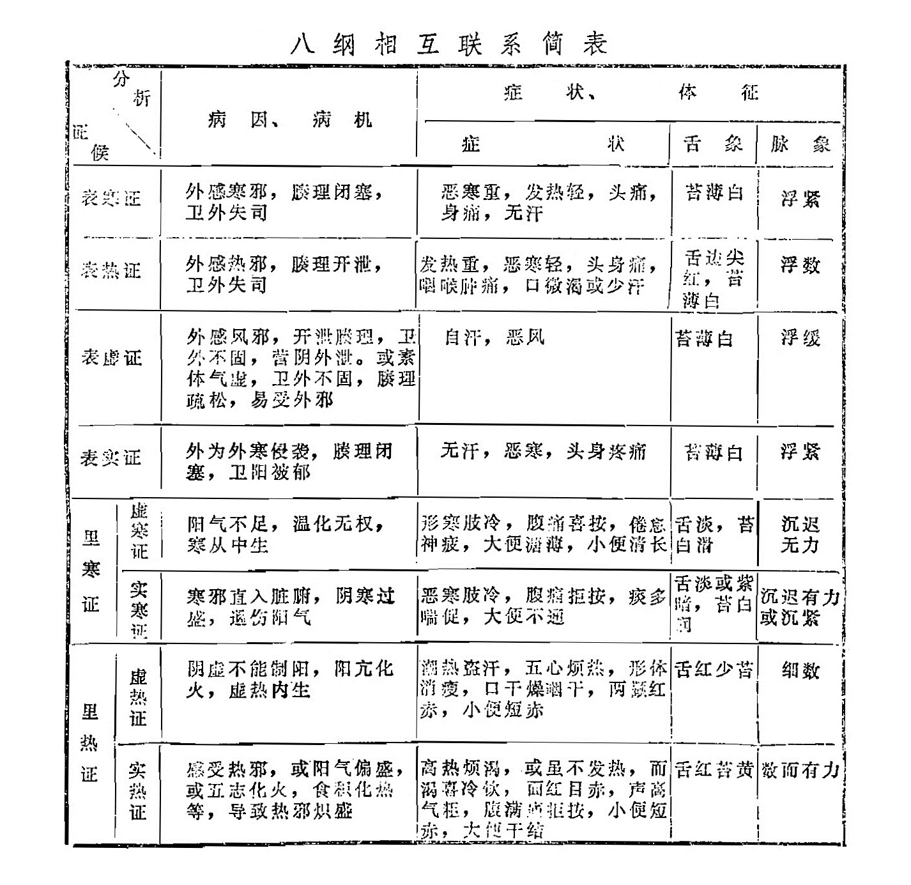
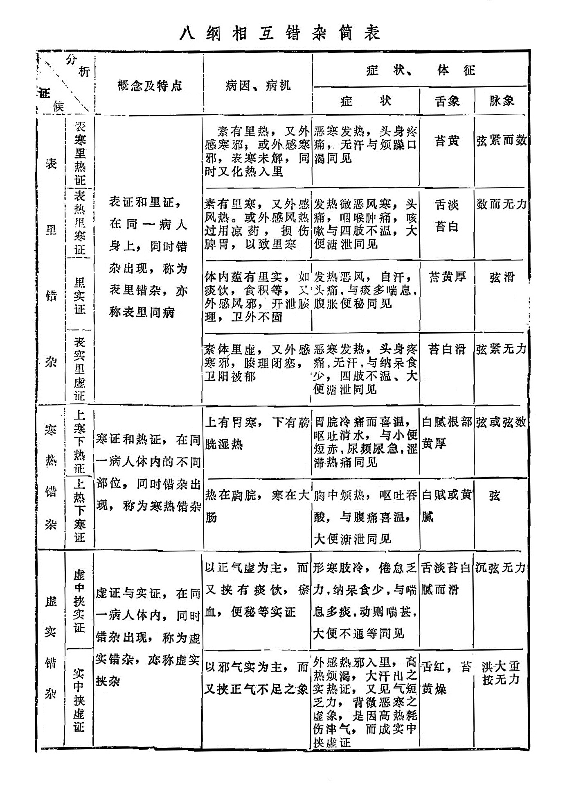
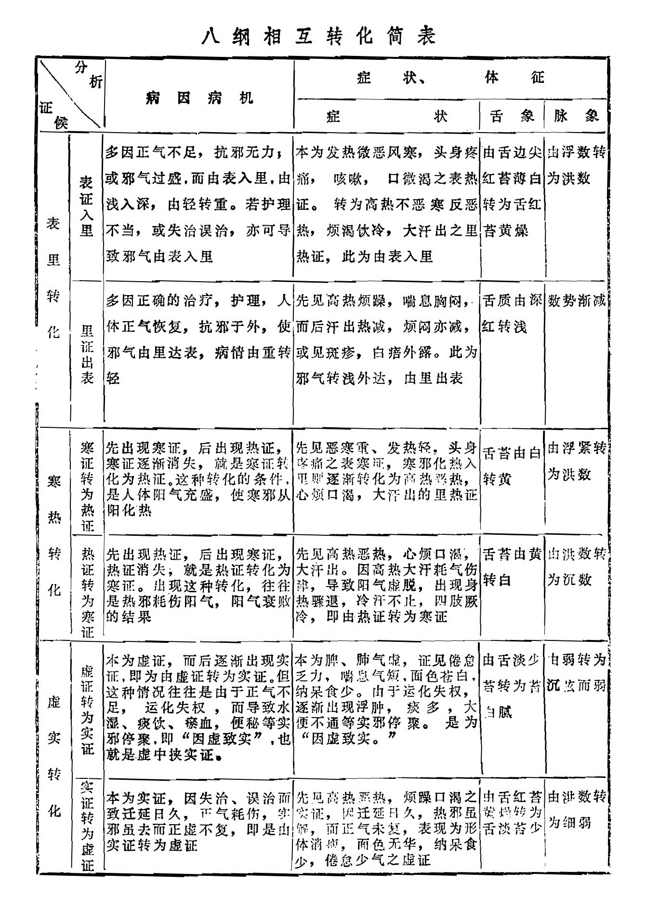
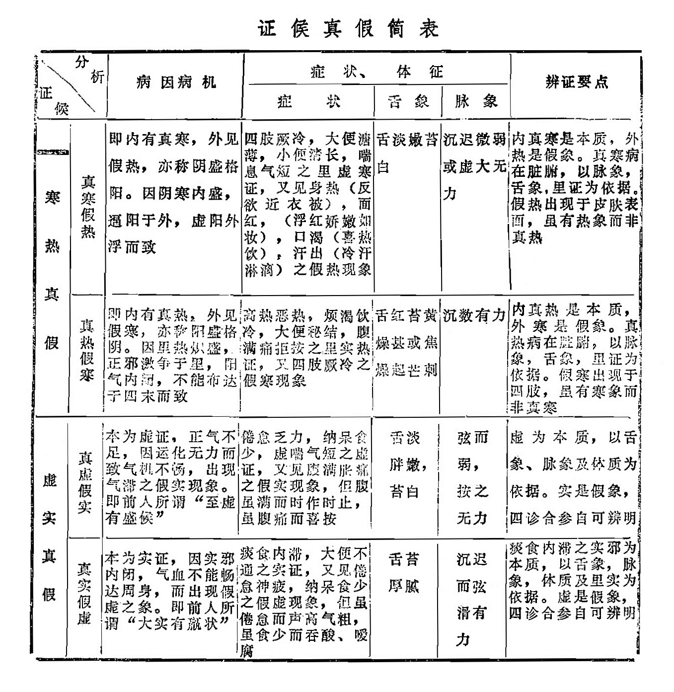
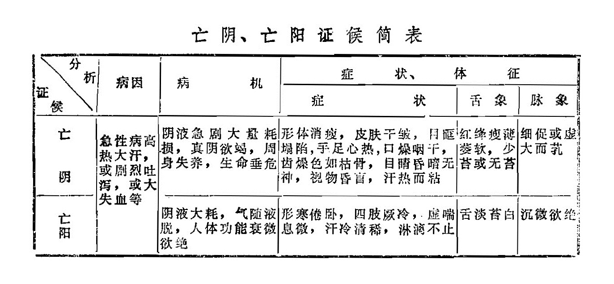

### 二、八纲之间的相互关系

病变是错综复杂的，八纲所属的证候，在临床中往往不是单独存在，而是相兼出现。在临床中，必须把八纲相互联系进行辨证，才能全面地分析病变的部位、性质、正邪关系。此外，八纲之间又可以出现相互错杂和相互转化，在某些情况下，还可以出现证候中真假互见的现象。兹将八纲之间这四种关系以及亡阴亡阳列表简述如下。

#### 1.相互联系

|        |        | 病因、病机                                                   | 症状                                                         | 舌象               | 脉象           |
| ------ | ------ | ------------------------------------------------------------ | ------------------------------------------------------------ | ------------------ | -------------- |
| 表寒证 |        | 外感寒邪，腠理闭塞，卫外失司                                 | 恶寒重，发热轻，头痛，身痛，无汗                             | 苔薄白             | 浮紧           |
| 表热证 |        | 外感寒邪，腠理开泄，卫外失司                                 | 发热重，恶寒轻，头身痛，咽喉肿痛，口微渴或少汗               | 舌边尖红，苔薄白   | 浮数           |
| 表虚证 |        | 外感风邪，开泄腠理，卫外不固，营阴外泄。或素体气虚，卫外不固，腠理疏松，易受外邪 | 自汗，恶风                                                   | 苔薄白             | 浮缓           |
| 表实证 |        | 外为外寒侵袭，腠理闭塞，卫阳被郁                             | 无汗，恶寒，头身疼痛                                         | 苔薄白             | 浮紧           |
| 里寒证 | 虚寒证 | 阳气不足，温化无权，寒从中生                                 | 形寒肢冷，腹痛喜按，倦怠神疲，大便溏薄，小便清长             | 舌淡，苔白滑       | 沉迟无力       |
| 里寒证 | 实寒证 | 寒邪直入脏腑，阴寒过盛，退伤阳气                             | 恶寒肢冷，腹痛拒按，痰多喘促，大便不通                       | 舌淡或紫暗，苔白润 | 沉迟有力或沉紧 |
| 里热证 | 虚热证 | 阴虚不能制阳，阳亢化火，虚热内生                             | 潮热盗汗，五心烦热，形体消瘦，口干燥咽干，两颧红赤，小便短赤 | 舌红少苔           | 细数           |
| 里热证 | 实热证 | 感受热邪，或阳气偏盛，或五志化火，食积化热等，导致热邪炽盛   | 高热烦渴，或虽不发热，而渴喜冷饮，面红目赤，声高气粗，胆满痛拒按，小便短赤，大便干结 | 舌红苔黄           | 数而有力       |

#### 2.相互错杂

|          |            | 概念及特点                                                   | 病因病机                                                     | 症状                                                         | 舌象           | 脉象         |
| -------- | ---------- | ------------------------------------------------------------ | ------------------------------------------------------------ | ------------------------------------------------------------ | -------------- | ------------ |
| 表里错杂 | 表寒里热证 | 表证和里证在同一病人身上，同时错杂出现，称为表里错杂，亦称表里同病 | 素有里热，又外感寒邪；或外感寒邪，表寒未解，同时又化热入里   | 恶寒发热，头身疼痛，无汗与烦躁口渴同见                       | 苔黄           | 弦紧而数     |
| 表里错杂 | 表热里寒证 | 同上                                                         | 素有里寒，又外感风热。或外感风热过用凉药，损伤脾胃，以致里寒 | 发热微恶风寒，头痛，咽喉肿痛，咳嗽与四肢不温，大便溏泄同见   | 舌淡苔白       | 数而无力     |
| 表里错杂 | 里实证     | 同上                                                         | 体内蕴有里实，如痰饮，食积等，又外感风邪，开泄腠理，卫外不固 | 发热恶风，自汗，头痛，与痰多喘息，腹胀便秘同见。             | 苔黄厚         | 弦滑         |
| 表里错杂 | 表实里虚证 | 同上                                                         | 素体里虚，又外感寒邪，腠理闭塞，卫阳被郁                     | 恶寒发热，头身疼痛，无汗，与纳呆食少，四肢不温、大便溏泄同见 | 苔白滑         | 弦紧无力     |
| 寒热错杂 | 上寒下热证 | 寒证和热证，在同一病人体内的不同部位，同时错杂出现，称为寒热错杂 | 上有胃热，下有膀胱湿热                                       | 胃脘冷痛而喜温，呕吐清水，与小便短赤，尿频尿急，涩滞热痛同见 | 白腻根部黄厚   | 弦或弦数     |
| 寒热错杂 | 上热下寒证 | 同上                                                         | 热在胸脘，寒在大肠                                           | 胸中烦热，呕吐吞酸，与腹痛喜温，大便溏泄同见                 | 白腻或黄腻     | 弦           |
| 虚实错杂 | 虚中挟实证 | 虚证与实证，在同一病人体内，同时错杂出现，称为虚实错杂，亦称虚实夹杂 | 以正气虚为主，而又夹有痰饮，淤血，便秘等实证                 | 形寒肢冷，倦怠乏力，纳呆食少，与喘息多痰，动则喘甚，大便不通等同见 | 舌淡苔白腻而滑 | 沉弦无力     |
| 虚实错杂 | 实中挟虚证 | 同上                                                         | 以邪气实为主，而有挟正气不足之象                             | 外感邪热入里，高热烦渴，大汗出之实热证，又见气短乏力，背微恶寒之虚像，是因高热耗伤津气，而成实中挟虚证 | 舌红，苔黄燥   | 洪大重按无力 |

#### 3.相互转化

|          |              | 病因病机                                                     | 症状                                                         | 舌象                           | 脉象             |
| -------- | ------------ | ------------------------------------------------------------ | ------------------------------------------------------------ | ------------------------------ | ---------------- |
| 表里转化 | 表证入里     | 多因正气不足，抗邪无力；或邪气过盛，而由表入里，由浅入深，由轻转重。若护理不当，或失治误治，亦可导致邪气由表入里 | 本为发热微恶风寒，头身疼痛，咳嗽，口微渴之表热证。转为高热不恶寒反恶热，烦渴饮冷，大汗出之里热证，此为由表入里 | 由舌边尖红苔薄白转为舌红苔黄燥 | 由浮数转为洪数   |
| 表里转化 | 里证出表     | 多因正确的治疗，护理，人体正气恢复，抗邪于外，使邪气由里达表，病情由重转轻 | 先见高热烦躁，喘息胸闷，而后汗出热减，烦闷亦减,或见斑疹，白㾦外露。此为邪气转浅外达，由里出表 | 舌质由深红转浅                 | 数势渐减         |
| 寒热转化 | 寒证转为热证 | 先出现寒证，后出现热证，寒证逐渐消失，就是寒证转化为热征。这种转化的条件，是人体阳气充盛，使寒邪从阳化热 | 先见恶寒重、发热轻，头身疼痛之表寒证，寒邪化热入里则逐渐转化为高热恶热，心烦口渴，大汗岀的里热证 | 舌苔由白转黄                   | 由浮紧转为洪数   |
| 寒热转化 | 热证转为寒证 | 先出现热证，后出现寒证，热证消失，就是热证转化为寒证。出现这种转化，往往是热邪耗伤阳气，阳气衰败的结果 | 先见高热恶热，心烦口渴，大汗出。因高热大汗耗气伤津，导致阳气虚脱，出现身热骤退，冷汗不止，四肢厥冷，即由热证转为寒证 | 舌苔由黄转白                   | 由洪数转为沉数   |
| 虚实转化 | 虚证转为实证 | 本为虚证，而后逐渐出现实证，即为由虚证转为实证。但这种情况往往是由于正气不足，运化失权，而导致水湿、痰饮、瘀血，便秘等实邪停聚，即“因虚致实”，也就是虚中挟实证。 | 本为脾、肺气虚，证见倦怠乏力，喘息气短，面色苍白，纳呆食少。由于运化失权，逐渐出现浮肿，痰多，大便不通等实邪停聚。是为“因虚致实。” | 由舌淡少苔转为苔白腻           | 由弱转为沉弦而弱 |
| 虚实转化 | 实证转为虚证 | 本为实证，因失治、误治而致迁延日久，正气耗伤，实邪虽去而正虚不复，即是由实证转为虚证 | 先见高热恶热，烦躁口渴之实证，因迁延日久，热邪虽解，面正气未复，表现为形体消瘦，面色无华，纳呆食少，倦怠少气之虚证 | 由舌红苔黄燥转为舌淡苔少       | 由洪数转为细弱   |
​	

#### 4.证候真假

|          |          | 病因病机                                                     | 症状                                                         | 舌象                     | 脉象               | 辨证要点                                                     |
| -------- | -------- | ------------------------------------------------------------ | ------------------------------------------------------------ | ------------------------ | ------------------ | ------------------------------------------------------------ |
| 寒热真假 | 真寒假热 | 即内有真寒，外见假热，亦称阴盛格阳。因阴寒内盛，逼阳于外，虚阳外浮而致 | 四肢厥冷，大便溏薄，小便清长，喘息气短之里虚寒证，又见身热（反欲近衣被），面红，（浮红娇嫩如妆），口渴（喜热饮），汗出（冷汗淋漓）之假热现象 | 舌淡嫩苔白               | 沉迟微弱或虚大无力 | 内真寒是本质，外热是假象。真寒病在脏腑，以脉象，舌象，里证为依据。假热出现于皮肤表面，虽有热象而非真热 |
| 寒热真假 | 真热假寒 | 即内有真热，外见假寒，亦称阳盛格阴。因里热炽盛，正邪激争于里，阳气内闭，不能布达于四末而致 | 高热恶热，烦渴饮冷，大便秘结，腹满痛拒按之里实热证，又四肢厥冷之假寒现象 | 舌紅苔黄燥甚或焦燥起芒刺 | 沉数有力           | 内真热是本质，外寒是假象。真热病在脏腑，以脉象，舌象，里证为依据。假寒出现于四肢， 虽有寒象而非真寒 |
| 虚实真假 | 真虚假实 | 本为虚证，正气不足，因运化无力而致气机不畅，出现气滞之假实现象。即前人所谓“至虚有盛候” | 倦怠乏力，纳呆食少，虚喘气短之虚证，又见腹满胀痛之假实现象，但腹虽满而时作时止,虽腹痛而喜按 | 舌淡胖嫩，苔白           | 弦而弱，按之无力   | 虚为本质，以舌象、脉象及休质为依据。实是假象，四诊合参自可辨明 |
| 虚实真假 | 真实假虚 | 本为实证，因实邪内闭，气血不能畅达周身，而出现假虚之象。即前人所谓“大实有羸状” | 痰食内滞，大便不通之实证，又见倦怠神疲，纳呆食少之假虚现象，但虽倦怠而声高气粗，虽食少而吞酸、嗳腐 | 舌苔厚腻                 | 沉迟而弦滑有力     | 痰食内滞之实邪为本质，以舌象，脉象，体质及里实为依据。虚是假象，四诊合参自可辨明 |

#### 5.亡阴与亡阳

亡阴，是指阴液耗损欲竭。亡阳，是指阳气耗散欲脱。二者大多出现在急性病中，均属危重证候，兹列表简介如下。

|      | 病因                                   | 病机                                           | 症状                                                         | 舌象                     | 脉象           |
| ---- | -------------------------------------- | ---------------------------------------------- | ------------------------------------------------------------ | ------------------------ | -------------- |
| 亡阴 | 急性病高热大汗，或剧烈吐泻，或大失血等 | 阴液急剧大量耗损，真阴欲竭，周身失养，生命垂危 | 形体消瘦，皮肤干皱，目眶塌陷，手足心热，口燥咽干，齿燥色如枯骨，目睛昏暗无神，视物昏盲，汗热而粘 | 红绛瘦薄萎软，少苔或无苔 | 细促或虚大而芤 |
| 亡阳 | 同上                                   | 阴液大耗，气随液脱，人体功能衰微欲绝           | 形寒倦卧，四肢厥冷，虚喘息微，汗冷清稀，淋漓不止             | 舌淡苔白                 | 沉微欲绝       |

由于人体阴阳是相互依存的，阴竭则阳无所附而浮散；阳亡则阴无所固而随脱。所以，在临床上亡阴与亡阳之出现虽有先后主次之分，但最终必相互影响，一亡俱亡，从而导致生命的终结。